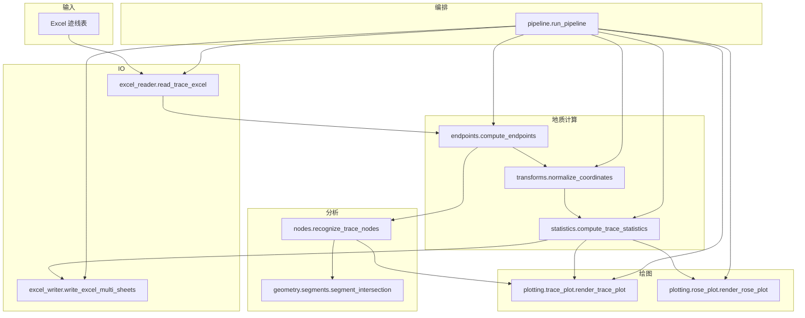
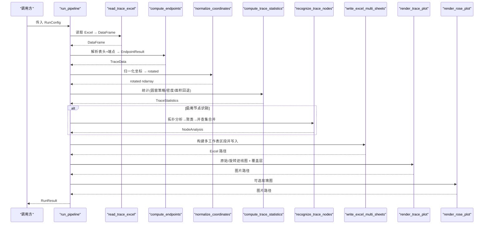
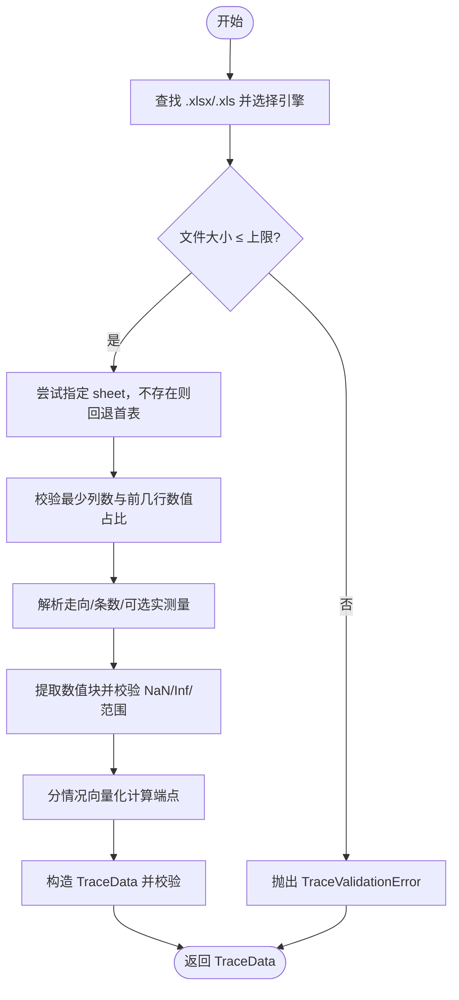
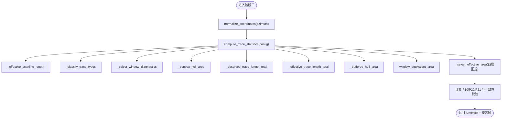
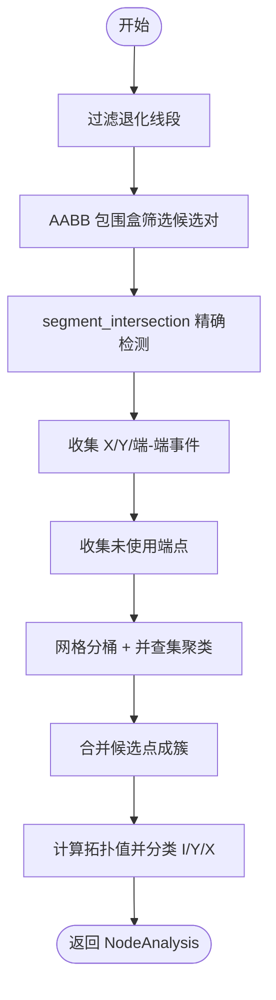
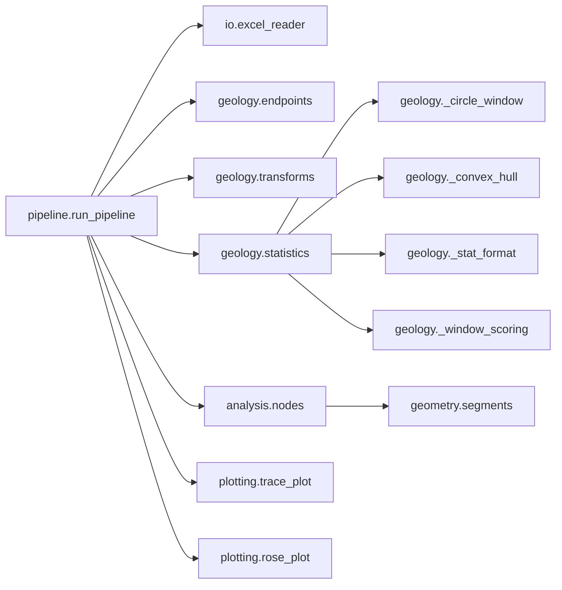
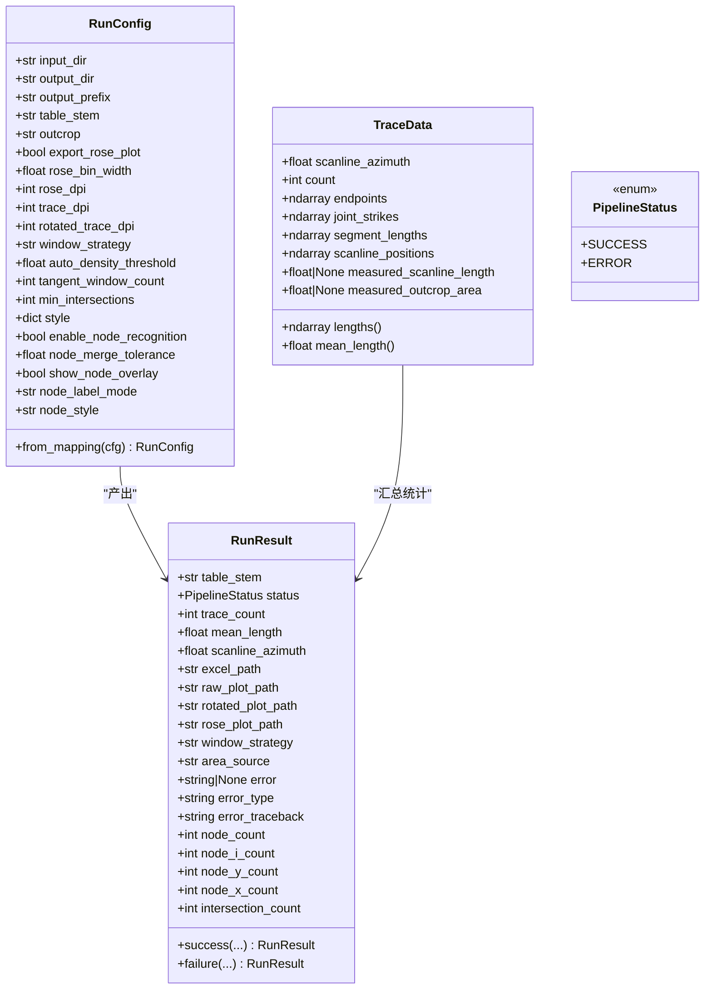

# 数据流与处理管线

<cite>
**本文引用的文件**   
- [trace_pipeline/pipeline.py](file://trace_pipeline/pipeline.py)
- [trace_pipeline/models.py](file://trace_pipeline/models.py)
- [trace_pipeline/config.py](file://trace_pipeline/config.py)
- [trace_pipeline/validation.py](file://trace_pipeline/validation.py)
- [trace_pipeline/io/excel_reader.py](file://trace_pipeline/io/excel_reader.py)
- [trace_pipeline/geology/endpoints.py](file://trace_pipeline/geology/endpoints.py)
- [trace_pipeline/geology/transforms.py](file://trace_pipeline/geology/transforms.py)
- [trace_pipeline/geology/statistics.py](file://trace_pipeline/geology/statistics.py)
- [trace_pipeline/analysis/nodes.py](file://trace_pipeline/analysis/nodes.py)
- [trace_pipeline/analysis/models.py](file://trace_pipeline/analysis/models.py)
- [trace_pipeline/geometry/segments.py](file://trace_pipeline/geometry/segments.py)
- [trace_pipeline/io/excel_writer.py](file://trace_pipeline/io/excel_writer.py)
- [trace_pipeline/plotting/trace_plot.py](file://trace_pipeline/plotting/trace_plot.py)
- [trace_pipeline/plotting/rose_plot.py](file://trace_pipeline/plotting/rose_plot.py)
</cite>

## 目录
1. [引言](#引言)
2. [项目结构](#项目结构)
3. [核心组件](#核心组件)
4. [架构总览](#架构总览)
5. [详细组件分析](#详细组件分析)
6. [依赖关系分析](#依赖关系分析)
7. [性能考虑](#性能考虑)
8. [故障排查指南](#故障排查指南)
9. [结论](#结论)
10. [附录](#附录)

## 引言
本文件面向 TracePipeline 的数据流与五阶段处理流水线，系统性阐述从 Excel 读取到统计、节点识别、Excel 导出与绘图输出的完整数据流转。文档聚焦以下目标：
- 明确每个阶段的输入/输出数据结构、转换规则与错误处理机制
- 解释不可变数据模型（TraceData、RunConfig、RunResult）在整个数据流中的作用与设计原则
- 提供数据流图与关键转换过程的代码路径示例
- 总结数据验证规则、异常降级策略与性能优化点

## 项目结构
TracePipeline 采用分层模块化组织：
- io：Excel 读写与发现
- geology：地质计算（端点解析、坐标变换、统计）
- analysis：拓扑与节点识别
- geometry：几何基础运算
- plotting：迹线图、旋转图、玫瑰图绘制
- pipeline：五阶段编排与结果封装
- models：不可变数据模型与校验
- config：配置加载与合并
- validation：通用类型强制与校验工具

图表来源
- [trace_pipeline/pipeline.py:230-474](file://trace_pipeline/pipeline.py#L230-L474)
- [trace_pipeline/io/excel_reader.py:36-106](file://trace_pipeline/io/excel_reader.py#L36-L106)
- [trace_pipeline/geology/endpoints.py:295-411](file://trace_pipeline/geology/endpoints.py#L295-L411)
- [trace_pipeline/geology/transforms.py:127-144](file://trace_pipeline/geology/transforms.py#L127-L144)
- [trace_pipeline/geology/statistics.py:212-391](file://trace_pipeline/geology/statistics.py#L212-L391)
- [trace_pipeline/analysis/nodes.py:160-416](file://trace_pipeline/analysis/nodes.py#L160-L416)
- [trace_pipeline/geometry/segments.py:42-113](file://trace_pipeline/geometry/segments.py#L42-L113)
- [trace_pipeline/io/excel_writer.py:462-489](file://trace_pipeline/io/excel_writer.py#L462-L489)
- [trace_pipeline/plotting/trace_plot.py:443-565](file://trace_pipeline/plotting/trace_plot.py#L443-L565)
- [trace_pipeline/plotting/rose_plot.py:106-140](file://trace_pipeline/plotting/rose_plot.py#L106-L140)

章节来源
- [trace_pipeline/pipeline.py:1-474](file://trace_pipeline/pipeline.py#L1-L474)

## 核心组件
本节聚焦不可变数据模型及其在数据流中的职责与约束。

- TraceData：单张迹线表的完整解析结果，包含测线走向、端点坐标、节理走向、段长、位置等；内部对数组进行不可变标记与派生属性缓存（如长度）。
- RunConfig：单次运行参数，含输入输出路径、样式、窗口策略、节点识别开关与容差等；通过工厂方法 from_mapping 与标量字段强制器完成校验与规范化。
- RunResult：运行结果封装，包含成功/失败状态、统计摘要、输出路径与错误信息；提供 success/failure 构造器。

设计原则
- 不可变性：使用 frozen dataclass，避免下游误改共享状态
- 强校验：__post_init__ 中执行形状、范围、有限性检查
- 派生缓存：按需计算并缓存派生属性，减少重复开销
- 统一错误：失败时以 RunResult.failure 携带错误类型与回溯

章节来源
- [trace_pipeline/models.py:41-157](file://trace_pipeline/models.py#L41-L157)
- [trace_pipeline/models.py:162-273](file://trace_pipeline/models.py#L162-L273)
- [trace_pipeline/models.py:278-352](file://trace_pipeline/models.py#L278-L352)

## 架构总览
下图展示五阶段流水线的端到端数据流与关键对象交互。

图表来源
- [trace_pipeline/pipeline.py:230-474](file://trace_pipeline/pipeline.py#L230-L474)
- [trace_pipeline/io/excel_reader.py:36-106](file://trace_pipeline/io/excel_reader.py#L36-L106)
- [trace_pipeline/geology/endpoints.py:295-411](file://trace_pipeline/geology/endpoints.py#L295-L411)
- [trace_pipeline/geology/transforms.py:127-144](file://trace_pipeline/geology/transforms.py#L127-L144)
- [trace_pipeline/geology/statistics.py:212-391](file://trace_pipeline/geology/statistics.py#L212-L391)
- [trace_pipeline/analysis/nodes.py:160-416](file://trace_pipeline/analysis/nodes.py#L160-L416)
- [trace_pipeline/io/excel_writer.py:462-489](file://trace_pipeline/io/excel_writer.py#L462-L489)
- [trace_pipeline/plotting/trace_plot.py:443-565](file://trace_pipeline/plotting/trace_plot.py#L443-L565)
- [trace_pipeline/plotting/rose_plot.py:106-140](file://trace_pipeline/plotting/rose_plot.py#L106-L140)

## 详细组件分析

### 阶段一：数据加载（Excel 读取 → DataFrame → TraceData）
- 输入：input_dir/table_stem/outcrop
- 过程：
  - excel_reader.read_trace_excel：候选扩展名(.xlsx/.xls)、工作表不存在回退首表、文件大小上限保护、前几行数值占比检测
  - endpoints.compute_endpoints：解析表头（走向、条数、可选实测量）、提取数值矩阵、倾向转走向、按左/右/双侧三种情况向量化计算端点
  - 组装为 TraceData，并在 __post_init__ 中做形状/有限性/非负等校验
- 输出：TraceData
- 错误处理：
  - 文件缺失/过大/格式非法直接抛出异常
  - 表头或数值列非法抛出 ValueError
  - 上层捕获后转为 RunResult.failure

图表来源
- [trace_pipeline/io/excel_reader.py:36-106](file://trace_pipeline/io/excel_reader.py#L36-L106)
- [trace_pipeline/geology/endpoints.py:113-179](file://trace_pipeline/geology/endpoints.py#L113-L179)
- [trace_pipeline/geology/endpoints.py:295-411](file://trace_pipeline/geology/endpoints.py#L295-L411)
- [trace_pipeline/models.py:65-121](file://trace_pipeline/models.py#L65-L121)

章节来源
- [trace_pipeline/io/excel_reader.py:36-169](file://trace_pipeline/io/excel_reader.py#L36-L169)
- [trace_pipeline/geology/endpoints.py:295-411](file://trace_pipeline/geology/endpoints.py#L295-L411)
- [trace_pipeline/models.py:41-157](file://trace_pipeline/models.py#L41-L157)

### 阶段二：坐标变换 + 统计（端点计算 → 坐标归一化 → 圆窗策略 → 密度统计）
- 输入：TraceData
- 过程：
  - transforms.normalize_coordinates：正象限平移 → 按走向角旋转 → 再次平移到非负区域
  - statistics.compute_trace_statistics：
    - 估计测线长度（实测优先，否则基于 r1 分布估计）
    - 分类 I/II/III 型裂隙
    - 圆窗诊断（自动/切圆/混合/同心），聚合 l_est/p20/p21
    - 凸包面积与缓冲凸包面积
    - 四层回退选择有效露头面积（实测→凸包→缓冲凸包→圆窗等效）
    - 观测迹长优先链（segment→endpoint→window）
    - 计算 P10/P20/P21 及一致性校验告警
- 输出：rotated 坐标、TraceStatistics、圆窗与凸包覆盖层数据
- 错误处理：
  - 坐标非法/NaN/Inf 抛错
  - 统计过程中出现不一致时记录警告而非中断

图表来源
- [trace_pipeline/geology/transforms.py:127-144](file://trace_pipeline/geology/transforms.py#L127-L144)
- [trace_pipeline/geology/statistics.py:212-391](file://trace_pipeline/geology/statistics.py#L212-L391)

章节来源
- [trace_pipeline/geology/transforms.py:1-169](file://trace_pipeline/geology/transforms.py#L1-L169)
- [trace_pipeline/geology/statistics.py:1-391](file://trace_pipeline/geology/statistics.py#L1-L391)

### 阶段三：节点识别（拓扑分析 → 网格聚类 → 并查集合并）
- 输入：endpoints (N,4)，NodeRecognitionConfig
- 过程：
  - 过滤退化线段（长度 < 容差）
  - AABB 包围盒快速筛选候选对
  - segment_intersection 精确相交检测，分类 X/Y/端-端事件
  - 未使用端点接近检测（网格分桶 + 并查集）
  - 候选点空间聚类（网格 + 并查集）
  - 根据簇内参与方式计算拓扑值并分类 I/Y/X
- 输出：NodeAnalysis（节点列表、交点事件、警告、跳过计数）
- 错误处理：
  - 退化线段过多仅记录警告
  - 坐标过大可能触发溢出警告

图表来源
- [trace_pipeline/analysis/nodes.py:160-416](file://trace_pipeline/analysis/nodes.py#L160-L416)
- [trace_pipeline/geometry/segments.py:42-113](file://trace_pipeline/geometry/segments.py#L42-L113)

章节来源
- [trace_pipeline/analysis/nodes.py:1-417](file://trace_pipeline/analysis/nodes.py#L1-L417)
- [trace_pipeline/analysis/models.py:1-98](file://trace_pipeline/analysis/models.py#L1-L98)
- [trace_pipeline/geometry/segments.py:1-197](file://trace_pipeline/geometry/segments.py#L1-L197)

### 阶段四：Excel 导出（多工作表生成 → 格式规范）
- 输入：TraceData、rotated、TraceStatistics、NodeAnalysis（可选）
- 过程：
  - build_result_workbook_sections：构建基本信息/裂隙情况/计算数据/原始坐标/旋转坐标/走向与长度/节点统计与明细等区段
  - write_excel_multi_sheets：逐区段写入独立工作表，应用标题、字体、边框、冻结窗格与列宽自适应
- 输出：Excel 文件路径
- 错误处理：
  - 形状不匹配/非法值抛错
  - 写入失败由上层捕获并记录

章节来源
- [trace_pipeline/io/excel_writer.py:280-489](file://trace_pipeline/io/excel_writer.py#L280-L489)

### 阶段五：绘图输出（迹线图 → 旋转图 → 玫瑰图）
- 输入：endpoints/rotated、TraceStatistics、覆盖层（圆窗/凸包/节点）
- 过程：
  - render_trace_plot：自适应 figure 尺寸、叠加圆窗或凸包、绘制迹线与节点、添加指北针/比例尺/图例/统计框
  - render_rose_plot：半圆折叠、直方图分箱、极坐标柱状图绘制
- 输出：PNG 图片路径
- 错误处理：
  - 输入非法抛错
  - 渲染失败由上层捕获并记录

章节来源
- [trace_pipeline/plotting/trace_plot.py:443-565](file://trace_pipeline/plotting/trace_plot.py#L443-L565)
- [trace_pipeline/plotting/rose_plot.py:106-140](file://trace_pipeline/plotting/rose_plot.py#L106-L140)

## 依赖关系分析
- 模块耦合
  - pipeline 作为编排者，依赖 io、geology、analysis、plotting 各层
  - statistics 与 _circle_window/_convex_hull/_stat_format/_window_scoring 解耦良好
  - nodes 依赖 geometry.segments 的相交算法
- 外部依赖
  - pandas/openpyxl 用于 Excel 读写
  - matplotlib 用于绘图
  - numpy 用于数值计算
- 循环依赖
  - 通过 validation 与 utils 抽象避免循环概念依赖

图表来源
- [trace_pipeline/pipeline.py:230-474](file://trace_pipeline/pipeline.py#L230-L474)
- [trace_pipeline/analysis/nodes.py:160-416](file://trace_pipeline/analysis/nodes.py#L160-L416)
- [trace_pipeline/geometry/segments.py:42-113](file://trace_pipeline/geometry/segments.py#L42-L113)
- [trace_pipeline/geology/statistics.py:212-391](file://trace_pipeline/geology/statistics.py#L212-L391)

## 性能考虑
- 数据加载
  - 文件签名缓存：_load_trace_data_cached 基于 mtime/size 缓存 TraceData，避免重复解析
  - Excel 大小限制与快速 sheet 回退，降低无效读取
- 数值计算
  - 端点计算采用预分配数组与向量化分支（左/右/双侧）
  - 坐标变换使用矩阵乘法批量旋转
  - 统计模块复用 hull_area 与 window 诊断结果，避免重复计算
- 节点识别
  - AABB 包围盒快速筛选候选对
  - 网格分桶 + 并查集实现高效聚类合并
- 绘图
  - 自适应 figure 尺寸保证不同图可比性
  - 节点按类型分组批量 scatter 提升渲染性能

[本节为通用指导，无需特定文件引用]

## 故障排查指南
- 常见错误与定位
  - 输入文件不存在：检查 input_dir/table_stem/outcrop 配置与路径解析
  - Excel 过大或格式非法：确认文件大小与列布局是否符合要求
  - 表头或数值列非法：检查走向角度范围、迹线条数、r1/r2/r4-r7 等列
  - 坐标包含 NaN/Inf：上游数据清洗或容差调整
  - 节点识别坐标过大：注意单位与坐标系缩放，必要时调整 merge_tolerance
- 异常降级策略
  - 统计面积四层回退：实测→凸包→缓冲凸包→圆窗等效
  - 迹长总长度回退链：segment→endpoint→window
  - 窗口一致性告警：主 P20/P21 与圆窗估算差异超过阈值时记录警告
- 日志与上下文
  - 使用 LogContext 记录请求 ID 与各阶段耗时
  - 子进程安全初始化 matplotlib 后端与工作线程日志

章节来源
- [trace_pipeline/pipeline.py:98-130](file://trace_pipeline/pipeline.py#L98-L130)
- [trace_pipeline/geology/statistics.py:106-166](file://trace_pipeline/geology/statistics.py#L106-L166)
- [trace_pipeline/geology/statistics.py:179-206](file://trace_pipeline/geology/statistics.py#L179-L206)
- [trace_pipeline/geology/statistics.py:313-336](file://trace_pipeline/geology/statistics.py#L313-L336)

## 结论
TracePipeline 通过严格的不可变数据模型与分层模块化设计，实现了稳健的五阶段数据处理流水线。其优势在于：
- 强校验与清晰的数据契约，确保上下游一致性与可追溯性
- 多层回退与一致性校验，提高统计结果的鲁棒性
- 向量化与空间索引优化，兼顾准确性与性能
- 完善的异常处理与日志体系，便于问题定位与运维

[本节为总结性内容，无需特定文件引用]

## 附录

### 不可变数据模型类图

图表来源
- [trace_pipeline/models.py:41-157](file://trace_pipeline/models.py#L41-L157)
- [trace_pipeline/models.py:162-273](file://trace_pipeline/models.py#L162-L273)
- [trace_pipeline/models.py:278-352](file://trace_pipeline/models.py#L278-L352)

### 关键转换过程代码路径示例
- Excel 读取与校验
  - [trace_pipeline/io/excel_reader.py:36-106](file://trace_pipeline/io/excel_reader.py#L36-L106)
  - [trace_pipeline/io/excel_reader.py:128-169](file://trace_pipeline/io/excel_reader.py#L128-L169)
- 端点解析与向量化计算
  - [trace_pipeline/geology/endpoints.py:113-179](file://trace_pipeline/geology/endpoints.py#L113-L179)
  - [trace_pipeline/geology/endpoints.py:295-411](file://trace_pipeline/geology/endpoints.py#L295-L411)
- 坐标归一化
  - [trace_pipeline/geology/transforms.py:127-144](file://trace_pipeline/geology/transforms.py#L127-L144)
- 统计与面积回退
  - [trace_pipeline/geology/statistics.py:212-391](file://trace_pipeline/geology/statistics.py#L212-L391)
- 节点识别与并查集
  - [trace_pipeline/analysis/nodes.py:160-416](file://trace_pipeline/analysis/nodes.py#L160-L416)
  - [trace_pipeline/geometry/segments.py:42-113](file://trace_pipeline/geometry/segments.py#L42-L113)
- Excel 多工作表导出
  - [trace_pipeline/io/excel_writer.py:280-489](file://trace_pipeline/io/excel_writer.py#L280-L489)
- 绘图输出
  - [trace_pipeline/plotting/trace_plot.py:443-565](file://trace_pipeline/plotting/trace_plot.py#L443-L565)
  - [trace_pipeline/plotting/rose_plot.py:106-140](file://trace_pipeline/plotting/rose_plot.py#L106-L140)