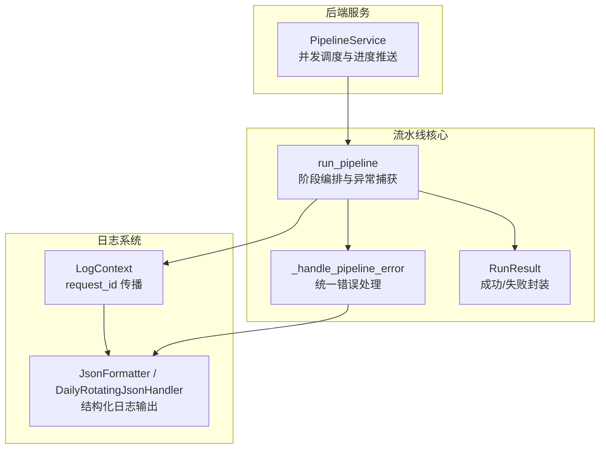
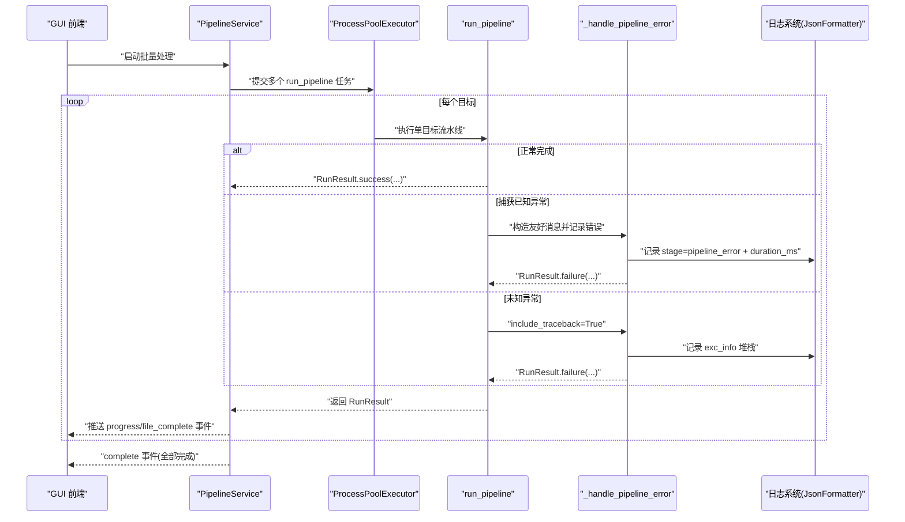
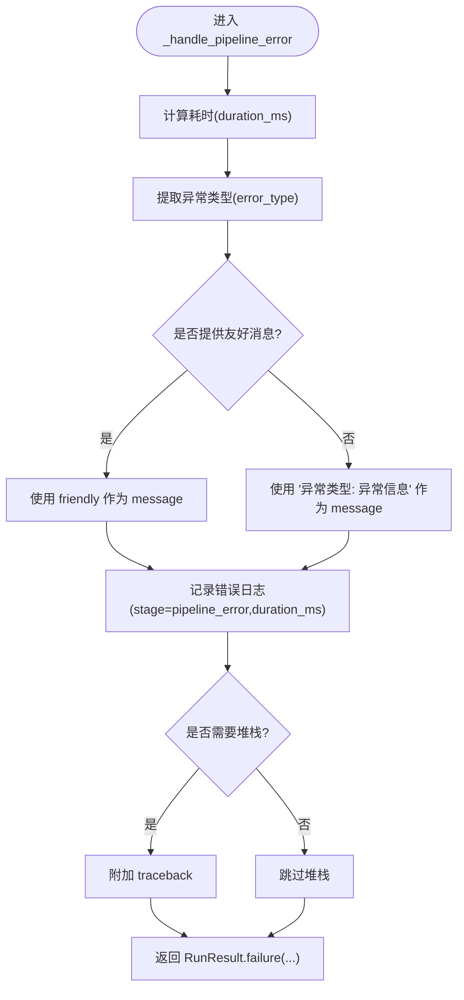
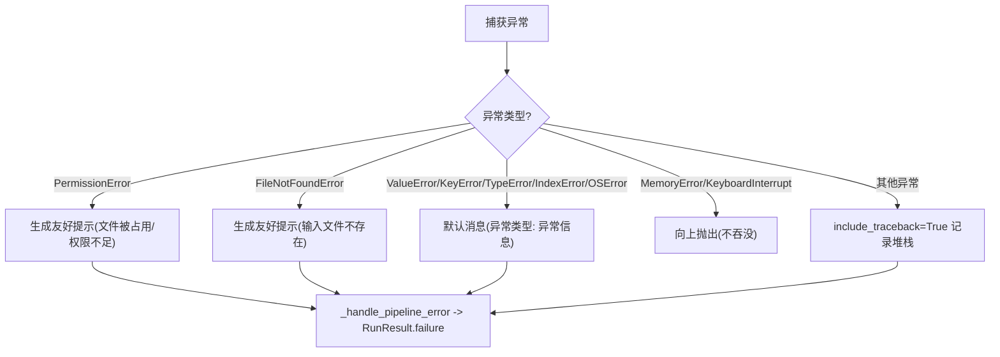
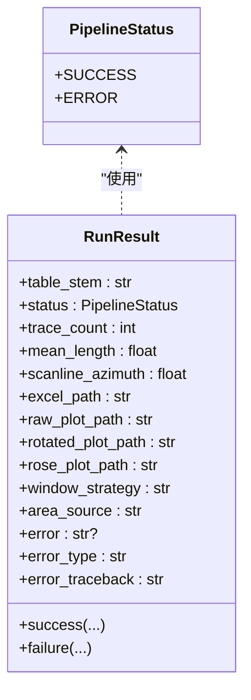
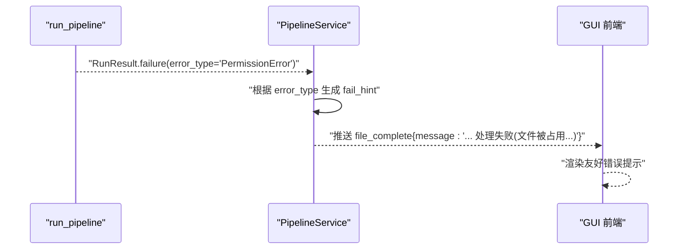
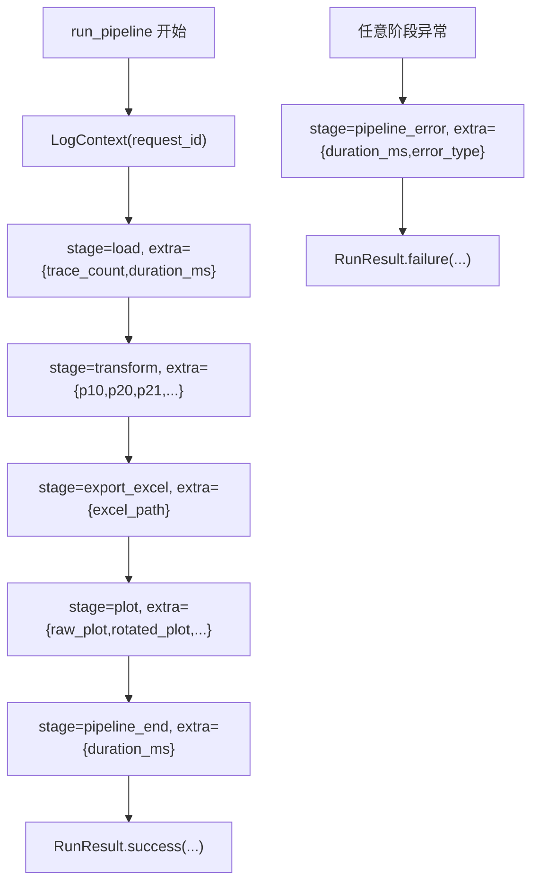
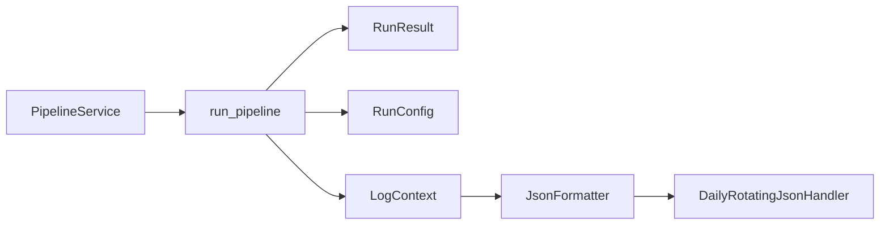

# 错误处理与异常管理

<cite>
**本文引用的文件**   
- [pipeline.py](file://trace_pipeline/pipeline.py)
- [models.py](file://trace_pipeline/models.py)
- [pipeline_service.py](file://backend/services/pipeline_service.py)
- [core.py](file://trace_pipeline/logging/core.py)
- [context.py](file://trace_pipeline/logging/context.py)
</cite>

## 目录
1. [简介](#简介)
2. [项目结构](#项目结构)
3. [核心组件](#核心组件)
4. [架构总览](#架构总览)
5. [详细组件分析](#详细组件分析)
6. [依赖关系分析](#依赖关系分析)
7. [性能考量](#性能考量)
8. [故障排查指南](#故障排查指南)
9. [结论](#结论)

## 简介
本文件聚焦 TracePipeline 的错误处理与异常管理体系，围绕统一错误处理函数 _handle_pipeline_error 的设计模式、异常类型分类策略、日志记录规范、RunResult 结果封装机制以及 GUI 友好提示的落地方式展开。文档同时提供结构化日志（含 extra 字段、阶段标记、时间统计）的使用说明与常见问题诊断路径，帮助读者快速定位并解决问题。

## 项目结构
与错误处理相关的核心代码分布在以下模块：
- trace_pipeline/pipeline.py：流水线编排与统一错误处理入口
- trace_pipeline/models.py：运行配置与结果模型（RunConfig/RunResult/PipelineStatus）
- backend/services/pipeline_service.py：后台任务调度、并发执行与结果聚合
- trace_pipeline/logging/core.py：JSON 日志格式化、按天归档与分片
- trace_pipeline/logging/context.py：请求上下文（request_id）与计时工具

图表来源
- [pipeline.py:230-474](file://trace_pipeline/pipeline.py#L230-L474)
- [pipeline_service.py:100-346](file://backend/services/pipeline_service.py#L100-L346)
- [core.py:44-146](file://trace_pipeline/logging/core.py#L44-L146)
- [context.py:27-56](file://trace_pipeline/logging/context.py#L27-L56)

章节来源
- [pipeline.py:230-474](file://trace_pipeline/pipeline.py#L230-L474)
- [pipeline_service.py:100-346](file://backend/services/pipeline_service.py#L100-L346)
- [core.py:44-146](file://trace_pipeline/logging/core.py#L44-L146)
- [context.py:27-56](file://trace_pipeline/logging/context.py#L27-L56)

## 核心组件
- 统一错误处理函数 _handle_pipeline_error
  - 职责：计算耗时、提取异常类型、记录结构化错误日志、生成友好消息、返回 RunResult.failure
  - 关键参数：cfg（运行配置）、exc（异常实例）、pipeline_start（开始时间戳）、friendly（可选友好消息）、include_traceback（是否附带堆栈）
  - 行为要点：
    - 通过 extra={"stage": "pipeline_error", "duration_ms": ...} 记录阶段与耗时
    - 当 include_traceback=True 时附加完整 traceback
    - 若未提供 friendly，则使用“异常类型: 异常信息”作为默认消息
    - 最终调用 RunResult.failure 返回失败结果

- 结果封装 RunResult
  - 成功路径：RunResult.success(...) 填充产出路径、统计量、节点信息等
  - 失败路径：RunResult.failure(table_stem, error, error_type, error_traceback) 设置 status=ERROR 并携带错误详情
  - 状态枚举 PipelineStatus：SUCCESS / ERROR

- 后台服务 PipelineService
  - 负责并行提交 run_pipeline 任务、收集结果、向队列推送进度事件
  - 对 MemoryError/SystemExit/KeyboardInterrupt 进行“不吞没”处理，直接向上抛出
  - 根据 result.error_type 为前端生成简短提示（如“文件被占用”、“输入文件不存在”）

- 日志系统
  - JsonFormatter：将 LogRecord 序列化为 JSON Lines，自动包含 request_id、extra、exc_info 等
  - DailyRotatingJsonHandler：按天目录存储、超过大小分片、旧日打包 zip 与清理
  - setup_logging/setup_worker_logging：主进程与子进程分别初始化日志处理器
  - LogContext：在作用域内绑定 request_id，便于跨层追踪

章节来源
- [pipeline.py:98-129](file://trace_pipeline/pipeline.py#L98-L129)
- [models.py:278-352](file://trace_pipeline/models.py#L278-L352)
- [pipeline_service.py:222-305](file://backend/services/pipeline_service.py#L222-L305)
- [core.py:44-146](file://trace_pipeline/logging/core.py#L44-L146)
- [context.py:27-56](file://trace_pipeline/logging/context.py#L27-L56)

## 架构总览
下图展示了从后台服务到流水线执行、再到统一错误处理与日志记录的端到端流程。

图表来源
- [pipeline_service.py:185-305](file://backend/services/pipeline_service.py#L185-L305)
- [pipeline.py:230-474](file://trace_pipeline/pipeline.py#L230-L474)
- [core.py:44-146](file://trace_pipeline/logging/core.py#L44-L146)

## 详细组件分析

### 统一错误处理函数 _handle_pipeline_error
设计要点
- 友好消息生成：优先使用传入的 friendly；否则回退为“异常类型: 异常信息”，确保用户可读
- 异常类型分类：通过 type(exc).__name__ 提取错误类型字符串，便于上层做差异化提示
- 日志记录策略：
  - 固定阶段标记 stage=pipeline_error
  - 记录 duration_ms 用于性能与问题定位
  - 可选 include_traceback 控制是否附带完整堆栈
- 结果封装：调用 RunResult.failure 返回标准失败结果

图表来源
- [pipeline.py:98-129](file://trace_pipeline/pipeline.py#L98-L129)

章节来源
- [pipeline.py:98-129](file://trace_pipeline/pipeline.py#L98-L129)

### 异常类型分类与处理逻辑
在 run_pipeline 中，针对不同异常采用差异化策略：
- PermissionError（文件权限/占用）
  - 友好消息：提示关闭已打开的输出文件（Excel/WPS），避免写入冲突
  - 日志：记录 stage=pipeline_error，附带 duration_ms
  - 结果：RunResult.failure，error_type="PermissionError"
- FileNotFoundError（输入文件缺失）
  - 友好消息：提示检查输入文件路径
  - 日志：同上
  - 结果：RunResult.failure，error_type="FileNotFoundError"
- ValueError/KeyError/TypeError/IndexError/OSError（数据格式或系统 I/O 错误）
  - 友好消息：默认“异常类型: 异常信息”
  - 日志：同上
  - 结果：RunResult.failure
- MemoryError/KeyboardInterrupt
  - 行为：不吞没，直接向上传播，由上层决定终止或恢复
- 其他异常
  - 行为：include_traceback=True，附带完整堆栈，便于深度诊断

图表来源
- [pipeline.py:450-474](file://trace_pipeline/pipeline.py#L450-L474)

章节来源
- [pipeline.py:450-474](file://trace_pipeline/pipeline.py#L450-L474)

### RunResult 结果封装机制
- 成功封装 RunResult.success
  - 填充 trace_count、mean_length、scanline_azimuth、excel_path、raw_plot_path、rotated_plot_path、rose_plot_path、window_strategy、area_source 及节点统计等
  - status=PipelineStatus.SUCCESS
- 失败封装 RunResult.failure
  - 必填 table_stem、error；可选 error_type、error_traceback
  - status=PipelineStatus.ERROR
- 状态枚举 PipelineStatus
  - SUCCESS / ERROR，避免字符串字面量拼写错误

图表来源
- [models.py:23-28](file://trace_pipeline/models.py#L23-L28)
- [models.py:278-352](file://trace_pipeline/models.py#L278-L352)

章节来源
- [models.py:23-28](file://trace_pipeline/models.py#L23-L28)
- [models.py:278-352](file://trace_pipeline/models.py#L278-L352)

### GUI 界面中的友好错误显示
- 后端在收到 RunResult 后，基于 error_type 生成简短提示：
  - PermissionError → “文件被占用，请关闭 Excel/WPS 后重试”
  - FileNotFoundError → “输入文件不存在”
- 这些提示随 file_complete 事件推送到前端，用于在进度面板或结果列表中展示给用户

图表来源
- [pipeline_service.py:289-305](file://backend/services/pipeline_service.py#L289-L305)

章节来源
- [pipeline_service.py:289-305](file://backend/services/pipeline_service.py#L289-L305)

### 日志系统的结构化记录方式
- 阶段标记与时间统计
  - 各阶段通过 extra={"stage": "...", "duration_ms": ...} 记录，便于检索与聚合
  - 典型阶段包括 pipeline_start、load、transform、export_excel、plot、pipeline_end、pipeline_error 等
- extra 参数的使用
  - 除 stage 与 duration_ms 外，还包含 outcrop、trace_count、excel_path、raw_plot、rotated_plot、rose_plot、node_count 等业务相关字段
- 请求上下文与跨层追踪
  - LogContext 在 run_pipeline 外层包裹，为每条流水线生成唯一 request_id，并在所有日志中自动注入
- JSON 序列化与健壮性
  - JsonFormatter 自动剔除内置属性、过滤 NaN/inf，保证输出为标准 JSON Lines
  - DailyRotatingJsonHandler 支持按天目录、按大小分片、旧日打包 zip 与过期清理

图表来源
- [pipeline.py:254-418](file://trace_pipeline/pipeline.py#L254-L418)
- [core.py:44-146](file://trace_pipeline/logging/core.py#L44-L146)
- [context.py:27-56](file://trace_pipeline/logging/context.py#L27-L56)

章节来源
- [pipeline.py:254-418](file://trace_pipeline/pipeline.py#L254-L418)
- [core.py:44-146](file://trace_pipeline/logging/core.py#L44-L146)
- [context.py:27-56](file://trace_pipeline/logging/context.py#L27-L56)

## 依赖关系分析
- run_pipeline 依赖：
  - models.RunConfig/RunResult/PipelineStatus
  - logging.LogContext、logging.Logger
  - 各业务模块（IO、变换、绘图等）
- PipelineService 依赖：
  - trace_pipeline.pipeline.run_pipeline
  - trace_pipeline.models.RunResult/PipelineStatus
  - logging 与 multiprocessing
- 日志子系统：
  - JsonFormatter/DailyRotatingJsonHandler 由 setup_logging/setup_worker_logging 装配
  - LogContext 通过 contextvars 传播 request_id

图表来源
- [pipeline_service.py:100-346](file://backend/services/pipeline_service.py#L100-L346)
- [pipeline.py:230-474](file://trace_pipeline/pipeline.py#L230-L474)
- [core.py:326-450](file://trace_pipeline/logging/core.py#L326-L450)

章节来源
- [pipeline_service.py:100-346](file://backend/services/pipeline_service.py#L100-L346)
- [pipeline.py:230-474](file://trace_pipeline/pipeline.py#L230-L474)
- [core.py:326-450](file://trace_pipeline/logging/core.py#L326-L450)

## 性能考量
- 错误处理开销极低：仅计算耗时、记录一次错误日志与构造一个不可变结果对象
- 结构化日志的额外字段（如 p10/p20/p21、节点计数）有助于后续性能分析与瓶颈定位
- 大对象（如 numpy 数组）不会直接写入日志，JsonFormatter 会进行安全转换与清洗，避免序列化失败

[本节为通用指导，无需特定文件引用]

## 故障排查指南
- 常见错误与定位步骤
  - PermissionError
    - 现象：提示“文件被占用或权限不足”
    - 排查：确认 Excel/WPS 未打开输出文件；检查输出目录权限
    - 日志关键字：stage=pipeline_error、error_type=PermissionError
  - FileNotFoundError
    - 现象：提示“输入文件不存在”
    - 排查：核对 input_dir 与 table_stem 是否正确；确认 .xlsx/.xls 存在
    - 日志关键字：stage=pipeline_error、error_type=FileNotFoundError
  - ValueError/KeyError/TypeError/IndexError/OSError
    - 现象：数据格式错误或系统 I/O 异常
    - 排查：查看 error 字段与日志 extra 中的上下文信息（如 outcrop、trace_count、excel_path）
    - 日志关键字：stage=pipeline_error、error_type=对应类型
  - MemoryError/KeyboardInterrupt
    - 现象：程序直接退出或中断
    - 排查：减少并行度、降低 DPI、缩小数据规模；关注系统内存压力
    - 日志关键字：无（异常未被吞没，直接上抛）
- 利用结构化日志快速定位
  - 使用 request_id 关联同一次处理的完整日志
  - 通过 stage 筛选关键阶段（load、transform、export_excel、plot、pipeline_error）
  - 结合 duration_ms 识别慢点与异常耗时
- 建议的日志检索命令（示例思路）
  - 按阶段过滤：grep '"stage":"pipeline_error"' logs/.../*.jsonl
  - 按请求 ID 过滤：grep '"request_id":"<your-id>"' logs/.../*.jsonl
  - 按错误类型过滤：grep '"error_type":"PermissionError"' logs/.../*.jsonl

章节来源
- [pipeline.py:450-474](file://trace_pipeline/pipeline.py#L450-L474)
- [core.py:44-146](file://trace_pipeline/logging/core.py#L44-L146)
- [context.py:27-56](file://trace_pipeline/logging/context.py#L27-L56)

## 结论
TracePipeline 的错误处理体系以 _handle_pipeline_error 为核心，结合 RunResult 的统一结果封装与结构化日志系统，实现了“可观测、可诊断、可呈现”的闭环。通过对不同异常类型的精细化处理与友好的前端提示，显著提升了用户体验与排障效率。建议在新增功能时遵循相同的错误处理与日志记录规范，保持系统一致性与可维护性。