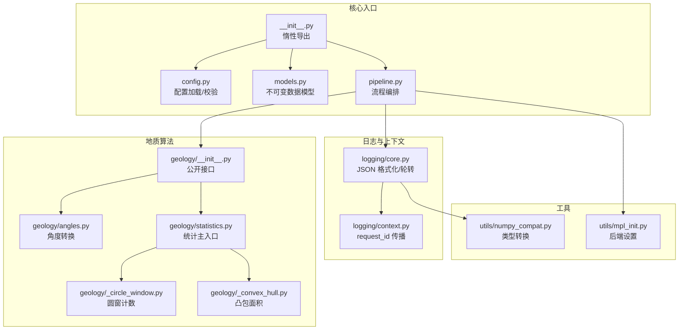
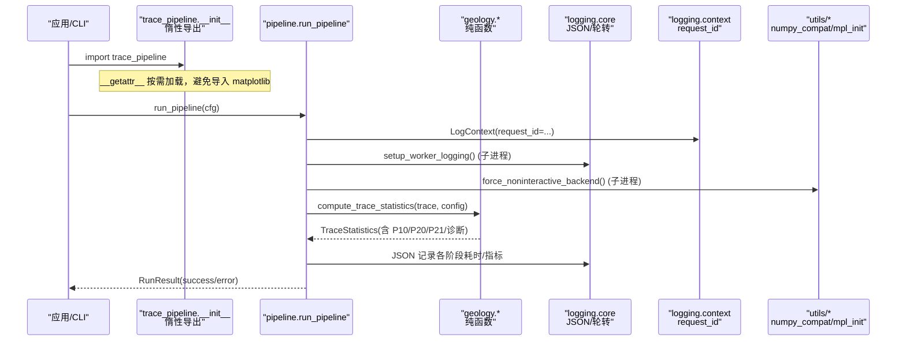
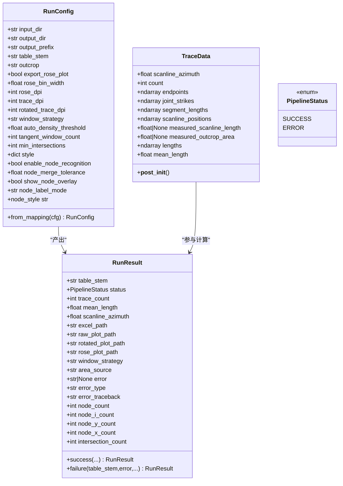
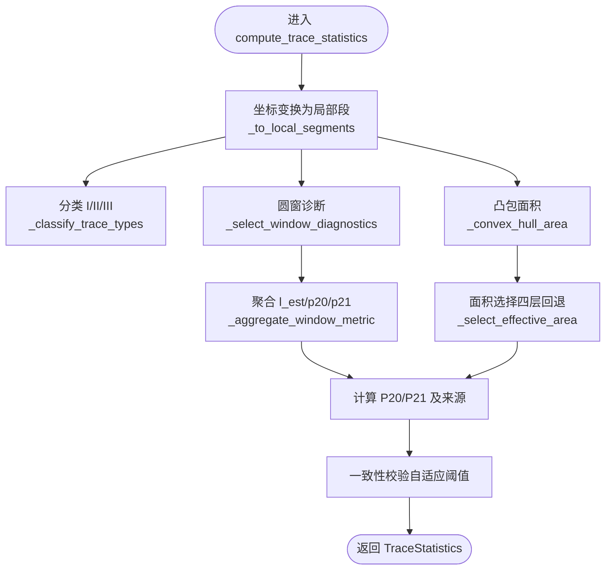
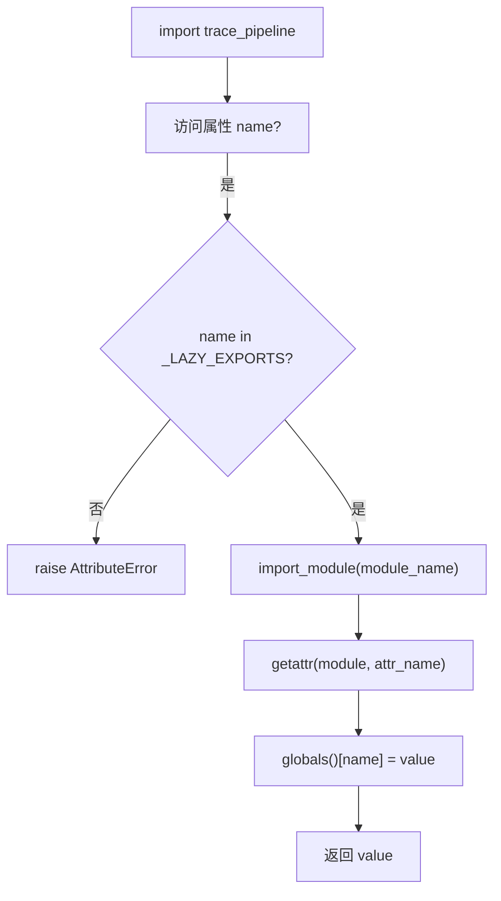
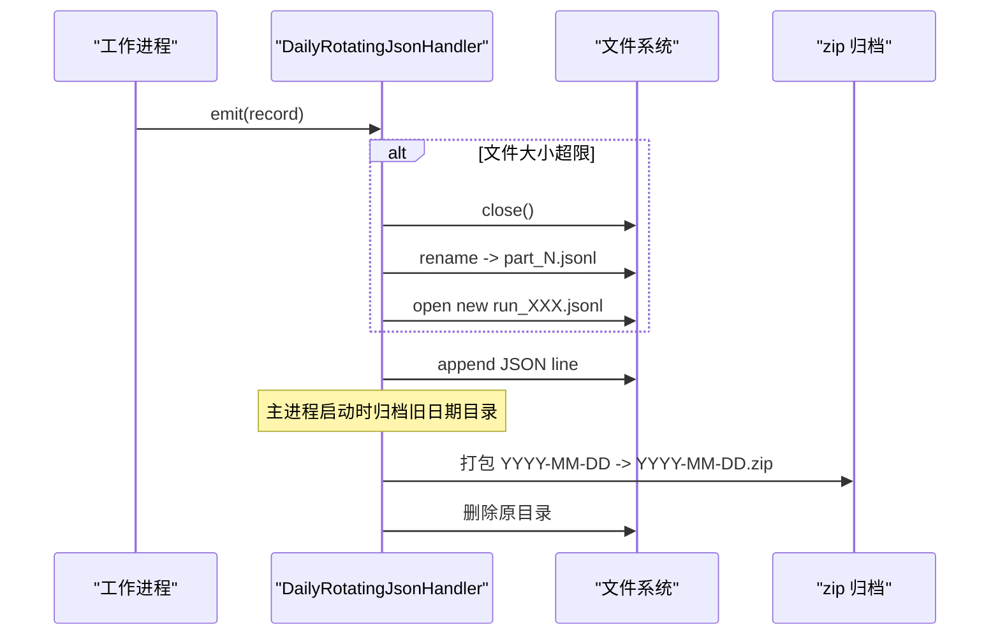
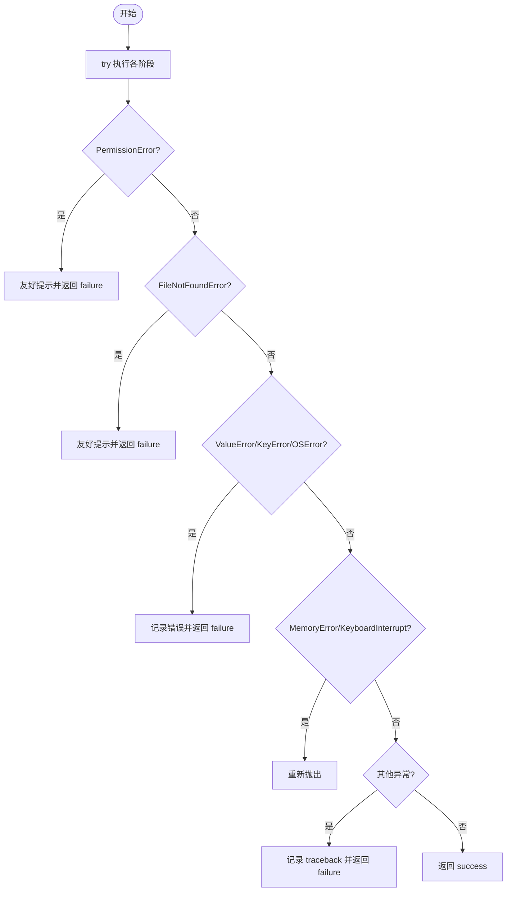
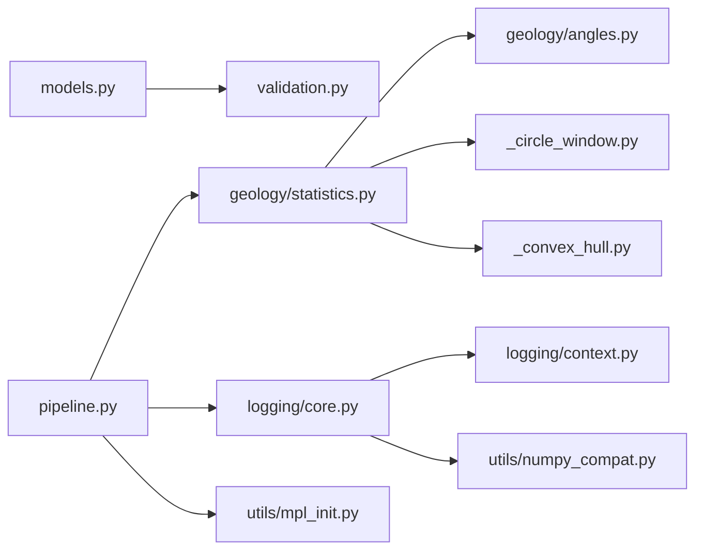

# 核心设计原则

<cite>
**本文引用的文件列表**
- [trace_pipeline/__init__.py](file://trace_pipeline/__init__.py)
- [trace_pipeline/models.py](file://trace_pipeline/models.py)
- [trace_pipeline/validation.py](file://trace_pipeline/validation.py)
- [trace_pipeline/config.py](file://trace_pipeline/config.py)
- [trace_pipeline/pipeline.py](file://trace_pipeline/pipeline.py)
- [trace_pipeline/geology/__init__.py](file://trace_pipeline/geology/__init__.py)
- [trace_pipeline/geology/angles.py](file://trace_pipeline/geology/angles.py)
- [trace_pipeline/geology/statistics.py](file://trace_pipeline/geology/statistics.py)
- [trace_pipeline/geology/_circle_window.py](file://trace_pipeline/geology/_circle_window.py)
- [trace_pipeline/geology/_convex_hull.py](file://trace_pipeline/geology/_convex_hull.py)
- [trace_pipeline/logging/core.py](file://trace_pipeline/logging/core.py)
- [trace_pipeline/logging/context.py](file://trace_pipeline/logging/context.py)
- [trace_pipeline/utils/numpy_compat.py](file://trace_pipeline/utils/numpy_compat.py)
- [trace_pipeline/utils/mpl_init.py](file://trace_pipeline/utils/mpl_init.py)
</cite>

## 目录
1. [引言](#引言)
2. [项目结构](#项目结构)
3. [核心组件](#核心组件)
4. [架构总览](#架构总览)
5. [详细组件分析](#详细组件分析)
6. [依赖关系分析](#依赖关系分析)
7. [性能考量](#性能考量)
8. [故障排查指南](#故障排查指南)
9. [结论](#结论)

## 引言
本文件聚焦 TracePipeline 的核心设计原则，围绕以下主题展开：不可变数据模型、纯函数计算、向量化优先策略、惰性导入机制、私有模块拆分策略、结构化日志与全链路追踪、异常安全与优雅降级。文档以源码为依据，提供代码级图示与可追溯来源，帮助读者从高层到细节全面理解系统的设计动机与实现方式。

## 项目结构
TracePipeline 采用按职责分层与子包划分的组织方式：
- trace_pipeline：核心库，包含数据模型、配置、流水线编排、地质算法、绘图、IO、日志等
- geology：地质/几何算法（纯函数为主）
- logging：JSON Lines 日志、按日轮转、上下文传播 request_id
- utils：通用工具（NumPy 兼容、matplotlib 初始化等）
- pipeline：单目标全流程编排（加载→变换→导出→绘图）

图表来源
- [trace_pipeline/__init__.py:1-83](file://trace_pipeline/__init__.py#L1-L83)
- [trace_pipeline/config.py:1-326](file://trace_pipeline/config.py#L1-L326)
- [trace_pipeline/models.py:1-352](file://trace_pipeline/models.py#L1-L352)
- [trace_pipeline/pipeline.py:1-474](file://trace_pipeline/pipeline.py#L1-L474)
- [trace_pipeline/geology/__init__.py:1-36](file://trace_pipeline/geology/__init__.py#L1-L36)
- [trace_pipeline/geology/angles.py:1-168](file://trace_pipeline/geology/angles.py#L1-L168)
- [trace_pipeline/geology/statistics.py:1-391](file://trace_pipeline/geology/statistics.py#L1-L391)
- [trace_pipeline/geology/_circle_window.py:1-269](file://trace_pipeline/geology/_circle_window.py#L1-L269)
- [trace_pipeline/geology/_convex_hull.py:1-208](file://trace_pipeline/geology/_convex_hull.py#L1-L208)
- [trace_pipeline/logging/core.py:1-450](file://trace_pipeline/logging/core.py#L1-L450)
- [trace_pipeline/logging/context.py:1-144](file://trace_pipeline/logging/context.py#L1-L144)
- [trace_pipeline/utils/numpy_compat.py:1-57](file://trace_pipeline/utils/numpy_compat.py#L1-L57)
- [trace_pipeline/utils/mpl_init.py:1-24](file://trace_pipeline/utils/mpl_init.py#L1-L24)

章节来源
- [trace_pipeline/__init__.py:1-83](file://trace_pipeline/__init__.py#L1-L83)
- [trace_pipeline/config.py:1-326](file://trace_pipeline/config.py#L1-L326)
- [trace_pipeline/models.py:1-352](file://trace_pipeline/models.py#L1-L352)
- [trace_pipeline/pipeline.py:1-474](file://trace_pipeline/pipeline.py#L1-L474)

## 核心组件
本节概述关键组件及其在整体设计中的作用，重点说明不可变数据模型、纯函数计算、向量化优先、惰性导入、日志与上下文、异常处理等原则的落地位置。

- 不可变数据模型：TraceData、RunConfig、RunResult 使用 frozen dataclass，并在构造后强制 NumPy 数组 writeable=False，确保数据完整性与线程安全。
- 纯函数计算：geology/ 子包以无状态、纯函数为核心，便于测试与并行化。
- 向量化优先：大量使用 NumPy 广播、布尔 mask、向量距离矩阵替代循环与分支。
- 惰性导入：顶层 __getattr__ 延迟加载 matplotlib 相关能力，import trace_pipeline 无副作用。
- 日志与上下文：JSON Lines 格式、按日轮转、contextvars 传播 request_id，支持多进程 worker 独立日志。
- 异常安全与优雅降级：流水线阶段式错误捕获、四层回退面积选择、自适应阈值一致性校验。

章节来源
- [trace_pipeline/models.py:1-352](file://trace_pipeline/models.py#L1-L352)
- [trace_pipeline/geology/__init__.py:1-36](file://trace_pipeline/geology/__init__.py#L1-L36)
- [trace_pipeline/geology/statistics.py:1-391](file://trace_pipeline/geology/statistics.py#L1-L391)
- [trace_pipeline/__init__.py:1-83](file://trace_pipeline/__init__.py#L1-L83)
- [trace_pipeline/logging/core.py:1-450](file://trace_pipeline/logging/core.py#L1-L450)
- [trace_pipeline/logging/context.py:1-144](file://trace_pipeline/logging/context.py#L1-L144)
- [trace_pipeline/pipeline.py:1-474](file://trace_pipeline/pipeline.py#L1-L474)

## 架构总览
下图展示了从顶层入口到核心计算与输出的调用链，体现“惰性导入 + 纯函数 + 向量化 + 结构化日志”的整体协作。

图表来源
- [trace_pipeline/__init__.py:51-58](file://trace_pipeline/__init__.py#L51-L58)
- [trace_pipeline/pipeline.py:230-474](file://trace_pipeline/pipeline.py#L230-L474)
- [trace_pipeline/geology/statistics.py:212-391](file://trace_pipeline/geology/statistics.py#L212-L391)
- [trace_pipeline/logging/core.py:326-398](file://trace_pipeline/logging/core.py#L326-L398)
- [trace_pipeline/logging/context.py:27-56](file://trace_pipeline/logging/context.py#L27-L56)
- [trace_pipeline/utils/mpl_init.py:12-24](file://trace_pipeline/utils/mpl_init.py#L12-L24)

## 详细组件分析

### 不可变数据模型与数据完整性保障
- 使用 frozen dataclass 定义 TraceData、RunConfig、RunResult，禁止运行时修改字段。
- 在 TraceData.__post_init__ 中：
  - 将输入转换为 np.ndarray 并强制写保护 flags.writeable=False，防止外部意外修改。
  - 严格校验形状、有限性、非负 count 等约束，保证下游计算的数据契约。
  - 可选正数字段 measured_scanline_length/measured_outcrop_area 通过统一校验器处理。
- RunConfig.from_mapping 仅提取已知字段，缺失项回退默认值；coerce_scalar_config_fields 对数值/布尔/枚举进行规范化与范围检查。
- RunResult.success/failure 工厂方法封装成功/失败结果构造，保持不可变性与一致的错误信息结构。

图表来源
- [trace_pipeline/models.py:41-157](file://trace_pipeline/models.py#L41-L157)
- [trace_pipeline/models.py:162-273](file://trace_pipeline/models.py#L162-L273)
- [trace_pipeline/models.py:278-352](file://trace_pipeline/models.py#L278-L352)
- [trace_pipeline/models.py:23-28](file://trace_pipeline/models.py#L23-L28)

章节来源
- [trace_pipeline/models.py:41-157](file://trace_pipeline/models.py#L41-L157)
- [trace_pipeline/models.py:162-273](file://trace_pipeline/models.py#L162-L273)
- [trace_pipeline/models.py:278-352](file://trace_pipeline/models.py#L278-L352)
- [trace_pipeline/validation.py:90-112](file://trace_pipeline/validation.py#L90-L112)

### 纯函数计算原则（geology/ 子包）
- 角度转换与折叠：azimuth_to_cartesian_deg、dip_to_strike、fold_strike_angle、fold_to_halfplane、fold_strikes_to_semicircle 均为无副作用的纯函数，输入输出明确，适合单元测试与并行执行。
- 统计主入口 compute_trace_statistics：
  - 基于 TraceData 与 TraceStatisticsConfig 计算 P10/P20/P21、平均迹长、测线长度来源、窗口策略与诊断。
  - 内部拆分为 _stat_types、_circle_window、_convex_hull、_stat_format、_window_scoring 等私有模块，单一职责清晰。
- 圆窗计数 _count_circle_windows_batch：
  - 利用 broadcasting 一次性构建 N×M 距离矩阵，避免 Python 层循环。
  - 使用布尔 mask 判定相交、端点在内/外，统计 m/q 值并推导 p20/p21/l_est。
- 凸包面积与缓冲：
  - 使用 Graham Scan 风格实现凸包，Shoelace 公式计算面积，缓冲面积近似解析解。
  - 提供几何质量检查（点数、退化、狭长度），用于面积选择的健壮性判断。

图表来源
- [trace_pipeline/geology/statistics.py:212-391](file://trace_pipeline/geology/statistics.py#L212-L391)
- [trace_pipeline/geology/_circle_window.py:71-216](file://trace_pipeline/geology/_circle_window.py#L71-L216)
- [trace_pipeline/geology/_convex_hull.py:79-114](file://trace_pipeline/geology/_convex_hull.py#L79-L114)

章节来源
- [trace_pipeline/geology/angles.py:28-168](file://trace_pipeline/geology/angles.py#L28-L168)
- [trace_pipeline/geology/statistics.py:1-391](file://trace_pipeline/geology/statistics.py#L1-L391)
- [trace_pipeline/geology/_circle_window.py:1-269](file://trace_pipeline/geology/_circle_window.py#L1-L269)
- [trace_pipeline/geology/_convex_hull.py:1-208](file://trace_pipeline/geology/_convex_hull.py#L1-L208)

### 向量化优先策略
- 广播与矩阵运算：
  - 圆窗计数中 centers 广播至 (N,M,2)，一次计算所有线段到所有圆心的最近点距离，避免逐条循环。
  - 叉积、投影、t/u 参数全部向量化，配合布尔 mask 完成相交判定。
- 复数运算替代循环：
  - 角度折叠与半平面映射使用模运算与 where 条件，避免显式 if-else 分支。
- 布尔 mask 替代分支：
  - dip_to_strike 使用三个 mask 分别赋值，提升可读性与性能。
  - 分类 I/II/III 使用布尔逻辑组合，减少嵌套条件。

章节来源
- [trace_pipeline/geology/_circle_window.py:117-176](file://trace_pipeline/geology/_circle_window.py#L117-L176)
- [trace_pipeline/geology/angles.py:43-70](file://trace_pipeline/geology/angles.py#L43-L70)
- [trace_pipeline/geology/angles.py:108-148](file://trace_pipeline/geology/angles.py#L108-L148)

### 惰性导入机制
- 顶层 __getattr__ 维护 _LAZY_EXPORTS 映射，仅在访问特定名称时动态 import_module 并缓存到全局命名空间。
- 好处：
  - import trace_pipeline 不触发 matplotlib 等重型依赖，避免启动开销与潜在环境冲突。
  - 对外 API 保持不变，用户无感知。
- 注意：
  - 未声明的属性会抛出 AttributeError，符合 Python 模块属性访问语义。

图表来源
- [trace_pipeline/__init__.py:31-58](file://trace_pipeline/__init__.py#L31-L58)

章节来源
- [trace_pipeline/__init__.py:31-58](file://trace_pipeline/__init__.py#L31-L58)

### 私有模块拆分策略
- 遵循 _*.py 命名约定，将复杂功能拆分为单一职责子模块：
  - _circle_window：圆窗策略、计数与评分
  - _convex_hull：凸包面积与缓冲
  - _stat_types：统计数据结构与常量
  - _stat_format：统计框行格式化
  - _window_scoring：窗口度量聚合与选择
- 优点：
  - 降低耦合，提高可测试性与可维护性
  - 控制单个文件规模，便于定位问题与审查

章节来源
- [trace_pipeline/geology/statistics.py:1-45](file://trace_pipeline/geology/statistics.py#L1-L45)
- [trace_pipeline/geology/_circle_window.py:1-20](file://trace_pipeline/geology/_circle_window.py#L1-L20)
- [trace_pipeline/geology/_convex_hull.py:1-20](file://trace_pipeline/geology/_convex_hull.py#L1-L20)

### 结构化日志设计与全链路追踪
- JSON Lines 格式：
  - JsonFormatter 将每条日志序列化为单行 JSON，包含 timestamp、level、logger、module、funcName、lineno、message、request_id、exc_info、extra 等字段。
  - 通过 _json_sanitize 与 _json_default 递归处理 numpy/pandas 类型，确保标准 JSON 输出。
- 按日轮转与归档：
  - DailyRotatingJsonHandler 按天创建目录 logs/YYYY-MM-DD，文件名 run_XXX.jsonl。
  - 自动打包前一天的目录为 zip，清理超过保留期的归档。
  - 支持同文件分片（run_XXX_part_N.jsonl），避免单文件过大。
- 上下文传播 request_id：
  - contextvars.ContextVar 存储 request_id，LogContext 作为上下文管理器绑定/恢复。
  - JsonFormatter 读取当前 request_id 写入日志，实现跨模块/线程的全链路追踪。
- 多进程安全：
  - 子进程通过 setup_worker_logging 独立创建 handler，文件名带 PID，避免共享文件句柄。
  - 归档操作仅在主进程执行，防止竞态。

图表来源
- [trace_pipeline/logging/core.py:148-305](file://trace_pipeline/logging/core.py#L148-L305)
- [trace_pipeline/logging/core.py:326-398](file://trace_pipeline/logging/core.py#L326-L398)
- [trace_pipeline/logging/context.py:27-56](file://trace_pipeline/logging/context.py#L27-L56)

章节来源
- [trace_pipeline/logging/core.py:44-146](file://trace_pipeline/logging/core.py#L44-L146)
- [trace_pipeline/logging/core.py:148-305](file://trace_pipeline/logging/core.py#L148-L305)
- [trace_pipeline/logging/core.py:326-398](file://trace_pipeline/logging/core.py#L326-L398)
- [trace_pipeline/logging/context.py:17-56](file://trace_pipeline/logging/context.py#L17-L56)
- [trace_pipeline/utils/numpy_compat.py:15-57](file://trace_pipeline/utils/numpy_compat.py#L15-L57)

### 异常安全与优雅降级
- 流水线异常处理：
  - _handle_pipeline_error 统一记录错误类型、耗时、可选 traceback，返回 RunResult.failure。
  - run_pipeline 针对 PermissionError、FileNotFoundError、常见 ValueError/KeyError/OSError 等进行友好提示与降级。
- 面积选择四层回退：
  - 实测面积 → 原始凸包 → 缓冲凸包 → 圆窗等效面积，逐级降级，确保尽可能产出有效结果。
  - 结合自适应阈值比较凸包面积与圆窗等效面积，差异过大则降级并告警。
- 一致性校验：
  - 根据样本量自适应调整 P20/P21 一致性阈值，超出阈值记录警告，辅助诊断数据质量。

图表来源
- [trace_pipeline/pipeline.py:98-130](file://trace_pipeline/pipeline.py#L98-L130)
- [trace_pipeline/pipeline.py:450-474](file://trace_pipeline/pipeline.py#L450-L474)
- [trace_pipeline/geology/statistics.py:106-166](file://trace_pipeline/geology/statistics.py#L106-L166)

章节来源
- [trace_pipeline/pipeline.py:98-130](file://trace_pipeline/pipeline.py#L98-L130)
- [trace_pipeline/pipeline.py:450-474](file://trace_pipeline/pipeline.py#L450-L474)
- [trace_pipeline/geology/statistics.py:106-166](file://trace_pipeline/geology/statistics.py#L106-L166)

## 依赖关系分析
- 模块内聚与耦合：
  - models.py 与 validation.py 低耦合，仅依赖标量校验函数，避免循环依赖。
  - geology/statistics.py 聚合多个私有子模块，但通过明确的接口边界维持高内聚。
- 外部依赖：
  - numpy 广泛用于向量化计算；pandas 仅在 numpy_compat 中可选导入，不影响核心路径。
  - matplotlib 通过惰性导入与 Agg 后端强制设置，避免 GUI 后端在多进程/后台线程中的冲突。
- 潜在循环依赖：
  - 通过 utils/paths.get_project_root 与 config.py 的 PROJECT_ROOT 解耦，避免循环引用。

图表来源
- [trace_pipeline/models.py:1-352](file://trace_pipeline/models.py#L1-L352)
- [trace_pipeline/validation.py:1-112](file://trace_pipeline/validation.py#L1-L112)
- [trace_pipeline/geology/statistics.py:1-391](file://trace_pipeline/geology/statistics.py#L1-L391)
- [trace_pipeline/geology/angles.py:1-168](file://trace_pipeline/geology/angles.py#L1-L168)
- [trace_pipeline/geology/_circle_window.py:1-269](file://trace_pipeline/geology/_circle_window.py#L1-L269)
- [trace_pipeline/geology/_convex_hull.py:1-208](file://trace_pipeline/geology/_convex_hull.py#L1-L208)
- [trace_pipeline/pipeline.py:1-474](file://trace_pipeline/pipeline.py#L1-L474)
- [trace_pipeline/logging/core.py:1-450](file://trace_pipeline/logging/core.py#L1-L450)
- [trace_pipeline/logging/context.py:1-144](file://trace_pipeline/logging/context.py#L1-L144)
- [trace_pipeline/utils/numpy_compat.py:1-57](file://trace_pipeline/utils/numpy_compat.py#L1-L57)
- [trace_pipeline/utils/mpl_init.py:1-24](file://trace_pipeline/utils/mpl_init.py#L1-L24)

章节来源
- [trace_pipeline/config.py:1-326](file://trace_pipeline/config.py#L1-L326)
- [trace_pipeline/pipeline.py:1-474](file://trace_pipeline/pipeline.py#L1-L474)

## 性能考量
- 向量化计算显著降低 Python 层循环开销，尤其在大规模迹线集合上表现突出。
- 圆窗批处理通过广播矩阵一次性计算距离与相交，内存占用随 N×M 增长，需权衡窗口数量与内存预算。
- 惰性导入避免启动时加载 matplotlib，缩短冷启动时间。
- 日志分片与归档避免单文件过大，降低 I/O 压力与磁盘碎片。
- 建议：
  - 对超大数据集，考虑分块处理或限制窗口数量。
  - 监控内存峰值，必要时调整 min_intersections 与窗口策略。

[本节为一般性指导，无需具体文件分析]

## 故障排查指南
- 无法写入输出文件：
  - 检查权限与文件占用，参考 _handle_pipeline_error 的友好提示。
- 输入文件不存在：
  - 确认 input_dir 与 table_stem 是否正确，查看 FileNotFoundError 处理路径。
- 日志缺失或重复：
  - 确认 setup_logging/setup_worker_logging 是否被正确调用，检查日志目录与分片命名。
- request_id 未传播：
  - 确认是否在 LogContext 作用域内调用，检查 contextvars 的使用。
- matplotlib 后端冲突：
  - 子进程中确保 force_noninteractive_backend 已调用，避免 GUI 后端初始化。

章节来源
- [trace_pipeline/pipeline.py:450-474](file://trace_pipeline/pipeline.py#L450-L474)
- [trace_pipeline/logging/core.py:326-398](file://trace_pipeline/logging/core.py#L326-L398)
- [trace_pipeline/logging/context.py:27-56](file://trace_pipeline/logging/context.py#L27-L56)
- [trace_pipeline/utils/mpl_init.py:12-24](file://trace_pipeline/utils/mpl_init.py#L12-L24)

## 结论
TracePipeline 通过不可变数据模型、纯函数计算、向量化优先、惰性导入、模块化拆分、结构化日志与上下文追踪、以及完善的异常安全与优雅降级策略，构建了高内聚、低耦合、可测试、可扩展且高性能的地质数据处理管线。这些设计原则不仅提升了系统的可靠性与可维护性，也为后续功能扩展与性能优化奠定了坚实基础。