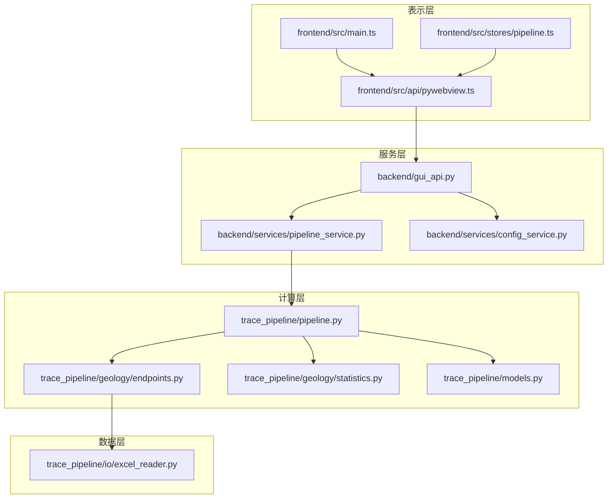
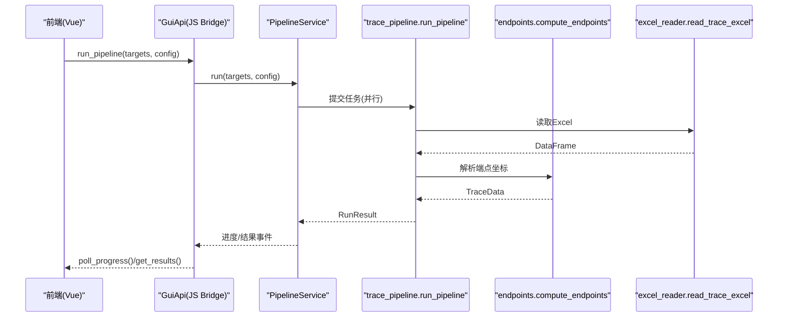
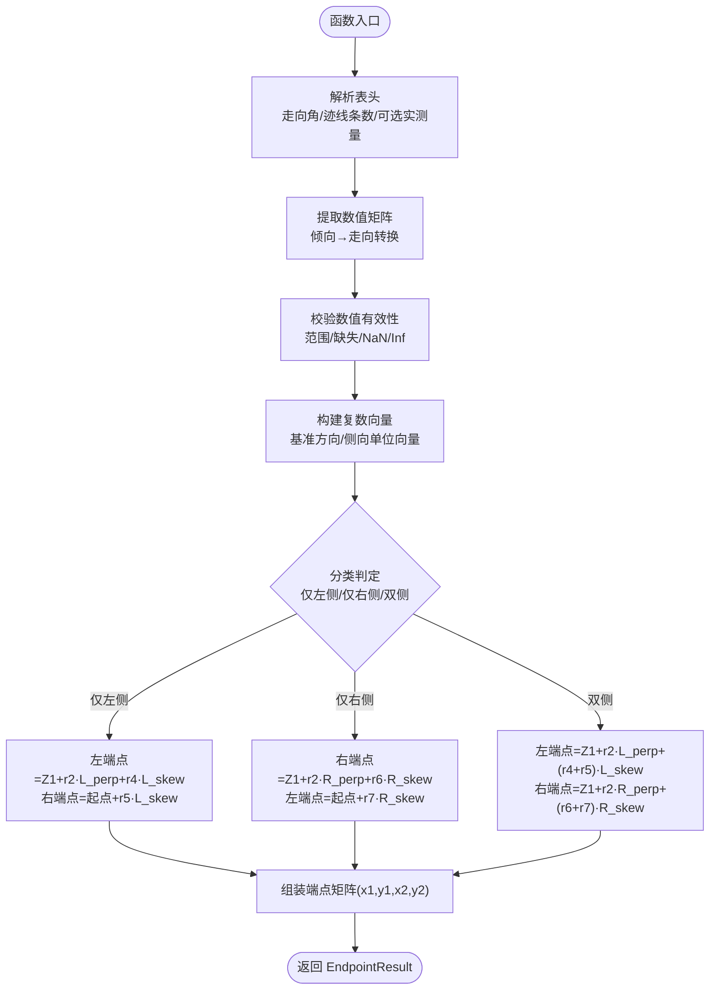
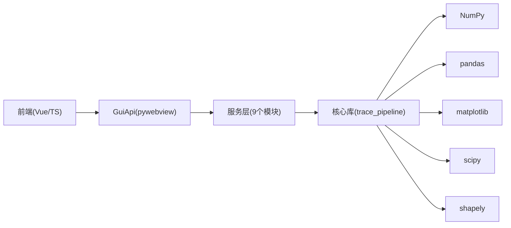

# 系统架构与技术栈

<cite>
**本文引用的文件**   
- [README.md](file://README.md)
- [backend/main_gui.py](file://backend/main_gui.py)
- [backend/gui_api.py](file://backend/gui_api.py)
- [backend/services/pipeline_service.py](file://backend/services/pipeline_service.py)
- [backend/services/config_service.py](file://backend/services/config_service.py)
- [frontend/src/main.ts](file://frontend/src/main.ts)
- [frontend/src/api/pywebview.ts](file://frontend/src/api/pywebview.ts)
- [frontend/src/stores/pipeline.ts](file://frontend/src/stores/pipeline.ts)
- [trace_pipeline/pipeline.py](file://trace_pipeline/pipeline.py)
- [trace_pipeline/models.py](file://trace_pipeline/models.py)
- [trace_pipeline/geology/endpoints.py](file://trace_pipeline/geology/endpoints.py)
- [trace_pipeline/io/excel_reader.py](file://trace_pipeline/io/excel_reader.py)
- [trace_pipeline/geology/statistics.py](file://trace_pipeline/geology/statistics.py)
- [pyproject.toml](file://pyproject.toml)
</cite>

## 目录
1. [简介](#简介)
2. [项目结构](#项目结构)
3. [核心组件](#核心组件)
4. [架构总览](#架构总览)
5. [详细组件分析](#详细组件分析)
6. [依赖关系分析](#依赖关系分析)
7. [性能考量](#性能考量)
8. [故障排查指南](#故障排查指南)
9. [结论](#结论)
10. [附录](#附录)

## 简介
TracePipeline 是一套面向岩体节理几何特征分析的专业工具，提供 CLI 与桌面 GUI 双模式。系统采用四层架构：表示层（Vue 3 + TypeScript + Element Plus + ECharts）、服务层（pywebview JS Bridge + 9 个 Python 服务模块）、计算层（NumPy 向量化 + 纯函数模块）、数据层（pandas + Excel 读写）。各层职责清晰、单向依赖，确保可维护性与可扩展性。

## 项目结构
仓库按“前端/后端/核心库”组织：
- frontend：Vue 3 + TypeScript 应用，Element Plus UI，ECharts 图表，Pinia 状态管理
- backend：pywebview 容器与 JS Bridge，9 个服务模块（配置、文件、流水线、预览、统计、数据、报告、审计、日志）
- trace_pipeline：核心库，包含数据模型、IO、几何与统计计算、绘图、CLI 等

图示来源
- [frontend/src/main.ts:1-88](file://frontend/src/main.ts#L1-L88)
- [frontend/src/api/pywebview.ts:1-337](file://frontend/src/api/pywebview.ts#L1-L337)
- [backend/gui_api.py:1-800](file://backend/gui_api.py#L1-L800)
- [backend/services/pipeline_service.py:1-346](file://backend/services/pipeline_service.py#L1-L346)
- [backend/services/config_service.py:1-144](file://backend/services/config_service.py#L1-L144)
- [trace_pipeline/pipeline.py:1-474](file://trace_pipeline/pipeline.py#L1-L474)
- [trace_pipeline/geology/endpoints.py:1-418](file://trace_pipeline/geology/endpoints.py#L1-L418)
- [trace_pipeline/geology/statistics.py:1-200](file://trace_pipeline/geology/statistics.py#L1-L200)
- [trace_pipeline/io/excel_reader.py:1-169](file://trace_pipeline/io/excel_reader.py#L1-L169)
- [trace_pipeline/models.py:1-352](file://trace_pipeline/models.py#L1-L352)

章节来源
- [README.md:170-282](file://README.md#L170-L282)

## 核心组件
- 表示层
  - Vue 3 + TypeScript 应用入口与路由、组件、样式初始化
  - pywebview.ts 封装 JS Bridge 调用，支持开发环境 mock
  - Pinia store 管理流水线运行状态与进度
- 服务层
  - GuiApi：JS Bridge 入口，统一鉴权、缓存、并发控制、审计
  - PipelineService：后台线程 + 多进程执行流水线，事件队列轮询
  - ConfigService：config.json 原子写入与校验
- 计算层
  - pipeline.run_pipeline：五阶段编排（加载→变换+统计→节点识别→Excel 导出→绘图）
  - endpoints.compute_endpoints：复数向量端点计算（纯函数、向量化）
  - statistics：P10/P20/P21 统计、圆窗策略、面积四级回退
  - models：不可变数据类 TraceData/RunConfig/RunResult
- 数据层
  - excel_reader：Excel 读取、引擎选择、工作表回退、格式校验

章节来源
- [frontend/src/main.ts:1-88](file://frontend/src/main.ts#L1-L88)
- [frontend/src/api/pywebview.ts:1-337](file://frontend/src/api/pywebview.ts#L1-L337)
- [frontend/src/stores/pipeline.ts:1-56](file://frontend/src/stores/pipeline.ts#L1-L56)
- [backend/gui_api.py:1-800](file://backend/gui_api.py#L1-L800)
- [backend/services/pipeline_service.py:1-346](file://backend/services/pipeline_service.py#L1-L346)
- [backend/services/config_service.py:1-144](file://backend/services/config_service.py#L1-L144)
- [trace_pipeline/pipeline.py:1-474](file://trace_pipeline/pipeline.py#L1-L474)
- [trace_pipeline/geology/endpoints.py:1-418](file://trace_pipeline/geology/endpoints.py#L1-L418)
- [trace_pipeline/geology/statistics.py:1-200](file://trace_pipeline/geology/statistics.py#L1-L200)
- [trace_pipeline/io/excel_reader.py:1-169](file://trace_pipeline/io/excel_reader.py#L1-L169)
- [trace_pipeline/models.py:1-352](file://trace_pipeline/models.py#L1-L352)

## 架构总览
系统严格分层，单向依赖：表示层 → 服务层 → 计算层 → 数据层。GUI 通过 pywebview 将前端方法映射到后端 GuiApi；GuiApi 再调度具体服务；服务层调用 trace_pipeline 核心库完成数据处理与可视化。

图示来源
- [frontend/src/api/pywebview.ts:1-337](file://frontend/src/api/pywebview.ts#L1-L337)
- [backend/gui_api.py:1-800](file://backend/gui_api.py#L1-L800)
- [backend/services/pipeline_service.py:1-346](file://backend/services/pipeline_service.py#L1-L346)
- [trace_pipeline/pipeline.py:1-474](file://trace_pipeline/pipeline.py#L1-L474)
- [trace_pipeline/geology/endpoints.py:1-418](file://trace_pipeline/geology/endpoints.py#L1-L418)
- [trace_pipeline/io/excel_reader.py:1-169](file://trace_pipeline/io/excel_reader.py#L1-L169)

## 详细组件分析

### 表示层（Vue 3 + TypeScript + Element Plus + ECharts）
- main.ts：创建 Vue 应用，注册 Element Plus 组件与全局样式，挂载根组件
- api/pywebview.ts：定义 GuiApiInterface 类型契约，封装 waitForApi 就绪等待与 mockApi 开发回退，统一暴露异步方法
- stores/pipeline.ts：Pinia Store 管理运行状态、进度、结果列表，持久化用户偏好

设计要点
- 类型安全桥接：前后端方法签名一致，vue-tsc 零错误
- 开发友好：浏览器环境自动使用 mock，无需启动后端即可调试
- 响应式状态：Store 驱动 UI 更新，轮询进度事件

章节来源
- [frontend/src/main.ts:1-88](file://frontend/src/main.ts#L1-L88)
- [frontend/src/api/pywebview.ts:1-337](file://frontend/src/api/pywebview.ts#L1-L337)
- [frontend/src/stores/pipeline.ts:1-56](file://frontend/src/stores/pipeline.ts#L1-L56)

### 服务层（pywebview JS Bridge + 9 个 Python 服务模块）
- main_gui.py：WebView2 检测、窗口居中、生命周期管理、绑定 GuiApi
- gui_api.py：对外暴露 37 个方法，实现路径安全校验、配置同步、缓存失效、并发锁、审计日志
- services/pipeline_service.py：后台线程 + ProcessPoolExecutor 并行执行，事件队列非阻塞轮询
- services/config_service.py：config.json 原子写入、字段校验、部分重置

技术选型决策
- 为什么选择 pywebview 而非 Electron
  - 体积更小：直接嵌入系统 WebView2，避免打包 Chromium 运行时
  - 资源占用更低：无 Node/Electron 额外开销，适合科学计算桌面应用
  - 原生能力：通过 JS Bridge 直接调用 Python，跨进程通信简单高效

章节来源
- [backend/main_gui.py:1-211](file://backend/main_gui.py#L1-L211)
- [backend/gui_api.py:1-800](file://backend/gui_api.py#L1-L800)
- [backend/services/pipeline_service.py:1-346](file://backend/services/pipeline_service.py#L1-L346)
- [backend/services/config_service.py:1-144](file://backend/services/config_service.py#L1-L144)

### 计算层（NumPy 向量化 + 纯函数模块）
- pipeline.py：run_pipeline 五阶段编排，含异常处理、日志上下文、子进程安全初始化 matplotlib
- geology/endpoints.py：compute_endpoints 基于复数向量化计算端点坐标，分左/右/双侧三种情形，纯函数、就地修改预分配数组
- geology/statistics.py：P10/P20/P21 统计、圆窗四策略、面积四级回退、迹长优先链
- models.py：不可变数据类 TraceData/RunConfig/RunResult，frozen=True，writeable=False 防止意外修改

设计原则体现
- 不可变数据模型：dataclass(frozen=True)，属性校验后设置 writeable=False
- 纯函数计算：geology 子包全部为纯函数，接收数组返回数组，无状态、无副作用
- 向量化优先：NumPy 广播 + 复数运算替代 for 循环；布尔 mask 替代 if-else 分支
- 惰性导入：__getattr__ 延迟加载 matplotlib/绘图模块，import trace_pipeline 无副作用

章节来源
- [trace_pipeline/pipeline.py:1-474](file://trace_pipeline/pipeline.py#L1-L474)
- [trace_pipeline/geology/endpoints.py:1-418](file://trace_pipeline/geology/endpoints.py#L1-L418)
- [trace_pipeline/geology/statistics.py:1-200](file://trace_pipeline/geology/statistics.py#L1-L200)
- [trace_pipeline/models.py:1-352](file://trace_pipeline/models.py#L1-L352)

### 数据层（pandas + Excel 读写）
- io/excel_reader.py：read_trace_excel 支持 .xlsx/.xls 双引擎，目标 sheet 不存在时回退首表，大小上限检查，基础格式校验

章节来源
- [trace_pipeline/io/excel_reader.py:1-169](file://trace_pipeline/io/excel_reader.py#L1-L169)

### 关键流程图：端点计算算法

图示来源
- [trace_pipeline/geology/endpoints.py:1-418](file://trace_pipeline/geology/endpoints.py#L1-L418)

## 依赖关系分析
- 前端依赖：Vue 3、TypeScript、Element Plus、ECharts、Pinia
- 后端依赖：pywebview、numpy、pandas、matplotlib、openpyxl/xlrd、scipy、shapely、python-docx、reportlab
- 核心库依赖：numpy、pandas、matplotlib、scipy、shapely

图示来源
- [pyproject.toml:35-48](file://pyproject.toml#L35-L48)
- [frontend/src/main.ts:1-88](file://frontend/src/main.ts#L1-L88)
- [backend/gui_api.py:1-800](file://backend/gui_api.py#L1-L800)
- [trace_pipeline/pipeline.py:1-474](file://trace_pipeline/pipeline.py#L1-L474)

章节来源
- [pyproject.toml:1-83](file://pyproject.toml#L1-L83)

## 性能考量
- NumPy 广播与复数运算优势
  - 端点计算使用复数向量一次性推导，避免逐行循环，显著降低 Python 解释器开销
  - 布尔 mask 批量筛选三类情形，减少分支判断与内存拷贝
- 向量化优先
  - 统计指标计算尽量使用 np.sum/np.mean/hypot 等 C 级实现
  - 面积回退与一致性阈值比较采用向量化逻辑
- 并行与缓存
  - PipelineService 使用 ProcessPoolExecutor 并行执行，workers 自适应 CPU 核心数
  - TTLCache/LRU 缓存图片与统计数据，DirectoryChangeDetector 监听 output 变更自动失效
- 惰性导入
  - matplotlib/绘图模块按需导入，避免 import trace_pipeline 时的冷启动开销

章节来源
- [trace_pipeline/geology/endpoints.py:1-418](file://trace_pipeline/geology/endpoints.py#L1-L418)
- [trace_pipeline/geology/statistics.py:1-200](file://trace_pipeline/geology/statistics.py#L1-L200)
- [backend/services/pipeline_service.py:1-346](file://backend/services/pipeline_service.py#L1-L346)
- [backend/gui_api.py:1-800](file://backend/gui_api.py#L1-L800)

## 故障排查指南
- WebView2 未安装
  - 现象：启动提示 WebView2 Runtime 未安装并引导下载
  - 处理：根据提示链接安装后重启应用
- 配置文件权限不足
  - 现象：无法创建或保存 config.json
  - 处理：检查输出目录权限，确保可写
- Excel 文件过大或格式错误
  - 现象：抛出 TraceValidationError 或 ValueError
  - 处理：确认文件大小 ≤ 50 MiB，列数与数据类型符合规范
- 文件被占用导致写入失败
  - 现象：PermissionError，提示关闭 Excel/WPS
  - 处理：关闭已打开的输出文件后重试
- 流水线内部异常
  - 现象：RunResult.error 记录错误类型与消息
  - 处理：查看 GUI 日志面板或 JSON Lines 日志，定位问题阶段

章节来源
- [backend/main_gui.py:1-211](file://backend/main_gui.py#L1-L211)
- [backend/services/config_service.py:1-144](file://backend/services/config_service.py#L1-L144)
- [trace_pipeline/io/excel_reader.py:1-169](file://trace_pipeline/io/excel_reader.py#L1-L169)
- [trace_pipeline/pipeline.py:1-474](file://trace_pipeline/pipeline.py#L1-L474)

## 结论
TracePipeline 通过四层架构实现了清晰的职责分离与单向依赖，结合 pywebview 的轻量桌面容器、Vue 3 Composition API 的类型安全与响应式优势、NumPy 向量化与复数运算的高性能特性，以及 pandas + Excel 的数据层支撑，提供了稳定高效的岩体节理测线数据处理与可视化体验。设计原则（不可变数据模型、纯函数计算、向量化优先、惰性导入）确保了代码的可维护性与扩展性。

## 附录
- 技术选型对比
  - pywebview vs Electron：体积、内存、原生能力、跨进程通信复杂度
  - Vue 3 Composition API：更好的逻辑复用与类型推断，配合 vue-tsc 保障前后端类型一致
  - NumPy 广播与复数运算：在大规模几何计算中具备显著性能优势
- 参考文档
  - README 中的架构图、数据流与设计原则说明

章节来源
- [README.md:170-282](file://README.md#L170-L282)