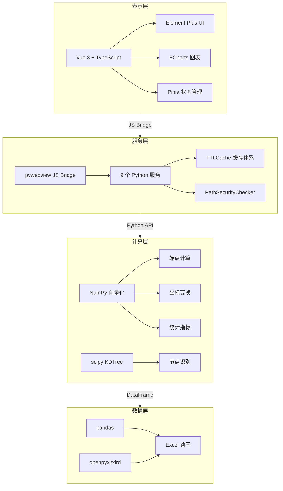
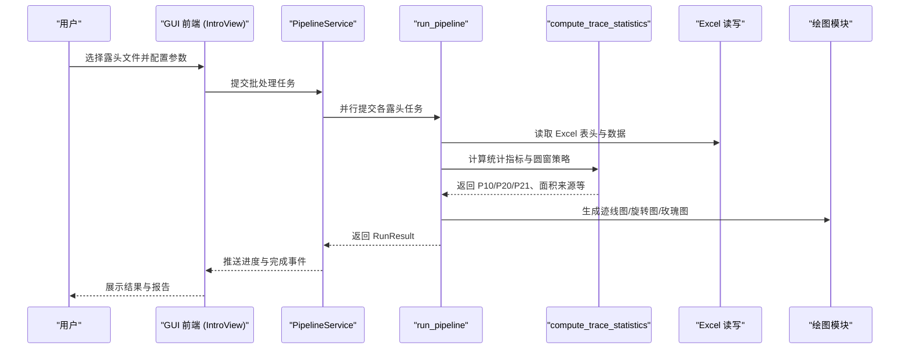
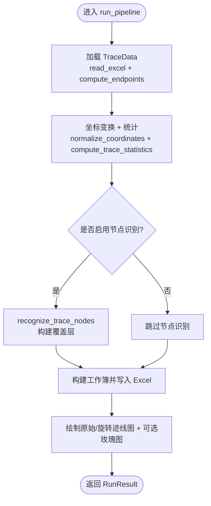
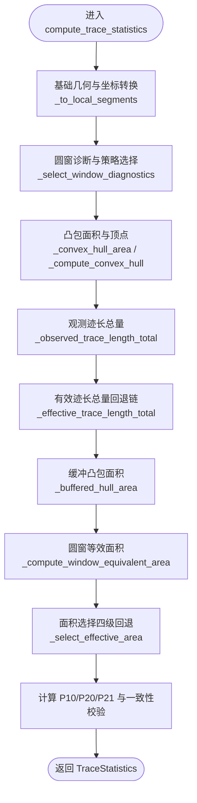
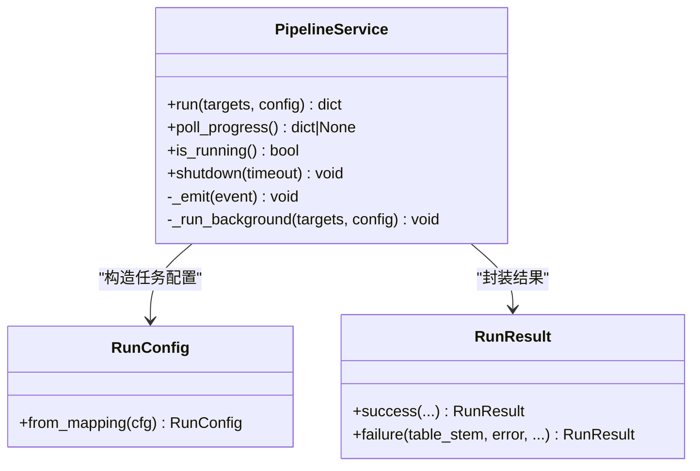
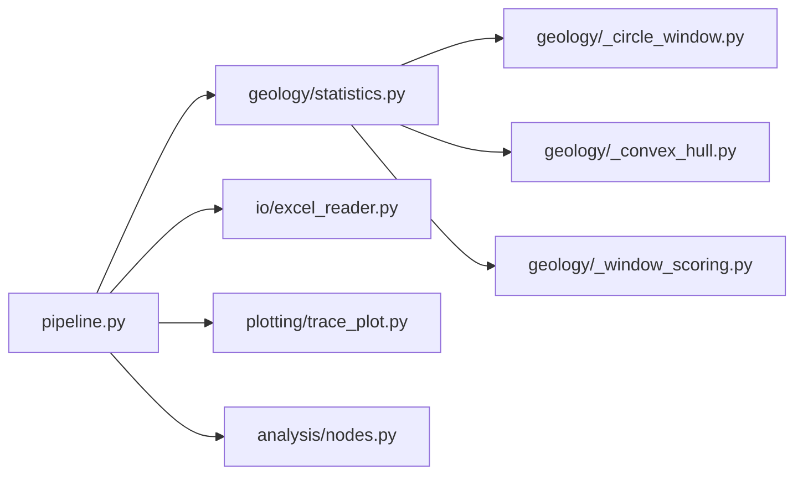

# 适用场景与目标用户

<cite>
**本文引用的文件列表**
- [README.md](file://README.md)
- [trace_pipeline/__init__.py](file://trace_pipeline/__init__.py)
- [trace_pipeline/pipeline.py](file://trace_pipeline/pipeline.py)
- [trace_pipeline/models.py](file://trace_pipeline/models.py)
- [trace_pipeline/geology/statistics.py](file://trace_pipeline/geology/statistics.py)
- [backend/services/pipeline_service.py](file://backend/services/pipeline_service.py)
- [reference/matlab/README.md](file://reference/matlab/README.md)
- [config.example.json](file://config.example.json)
- [frontend/src/views/IntroView.vue](file://frontend/src/views/IntroView.vue)
</cite>

## 目录
1. [引言](#引言)
2. [项目结构](#项目结构)
3. [核心组件](#核心组件)
4. [架构总览](#架构总览)
5. [详细组件分析](#详细组件分析)
6. [依赖关系分析](#依赖关系分析)
7. [性能考量](#性能考量)
8. [故障排查指南](#故障排查指南)
9. [结论](#结论)
10. [附录](#附录)

## 引言
TracePipeline 是一套面向岩体节理几何特征分析的工程化工具，提供从原始测线记录到统计指标、可视化图表的全流程自动化处理。其三大典型应用场景为：
- 岩体结构面调查（矿山、隧道工程）
- 隧道/边坡工程地质勘察（岩土工程设计）
- 岩石力学研究（学术科研）

不同用户群体的需求特点：
- 地质工程师：需要高效的批量处理能力、稳定的输出产物与可追溯的数据链
- 研究人员：需要精确的算法验证、与 MATLAB 原型完全兼容的结果对比能力
- 学生：需要易用的学习工具、清晰的可视化与交互式界面

与传统手工计算方法相比，本系统在以下方面具备显著优势：
- 精度：端点坐标计算与统计指标与 MATLAB 原型完全兼容，误差在数值级极小范围
- 效率：支持多进程并行处理，批量任务吞吐显著提升
- 可重复性：完整的数据溯源链（P₁₀/P₂₀/P₂₁ 来源标注、圆窗策略选择、面积回退路径），审计友好

## 项目结构
系统采用四层架构：表示层（Vue 3 + Element Plus + ECharts）、服务层（pywebview JS Bridge + Python 服务模块）、计算层（NumPy 向量化纯函数）、数据层（pandas + Excel 读写）。流水线编排贯穿“加载 → 变换+统计 → 节点识别 → Excel 导出 → 绘图”五个阶段。

图示来源
- [README.md:170-220](file://README.md#L170-L220)

章节来源
- [README.md:170-220](file://README.md#L170-L220)

## 核心组件
- 数据模型与校验：不可变数据类 TraceData、RunConfig、RunResult，确保输入输出一致性与安全性
- 流水线编排：run_pipeline 串联五阶段，统一异常处理与日志上下文
- 统计计算：compute_trace_statistics 实现 P₁₀/P₂₀/P₂₁、平均迹长、圆窗策略与面积四级回退
- 并行执行：PipelineService 基于 ProcessPoolExecutor 的多进程调度与进度轮询
- GUI 入口：IntroView 展示快速开始与工作流引导

章节来源
- [trace_pipeline/models.py:41-156](file://trace_pipeline/models.py#L41-L156)
- [trace_pipeline/pipeline.py:230-474](file://trace_pipeline/pipeline.py#L230-L474)
- [trace_pipeline/geology/statistics.py:212-391](file://trace_pipeline/geology/statistics.py#L212-L391)
- [backend/services/pipeline_service.py:32-346](file://backend/services/pipeline_service.py#L32-L346)
- [frontend/src/views/IntroView.vue:120-136](file://frontend/src/views/IntroView.vue#L120-L136)

## 架构总览
下图展示了从前端交互到后端服务再到计算与数据层的端到端调用关系，以及关键模块的职责边界。

图示来源
- [backend/services/pipeline_service.py:100-346](file://backend/services/pipeline_service.py#L100-L346)
- [trace_pipeline/pipeline.py:230-474](file://trace_pipeline/pipeline.py#L230-L474)
- [trace_pipeline/geology/statistics.py:212-391](file://trace_pipeline/geology/statistics.py#L212-L391)

## 详细组件分析

### 组件一：流水线编排（单目标全流程）
- 职责：串联数据加载、坐标变换与统计、节点识别、Excel 导出、绘图；统一异常处理与结构化日志
- 关键点：
  - 子进程安全：独立初始化 matplotlib 非交互后端与样式
  - 阶段化计时与日志：便于性能分析与问题定位
  - 错误降级：权限不足、文件不存在等友好的失败提示

图示来源
- [trace_pipeline/pipeline.py:230-474](file://trace_pipeline/pipeline.py#L230-L474)

章节来源
- [trace_pipeline/pipeline.py:230-474](file://trace_pipeline/pipeline.py#L230-L474)

### 组件二：统计指标与面积回退
- 职责：计算 P₁₀/P₂₀/P₂₁、平均迹长、圆窗策略选择与一致性校验；实现面积四级回退（实测→凸包→缓冲凸包→圆窗等效）
- 关键点：
  - 自适应阈值：根据样本量动态调整不一致性阈值
  - 观测优先链：segment(r5+r7) → endpoint(欧氏距离) → window(l_est)
  - 诊断信息：记录窗口策略、面积来源、差异比例与告警

图示来源
- [trace_pipeline/geology/statistics.py:212-391](file://trace_pipeline/geology/statistics.py#L212-L391)

章节来源
- [trace_pipeline/geology/statistics.py:212-391](file://trace_pipeline/geology/statistics.py#L212-L391)

### 组件三：并行执行服务（GUI 后台线程）
- 职责：接收前端任务，使用 ProcessPoolExecutor 并行执行多个露头处理；通过队列轮询推送进度与完成事件
- 关键点：
  - 优雅关闭：设置 shutdown_event 并在任务间检查，避免强制中断正在写入的文件
  - 并发控制：parallel_workers=0 自动 CPU 数，=1 串行，>1 指定进程数
  - 结果聚合：将每个目标的 RunResult 转换为前端可读的事件对象

图示来源
- [backend/services/pipeline_service.py:32-346](file://backend/services/pipeline_service.py#L32-L346)
- [trace_pipeline/models.py:162-352](file://trace_pipeline/models.py#L162-L352)

章节来源
- [backend/services/pipeline_service.py:32-346](file://backend/services/pipeline_service.py#L32-L346)
- [trace_pipeline/models.py:162-352](file://trace_pipeline/models.py#L162-L352)

### 组件四：GUI 快速开始与工作流引导
- 职责：展示功能模块卡片与快速开始步骤，引导用户完成“选择文件 → 运行处理 → 查看结果 → 导出报告”
- 关键点：
  - 四个步骤清晰呈现，适合初学者入门
  - 模块卡片对应处理、统计、对比、数据、配置五大页面

章节来源
- [frontend/src/views/IntroView.vue:120-136](file://frontend/src/views/IntroView.vue#L120-L136)

## 依赖关系分析
- 模块内聚与耦合：
  - pipeline.py 作为编排中心，依赖 geology、io、plotting、analysis 等子模块
  - statistics.py 内部拆分为 _circle_window、_convex_hull、_stat_types、_window_scoring 等子模块，职责清晰
- 外部依赖：
  - NumPy 向量化用于端点计算与坐标变换
  - scipy KDTree 用于节点识别的空间聚类
  - pandas/openpyxl/xlrd 用于 Excel 读写
  - matplotlib/ECharts 用于可视化
- 潜在循环依赖：
  - 通过惰性导入与 __getattr__ 延迟加载绘图相关模块，避免 import 时副作用

图示来源
- [trace_pipeline/pipeline.py:1-474](file://trace_pipeline/pipeline.py#L1-L474)
- [trace_pipeline/geology/statistics.py:1-391](file://trace_pipeline/geology/statistics.py#L1-L391)

章节来源
- [trace_pipeline/pipeline.py:1-474](file://trace_pipeline/pipeline.py#L1-L474)
- [trace_pipeline/geology/statistics.py:1-391](file://trace_pipeline/geology/statistics.py#L1-L391)

## 性能考量
- 多进程并行：
  - 默认 parallel_workers=0 自动按 CPU 核心数分配；也可手动指定或设为 1 串行
  - 后台线程非守护，确保当前文件/Excel 写入完成后主进程才退出
- 缓存体系：
  - 文件扫描 TTLCache、统计数据 LRU、图片缩略图 LRU、Excel 数据 TTLCache
- 向量化优先：
  - NumPy 广播与复数运算替代 for 循环，提升大规模数据处理速度
- 建议：
  - 大批量任务建议使用 CLI 模式并开启并行
  - 高 DPI 绘图会显著增加耗时，按需调整 trace_dpi/rose_dpi

章节来源
- [backend/services/pipeline_service.py:146-175](file://backend/services/pipeline_service.py#L146-L175)
- [README.md:636-648](file://README.md#L636-L648)
- [config.example.json:1-26](file://config.example.json#L1-L26)

## 故障排查指南
- 常见错误与提示：
  - PermissionError：文件被占用或权限不足，请关闭已打开的输出文件后重试
  - FileNotFoundError：输入文件不存在，请检查文件路径与命名格式
  - ValueError/KeyError/TypeError/IndexError/OSError：数据格式或字段类型不匹配
- 调试建议：
  - 使用试运行模式（dry-run）预览目标，不实际执行
  - 查看结构化日志（JSON Lines，按日轮转，request_id 全链路追踪）
  - 在 GUI 开发者模式下查看调试面板与缓存命中情况

章节来源
- [trace_pipeline/pipeline.py:450-474](file://trace_pipeline/pipeline.py#L450-L474)
- [backend/services/pipeline_service.py:289-305](file://backend/services/pipeline_service.py#L289-L305)
- [README.md:114-116](file://README.md#L114-L116)

## 结论
TracePipeline 以工程化方式实现了岩体节理测线数据的自动化处理与可视化，满足三类典型应用场景与三类用户群体的差异化需求。相较于传统手工方法，系统在精度（与 MATLAB 原型完全兼容）、效率（多进程并行）、可重复性（完整数据溯源链）方面具有显著优势，并提供直观的 GUI 与完善的测试保障，适合工程实践与学术研究的双重使用。

## 附录

### 适用场景与目标用户对照
- 岩体结构面调查（矿山、隧道工程）
  - 需求：批量处理、稳定输出、可追溯
  - 推荐：CLI 并行模式、Excel 多工作表导出、报告一键生成
- 隧道/边坡工程地质勘察（岩土工程设计）
  - 需求：高精度统计、面积回退策略、可视化覆盖层
  - 推荐：启用节点识别、自定义绘图样式、高 DPI 输出
- 岩石力学研究（学术科研）
  - 需求：算法验证、与 MATLAB 原型对比、可重复性
  - 推荐：使用 Python API 编程接口、查看诊断信息与告警

章节来源
- [README.md:93-116](file://README.md#L93-L116)
- [reference/matlab/README.md:25-71](file://reference/matlab/README.md#L25-L71)

### 实际案例说明（典型工作流程与处理结果）
- 输入准备：将 Excel 文件命名为 {露头名}_process.xlsx 放入 input/ 目录，复制 config.example.json 为 config.json 并按需修改
- 运行方式：
  - CLI 批量处理：python run_trace_pipeline.py
  - GUI 桌面应用：先构建前端，再 python run_gui.py
- 产出物：
  - 多工作表 Excel：{露头}_traces.xlsx（含基本信息、裂隙情况、计算数据、端点坐标、节点统计等）
  - 原始迹线图：{露头}_raw(n=N).png
  - 旋转迹线图：{露头}_rotated(strike=X).png
  - 玫瑰图（可选）：{露头}_rose(bin=X).png
  - 报告（可选）：reports/{露头}_report.pdf/.docx

章节来源
- [README.md:64-84](file://README.md#L64-L84)
- [README.md:132-141](file://README.md#L132-L141)
- [config.example.json:1-26](file://config.example.json#L1-L26)