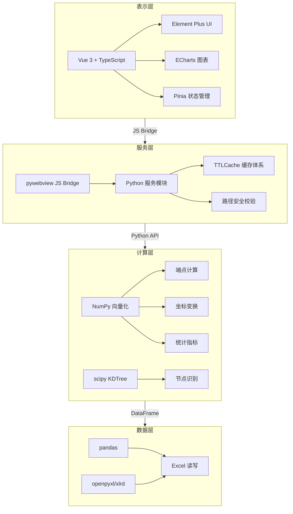
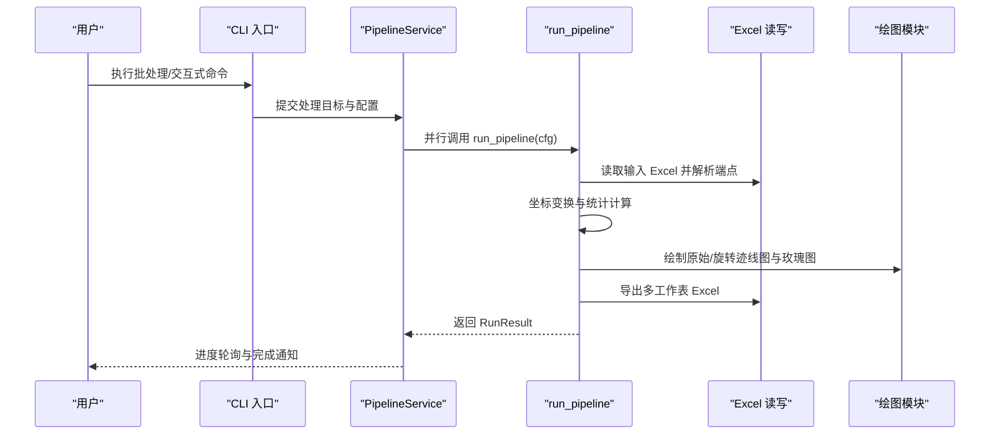

# 项目概述

<cite>
**本文引用的文件列表**   
- [README.md](file://README.md)
- [pyproject.toml](file://pyproject.toml)
- [trace_pipeline/__init__.py](file://trace_pipeline/__init__.py)
- [trace_pipeline/pipeline.py](file://trace_pipeline/pipeline.py)
- [trace_pipeline/config.py](file://trace_pipeline/config.py)
- [trace_pipeline/models.py](file://trace_pipeline/models.py)
- [trace_pipeline/geology/endpoints.py](file://trace_pipeline/geology/endpoints.py)
- [trace_pipeline/geology/statistics.py](file://trace_pipeline/geology/statistics.py)
- [backend/gui_api.py](file://backend/gui_api.py)
- [backend/services/pipeline_service.py](file://backend/services/pipeline_service.py)
- [run_trace_pipeline.py](file://run_trace_pipeline.py)
- [frontend/package.json](file://frontend/package.json)
- [config.example.json](file://config.example.json)
</cite>

## 目录
1. [简介](#简介)
2. [适用场景与核心价值](#适用场景与核心价值)
3. [核心特性概览](#核心特性概览)
4. [技术栈与架构总览](#技术栈与架构总览)
5. [四层架构与职责划分](#四层架构与职责划分)
6. [关键算法与技术要点](#关键算法与技术要点)
7. [快速开始指南](#快速开始指南)
8. [数据流与处理管线](#数据流与处理管线)
9. [依赖关系与耦合分析](#依赖关系与耦合分析)
10. [性能与可扩展性建议](#性能与可扩展性建议)
11. [常见问题与排错指引](#常见问题与排错指引)
12. [结语](#结语)

## 简介
TracePipeline 是一套面向岩体节理测线法的数据处理与可视化系统，提供从原始测线记录到统计指标、可视化图表的全流程自动化能力。系统支持 CLI 命令行与桌面 GUI 双模式运行，采用 Python + Vue 3 前后端分离架构，具备高可维护性与工程化落地能力。

## 适用场景与核心价值
- 岩体结构面调查：将野外实测 r₁–r₇ 数据自动转换为二维端点坐标，输出标准化迹线图与玫瑰图。
- 隧道/边坡工程地质勘察：基于圆窗策略与面积回退机制，稳定计算 P₁₀/P₂₀/P₂₁ 等密度指标，支撑工程评价。
- 岩石力学研究：提供节点拓扑识别（I/Y/X）、凸包与缓冲区域构建、多露头对比与报告导出，便于深入分析与成果归档。

## 核心特性概览
- 综合法端点计算：从 r₁–r₇ 测线记录经复数向量化推导端点坐标，一维→二维空间还原。
- 坐标变换流水线：平移正象限 → 走向角旋转 → 再平移的规范化流程，自动处理坐标系对齐。
- 迹线分类与统计：I/II/III 型自动分类，P₁₀/P₂₀/P₂₁ 密度统计（实测优先四级回退），平均迹长估计。
- 圆窗四策略：tangent / hybrid / concentric / auto，auto 模式通过多因子加权评分自动选择。
- 面积四级回退：实测面积 → 凸包 → 缓冲凸包 → 圆窗等效面积，确保统计指标始终可计算。
- 节点拓扑识别：I/Y/X 型拓扑节点自动识别，空间网格聚类 + 并查集 + 自适应合并容差。
- 高精度绘图：600 DPI 迹线图（比例尺、指北针、LaTeX 统计框、覆盖层、自动避让）与玫瑰图。
- Excel 多工作表导出：基本信息、裂隙情况、计算数据、端点坐标、节点统计等。
- 桌面 GUI：Vue 3 + Element Plus + ECharts 交互式仪表板，6 页面视图，多级缓存体系。
- 报告导出：Word / PDF 一键生成，含统计汇总与图表内嵌，支持批量 ZIP 打包。
- 多露头对比：统计指标对比表格 + 柱状图 + 图片网格，便于跨露头分析。
- 数据溯源：P₁₀/P₂₀/P₂₁ 计算来源链追溯（实测/凸包/圆窗等效），审计友好。
- 类型安全桥接：GuiApiInterface（37 方法签名）+ TypeScript 严格类型，前后端类型精确匹配。
- 完善测试：后端 pytest + 前端 Vitest 组件/Store 测试。

章节来源
- [README.md:96-117](file://README.md#L96-L117)

## 技术栈与架构总览
- 表示层：Vue 3 + TypeScript + Element Plus + ECharts + Pinia，提供 6 个页面视图与响应式仪表板。
- 服务层：pywebview JS Bridge + 多个 Python 服务模块，负责前后端通信、线程管理、缓存与安全校验。
- 计算层：NumPy 向量化 + 纯函数模块，实现端点计算、坐标变换、统计指标与节点识别。
- 数据层：pandas + openpyxl/xlrd，Excel 读写、文件发现、多工作表导出。

图示来源
- [backend/gui_api.py:52-110](file://backend/gui_api.py#L52-L110)
- [trace_pipeline/pipeline.py:230-474](file://trace_pipeline/pipeline.py#L230-L474)
- [trace_pipeline/geology/endpoints.py:295-411](file://trace_pipeline/geology/endpoints.py#L295-L411)
- [trace_pipeline/geology/statistics.py:212-391](file://trace_pipeline/geology/statistics.py#L212-L391)

章节来源
- [README.md:169-281](file://README.md#L169-L281)
- [pyproject.toml:35-48](file://pyproject.toml#L35-L48)
- [frontend/package.json:14-23](file://frontend/package.json#L14-L23)

## 四层架构与职责划分
- 表示层（Presentation）
  - 职责：用户交互、路由与状态管理、图表渲染、结果展示。
  - 关键入口：GUI 启动脚本与前端构建产物；CLI 输出结果打印。
- 服务层（Service）
  - 职责：API 暴露、任务调度、并发控制、缓存与日志、安全校验。
  - 关键入口：GuiApi 类与 PipelineService 后台执行器。
- 计算层（Computation）
  - 职责：纯函数算法实现，包括端点计算、坐标变换、统计指标、节点识别。
  - 关键入口：compute_endpoints、normalize_coordinates、compute_trace_statistics、recognize_trace_nodes。
- 数据层（Data）
  - 职责：Excel 读取/写入、文件发现、多工作表导出。
  - 关键入口：read_trace_excel、write_excel_multi_sheets、find_trace_tables。

章节来源
- [trace_pipeline/__init__.py:1-83](file://trace_pipeline/__init__.py#L1-L83)
- [backend/gui_api.py:52-110](file://backend/gui_api.py#L52-L110)
- [backend/services/pipeline_service.py:32-100](file://backend/services/pipeline_service.py#L32-L100)
- [trace_pipeline/pipeline.py:230-474](file://trace_pipeline/pipeline.py#L230-L474)

## 关键算法与技术要点
- 综合法测量原理
  - 根据迹线与测线的相互关系，将节理迹线分为三种类型：相交型（I 型）、延长相交型（II 型）、不相交型（III 型）。
- 复平面端点坐标算法
  - 在复平面中构建测线局部坐标系，使用单位向量与垂直向量进行端点定位；按左侧/右侧/双侧三种情形分别计算。
- 坐标变换流水线
  - 归一化坐标后，按测线走向旋转至 x 轴方向，便于后续统计与可视化。
- 统计分析方法
  - 自适应阈值与一致性校验；面积四级回退策略；P₁₀/P₂₀/P₂₁ 密度指标与平均迹长估计。
- 节点拓扑识别
  - 空间网格聚类 + 并查集 + 自适应合并容差，识别 I/Y/X 型节点与交点事件。

章节来源
- [README.md:782-800](file://README.md#L782-L800)
- [trace_pipeline/geology/endpoints.py:295-411](file://trace_pipeline/geology/endpoints.py#L295-L411)
- [trace_pipeline/geology/statistics.py:212-391](file://trace_pipeline/geology/statistics.py#L212-L391)

## 快速开始指南
- 安装与运行（CLI 模式）
  - 克隆仓库并安装依赖，准备输入数据，复制配置模板为 config.json，按需修改。
  - 运行批处理或交互式选择目标，查看输出产物。
- 安装与运行（GUI 模式）
  - 先构建前端（npm install && npm run build），然后启动桌面应用。
  - 首次启动包含 WebView2 检测、配置初始化、文件扫描与服务就绪引导。

章节来源
- [README.md:64-86](file://README.md#L64-L86)
- [README.md:369-406](file://README.md#L369-L406)
- [run_trace_pipeline.py:1-30](file://run_trace_pipeline.py#L1-L30)

## 数据流与处理管线
一次完整的流水线处理包含五个阶段：
- ① 数据加载：Excel 读取与端点计算。
- ② 坐标变换+统计：归一化坐标、旋转、统计指标计算、圆窗覆盖层与凸包构建。
- ③ 节点识别：可选，I/Y/X 拓扑识别与覆盖层构建。
- ④ Excel 导出：多工作表导出（基本信息、裂隙情况、计算数据、端点坐标、节点统计等）。
- ⑤ 绘图：原始迹线图、旋转迹线图、玫瑰图（可选）。

图示来源
- [trace_pipeline/cli/main.py:28-110](file://trace_pipeline/cli/main.py#L28-L110)
- [backend/services/pipeline_service.py:100-346](file://backend/services/pipeline_service.py#L100-L346)
- [trace_pipeline/pipeline.py:230-474](file://trace_pipeline/pipeline.py#L230-L474)

## 依赖关系与耦合分析
- 模块耦合
  - 服务层对计算层与数据层单向依赖，避免循环引用。
  - GUI 服务层通过 GuiApi 暴露方法，内部懒加载各服务实例，降低启动开销。
- 外部依赖
  - 数值计算：NumPy、scipy、shapely。
  - 绘图：matplotlib（惰性导入，避免无副作用初始化）。
  - Excel：pandas + openpyxl/xlrd。
  - 桌面容器：pywebview（Windows WebView2）。
- 类型安全桥接
  - GuiApi 方法签名与前端 TypeScript 类型严格匹配，减少运行时错误。

章节来源
- [trace_pipeline/__init__.py:31-58](file://trace_pipeline/__init__.py#L31-L58)
- [backend/gui_api.py:52-110](file://backend/gui_api.py#L52-L110)
- [pyproject.toml:35-48](file://pyproject.toml#L35-L48)

## 性能与可扩展性建议
- 向量化优先：尽量使用 NumPy 广播与布尔 mask 替代 for 循环与 if-else 分支。
- 惰性导入：仅在需要时初始化 matplotlib 与绘图模块，提升首启速度。
- 缓存体系：后端 TTLCache/LRU 与前端 sessionStorage 结合，减少重复计算与 IO。
- 并行执行：ProcessPoolExecutor 配合 spawn 上下文，合理设置 workers 数量。
- 资源锁：重资源操作（预览、报告生成、ZIP 导出）使用运行锁防止并发冲突。

章节来源
- [trace_pipeline/pipeline.py:230-253](file://trace_pipeline/pipeline.py#L230-L253)
- [backend/gui_api.py:52-110](file://backend/gui_api.py#L52-L110)
- [backend/services/pipeline_service.py:146-175](file://backend/services/pipeline_service.py#L146-L175)

## 常见问题与排错指引
- 文件被占用或权限不足
  - 现象：PermissionError，提示关闭已打开的输出文件（如 Excel/WPS）后重试。
  - 处理：统一异常捕获并返回友好提示，避免中断整个批次。
- 输入文件不存在
  - 现象：FileNotFoundError，检查文件路径与命名是否符合 {露头}_process.xls*。
  - 处理：CLI 与 GUI 均提供试运行与文件列表功能，辅助定位问题。
- 配置项缺失或非法
  - 现象：JSON 解析失败或缺少必要字段。
  - 处理：validate_config 强制类型转换与必填项校验，未知键发出警告。
- 窗口验证告警
  - 现象：主 P20/P21 与圆窗估计值差异超过自适应阈值。
  - 处理：记录告警信息，必要时调整 window_strategy 或 min_intersections。

章节来源
- [trace_pipeline/pipeline.py:450-474](file://trace_pipeline/pipeline.py#L450-L474)
- [trace_pipeline/config.py:86-146](file://trace_pipeline/config.py#L86-L146)
- [trace_pipeline/geology/statistics.py:314-336](file://trace_pipeline/geology/statistics.py#L314-L336)

## 结语
TracePipeline 以工程化思维实现了岩体节理测线数据的端到端处理与可视化，兼顾易用性与专业性。其分层架构、类型安全桥接与完善的测试体系，使其既适合初学者上手，也满足专业用户的深度需求。未来可在更多几何模型与统计方法上扩展，进一步提升系统的通用性与鲁棒性。