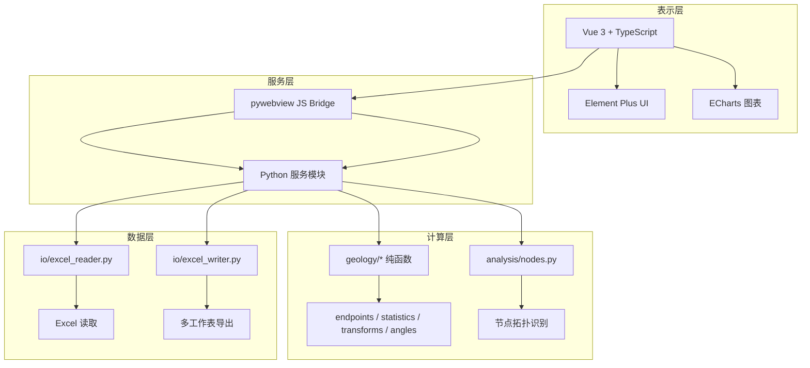
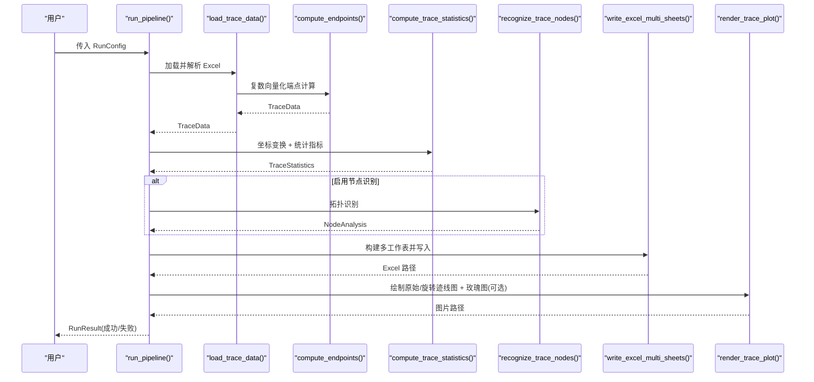
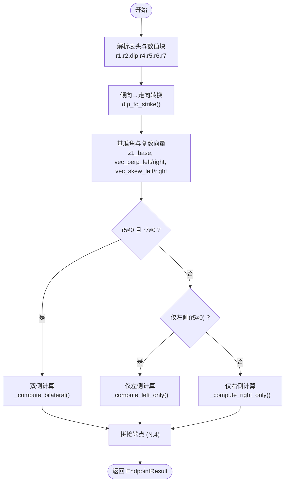
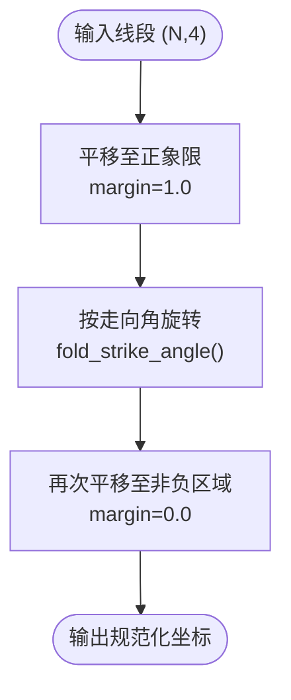
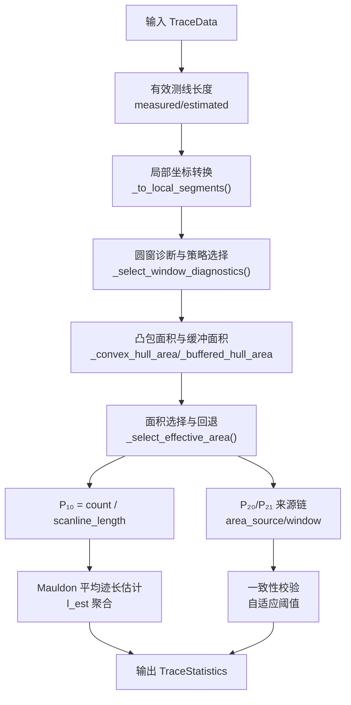
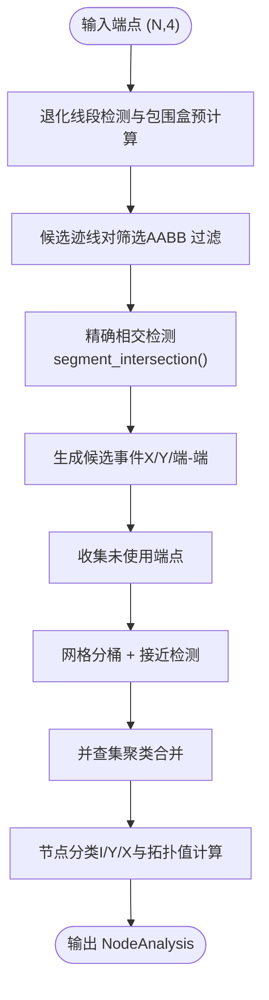
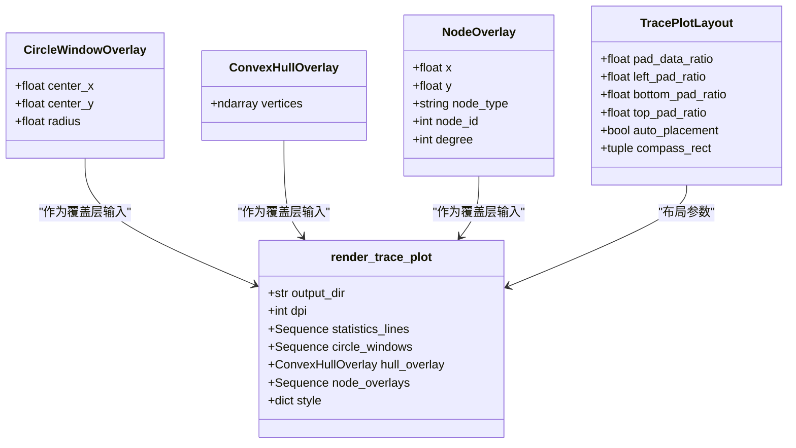
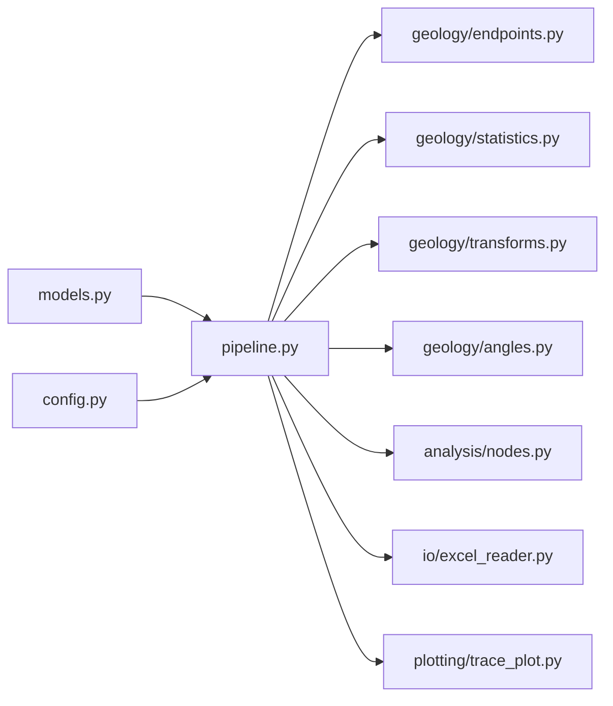

# 项目简介与核心特性

<cite>
**本文引用的文件列表**
- [README.md](file://README.md)
- [trace_pipeline/__init__.py](file://trace_pipeline/__init__.py)
- [trace_pipeline/pipeline.py](file://trace_pipeline/pipeline.py)
- [trace_pipeline/config.py](file://trace_pipeline/config.py)
- [trace_pipeline/models.py](file://trace_pipeline/models.py)
- [trace_pipeline/geology/endpoints.py](file://trace_pipeline/geology/endpoints.py)
- [trace_pipeline/geology/statistics.py](file://trace_pipeline/geology/statistics.py)
- [trace_pipeline/geology/transforms.py](file://trace_pipeline/geology/transforms.py)
- [trace_pipeline/geology/angles.py](file://trace_pipeline/geology/angles.py)
- [trace_pipeline/io/excel_reader.py](file://trace_pipeline/io/excel_reader.py)
- [trace_pipeline/plotting/trace_plot.py](file://trace_pipeline/plotting/trace_plot.py)
- [reference/matlab/README.md](file://reference/matlab/README.md)
- [config.example.json](file://config.example.json)
</cite>

## 目录
1. [引言](#引言)
2. [项目结构](#项目结构)
3. [核心组件](#核心组件)
4. [架构总览](#架构总览)
5. [详细组件分析](#详细组件分析)
6. [依赖关系分析](#依赖关系分析)
7. [性能考量](#性能考量)
8. [故障排查指南](#故障排查指南)
9. [结论](#结论)
10. [附录](#附录)

## 引言
TracePipeline 是一套面向岩体节理几何特征分析的专业工具，服务于岩体结构面调查、隧道/边坡工程地质勘察、岩石力学研究中的节理几何参数提取。系统以野外实测节理迹线数据为基础，实现从原始测线记录到统计指标、可视化图表的全流程自动化处理，并提供 CLI 命令行与桌面 GUI 双模式运行。

核心目标：
- 面向综合法测量数据的端点坐标计算与标准化可视化
- 提供 P₁₀/P₂₀/P₂₁ 密度统计、Mauldon 平均迹长估计、圆窗四策略选择与面积四级回退
- 支持节点拓扑识别（I/Y/X 型）与高精度绘图输出
- 与 MATLAB 原版算法保持一致性，复数向量化端点计算误差 < 10⁻¹⁰ m

## 项目结构
项目采用四层架构：表示层（Vue 3 + Element Plus + ECharts）、服务层（pywebview JS Bridge + Python 服务）、计算层（NumPy 纯函数模块）、数据层（pandas + openpyxl/xlrd）。核心代码位于 trace_pipeline 包内，按职责拆分为 geology（地质/几何算法）、io（Excel 读写）、plotting（绘图）、analysis（节点识别）、cli（命令行入口）等子模块。

图示来源
- [trace_pipeline/pipeline.py:1-474](file://trace_pipeline/pipeline.py#L1-L474)
- [trace_pipeline/geology/endpoints.py:1-418](file://trace_pipeline/geology/endpoints.py#L1-L418)
- [trace_pipeline/geology/statistics.py:1-391](file://trace_pipeline/geology/statistics.py#L1-L391)
- [trace_pipeline/geology/transforms.py:1-169](file://trace_pipeline/geology/transforms.py#L1-L169)
- [trace_pipeline/io/excel_reader.py:1-169](file://trace_pipeline/io/excel_reader.py#L1-L169)
- [trace_pipeline/plotting/trace_plot.py:1-565](file://trace_pipeline/plotting/trace_plot.py#L1-L565)

章节来源
- [README.md:170-281](file://README.md#L170-L281)
- [trace_pipeline/__init__.py:1-83](file://trace_pipeline/__init__.py#L1-L83)

## 核心组件
- 数据模型与配置
  - TraceData：不可变数据容器，包含端点坐标、走向角、段长、位置等；提供长度派生属性与缓存。
  - RunConfig：流水线运行参数，含窗口策略、DPI、节点识别开关等。
  - RunResult：单次流水线运行结果，含路径、状态、统计摘要。
  - 配置加载与校验：load_config、validate_config、apply_cli_overrides、ensure_workspace_dirs。

- 数据处理管线
  - run_pipeline：五阶段编排（加载 → 变换+统计 → 节点识别 → Excel 导出 → 绘图），统一异常处理与结构化日志。
  - load_trace_data：按文件签名缓存的 TraceData 加载器，内部调用 compute_endpoints。

- 地质与几何算法
  - endpoints.compute_endpoints：从 r₁–r₇ 测线记录经复数向量化推导端点坐标，自动判别三种情形（仅左/仅右/双侧）。
  - statistics.compute_trace_statistics：P₁₀/P₂₀/P₂₁ 统计、Mauldon 平均迹长估计、圆窗四策略选择与面积四级回退。
  - transforms.normalize_coordinates：平移正象限 → 走向旋转 → 再平移的规范化流程。
  - angles.dip_to_strike / fold_to_halfplane / fold_strike_angle：倾向→走向转换、半平面折叠、走向角折叠。

- 节点拓扑识别
  - analysis.nodes.recognize_trace_nodes：基于包围盒筛选与精确相交检测，网格聚类 + 并查集合并，分类 I/Y/X 型节点。

- 输入输出与可视化
  - io.excel_reader.read_trace_excel：候选扩展名 + 工作表回退 + 格式校验。
  - plotting.trace_plot.render_trace_plot：600 DPI 迹线图（比例尺、指北针、LaTeX 统计框、覆盖层、自动避让）。

章节来源
- [trace_pipeline/models.py:1-352](file://trace_pipeline/models.py#L1-L352)
- [trace_pipeline/config.py:1-326](file://trace_pipeline/config.py#L1-L326)
- [trace_pipeline/pipeline.py:1-474](file://trace_pipeline/pipeline.py#L1-L474)
- [trace_pipeline/geology/endpoints.py:1-418](file://trace_pipeline/geology/endpoints.py#L1-L418)
- [trace_pipeline/geology/statistics.py:1-391](file://trace_pipeline/geology/statistics.py#L1-L391)
- [trace_pipeline/geology/transforms.py:1-169](file://trace_pipeline/geology/transforms.py#L1-L169)
- [trace_pipeline/geology/angles.py:1-168](file://trace_pipeline/geology/angles.py#L1-L168)
- [trace_pipeline/io/excel_reader.py:1-169](file://trace_pipeline/io/excel_reader.py#L1-L169)
- [trace_pipeline/plotting/trace_plot.py:1-565](file://trace_pipeline/plotting/trace_plot.py#L1-L565)

## 架构总览
一次完整的流水线处理包含五个阶段：数据加载、坐标变换与统计、节点识别、Excel 导出、绘图。各阶段通过不可变数据模型传递，确保可追溯性与一致性。

图示来源
- [trace_pipeline/pipeline.py:230-474](file://trace_pipeline/pipeline.py#L230-L474)
- [trace_pipeline/geology/endpoints.py:295-411](file://trace_pipeline/geology/endpoints.py#L295-L411)
- [trace_pipeline/geology/statistics.py:212-391](file://trace_pipeline/geology/statistics.py#L212-L391)
- [trace_pipeline/analysis/nodes.py:160-417](file://trace_pipeline/analysis/nodes.py#L160-L417)
- [trace_pipeline/plotting/trace_plot.py:443-565](file://trace_pipeline/plotting/trace_plot.py#L443-L565)

## 详细组件分析

### 综合法测量原理与 r₁–r₇ 数学含义
- 测线局部坐标系：以测线方向为基准，沿测线位移 r₁、垂直测线位移 r₂ 定位起点；左侧迹长 r₄/r₅、右侧迹长 r₆/r₇ 确定迹线延伸方向与长度。
- 三种迹线类型判定条件：
  - I 型（相交型）：双侧均有迹线延伸（r₅ ≠ 0, r₇ ≠ 0），迹线直接穿过测线。
  - II 型（延长相交型）：仅单侧有迹线延伸（仅一侧非零），迹线延长线穿过测线。
  - III 型（不相交型）：过迹线起点作测线垂线定位，迹线及延长线均不穿过测线。
- 复数向量化端点计算：在复平面中构建单位向量 e^{iθ}，根据 r₅、r₇ 取值自动判别三种情形，分别计算起点与终点坐标，保证与 MATLAB 原版误差 < 10⁻¹⁰ m。

图示来源
- [trace_pipeline/geology/endpoints.py:295-411](file://trace_pipeline/geology/endpoints.py#L295-L411)
- [trace_pipeline/geology/angles.py:43-70](file://trace_pipeline/geology/angles.py#L43-L70)

章节来源
- [trace_pipeline/geology/endpoints.py:1-418](file://trace_pipeline/geology/endpoints.py#L1-L418)
- [reference/matlab/README.md:25-71](file://reference/matlab/README.md#L25-L71)

### 坐标变换流水线
- 规范化流程：先平移到正象限（留白边距），再按走向角旋转，最后再次平移到非负区域，确保所有坐标 ≥ 0，便于后续统计与绘图。
- 关键函数：shift_to_positive、rotate_and_shift、normalize_coordinates、normalize_points_like_lines。

图示来源
- [trace_pipeline/geology/transforms.py:86-169](file://trace_pipeline/geology/transforms.py#L86-L169)
- [trace_pipeline/geology/angles.py:76-102](file://trace_pipeline/geology/angles.py#L76-L102)

章节来源
- [trace_pipeline/geology/transforms.py:1-169](file://trace_pipeline/geology/transforms.py#L1-L169)

### P₁₀/P₂₀/P₂₁ 密度统计与 Mauldon 平均迹长估计
- 测线长度来源：优先实测（measured），否则估计（estimated）。
- 露头面积四级回退：实测面积 → 凸包面积 → 缓冲凸包面积 → 圆窗等效面积（由 P₂₀_window 反推）。
- 观测迹长优先链：segment(r5+r7) → endpoint(欧氏距离) → window(l_est)。
- 自适应阈值：样本量越大越严格，用于面积降级与 P₂₀/P₂₁ 一致性校验。
- 圆窗四策略：tangent/hybrid/concentric/auto，auto 模式 6 因子加权评分自动选择。

图示来源
- [trace_pipeline/geology/statistics.py:212-391](file://trace_pipeline/geology/statistics.py#L212-L391)

章节来源
- [trace_pipeline/geology/statistics.py:1-391](file://trace_pipeline/geology/statistics.py#L1-L391)

### 节点拓扑识别（I/Y/X 型）
- 预处理：计算迹线包围盒，过滤不可能相交的迹线对。
- 相交检测：对候选迹线对调用 segment_intersection，分类 X/Y/端-端事件。
- 端点处理：收集未使用端点，检测接近的端点对。
- 聚类合并：空间网格 + 并查集 + 自适应合并容差。
- 节点分类：根据簇内迹线参与方式确定类型与分支数。

图示来源
- [trace_pipeline/analysis/nodes.py:160-417](file://trace_pipeline/analysis/nodes.py#L160-L417)

章节来源
- [trace_pipeline/analysis/nodes.py:1-417](file://trace_pipeline/analysis/nodes.py#L1-L417)

### 高精度绘图与覆盖层
- 600 DPI 迹线图：包含比例尺、指北针、LaTeX 统计框、凸包/圆窗/节点覆盖层、自动避让。
- 自适应 figure 尺寸：使不同图之间 1m 的物理长度尽量一致，面积具有可比性。
- 图层控制：include_trace/include_hull/include_circles/include_nodes/include_decorations，支持背景透明。

图示来源
- [trace_pipeline/plotting/trace_plot.py:72-133](file://trace_pipeline/plotting/trace_plot.py#L72-L133)
- [trace_pipeline/plotting/trace_plot.py:443-565](file://trace_pipeline/plotting/trace_plot.py#L443-L565)

章节来源
- [trace_pipeline/plotting/trace_plot.py:1-565](file://trace_pipeline/plotting/trace_plot.py#L1-L565)

## 依赖关系分析
- 模块耦合与内聚
  - pipeline.py 串联各子模块，保持高内聚低耦合；数据模型集中定义于 models.py。
  - geology/* 均为纯函数，无状态、无副作用，便于测试与复用。
- 外部依赖
  - NumPy 向量化计算、pandas/openpyxl/xlrd 读写 Excel、matplotlib 绘图、scipy/shapely 空间与几何计算。
- 潜在循环依赖
  - 通过惰性导入与 __getattr__ 避免初始化 matplotlib 带来的副作用。

图示来源
- [trace_pipeline/pipeline.py:1-474](file://trace_pipeline/pipeline.py#L1-L474)
- [trace_pipeline/__init__.py:1-83](file://trace_pipeline/__init__.py#L1-L83)

章节来源
- [trace_pipeline/__init__.py:1-83](file://trace_pipeline/__init__.py#L1-L83)
- [trace_pipeline/pipeline.py:1-474](file://trace_pipeline/pipeline.py#L1-L474)

## 性能考量
- 向量化优先：NumPy 广播 + 复数运算替代 for 循环；布尔 mask 替代 if-else 分支。
- 惰性导入：import trace_pipeline 不会触发 matplotlib 初始化，降低启动开销。
- 缓存体系：后端 TTLCache/LRU 缓存统计数据、图片、缩略图、Excel 数据；前端 sessionStorage 缓存结果列表与对比数据。
- 并行处理：CLI 支持 -p N 并行进程，默认启发式在目标数 ≤2 时降级串行。

[本节为通用指导，无需具体文件分析]

## 故障排查指南
- 常见错误与提示
  - 文件被占用或权限不足：关闭已打开的输出文件后重试。
  - 输入文件不存在：检查文件路径与命名规则。
  - Excel 过大：超过 50 MiB 上限将拒绝读取。
  - 数据格式错误：列数不足、NaN/Inf、倾向角度不在 [0, 360)、r5 与 r7 同时为 0 等。
- 调试建议
  - 查看结构化日志（JSON Lines，按日轮转，request_id 全链路追踪）。
  - 使用 --dry-run 试运行预览目标，不实际执行。
  - 启用 is_dev_mode 显示开发者面板，辅助定位问题。

章节来源
- [trace_pipeline/pipeline.py:450-474](file://trace_pipeline/pipeline.py#L450-L474)
- [trace_pipeline/io/excel_reader.py:69-106](file://trace_pipeline/io/excel_reader.py#L69-L106)
- [trace_pipeline/geology/endpoints.py:113-205](file://trace_pipeline/geology/endpoints.py#L113-L205)

## 结论
TracePipeline 将 MATLAB 原型算法完整移植为工程化 Python 代码，提供端到端的岩体节理测线数据处理能力。其核心优势在于：
- 复数向量化端点计算的高精度与高效性
- 坐标变换流水线的规范化与可重复性
- 圆窗四策略与面积四级回退的稳健统计
- 节点拓扑识别与高精度绘图的可视化闭环
- 完善的配置管理、安全校验与测试覆盖

对于初学者，系统提供了清晰的地质学基础概念与直观界面；对于有经验的开发者，模块化的纯函数设计与类型安全的 API 便于二次开发与集成。

[本节为总结，无需具体文件分析]

## 附录

### 处理管线流程图与产出物清单
- 处理管线流程图
  - ① 数据加载 → ② 坐标变换+统计 → ③ 节点识别 → ④ Excel 导出 → ⑤ 绘图
- 产出物清单（每个露头）
  - 多工作表 Excel：{露头}_traces.xlsx（6–9 个 Sheet，含基本信息、裂隙情况、计算数据、端点坐标、节点统计等）
  - 原始迹线图：{露头}_raw(n=N).png
  - 旋转迹线图：{露头}_rotated(strike=X).png
  - 玫瑰图（可选）：{露头}_rose(bin=X).png
  - 报告（可选）：reports/{露头}_report.pdf/.docx

章节来源
- [README.md:119-141](file://README.md#L119-L141)
- [config.example.json:1-26](file://config.example.json#L1-L26)