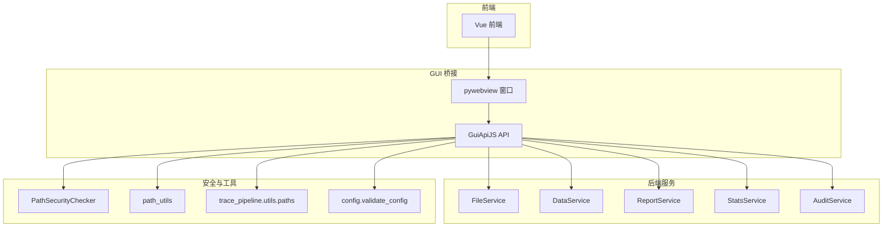
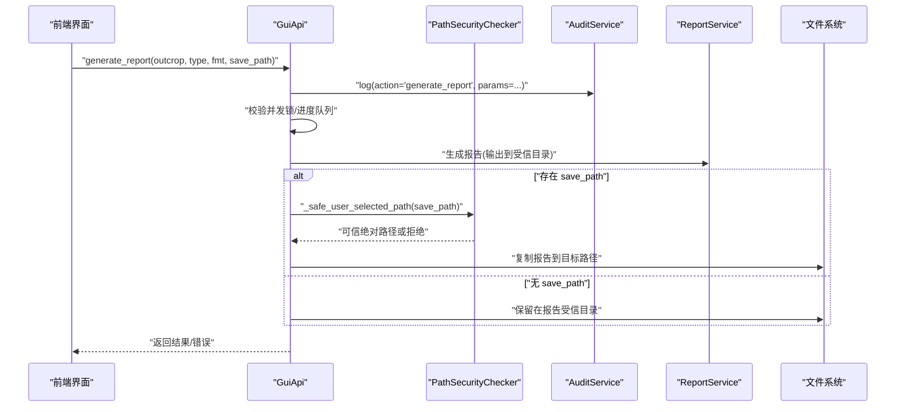
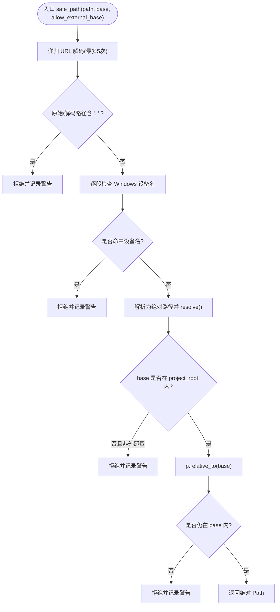
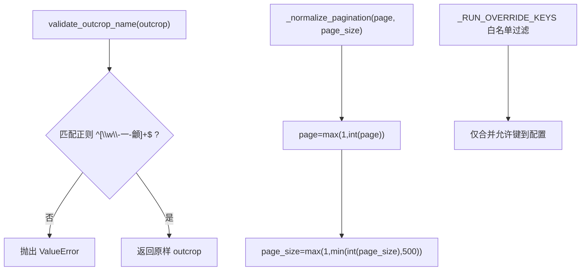
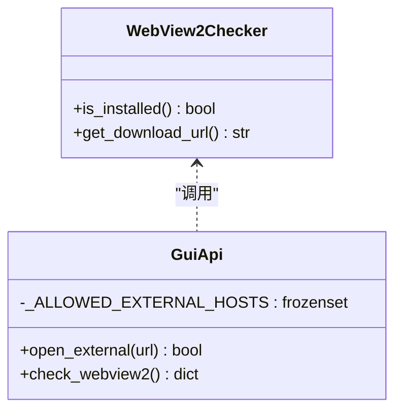
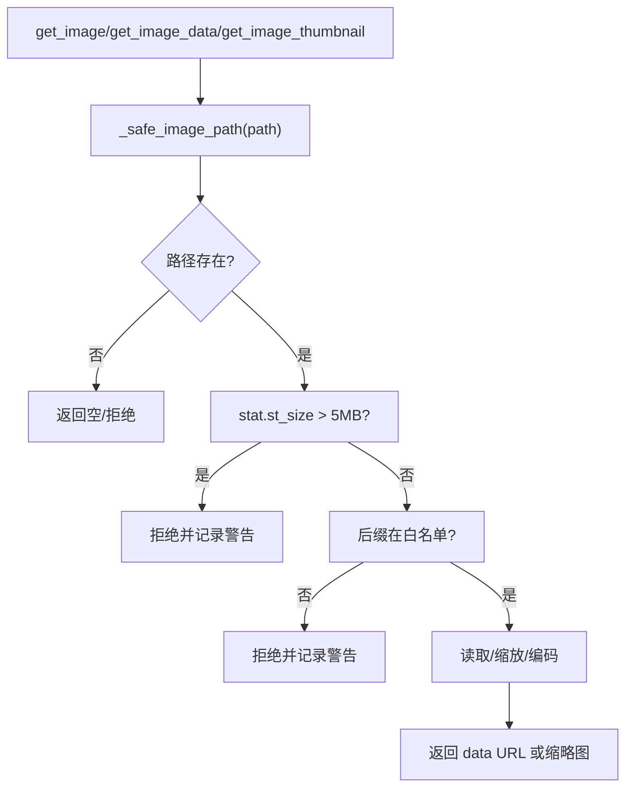
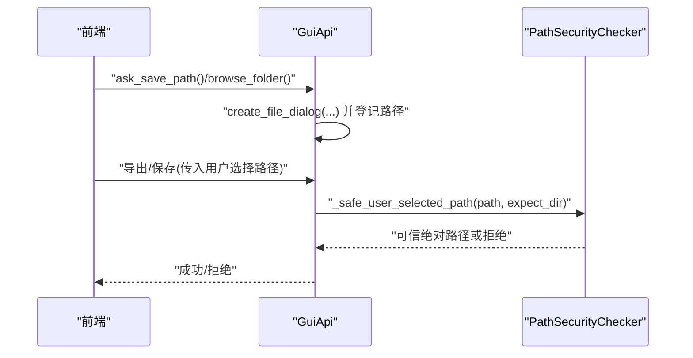
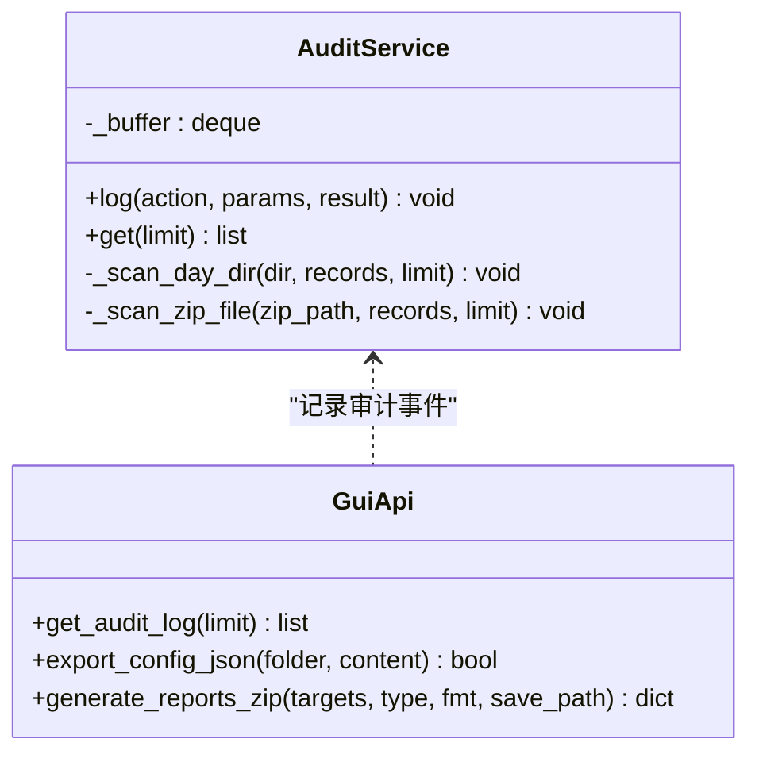
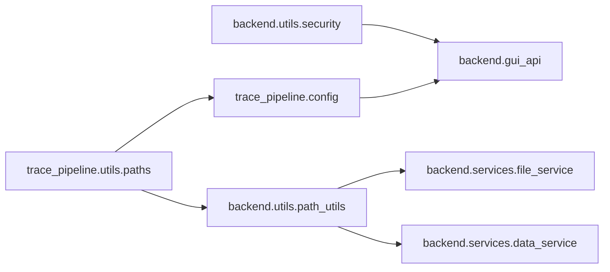

# 安全配置

<cite>
**本文引用的文件**   
- [backend/utils/security.py](file://backend/utils/security.py)
- [backend/utils/path_utils.py](file://backend/utils/path_utils.py)
- [backend/gui_api.py](file://backend/gui_api.py)
- [backend/main_gui.py](file://backend/main_gui.py)
- [backend/webview2_checker.py](file://backend/webview2_checker.py)
- [backend/services/file_service.py](file://backend/services/file_service.py)
- [backend/services/data_service.py](file://backend/services/data_service.py)
- [backend/services/audit_service.py](file://backend/services/audit_service.py)
- [trace_pipeline/utils/paths.py](file://trace_pipeline/utils/paths.py)
- [trace_pipeline/config.py](file://trace_pipeline/config.py)
- [tests/test_security.py](file://tests/test_security.py)
</cite>

## 目录
1. [简介](#简介)
2. [项目结构](#项目结构)
3. [核心组件](#核心组件)
4. [架构总览](#架构总览)
5. [详细组件分析](#详细组件分析)
6. [依赖关系分析](#依赖关系分析)
7. [性能与安全权衡](#性能与安全权衡)
8. [故障排查指南](#故障排查指南)
9. [结论](#结论)
10. [附录：工具与清单](#附录工具与清单)

## 简介
本指南聚焦 TracePipeline 的安全配置，围绕路径遍历防护、输入验证与白名单、外部域名白名单、WebView2 安全策略、跨域与资源加载限制、图片格式与安全校验、用户权限与访问控制、网络安全（HTTPS/证书/加密）、以及安全审计与漏洞扫描等主题，提供从代码到实践的系统化说明。文档中的实现细节均来源于仓库源码，并辅以图示帮助理解。

## 项目结构
本项目采用前后端分离的桌面应用架构：前端通过 pywebview 调用后端 GuiApi；后端以服务分层组织，包含文件、数据、报告、统计、审计等服务；安全能力集中在路径校验、输入校验、白名单与大小限制等模块中。

**图表来源** 
- [backend/gui_api.py:52-110](file://backend/gui_api.py#L52-L110)
- [backend/utils/security.py:14-128](file://backend/utils/security.py#L14-L128)
- [backend/utils/path_utils.py:1-68](file://backend/utils/path_utils.py#L1-L68)
- [trace_pipeline/utils/paths.py:12-43](file://trace_pipeline/utils/paths.py#L12-L43)
- [trace_pipeline/config.py:148-190](file://trace_pipeline/config.py#L148-L190)

**章节来源**
- [backend/gui_api.py:52-110](file://backend/gui_api.py#L52-L110)
- [backend/utils/security.py:14-128](file://backend/utils/security.py#L14-L128)
- [backend/utils/path_utils.py:1-68](file://backend/utils/path_utils.py#L1-L68)
- [trace_pipeline/utils/paths.py:12-43](file://trace_pipeline/utils/paths.py#L12-L43)
- [trace_pipeline/config.py:148-190](file://trace_pipeline/config.py#L148-L190)

## 核心组件
- 路径安全校验器：统一拦截路径遍历、Windows 设备名、符号链接逃逸与越权访问。
- 输入与参数校验：露头名白名单、分页参数规范化、配置字段白名单覆盖。
- 外部域名白名单：仅允许受控域名打开系统浏览器。
- WebView2 检测与引导：缺失运行时提示下载，避免未授权渲染环境。
- 图片读取与缩略图：扩展名白名单、MIME 映射、文件大小上限、尺寸上限。
- 用户选择路径登记：仅允许通过系统对话框选择的目录/文件写入。
- 审计日志：关键操作记录与内存缓冲，支持归档回溯。

**章节来源**
- [backend/utils/security.py:14-128](file://backend/utils/security.py#L14-L128)
- [backend/utils/path_utils.py:16-37](file://backend/utils/path_utils.py#L16-L37)
- [backend/gui_api.py:39-49](file://backend/gui_api.py#L39-L49)
- [backend/gui_api.py:901-925](file://backend/gui_api.py#L901-L925)
- [backend/webview2_checker.py:35-60](file://backend/webview2_checker.py#L35-L60)
- [backend/gui_api.py:964-1010](file://backend/gui_api.py#L964-L1010)
- [backend/gui_api.py:1165-1253](file://backend/gui_api.py#L1165-L1253)
- [backend/services/audit_service.py:22-47](file://backend/services/audit_service.py#L22-L47)

## 架构总览
下图展示一次“生成报告并保存到用户指定位置”的关键流程，体现路径校验、白名单、大小限制与审计的组合使用。

**图表来源** 
- [backend/gui_api.py:644-730](file://backend/gui_api.py#L644-L730)
- [backend/gui_api.py:194-216](file://backend/gui_api.py#L194-L216)
- [backend/services/audit_service.py:28-47](file://backend/services/audit_service.py#L28-L47)

## 详细组件分析

### 路径遍历防护机制
- 递归 URL 解码防御双重编码绕过。
- 拒绝包含 ".." 的路径片段。
- 拒绝 Windows 设备名（如 CON/NUL/COMx/LPTx）。
- resolve() 后强制相对 base 检查，防止符号链接逃逸。
- 默认仅允许项目根内路径；仅在显式 allow_external_base=True 时允许外部可信基准。

**图表来源** 
- [backend/utils/security.py:47-127](file://backend/utils/security.py#L47-L127)

**章节来源**
- [backend/utils/security.py:47-127](file://backend/utils/security.py#L47-L127)
- [tests/test_security.py:21-43](file://tests/test_security.py#L21-L43)

### 输入验证与路径规范化
- 露头名白名单：仅允许字母、数字、下划线、连字符与中文，禁止路径分隔符与 ".."。
- 分页参数规范化：页码下限为 1，页大小上限 500，非法值回退默认。
- 配置覆盖白名单：run_pipeline 仅允许覆盖处理参数与样式/并行度，禁止路径/目标字段被前端覆盖。

**图表来源** 
- [backend/utils/path_utils.py:16-37](file://backend/utils/path_utils.py#L16-L37)
- [backend/services/data_service.py:60-71](file://backend/services/data_service.py#L60-L71)
- [backend/gui_api.py:48-49](file://backend/gui_api.py#L48-L49)

**章节来源**
- [backend/utils/path_utils.py:16-37](file://backend/utils/path_utils.py#L16-L37)
- [backend/services/data_service.py:60-71](file://backend/services/data_service.py#L60-L71)
- [backend/gui_api.py:48-49](file://backend/gui_api.py#L48-L49)

### 外部域名白名单与 WebView2 安全策略
- 外部域名白名单：仅允许 microsoft.com 相关域名打开系统浏览器，其他一律拒绝。
- WebView2 检测：启动前检查运行时是否安装，缺失则显示引导页面并提供官方下载链接。
- 跨域与资源加载限制：应用以内嵌静态资源为主，不直接暴露任意网络资源；对外部链接严格白名单控制。

**图表来源** 
- [backend/webview2_checker.py:35-60](file://backend/webview2_checker.py#L35-L60)
- [backend/gui_api.py:39-46](file://backend/gui_api.py#L39-L46)
- [backend/gui_api.py:901-925](file://backend/gui_api.py#L901-L925)
- [backend/gui_api.py:1429-1439](file://backend/gui_api.py#L1429-L1439)

**章节来源**
- [backend/gui_api.py:39-46](file://backend/gui_api.py#L39-L46)
- [backend/gui_api.py:901-925](file://backend/gui_api.py#L901-L925)
- [backend/webview2_checker.py:35-60](file://backend/webview2_checker.py#L35-L60)

### 图片格式与安全校验
- 扩展名白名单：仅允许 PNG/JPG/JPEG/GIF/BMP/WEBP，拒绝 SVG 等易引发 XSS 的类型。
- MIME 类型映射：按扩展名返回对应 data URL 的 MIME。
- 文件大小上限：单张图片最大 5MB，超出即拒绝。
- 缩略图尺寸限制：最小 64px，最大 1600px，确保渲染安全与性能。
- 元数据接口：仅返回 mtime/size/ext，不读取内容，降低风险。

**图表来源** 
- [backend/gui_api.py:964-1010](file://backend/gui_api.py#L964-L1010)
- [backend/gui_api.py:1076-1163](file://backend/gui_api.py#L1076-L1163)

**章节来源**
- [backend/gui_api.py:964-1010](file://backend/gui_api.py#L964-L1010)
- [backend/gui_api.py:1076-1163](file://backend/gui_api.py#L1076-L1163)
- [tests/test_security.py:133-148](file://tests/test_security.py#L133-L148)

### 用户权限与访问控制
- 用户选择路径登记：仅允许通过系统对话框选择的目录/文件进行写入，内部维护已登记集合与线程锁。
- 可信文件基目录：项目根、input/output、报告目录为受信基目录；保存路径需经 _safe_user_selected_path 校验。
- GUI 权限模型：所有可写操作均需先通过路径白名单与用户选择登记双重校验。

**图表来源** 
- [backend/gui_api.py:1165-1253](file://backend/gui_api.py#L1165-L1253)
- [backend/gui_api.py:194-216](file://backend/gui_api.py#L194-L216)

**章节来源**
- [backend/gui_api.py:194-216](file://backend/gui_api.py#L194-L216)
- [backend/gui_api.py:1165-1253](file://backend/gui_api.py#L1165-L1253)
- [tests/test_security.py:45-104](file://tests/test_security.py#L45-L104)

### 网络安全配置（HTTPS/证书/通信加密）
- 外部链接协议限制：仅允许 http/https 协议，其余协议拒绝。
- 域名白名单：仅允许微软相关域名，避免恶意跳转。
- 本地资源加载：前端静态资源由应用托管，不直接加载任意网络资源。
- 证书与加密：应用本身不直接发起 HTTPS 请求；如需集成网络功能，建议启用系统默认 TLS 校验与证书链验证。

**章节来源**
- [backend/gui_api.py:901-925](file://backend/gui_api.py#L901-L925)

### 安全审计与监控
- 审计服务：将关键操作（配置变更、报告生成、ZIP 打包、配置导出等）写入结构化日志，并提供最近 N 条记录的内存缓存与归档扫描。
- 日志归档：支持扫描当天及前两天的日志目录与 zip 归档，限制单个成员大小，避免 DoS。
- 审计查询：前端可通过 get_audit_log 获取最近审计记录，便于问题定位与合规审查。

**图表来源** 
- [backend/services/audit_service.py:22-155](file://backend/services/audit_service.py#L22-L155)
- [backend/gui_api.py:886-898](file://backend/gui_api.py#L886-L898)
- [backend/gui_api.py:1255-1305](file://backend/gui_api.py#L1255-L1305)
- [backend/gui_api.py:732-853](file://backend/gui_api.py#L732-L853)

**章节来源**
- [backend/services/audit_service.py:22-155](file://backend/services/audit_service.py#L22-L155)
- [backend/gui_api.py:886-898](file://backend/gui_api.py#L886-L898)
- [backend/gui_api.py:1255-1305](file://backend/gui_api.py#L1255-L1305)
- [backend/gui_api.py:732-853](file://backend/gui_api.py#L732-L853)

## 依赖关系分析
- 路径解析与项目根：通过 trace_pipeline.utils.paths 获取项目根与资源根，保证打包与开发模式一致。
- 配置校验：trace_pipeline.config.validate_config 负责字段白名单、必填项、类型归一与路径解析。
- 服务层复用：FileService/DataService 使用 path_utils.resolve_path 与 validate_outcrop_name，统一错误响应格式。

**图表来源** 
- [trace_pipeline/utils/paths.py:12-43](file://trace_pipeline/utils/paths.py#L12-L43)
- [trace_pipeline/config.py:148-190](file://trace_pipeline/config.py#L148-L190)
- [backend/utils/path_utils.py:1-68](file://backend/utils/path_utils.py#L1-L68)
- [backend/services/file_service.py:1-103](file://backend/services/file_service.py#L1-L103)
- [backend/services/data_service.py:1-278](file://backend/services/data_service.py#L1-L278)
- [backend/gui_api.py:52-110](file://backend/gui_api.py#L52-L110)

**章节来源**
- [trace_pipeline/utils/paths.py:12-43](file://trace_pipeline/utils/paths.py#L12-L43)
- [trace_pipeline/config.py:148-190](file://trace_pipeline/config.py#L148-L190)
- [backend/utils/path_utils.py:1-68](file://backend/utils/path_utils.py#L1-L68)
- [backend/services/file_service.py:1-103](file://backend/services/file_service.py#L1-L103)
- [backend/services/data_service.py:1-278](file://backend/services/data_service.py#L1-L278)
- [backend/gui_api.py:52-110](file://backend/gui_api.py#L52-L110)

## 性能与安全权衡
- 图片缓存：TTLCache 减少重复 IO 与编解码开销，同时结合 mtime/size 作为缓存键，兼顾正确性与性能。
- 并发控制：预览与报告生成使用互斥锁，避免资源耗尽与竞态条件。
- 分页限制：限制最大页大小，防止超大响应导致内存/CPU 压力。
- 目录变更检测：自动失效缓存，保证一致性而不牺牲过多性能。

**章节来源**
- [backend/gui_api.py:94](file://backend/gui_api.py#L94)
- [backend/gui_api.py:602-627](file://backend/gui_api.py#L602-L627)
- [backend/gui_api.py:644-730](file://backend/gui_api.py#L644-L730)
- [backend/services/data_service.py:60-71](file://backend/services/data_service.py#L60-L71)
- [backend/gui_api.py:250-261](file://backend/gui_api.py#L250-L261)

## 故障排查指南
- 路径越权/拒绝：检查是否包含 ".."、Windows 设备名或不在可信基目录内；确认是否通过系统对话框登记了外部路径。
- 图片读取失败：确认扩展名在白名单、文件大小不超过上限、路径存在且可读。
- 外部链接被拒：确认域名在白名单且协议为 http/https。
- 审计记录缺失：检查内存缓冲区是否已满或被清理，查看日志归档目录与 zip 包是否可达。
- WebView2 未安装：根据引导页面提示安装运行时后重启应用。

**章节来源**
- [backend/utils/security.py:47-127](file://backend/utils/security.py#L47-L127)
- [backend/gui_api.py:964-1010](file://backend/gui_api.py#L964-L1010)
- [backend/gui_api.py:901-925](file://backend/gui_api.py#L901-L925)
- [backend/services/audit_service.py:59-155](file://backend/services/audit_service.py#L59-L155)
- [backend/webview2_checker.py:35-60](file://backend/webview2_checker.py#L35-L60)

## 结论
TracePipeline 在路径安全、输入校验、白名单控制、图片安全、用户选择路径登记与审计等方面形成了较为完整的安全闭环。建议在后续迭代中持续完善：
- 引入更严格的 MIME 头签名校验（可选增强）。
- 对 ZIP 成员数量与解压深度增加限制（已在审计归档中部分实现）。
- 对敏感操作增加二次确认与操作者身份绑定（当前以审计为主）。
- 在需要网络访问的场景启用系统默认 TLS 校验与证书链验证。

## 附录：工具与清单
- 依赖包安全检查：建议使用 pip-audit 或 safety 定期扫描 requirements.txt/pyproject.toml 依赖。
- 静态代码分析：可使用 ruff/flake8/mypy 进行规范与类型检查。
- 运行时安全监控：结合审计日志与结构化日志，建立告警规则（如频繁越权、超大文件、异常外链）。
- 单元测试覆盖：参考 tests/test_security.py 的断言方式，补充更多边界用例（URL 多重编码、设备名变体、并发读写等）。