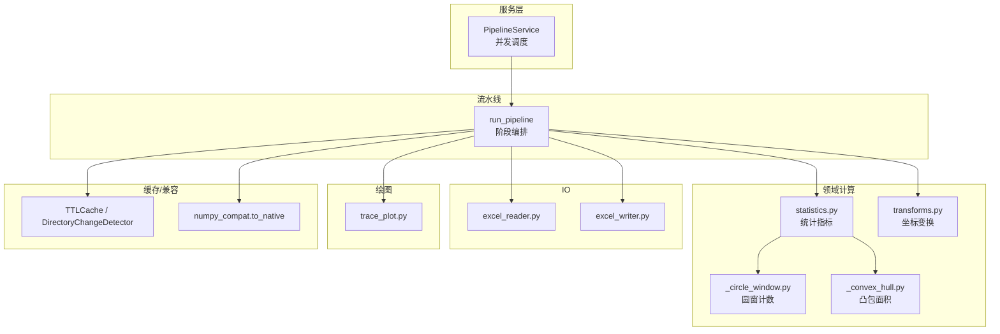
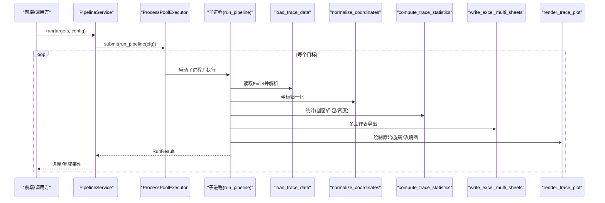
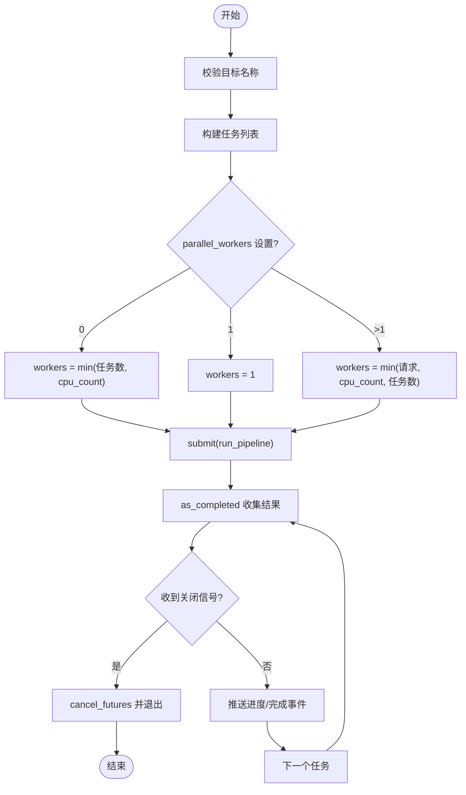
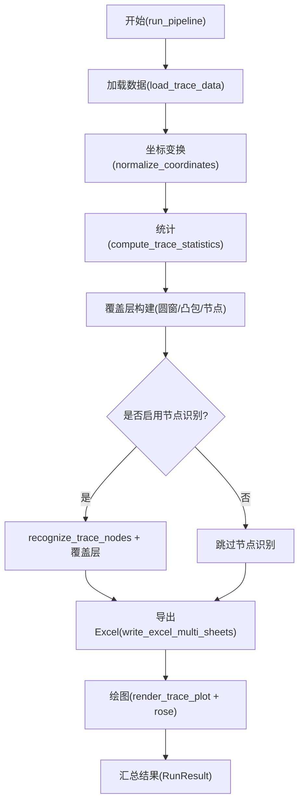
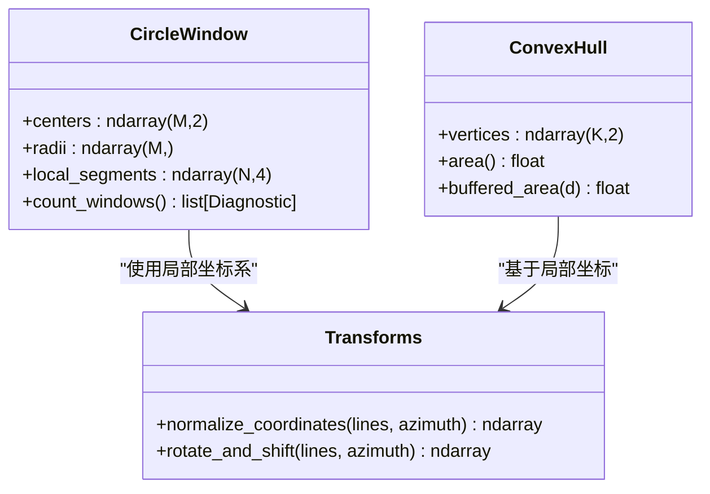
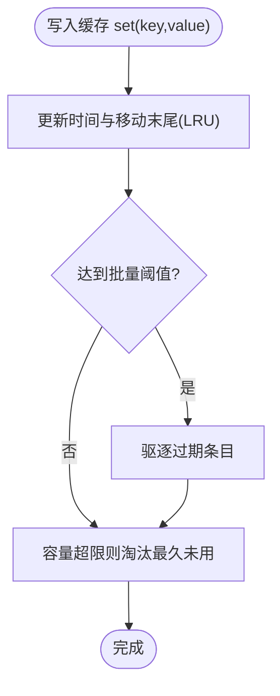
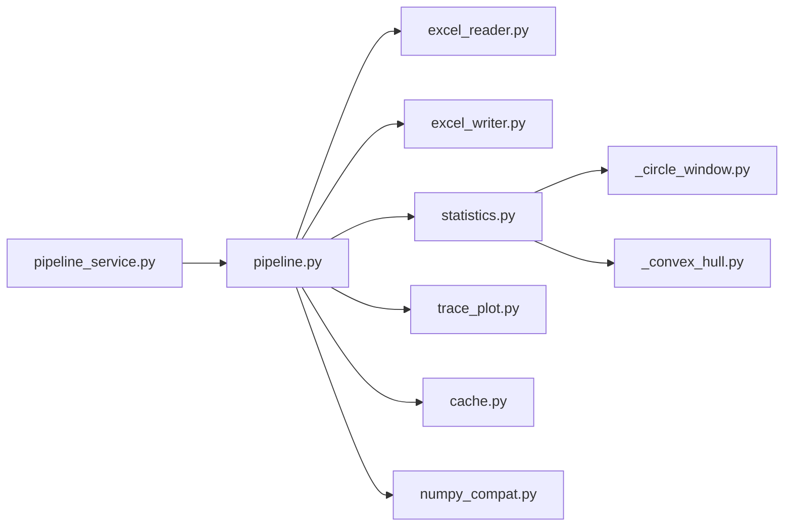

# 性能优化

<cite>
**本文引用的文件**   
- [trace_pipeline/pipeline.py](file://trace_pipeline/pipeline.py)
- [backend/services/pipeline_service.py](file://backend/services/pipeline_service.py)
- [backend/utils/cache.py](file://backend/utils/cache.py)
- [trace_pipeline/utils/numpy_compat.py](file://trace_pipeline/utils/numpy_compat.py)
- [trace_pipeline/geology/statistics.py](file://trace_pipeline/geology/statistics.py)
- [trace_pipeline/geology/_circle_window.py](file://trace_pipeline/geology/_circle_window.py)
- [trace_pipeline/geology/_convex_hull.py](file://trace_pipeline/geology/_convex_hull.py)
- [trace_pipeline/geology/transforms.py](file://trace_pipeline/geology/transforms.py)
- [trace_pipeline/io/excel_reader.py](file://trace_pipeline/io/excel_reader.py)
- [trace_pipeline/io/excel_writer.py](file://trace_pipeline/io/excel_writer.py)
- [trace_pipeline/plotting/trace_plot.py](file://trace_pipeline/plotting/trace_plot.py)
- [tests/test_pipeline.py](file://tests/test_pipeline.py)
- [tests/test_cache.py](file://tests/test_cache.py)
</cite>

## 目录
1. [引言](#引言)
2. [项目结构](#项目结构)
3. [核心组件](#核心组件)
4. [架构总览](#架构总览)
5. [详细组件分析](#详细组件分析)
6. [依赖关系分析](#依赖关系分析)
7. [性能考量与优化建议](#性能考量与优化建议)
8. [故障排查指南](#故障排查指南)
9. [结论](#结论)
10. [附录](#附录)

## 引言
本文件聚焦 TracePipeline 的性能优化，围绕以下主题展开：
- NumPy 向量化编程技巧：复数向量运算、广播机制、内存布局优化
- 多线程与并行处理：多进程池配置、任务分发策略、负载均衡
- 缓存机制：多级缓存架构、LRU/TTL 策略、缓存失效
- 内存管理：大数据集处理、内存泄漏检测、垃圾回收调优
- 性能分析工具：profiler、内存分析器、瓶颈定位
- 实际测试用例与优化前后对比方法

## 项目结构
TracePipeline 采用“服务层 + 领域计算 + IO/绘图”的分层组织。关键路径为：
- 服务层（后台调度）：pipeline_service.py
- 流水线编排：pipeline.py
- 领域计算（统计、几何、变换）：geology/*
- IO（Excel 读写）：io/*
- 绘图：plotting/*
- 缓存与兼容：backend/utils/cache.py, trace_pipeline/utils/numpy_compat.py

图表来源
- [backend/services/pipeline_service.py:145-200](file://backend/services/pipeline_service.py#L145-L200)
- [trace_pipeline/pipeline.py:230-474](file://trace_pipeline/pipeline.py#L230-L474)
- [trace_pipeline/geology/statistics.py:212-391](file://trace_pipeline/geology/statistics.py#L212-L391)
- [trace_pipeline/geology/_circle_window.py:71-216](file://trace_pipeline/geology/_circle_window.py#L71-L216)
- [trace_pipeline/geology/_convex_hull.py:79-114](file://trace_pipeline/geology/_convex_hull.py#L79-L114)
- [trace_pipeline/geology/transforms.py:127-144](file://trace_pipeline/geology/transforms.py#L127-L144)
- [trace_pipeline/io/excel_reader.py:36-106](file://trace_pipeline/io/excel_reader.py#L36-L106)
- [trace_pipeline/io/excel_writer.py:462-489](file://trace_pipeline/io/excel_writer.py#L462-L489)
- [trace_pipeline/plotting/trace_plot.py:443-565](file://trace_pipeline/plotting/trace_plot.py#L443-L565)
- [backend/utils/cache.py:18-90](file://backend/utils/cache.py#L18-L90)

章节来源
- [backend/services/pipeline_service.py:1-346](file://backend/services/pipeline_service.py#L1-L346)
- [trace_pipeline/pipeline.py:1-474](file://trace_pipeline/pipeline.py#L1-L474)

## 核心组件
- PipelineService：后台线程 + ProcessPoolExecutor 并行执行 run_pipeline；支持关闭信号、进度轮询、错误聚合。
- run_pipeline：单目标全流程编排（加载→变换→统计→导出→绘图），含子进程安全初始化与异常统一处理。
- statistics：主统计入口，组合圆窗诊断、凸包面积、测线长度估算、P10/P20/P21 等指标。
- _circle_window：向量化圆窗相交判定与批量统计。
- _convex_hull：凸包构建、面积、缓冲近似、几何有效性检查。
- transforms：纯函数式坐标平移/旋转，避免原地修改，利于复用与缓存。
- excel_reader/writer：健壮读取（回退 sheet、大小限制）、高效写入（多 sheet、样式一次遍历）。
- cache：TTL+LRU 缓存与目录变更检测，用于输入数据与中间结果加速。
- numpy_compat：科学计算类型到原生类型的递归转换，保障日志/序列化稳定。

章节来源
- [backend/services/pipeline_service.py:32-100](file://backend/services/pipeline_service.py#L32-L100)
- [trace_pipeline/pipeline.py:230-474](file://trace_pipeline/pipeline.py#L230-L474)
- [trace_pipeline/geology/statistics.py:212-391](file://trace_pipeline/geology/statistics.py#L212-L391)
- [trace_pipeline/geology/_circle_window.py:71-216](file://trace_pipeline/geology/_circle_window.py#L71-L216)
- [trace_pipeline/geology/_convex_hull.py:79-114](file://trace_pipeline/geology/_convex_hull.py#L79-L114)
- [trace_pipeline/geology/transforms.py:127-144](file://trace_pipeline/geology/transforms.py#L127-L144)
- [trace_pipeline/io/excel_reader.py:36-106](file://trace_pipeline/io/excel_reader.py#L36-L106)
- [trace_pipeline/io/excel_writer.py:462-489](file://trace_pipeline/io/excel_writer.py#L462-L489)
- [backend/utils/cache.py:18-90](file://backend/utils/cache.py#L18-L90)
- [trace_pipeline/utils/numpy_compat.py:15-57](file://trace_pipeline/utils/numpy_compat.py#L15-L57)

## 架构总览
下图展示从服务层到具体计算的调用序列，以及关键并行点。

图表来源
- [backend/services/pipeline_service.py:145-200](file://backend/services/pipeline_service.py#L145-L200)
- [trace_pipeline/pipeline.py:230-474](file://trace_pipeline/pipeline.py#L230-L474)
- [trace_pipeline/io/excel_reader.py:36-106](file://trace_pipeline/io/excel_reader.py#L36-L106)
- [trace_pipeline/geology/transforms.py:127-144](file://trace_pipeline/geology/transforms.py#L127-L144)
- [trace_pipeline/geology/statistics.py:212-391](file://trace_pipeline/geology/statistics.py#L212-L391)
- [trace_pipeline/io/excel_writer.py:462-489](file://trace_pipeline/io/excel_writer.py#L462-L489)
- [trace_pipeline/plotting/trace_plot.py:443-565](file://trace_pipeline/plotting/trace_plot.py#L443-L565)

## 详细组件分析

### 组件A：并行调度与任务分发（PipelineService）
- 并发模型：后台线程负责提交任务，使用 ProcessPoolExecutor 以 spawn 上下文创建独立子进程，避免共享状态污染。
- 并行度控制：parallel_workers=0 自动取 CPU 核心数；=1 串行；>1 指定进程数，受限于 CPU 数量与任务数。
- 负载均衡：as_completed 顺序返回已完成任务，天然实现动态负载分配；支持关闭信号提前中止并 cancel_futures。
- 进度上报：通过线程安全队列推送 start/progress/file_complete/complete/error 事件，供前端轮询。

图表来源
- [backend/services/pipeline_service.py:145-200](file://backend/services/pipeline_service.py#L145-L200)
- [backend/services/pipeline_service.py:202-220](file://backend/services/pipeline_service.py#L202-L220)

章节来源
- [backend/services/pipeline_service.py:32-100](file://backend/services/pipeline_service.py#L32-L100)
- [backend/services/pipeline_service.py:145-200](file://backend/services/pipeline_service.py#L145-L200)
- [backend/services/pipeline_service.py:202-220](file://backend/services/pipeline_service.py#L202-L220)

### 组件B：流水线编排（run_pipeline）
- 阶段划分：加载 → 坐标变换 → 统计与覆盖层构建 → 节点识别（可选）→ Excel 导出 → 绘图。
- 子进程安全：在子进程中强制非交互后端与样式初始化，避免跨进程 GUI 资源冲突。
- 异常处理：统一捕获权限、文件缺失、数值错误等，返回失败结果并附带友好提示。
- 计时埋点：各阶段记录耗时，便于性能分析与瓶颈定位。

图表来源
- [trace_pipeline/pipeline.py:230-474](file://trace_pipeline/pipeline.py#L230-L474)
- [trace_pipeline/pipeline.py:132-228](file://trace_pipeline/pipeline.py#L132-L228)

章节来源
- [trace_pipeline/pipeline.py:230-474](file://trace_pipeline/pipeline.py#L230-L474)
- [trace_pipeline/pipeline.py:132-228](file://trace_pipeline/pipeline.py#L132-L228)

### 组件C：NumPy 向量化与内存布局优化
- 圆窗相交判定：利用广播生成 (N, M) 距离矩阵，一次性判断所有线段与所有窗口相交，避免 Python 循环。
- 最近点投影：对每条线段计算到圆心的最近点参数 t，并用 clip 限制在线段范围内，再求距离。
- 分类与计数：端点是否在圆内、相交线段掩码、按窗口维度 sum 统计，得到 m/q 值与 P20/P21/l_est。
- 坐标变换：矩阵乘法 (N×2) @ rot_mat.T 批量旋转，随后平移至非负区域，避免逐点操作。
- 凸包与面积：Shoelace 公式中心化提升大坐标精度；缓冲面积用解析近似 area + perimeter*buffer + π*buffer²。

图表来源
- [trace_pipeline/geology/_circle_window.py:71-216](file://trace_pipeline/geology/_circle_window.py#L71-L216)
- [trace_pipeline/geology/_convex_hull.py:79-114](file://trace_pipeline/geology/_convex_hull.py#L79-L114)
- [trace_pipeline/geology/transforms.py:127-144](file://trace_pipeline/geology/transforms.py#L127-L144)

章节来源
- [trace_pipeline/geology/_circle_window.py:71-216](file://trace_pipeline/geology/_circle_window.py#L71-L216)
- [trace_pipeline/geology/_convex_hull.py:79-114](file://trace_pipeline/geology/_convex_hull.py#L79-L114)
- [trace_pipeline/geology/transforms.py:127-144](file://trace_pipeline/geology/transforms.py#L127-L144)

### 组件D：缓存机制（TTL+LRU 与目录变更检测）
- TTLCache：线程安全，OrderedDict 维护 LRU；set 时批量驱逐过期条目，避免频繁全扫描；支持前缀失效。
- DirectoryChangeDetector：浅层快照比较（文件名、类型、大小、mtime），支持截断场景的总数标记，保证新增/删除可检测。
- 应用位置：load_trace_data 使用 lru_cache 按文件签名缓存 TraceData；服务层可用目录变更检测触发缓存失效。

图表来源
- [backend/utils/cache.py:53-90](file://backend/utils/cache.py#L53-L90)

章节来源
- [backend/utils/cache.py:18-90](file://backend/utils/cache.py#L18-L90)
- [backend/utils/cache.py:92-155](file://backend/utils/cache.py#L92-L155)
- [trace_pipeline/pipeline.py:61-95](file://trace_pipeline/pipeline.py#L61-L95)

### 组件E：IO 与绘图性能要点
- Excel 读取：优先 .xlsx，缺失回退 .xls；sheet 不存在直接回退首表；文件大小上限保护；首行快速数值性校验。
- Excel 写入：多 sheet 输出，单次遍历整列统计最大宽度，减少二次遍历；标题合并、冻结窗格、字体区分中/英。
- 绘图：segments_to_xy 将 (N,4) 转为带 NaN 分隔的一维数组，matplotlib 自动断开线段；节点按类型分组 scatter 批量绘制；自适应 figure 尺寸保持物理尺度一致。

章节来源
- [trace_pipeline/io/excel_reader.py:36-106](file://trace_pipeline/io/excel_reader.py#L36-L106)
- [trace_pipeline/io/excel_writer.py:462-489](file://trace_pipeline/io/excel_writer.py#L462-L489)
- [trace_pipeline/plotting/trace_plot.py:151-169](file://trace_pipeline/plotting/trace_plot.py#L151-L169)
- [trace_pipeline/plotting/trace_plot.py:320-357](file://trace_pipeline/plotting/trace_plot.py#L320-L357)
- [trace_pipeline/plotting/trace_plot.py:443-565](file://trace_pipeline/plotting/trace_plot.py#L443-L565)

## 依赖关系分析
- 服务层依赖：concurrent.futures.ProcessPoolExecutor、multiprocessing.spawn 上下文、threading.Lock 队列。
- 领域计算依赖：numpy 广播与线性代数、math 基础函数、dataclass 诊断对象。
- IO 依赖：pandas.read_excel/openpyxl；openpyxl 样式与富文本。
- 绘图依赖：matplotlib patches、布局与样式模块。

图表来源
- [backend/services/pipeline_service.py:1-346](file://backend/services/pipeline_service.py#L1-L346)
- [trace_pipeline/pipeline.py:1-474](file://trace_pipeline/pipeline.py#L1-L474)
- [trace_pipeline/geology/statistics.py:1-391](file://trace_pipeline/geology/statistics.py#L1-L391)
- [trace_pipeline/io/excel_reader.py:1-169](file://trace_pipeline/io/excel_reader.py#L1-L169)
- [trace_pipeline/io/excel_writer.py:1-489](file://trace_pipeline/io/excel_writer.py#L1-L489)
- [trace_pipeline/plotting/trace_plot.py:1-565](file://trace_pipeline/plotting/trace_plot.py#L1-L565)
- [backend/utils/cache.py:1-155](file://backend/utils/cache.py#L1-L155)
- [trace_pipeline/utils/numpy_compat.py:1-57](file://trace_pipeline/utils/numpy_compat.py#L1-L57)

章节来源
- [backend/services/pipeline_service.py:1-346](file://backend/services/pipeline_service.py#L1-L346)
- [trace_pipeline/pipeline.py:1-474](file://trace_pipeline/pipeline.py#L1-L474)

## 性能考量与优化建议

### NumPy 向量化与内存布局
- 广播与矩阵乘：圆窗相交判定使用 (N,M) 广播矩阵，避免 Python 级循环；坐标旋转使用 (N,2) @ mat.T 批量计算。
- 数据类型与视图：尽量使用 float64 连续内存块，避免多次 astype 与 copy；必要时使用 np.ascontiguousarray 确保 C 序。
- 内存峰值控制：圆窗批次数过大可能产生巨大 (N,M) 矩阵，可按窗口分块或降低 radii 数量；统计阶段复用已计算的 hull_area 避免重复计算。
- 复数向量运算：当前代码未直接使用复数向量，但可通过复数表示二维向量进行旋转（z * exp(iθ)），需注意 dtype 与内存开销权衡。

章节来源
- [trace_pipeline/geology/_circle_window.py:71-216](file://trace_pipeline/geology/_circle_window.py#L71-L216)
- [trace_pipeline/geology/transforms.py:127-144](file://trace_pipeline/geology/transforms.py#L127-L144)
- [trace_pipeline/geology/statistics.py:212-391](file://trace_pipeline/geology/statistics.py#L212-L391)

### 多线程与并行处理
- 进程池配置：parallel_workers=0 自动选择 CPU 核心数；=1 串行；>1 指定进程数，受限于硬件与任务数。
- 任务分发：as_completed 动态获取完成项，天然负载均衡；关闭信号支持取消剩余任务。
- 子进程隔离：spawn 上下文确保每个子进程独立初始化 matplotlib 后端与日志，避免共享状态竞争。

章节来源
- [backend/services/pipeline_service.py:145-200](file://backend/services/pipeline_service.py#L145-L200)
- [backend/services/pipeline_service.py:202-220](file://backend/services/pipeline_service.py#L202-L220)
- [trace_pipeline/pipeline.py:239-253](file://trace_pipeline/pipeline.py#L239-L253)

### 缓存机制与失效
- 多级缓存：lru_cache 针对 load_trace_data 按文件签名缓存 TraceData；TTLCache 提供通用 TTL+LRU；DirectoryChangeDetector 监控目录变化触发失效。
- 失效策略：invalidate/invalidate_prefix 支持精确与批量失效；目录截断场景通过总数标记保证新增/删除可检测。

章节来源
- [trace_pipeline/pipeline.py:61-95](file://trace_pipeline/pipeline.py#L61-L95)
- [backend/utils/cache.py:18-90](file://backend/utils/cache.py#L18-L90)
- [backend/utils/cache.py:92-155](file://backend/utils/cache.py#L92-L155)

### 内存管理与 GC 调优
- 大数据集处理：Excel 读取增加大小上限保护；写入时单次遍历统计列宽，避免二次遍历；绘图时按类型分组 scatter 批量绘制。
- 内存泄漏检测：关注大型临时数组（如 (N,M) 距离矩阵）生命周期；及时释放引用；避免在循环中累积对象。
- GC 调优：在长任务后显式调用 gc.collect()；调整阈值以减少频繁回收带来的抖动。

章节来源
- [trace_pipeline/io/excel_reader.py:69-78](file://trace_pipeline/io/excel_reader.py#L69-L78)
- [trace_pipeline/io/excel_writer.py:434-456](file://trace_pipeline/io/excel_writer.py#L434-L456)
- [trace_pipeline/plotting/trace_plot.py:320-357](file://trace_pipeline/plotting/trace_plot.py#L320-L357)

### 性能分析工具与瓶颈定位
- profiler：使用 cProfile 或 line_profiler 对 run_pipeline 及各阶段函数打点，结合 pipeline 内部计时日志定位慢点。
- 内存分析器：memory_profiler 跟踪关键函数内存占用，重点关注圆窗批处理与 DataFrame 构造。
- 瓶颈定位：优先观察 Excel 读写与绘图阶段；若圆窗批次数过大，考虑分块或降采样；统计阶段复用中间结果避免重复计算。

章节来源
- [trace_pipeline/pipeline.py:254-418](file://trace_pipeline/pipeline.py#L254-L418)

### 实际测试用例与优化前后对比
- 集成测试：tests/test_pipeline.py 验证端到端流程成功与错误路径，可作为基准回归用例。
- 并发缓存测试：tests/test_cache.py 验证目录变更检测的并发安全与截断场景正确性。
- 对比方法：在相同数据集下，分别运行串行与并行模式，记录各阶段耗时与总耗时；开启/关闭缓存对比加载时间；调整 parallel_workers 观察吞吐变化。

章节来源
- [tests/test_pipeline.py:1-125](file://tests/test_pipeline.py#L1-L125)
- [tests/test_cache.py:1-157](file://tests/test_cache.py#L1-L157)

## 故障排查指南
- 文件被占用或权限不足：统一捕获 PermissionError，提示关闭 Excel/WPS 后重试。
- 输入文件不存在：捕获 FileNotFoundError，提示检查路径。
- 数据格式错误：TraceValidationError 上抛，不回退首表，避免掩盖真实错误。
- 子进程异常：PipelineService 捕获并包装为 RunResult.failure，保留错误类型与消息。
- 并发竞态：DirectoryChangeDetector 与 TTLCache 均使用锁保护，确保并发安全。

章节来源
- [trace_pipeline/pipeline.py:450-474](file://trace_pipeline/pipeline.py#L450-L474)
- [trace_pipeline/io/excel_reader.py:128-169](file://trace_pipeline/io/excel_reader.py#L128-L169)
- [backend/services/pipeline_service.py:223-232](file://backend/services/pipeline_service.py#L223-L232)
- [backend/utils/cache.py:18-90](file://backend/utils/cache.py#L18-L90)

## 结论
TracePipeline 在多个层面实现了高性能设计：
- 领域计算全面向量化，充分利用 NumPy 广播与矩阵运算，显著降低 Python 循环开销。
- 服务层采用多进程池与动态负载均衡，配合关闭信号与进度上报，兼顾吞吐与可控性。
- 多级缓存与目录变更检测有效减少重复 IO 与计算。
- IO 与绘图阶段注重一次性遍历与批量绘制，避免额外开销。
建议在大数据集场景下进一步评估圆窗批处理规模、内存峰值与 GC 行为，并结合 profiler 持续优化。

## 附录
- 术语说明：
  - P10：线密度（单位长度上的迹线数）
  - P20：面密度（单位面积上的迹线数）
  - P21：面累计长度密度（单位面积上的迹线总长度）
  - 圆窗策略：tangent/hybrid/concentric，依据密度与样本充分性自动选择
- 参考实现路径：
  - 向量化圆窗计数：[_circle_window.py:71-216](file://trace_pipeline/geology/_circle_window.py#L71-L216)
  - 凸包面积与缓冲：[_convex_hull.py:79-114](file://trace_pipeline/geology/_convex_hull.py#L79-L114)
  - 坐标变换：[transforms.py:127-144](file://trace_pipeline/geology/transforms.py#L127-L144)
  - 统计主入口：[statistics.py:212-391](file://trace_pipeline/geology/statistics.py#L212-L391)
  - 并行调度：[pipeline_service.py:145-200](file://backend/services/pipeline_service.py#L145-L200)
  - 缓存与失效：[cache.py:18-90](file://backend/utils/cache.py#L18-L90), [cache.py:92-155](file://backend/utils/cache.py#L92-L155)
  - Excel 读写：[excel_reader.py:36-106](file://trace_pipeline/io/excel_reader.py#L36-L106), [excel_writer.py:462-489](file://trace_pipeline/io/excel_writer.py#L462-L489)
  - 绘图：[trace_plot.py:443-565](file://trace_pipeline/plotting/trace_plot.py#L443-L565)