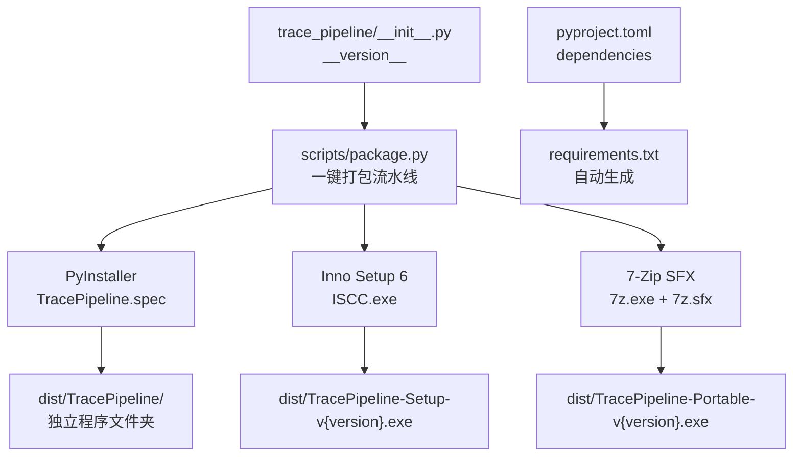
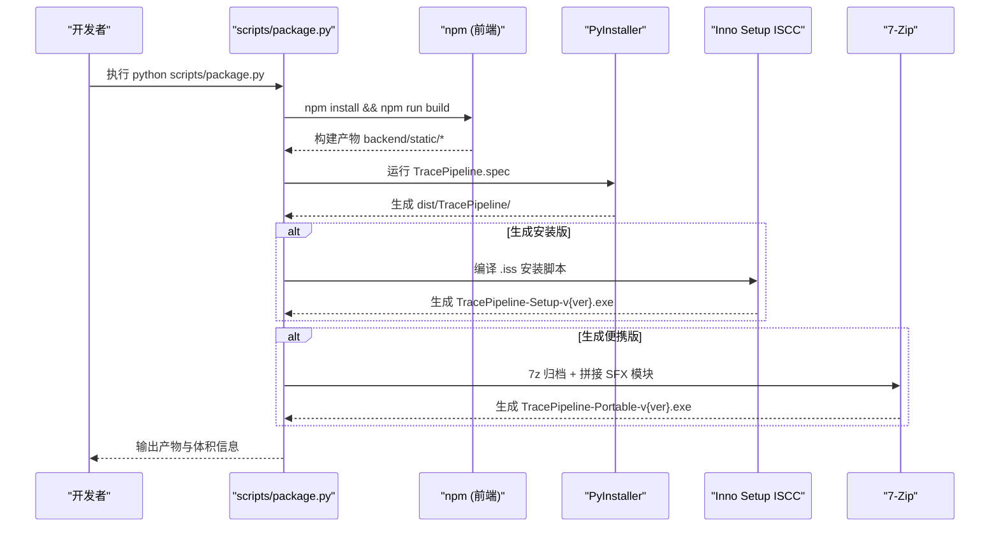
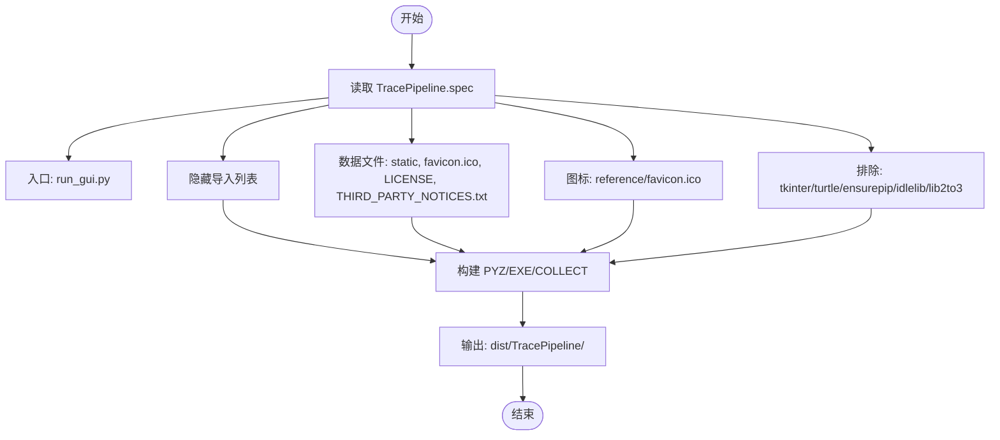
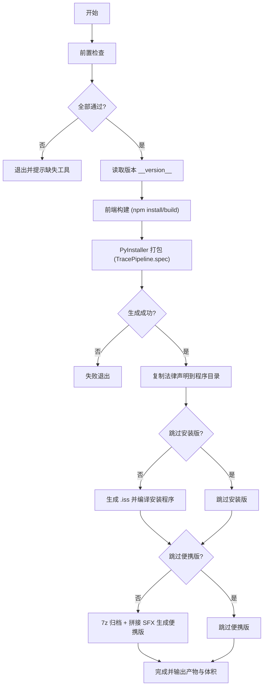
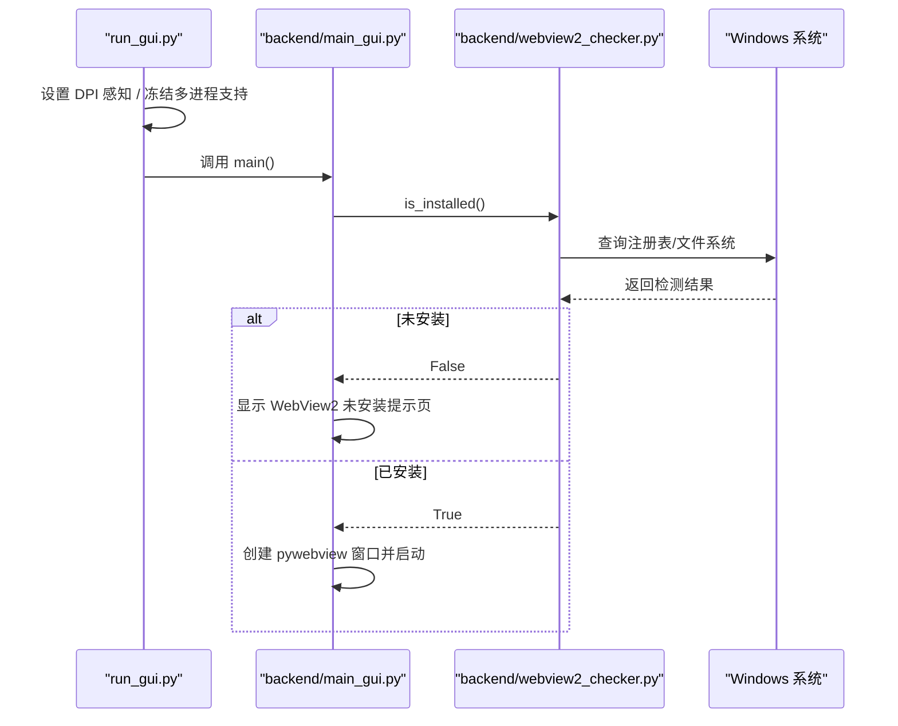
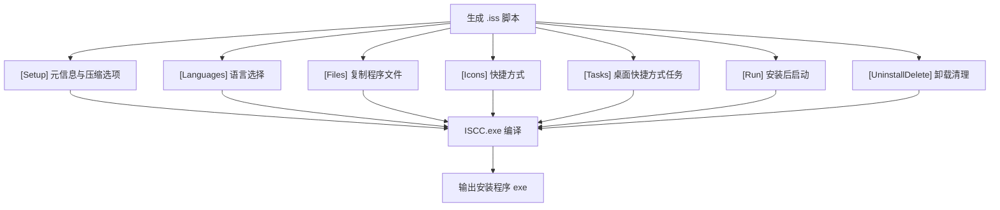
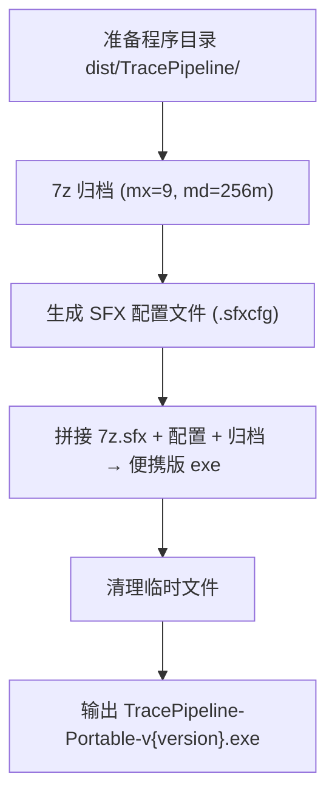
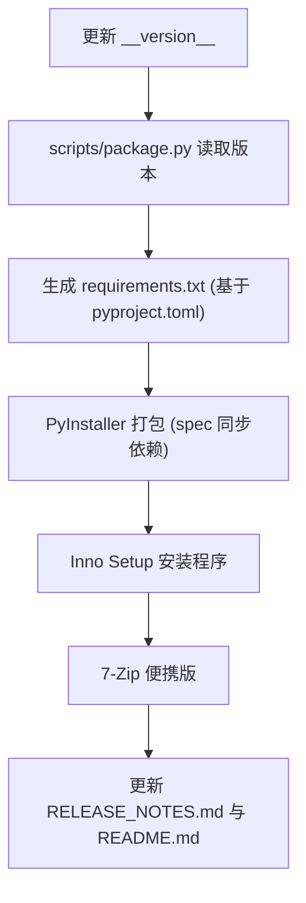
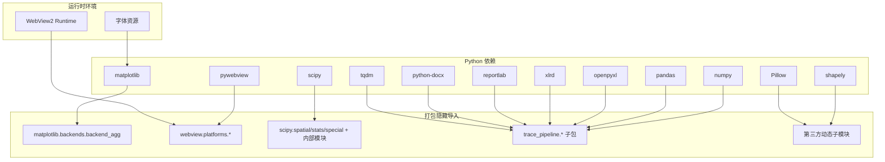

# 打包分发

<cite>
**本文引用的文件**   
- [TracePipeline.spec](file://TracePipeline.spec)
- [scripts/package.py](file://scripts/package.py)
- [pyproject.toml](file://pyproject.toml)
- [requirements.txt](file://requirements.txt)
- [run_gui.py](file://run_gui.py)
- [backend/main_gui.py](file://backend/main_gui.py)
- [backend/webview2_checker.py](file://backend/webview2_checker.py)
- [trace_pipeline/__init__.py](file://trace_pipeline/__init__.py)
- [TracePipeline-setup.iss](file://TracePipeline-setup.iss)
- [README.md](file://README.md)
- [RELEASE_NOTES.md](file://RELEASE_NOTES.md)
</cite>

## 目录
1. [简介](#简介)
2. [项目结构](#项目结构)
3. [核心组件](#核心组件)
4. [架构总览](#架构总览)
5. [详细组件分析](#详细组件分析)
6. [依赖分析](#依赖分析)
7. [性能考虑](#性能考虑)
8. [故障排除指南](#故障排除指南)
9. [结论](#结论)
10. [附录](#附录)

## 简介
本指南面向 TracePipeline 的打包与分发，覆盖以下目标：
- PyInstaller 配置与打包流程（spec 文件、依赖收集、图标嵌入）
- Inno Setup 安装程序生成（安装包定制、注册表操作、卸载清理）
- 7-Zip SFX 自解压便携版构建（压缩优化、启动脚本）
- 版本管理与发布流程（版本号规范、变更日志维护、发布自动化）
- 跨平台打包注意事项（Windows 特定配置、依赖库处理、WebView2 集成）
- 打包故障排除（常见错误、依赖缺失、运行时问题诊断）

## 项目结构
与打包相关的关键位置与职责：
- 打包规格与入口
  - TracePipeline.spec：PyInstaller 打包规格，定义入口、隐藏导入、数据文件、图标等
  - run_gui.py：GUI 应用入口，负责 DPI 感知、后端初始化、异常兜底
- 一键打包脚本
  - scripts/package.py：串联前端构建、PyInstaller、Inno Setup、7-Zip SFX 的一键流水线
- 版本与依赖声明
  - trace_pipeline/__init__.py：集中定义 __version__
  - pyproject.toml：项目元数据与依赖声明
  - requirements.txt：由脚本从 pyproject.toml 自动生成的依赖清单
- 安装器与产物
  - TracePipeline-setup.iss：Inno Setup 安装脚本（由打包脚本自动生成）
  - dist/：最终产物输出目录（程序文件夹、安装版、便携版）

图表来源
- [scripts/package.py:306-563](file://scripts/package.py#L306-L563)
- [TracePipeline.spec:1-150](file://TracePipeline.spec#L1-L150)
- [trace_pipeline/__init__.py:19-19](file://trace_pipeline/__init__.py#L19-L19)
- [pyproject.toml:35-48](file://pyproject.toml#L35-L48)
- [requirements.txt:1-17](file://requirements.txt#L1-L17)

章节来源
- [scripts/package.py:306-563](file://scripts/package.py#L306-L563)
- [TracePipeline.spec:1-150](file://TracePipeline.spec#L1-L150)
- [trace_pipeline/__init__.py:19-19](file://trace_pipeline/__init__.py#L19-L19)
- [pyproject.toml:35-48](file://pyproject.toml#L35-L48)
- [requirements.txt:1-17](file://requirements.txt#L1-L17)

## 核心组件
- PyInstaller 打包规格（TracePipeline.spec）
  - 入口：run_gui.py
  - 隐藏导入：matplotlib Agg 后端、pywebview Windows 平台后端、scipy 子模块、trace_pipeline 各子包、第三方动态子模块
  - 数据文件：backend/static、reference/favicon.ico、LICENSE、THIRD_PARTY_NOTICES.txt
  - 图标：reference/favicon.ico（若存在）
- 一键打包脚本（scripts/package.py）
  - 步骤 0：前端构建（npm install/build），产出 backend/static/index.html
  - 步骤 1：PyInstaller 打包，生成 dist/TracePipeline/
  - 步骤 2：Inno Setup 编译安装程序
  - 步骤 3：7-Zip SFX 生成便携版
  - 前置检查：venv Python、PyInstaller、图标、法律声明、Inno Setup、7-Zip
  - 版本读取：解析 trace_pipeline/__init__.py 中的 __version__
- 运行入口与 WebView2 检测
  - run_gui.py：DPI 感知、multiprocessing.freeze_support()、强制非交互 matplotlib 后端、全局异常捕获
  - backend/main_gui.py：pywebview 窗口创建、居中逻辑、图标设置、启动阶段日志
  - backend/webview2_checker.py：通过注册表与路径探测 WebView2 Runtime 是否已安装

章节来源
- [TracePipeline.spec:38-150](file://TracePipeline.spec#L38-L150)
- [scripts/package.py:210-353](file://scripts/package.py#L210-L353)
- [run_gui.py:1-60](file://run_gui.py#L1-L60)
- [backend/main_gui.py:81-206](file://backend/main_gui.py#L81-L206)
- [backend/webview2_checker.py:35-60](file://backend/webview2_checker.py#L35-L60)

## 架构总览
打包流水线整体时序如下：

图表来源
- [scripts/package.py:282-563](file://scripts/package.py#L282-L563)
- [TracePipeline.spec:1-150](file://TracePipeline.spec#L1-L150)

## 详细组件分析

### PyInstaller 打包规格（TracePipeline.spec）
- 入口与数据
  - 入口脚本：run_gui.py
  - 数据文件：backend/static、reference/favicon.ico、LICENSE、THIRD_PARTY_NOTICES.txt
  - 图标：reference/favicon.ico（条件存在时启用）
- 隐藏导入策略
  - matplotlib.backends.backend_agg（避免 GUI 后端冲突）
  - webview.platforms.*（winforms/win32/edgechromium/mshtml/guilib）
  - scipy.spatial/scipy.stats/scipy.special 及其内部 _qhull/_stats/_ufuncs
  - trace_pipeline 下 plotting/geology/io/cli/logging 等子包（惰性加载需显式声明）
  - shapely.geometry、PIL._imaging、openpyxl、xlrd、docx、reportlab 等第三方动态子模块
- 排除项
  - tkinter/turtle/ensurepip/idlelib/lib2to3（GUI 不需要）
- 输出
  - EXE 与 COLLECT 组合，strip=True，upx=False，console=False，禁用窗口化回溯

图表来源
- [TracePipeline.spec:38-150](file://TracePipeline.spec#L38-L150)

章节来源
- [TracePipeline.spec:1-150](file://TracePipeline.spec#L1-L150)

### 一键打包脚本（scripts/package.py）
- 前置检查
  - venv Python、PyInstaller、图标、法律声明、Inno Setup、7-Zip（含 7z.sfx）
- 版本读取
  - 正则解析 trace_pipeline/__init__.py 中的 __version__
- 前端构建
  - 进入 frontend 目录执行 npm install 与 npm run build，校验 backend/static/index.html 是否存在
- PyInstaller 打包
  - 调用 .venv/Scripts/pyinstaller.exe 执行 TracePipeline.spec，清理旧 dist 与临时文件，复制法律声明到程序目录
- Inno Setup 安装程序
  - 生成 .iss 脚本（语言选择、文件/图标/任务/运行/卸载删除等），调用 ISCC.exe 编译
- 7-Zip 便携版
  - 使用 mx=9/md=256m 最高压缩比创建 .7z，拼接 7z.sfx 与配置文件生成自解压 exe，并清理临时文件

图表来源
- [scripts/package.py:210-563](file://scripts/package.py#L210-L563)

章节来源
- [scripts/package.py:210-563](file://scripts/package.py#L210-L563)

### 运行入口与 WebView2 集成（Windows 特定）
- run_gui.py
  - 在导入任何 GUI 库之前设置 Per-Monitor V2 DPI 感知
  - 强制 matplotlib 使用 Agg 后端，避免后台线程绘图触发 Tkinter
  - multiprocessing.freeze_support() 确保子进程不重复执行 GUI 初始化
  - 全局异常捕获，失败时弹出 MessageBoxW 提示
- backend/main_gui.py
  - 计算屏幕尺寸与窗口居中坐标
  - 先检测 WebView2 是否安装；未安装则显示引导页面并提供下载链接
  - 创建 pywebview 窗口，绑定 JS API，设置图标与最小尺寸
- backend/webview2_checker.py
  - 通过注册表键值与常见 DLL 路径判断 WebView2 Runtime 是否已安装
  - 提供下载 URL 供用户手动安装

图表来源
- [run_gui.py:1-60](file://run_gui.py#L1-L60)
- [backend/main_gui.py:81-206](file://backend/main_gui.py#L81-L206)
- [backend/webview2_checker.py:35-60](file://backend/webview2_checker.py#L35-L60)

章节来源
- [run_gui.py:1-60](file://run_gui.py#L1-L60)
- [backend/main_gui.py:81-206](file://backend/main_gui.py#L81-L206)
- [backend/webview2_checker.py:35-60](file://backend/webview2_checker.py#L35-L60)

### Inno Setup 安装程序生成
- 脚本生成 .iss 内容
  - 语言块：优先本地中文语言文件，否则回退至编译器内置或仅英文
  - Files：递归复制 dist/TracePipeline/* 到 {app}
  - Icons：程序组快捷方式、桌面快捷方式（可选）、卸载快捷方式
  - Tasks：桌面快捷方式任务
  - Run：安装完成后启动程序（静默模式跳过）
  - UninstallDelete：卸载时清理 logs 目录与 config.json
- 编译与产物
  - 调用 ISCC.exe 编译，输出 TracePipeline-Setup-v{version}.exe

图表来源
- [scripts/package.py:356-474](file://scripts/package.py#L356-L474)
- [TracePipeline-setup.iss:1-43](file://TracePipeline-setup.iss#L1-L43)

章节来源
- [scripts/package.py:356-474](file://scripts/package.py#L356-L474)
- [TracePipeline-setup.iss:1-43](file://TracePipeline-setup.iss#L1-L43)

### 7-Zip SFX 便携版制作
- 压缩参数
  - 7z a -t7z -mx=9 -md=256m -ms=on 最高压缩比与大字典
- SFX 配置
  - 标题、提示文本、提取路径、默认运行程序、GUI 标志
- 拼接流程
  - 将 7z.sfx + sfxcfg + .7z 二进制拼接为自解压 exe
- 产物
  - TracePipeline-Portable-v{version}.exe，并在 dist 旁附带 THIRD_PARTY_NOTICES.txt

图表来源
- [scripts/package.py:478-563](file://scripts/package.py#L478-L563)

章节来源
- [scripts/package.py:478-563](file://scripts/package.py#L478-L563)

### 版本管理与发布流程
- 版本号来源
  - trace_pipeline/__init__.py 中 __version__ 作为唯一真实来源
  - 打包脚本与 spec 均从该文件读取版本号
- 依赖管理
  - pyproject.toml 的 dependencies 列表被脚本正则解析，生成 requirements.txt
  - 仅在内容变化时写入，避免无意义的时间戳变更
- 发布说明与验证
  - RELEASE_NOTES.md 记录每个版本的变更、验证状态与发行产物路径
  - README.md 包含打包分发章节与工具链说明

图表来源
- [trace_pipeline/__init__.py:19-19](file://trace_pipeline/__init__.py#L19-L19)
- [scripts/package.py:117-206](file://scripts/package.py#L117-L206)
- [pyproject.toml:35-48](file://pyproject.toml#L35-L48)
- [requirements.txt:1-17](file://requirements.txt#L1-L17)
- [RELEASE_NOTES.md:1-52](file://RELEASE_NOTES.md#L1-L52)
- [README.md:749-778](file://README.md#L749-L778)

章节来源
- [trace_pipeline/__init__.py:19-19](file://trace_pipeline/__init__.py#L19-L19)
- [scripts/package.py:117-206](file://scripts/package.py#L117-L206)
- [pyproject.toml:35-48](file://pyproject.toml#L35-L48)
- [requirements.txt:1-17](file://requirements.txt#L1-L17)
- [RELEASE_NOTES.md:1-52](file://RELEASE_NOTES.md#L1-L52)
- [README.md:749-778](file://README.md#L749-L778)

## 依赖分析
- 核心依赖（来自 pyproject.toml）
  - numpy、pandas、matplotlib、openpyxl、Pillow、scipy、shapely、pywebview、python-docx、reportlab、tqdm、xlrd
- 打包隐藏导入（TracePipeline.spec）
  - matplotlib.backends.backend_agg
  - webview.platforms.winforms/win32/edgechromium/mshtml/guilib
  - scipy.spatial/scipy.stats/scipy.special 及其内部 _qhull/_stats/_ufuncs
  - trace_pipeline.plotting/style、trace_plot、rose_plot、overlays、preview_plot、_helpers
  - trace_pipeline.pipeline、geology.statistics/transforms/angles/endpoints/_stat_types/_stat_format/_circle_window/_convex_hull/_window_strategies/_window_scoring
  - trace_pipeline.analysis.models/nodes、geometry.segments、io.excel_reader/excel_writer/discovery、cli.main/args/dispatcher/interactive、logging.core/context、models/config/validation/reporting
  - shapely.geometry、PIL._imaging、openpyxl、xlrd、docx、reportlab
- 运行时依赖（Windows 特定）
  - WebView2 Runtime（Win11 内置，Win10 可自动推送或手动安装）
  - 字体资源（matplotlib 渲染需要）

图表来源
- [pyproject.toml:35-48](file://pyproject.toml#L35-L48)
- [TracePipeline.spec:43-100](file://TracePipeline.spec#L43-L100)
- [backend/webview2_checker.py:35-60](file://backend/webview2_checker.py#L35-L60)

章节来源
- [pyproject.toml:35-48](file://pyproject.toml#L35-L48)
- [TracePipeline.spec:43-100](file://TracePipeline.spec#L43-L100)
- [backend/webview2_checker.py:35-60](file://backend/webview2_checker.py#L35-L60)

## 性能考虑
- 压缩与体积
  - 7-Zip 使用 mx=9 与 md=256m 提升压缩率，适合便携版分发
  - PyInstaller 启用 strip=True，关闭 upx 以避免兼容性问题
- 启动时间
  - 非核心服务懒加载，WebView2 检测后初始化
  - 前端静态资源预构建，减少运行时开销
- 内存占用
  - 图片缓存 TTLCache 限制容量与过期时间
  - 报告导出队列上限，避免长期运行消息堆积

[本节为通用指导，无需具体文件分析]

## 故障排除指南
- 常见打包错误
  - 缺少前端构建产物：确保 backend/static/index.html 存在，或允许脚本自动构建
  - PyInstaller 打包失败：检查 hiddenimports 是否覆盖所有惰性导入模块
  - 图标缺失：确认 reference/favicon.ico 存在
  - 法律声明缺失：LICENSE 与 THIRD_PARTY_NOTICES.txt 必须存在
- 工具链问题
  - Inno Setup 未找到：设置环境变量 ISCC_EXE 或传入 --iscc-path
  - 7-Zip 未找到或缺少 7z.sfx：设置 SEVEN_ZIP 或传入 --seven-zip-path
- 运行时问题
  - WebView2 未安装：首次启动会提示下载链接；建议在安装程序中引导用户安装
  - DPI 缩放异常：run_gui.py 已设置 Per-Monitor V2 感知，确保在 Windows 10+ 上运行
  - 字体缺失导致绘图警告：确保系统字体可用或自定义 matplotlib 字体路径

章节来源
- [scripts/package.py:210-353](file://scripts/package.py#L210-L353)
- [TracePipeline.spec:26-34](file://TracePipeline.spec#L26-L34)
- [backend/webview2_checker.py:35-60](file://backend/webview2_checker.py#L35-L60)
- [run_gui.py:23-33](file://run_gui.py#L23-L33)

## 结论
TracePipeline 的打包与分发采用“前端构建 + PyInstaller + Inno Setup + 7-Zip SFX”的一体化流水线，配合统一的版本源与依赖声明，实现了安装版与便携版的稳定产出。通过合理的隐藏导入、数据文件与图标配置，以及严格的运行时依赖检测（如 WebView2），确保了用户在 Windows 平台的开箱即用体验。建议在生产环境中固化工具链路径与环境变量，并结合 RELEASE_NOTES.md 进行规范的版本发布。

[本节为总结性内容，无需具体文件分析]

## 附录
- 快速命令参考
  - 完整打包：python scripts/package.py
  - 仅安装版：python scripts/package.py --skip-portable
  - 仅便携版：python scripts/package.py --skip-installer
  - 跳过前端构建：python scripts/package.py --skip-frontend
  - 仅生成 requirements.txt：python scripts/package.py --gen-requirements
- 产物路径
  - 程序文件夹：dist/TracePipeline/
  - 安装版：dist/TracePipeline-Setup-v{version}.exe
  - 便携版：dist/TracePipeline-Portable-v{version}.exe

章节来源
- [scripts/package.py:575-703](file://scripts/package.py#L575-L703)
- [README.md:749-778](file://README.md#L749-L778)