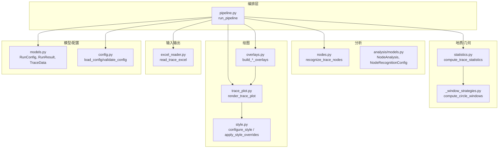
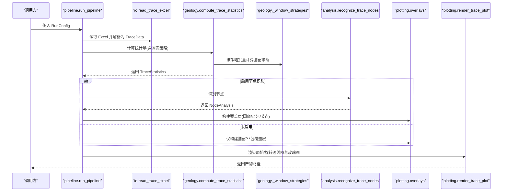
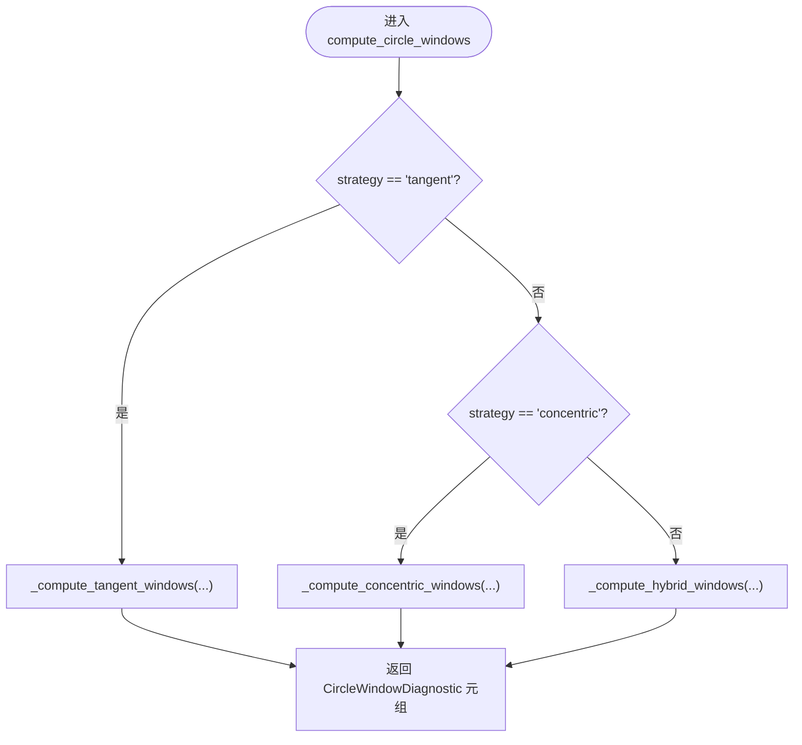
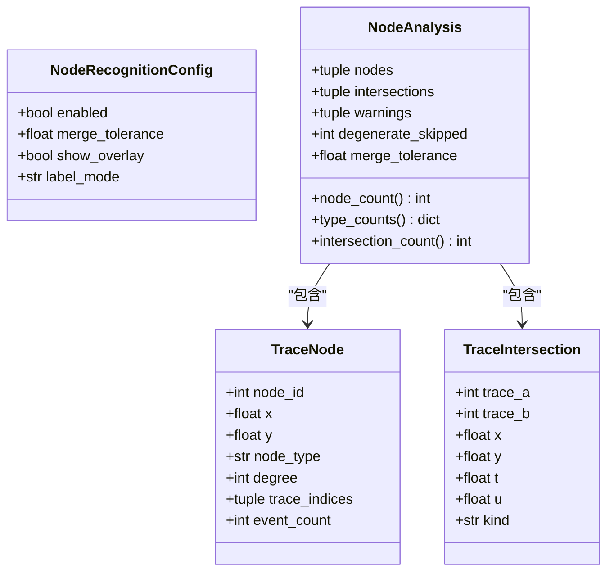
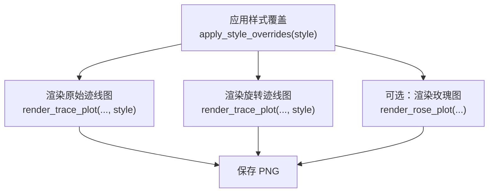
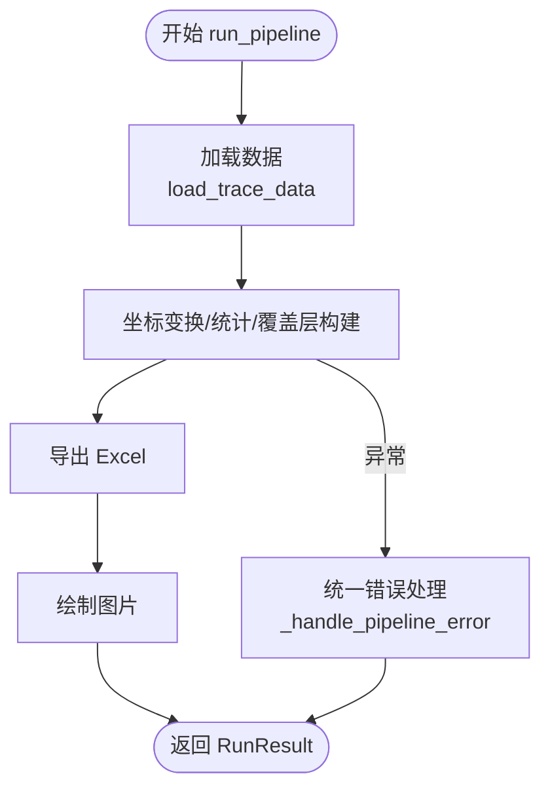
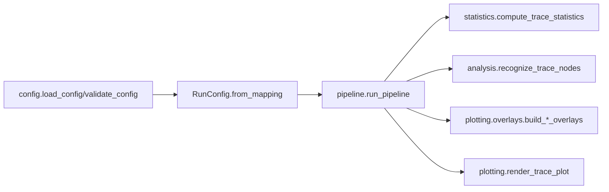
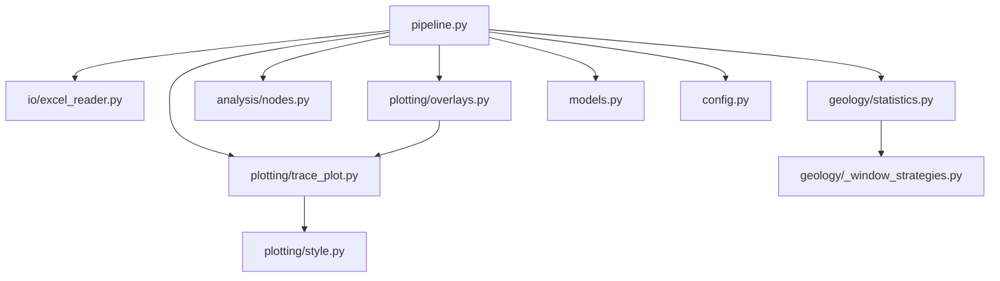

# 扩展开发

<cite>
**本文引用的文件**   
- [trace_pipeline/__init__.py](file://trace_pipeline/__init__.py)
- [trace_pipeline/pipeline.py](file://trace_pipeline/pipeline.py)
- [trace_pipeline/config.py](file://trace_pipeline/config.py)
- [trace_pipeline/models.py](file://trace_pipeline/models.py)
- [trace_pipeline/analysis/nodes.py](file://trace_pipeline/analysis/nodes.py)
- [trace_pipeline/analysis/models.py](file://trace_pipeline/analysis/models.py)
- [trace_pipeline/geology/statistics.py](file://trace_pipeline/geology/statistics.py)
- [trace_pipeline/geology/_window_strategies.py](file://trace_pipeline/geology/_window_strategies.py)
- [trace_pipeline/io/excel_reader.py](file://trace_pipeline/io/excel_reader.py)
- [trace_pipeline/plotting/style.py](file://trace_pipeline/plotting/style.py)
- [trace_pipeline/plotting/overlays.py](file://trace_pipeline/plotting/overlays.py)
- [trace_pipeline/plotting/trace_plot.py](file://trace_pipeline/plotting/trace_plot.py)
- [trace_pipeline/utils/mpl_init.py](file://trace_pipeline/utils/mpl_init.py)
- [config.example.json](file://config.example.json)
</cite>

## 目录
1. [简介](#简介)
2. [项目结构](#项目结构)
3. [核心组件](#核心组件)
4. [架构总览](#架构总览)
5. [详细组件分析](#详细组件分析)
6. [依赖关系分析](#依赖关系分析)
7. [性能考量](#性能考量)
8. [故障排查指南](#故障排查指南)
9. [结论](#结论)
10. [附录：完整扩展示例](#附录完整扩展示例)

## 简介
本指南面向希望在 TracePipeline 中进行高级扩展的开发者，围绕以下目标展开：
- 新增圆窗策略（接口规范、评分函数实现、注册机制）
- 扩展节点识别算法（拓扑分析接口、几何判断逻辑、结果数据结构）
- 自定义绘图样式（样式类继承、渲染管线集成、主题切换支持）
- 数据处理管道扩展（新算子开发、数据流连接、错误处理机制）
- 插件架构设计（模块化原则、依赖注入、配置管理）
- 最佳实践与测试要求
- 从需求到部署的完整示例流程

## 项目结构
TracePipeline 采用“领域模块 + 编排层”的分层组织方式：
- geology：地质/几何算法（统计、圆窗策略、坐标变换等）
- analysis：节点识别与分析
- plotting：迹线图、玫瑰图、覆盖层构建与样式系统
- io：Excel 读取/写入与发现
- pipeline：单目标全流程编排（加载→计算→导出→绘图）
- models/config：数据模型与配置加载/校验
- utils：通用工具（字体、路径、matplotlib 初始化等）

图表来源
- [trace_pipeline/pipeline.py:230-474](file://trace_pipeline/pipeline.py#L230-L474)
- [trace_pipeline/geology/statistics.py:212-391](file://trace_pipeline/geology/statistics.py#L212-L391)
- [trace_pipeline/geology/_window_strategies.py:173-185](file://trace_pipeline/geology/_window_strategies.py#L173-L185)
- [trace_pipeline/analysis/nodes.py:160-417](file://trace_pipeline/analysis/nodes.py#L160-L417)
- [trace_pipeline/plotting/overlays.py:33-156](file://trace_pipeline/plotting/overlays.py#L33-L156)
- [trace_pipeline/plotting/trace_plot.py:443-565](file://trace_pipeline/plotting/trace_plot.py#L443-L565)
- [trace_pipeline/plotting/style.py:187-296](file://trace_pipeline/plotting/style.py#L187-L296)
- [trace_pipeline/io/excel_reader.py:36-169](file://trace_pipeline/io/excel_reader.py#L36-L169)
- [trace_pipeline/models.py:162-352](file://trace_pipeline/models.py#L162-L352)
- [trace_pipeline/config.py:86-191](file://trace_pipeline/config.py#L86-L191)

章节来源
- [trace_pipeline/__init__.py:1-83](file://trace_pipeline/__init__.py#L1-L83)
- [trace_pipeline/pipeline.py:1-474](file://trace_pipeline/pipeline.py#L1-L474)
- [trace_pipeline/config.py:1-326](file://trace_pipeline/config.py#L1-L326)
- [trace_pipeline/models.py:1-352](file://trace_pipeline/models.py#L1-L352)

## 核心组件
- 运行配置与结果
  - RunConfig：不可变运行参数，含窗口策略、节点识别开关、DPI、样式等。
  - RunResult：不可变运行结果，包含成功/失败状态、关键指标与产物路径。
  - TraceData：解析后的迹线数据容器，提供长度派生属性与严格校验。
- 流水线编排
  - run_pipeline：串联「加载 → 变换 → 导出 Excel → 绘制图片」五阶段，统一异常处理与日志上下文。
- 统计与圆窗
  - compute_trace_statistics：计算 P10/P20/P21、面积来源选择、一致性校验与告警。
  - compute_circle_windows：按策略（tangent/concentric/hybrid）批量生成圆窗诊断。
- 节点识别
  - recognize_trace_nodes：基于线段相交检测、端点接近聚类、并查集合并与拓扑分类。
- 绘图与样式
  - render_trace_plot：自适应布局、图层叠加（迹线/凸包/圆窗/节点）、指北针与比例尺。
  - configure_style/apply_style_overrides：全局样式与线程安全临时覆盖。
- 输入输出
  - read_trace_excel：多引擎回退、工作表回退、格式校验与大小限制。

章节来源
- [trace_pipeline/models.py:162-352](file://trace_pipeline/models.py#L162-L352)
- [trace_pipeline/pipeline.py:230-474](file://trace_pipeline/pipeline.py#L230-L474)
- [trace_pipeline/geology/statistics.py:212-391](file://trace_pipeline/geology/statistics.py#L212-L391)
- [trace_pipeline/geology/_window_strategies.py:173-185](file://trace_pipeline/geology/_window_strategies.py#L173-L185)
- [trace_pipeline/analysis/nodes.py:160-417](file://trace_pipeline/analysis/nodes.py#L160-L417)
- [trace_pipeline/plotting/trace_plot.py:443-565](file://trace_pipeline/plotting/trace_plot.py#L443-L565)
- [trace_pipeline/plotting/style.py:187-296](file://trace_pipeline/plotting/style.py#L187-L296)
- [trace_pipeline/io/excel_reader.py:36-169](file://trace_pipeline/io/excel_reader.py#L36-L169)

## 架构总览
下图展示一次典型运行的调用链与数据流向。

图表来源
- [trace_pipeline/pipeline.py:230-474](file://trace_pipeline/pipeline.py#L230-L474)
- [trace_pipeline/io/excel_reader.py:36-169](file://trace_pipeline/io/excel_reader.py#L36-L169)
- [trace_pipeline/geology/statistics.py:212-391](file://trace_pipeline/geology/statistics.py#L212-L391)
- [trace_pipeline/geology/_window_strategies.py:173-185](file://trace_pipeline/geology/_window_strategies.py#L173-L185)
- [trace_pipeline/analysis/nodes.py:160-417](file://trace_pipeline/analysis/nodes.py#L160-L417)
- [trace_pipeline/plotting/overlays.py:33-156](file://trace_pipeline/plotting/overlays.py#L33-L156)
- [trace_pipeline/plotting/trace_plot.py:443-565](file://trace_pipeline/plotting/trace_plot.py#L443-L565)

## 详细组件分析

### 新增圆窗策略（接口规范、评分函数、注册机制）
- 现有策略与入口
  - 策略入口：compute_circle_windows(local_segments, scanline_length, config, strategy)
  - 内置策略：tangent、concentric、hybrid（auto 时由上层选择）
- 接口规范
  - 输入：局部坐标系下的迹线片段数组、测线长度、TraceStatisticsConfig、strategy 字符串
  - 输出：CircleWindowDiagnostic 元组（包含中心、半径、有效性、策略标识、分组键等）
- 评分与选择
  - 上层通过 _select_window_diagnostics 聚合各策略的 l_est/p20/p21 等指标，结合 hull_area 与一致性阈值进行最终选择
- 添加新策略步骤
  1) 在 _window_strategies.py 中新增策略函数（参考 _compute_tangent_windows/_compute_concentric_windows/_compute_hybrid_windows 的实现模式），使用 _count_circle_windows_batch 批量计数
  2) 在 compute_circle_windows 中添加分支以分发到新策略
  3) 在上层选择逻辑中纳入新策略（若需要自动选择）
  4) 在配置项中暴露新策略名称（如 window_strategy 枚举值）
  5) 编写单元测试验证不同密度/边界条件下的稳定性与性能

图表来源
- [trace_pipeline/geology/_window_strategies.py:173-185](file://trace_pipeline/geology/_window_strategies.py#L173-L185)
- [trace_pipeline/geology/_window_strategies.py:87-130](file://trace_pipeline/geology/_window_strategies.py#L87-L130)
- [trace_pipeline/geology/_window_strategies.py:132-171](file://trace_pipeline/geology/_window_strategies.py#L132-L171)
- [trace_pipeline/geology/_window_strategies.py:52-85](file://trace_pipeline/geology/_window_strategies.py#L52-L85)

章节来源
- [trace_pipeline/geology/_window_strategies.py:1-185](file://trace_pipeline/geology/_window_strategies.py#L1-L185)
- [trace_pipeline/geology/statistics.py:212-391](file://trace_pipeline/geology/statistics.py#L212-L391)

### 节点识别算法扩展（拓扑分析接口、几何判断、结果数据结构）
- 数据结构
  - NodeRecognitionConfig：控制是否启用、合并容差、标签模式
  - TraceNode：节点位置、类型（I/Y/X）、度（拓扑值）、参与迹线索引、事件数
  - TraceIntersection：两迹线相交事件（端点/内部/重叠）
  - NodeAnalysis：节点集合、相交事件、警告、退化跳过计数、合并容差
- 算法要点
  - 预处理：过滤退化线段、预计算包围盒与半长
  - 相交检测：对候选对调用 segment_intersection，区分 X/Y/端-端事件
  - 端点接近检测：网格分桶 + 并查集聚类
  - 拓扑分类：根据每条迹线的参数分布判定 I/Y/X 及 degree
- 扩展建议
  - 新增节点类型或度量：在 _classify_and_compute_node 中扩展分类规则
  - 调整聚类容差：merge_tolerance 与 cluster_tol 的关系需考虑平均迹长
  - 性能优化：向量化包围盒筛选、批处理候选点聚类已具备良好基础

图表来源
- [trace_pipeline/analysis/models.py:22-98](file://trace_pipeline/analysis/models.py#L22-L98)
- [trace_pipeline/analysis/nodes.py:160-417](file://trace_pipeline/analysis/nodes.py#L160-L417)

章节来源
- [trace_pipeline/analysis/models.py:1-98](file://trace_pipeline/analysis/models.py#L1-L98)
- [trace_pipeline/analysis/nodes.py:1-417](file://trace_pipeline/analysis/nodes.py#L1-L417)

### 自定义绘图样式（样式类继承、渲染管线集成、主题切换）
- 样式系统
  - configure_style：设置 CJK/西文字体栈、数学文本字体、论文风格默认值
  - apply_style_overrides：线程安全的临时覆盖，支持颜色、线宽、填充透明度等常量映射
- 覆盖层与渲染
  - overlays.py 将统计/节点结果转换为 CircleWindowOverlay/ConvexHullOverlay/NodeOverlay
  - trace_plot.py 负责布局、图层叠加、指北针、比例尺、图例与统计框
- 主题切换
  - 通过 style 字典传入覆盖项（如 trace_line_color、hull_fill_alpha、circle_window_line_color 等）
  - 在 pipeline 的绘图阶段使用 apply_style_overrides 包裹渲染，确保并发安全

图表来源
- [trace_pipeline/plotting/style.py:258-296](file://trace_pipeline/plotting/style.py#L258-L296)
- [trace_pipeline/plotting/trace_plot.py:443-565](file://trace_pipeline/plotting/trace_plot.py#L443-L565)
- [trace_pipeline/plotting/overlays.py:33-156](file://trace_pipeline/plotting/overlays.py#L33-L156)

章节来源
- [trace_pipeline/plotting/style.py:1-296](file://trace_pipeline/plotting/style.py#L1-L296)
- [trace_pipeline/plotting/trace_plot.py:1-565](file://trace_pipeline/plotting/trace_plot.py#L1-L565)
- [trace_pipeline/plotting/overlays.py:1-156](file://trace_pipeline/plotting/overlays.py#L1-L156)

### 数据处理管道扩展（新算子、数据流连接、错误处理）
- 数据流
  - load_trace_data：读取 Excel → 计算端点 → 构造 TraceData（带缓存）
  - run_pipeline：顺序执行 transform → statistics → overlays → export → plot
- 新算子接入
  - 在 pipeline 的 transform 阶段插入新算子（例如新的几何变换或特征提取），保持输入/输出为 numpy 数组或 TraceData 字段
  - 如需影响统计或覆盖层，更新 overlays 构建逻辑并在绘图阶段传入新图层
- 错误处理
  - 统一异常捕获：PermissionError/FileNotFoundError/ValueError 等友好提示
  - 子进程安全：非交互后端强制设置与独立日志初始化

图表来源
- [trace_pipeline/pipeline.py:230-474](file://trace_pipeline/pipeline.py#L230-L474)
- [trace_pipeline/io/excel_reader.py:36-169](file://trace_pipeline/io/excel_reader.py#L36-L169)

章节来源
- [trace_pipeline/pipeline.py:1-474](file://trace_pipeline/pipeline.py#L1-L474)
- [trace_pipeline/io/excel_reader.py:1-169](file://trace_pipeline/io/excel_reader.py#L1-L169)

### 插件架构设计（模块化、依赖注入、配置管理）
- 模块化原则
  - 领域能力按 geology/analysis/plotting/io 分层，避免跨层强耦合
  - 公开 API 集中在 __init__.py 的懒加载导出，降低启动开销
- 依赖注入
  - 通过 RunConfig 传递策略、样式、节点识别开关等；通过 overlays 构建器注入覆盖层
- 配置管理
  - load_config/validate_config 负责 JSON 合并、必填校验、路径解析与 CLI 覆盖
  - config.example.json 提供模板，便于快速上手

图表来源
- [trace_pipeline/config.py:86-191](file://trace_pipeline/config.py#L86-L191)
- [trace_pipeline/models.py:236-268](file://trace_pipeline/models.py#L236-L268)
- [trace_pipeline/pipeline.py:230-474](file://trace_pipeline/pipeline.py#L230-L474)

章节来源
- [trace_pipeline/config.py:1-326](file://trace_pipeline/config.py#L1-L326)
- [trace_pipeline/__init__.py:1-83](file://trace_pipeline/__init__.py#L1-L83)
- [config.example.json:1-26](file://config.example.json#L1-L26)

## 依赖关系分析
- 直接依赖
  - pipeline 依赖 io、geology、analysis、plotting、models、config
  - statistics 依赖 _window_strategies、_convex_hull、_stat_types、angles
  - overlays 依赖 trace_plot 的覆盖层数据类型
  - trace_plot 依赖 style 与 layout helpers
- 潜在循环
  - plotting.style 与 trace_plot 通过常量映射解耦，避免直接循环导入
- 外部依赖
  - matplotlib（绘图）、pandas/openpyxl/xlrd（Excel 读写）、numpy（数值计算）

图表来源
- [trace_pipeline/pipeline.py:230-474](file://trace_pipeline/pipeline.py#L230-L474)
- [trace_pipeline/geology/statistics.py:212-391](file://trace_pipeline/geology/statistics.py#L212-L391)
- [trace_pipeline/plotting/overlays.py:33-156](file://trace_pipeline/plotting/overlays.py#L33-L156)
- [trace_pipeline/plotting/trace_plot.py:443-565](file://trace_pipeline/plotting/trace_plot.py#L443-L565)
- [trace_pipeline/plotting/style.py:187-296](file://trace_pipeline/plotting/style.py#L187-L296)

章节来源
- [trace_pipeline/pipeline.py:1-474](file://trace_pipeline/pipeline.py#L1-L474)
- [trace_pipeline/geology/statistics.py:1-391](file://trace_pipeline/geology/statistics.py#L1-L391)
- [trace_pipeline/plotting/overlays.py:1-156](file://trace_pipeline/plotting/overlays.py#L1-L156)
- [trace_pipeline/plotting/trace_plot.py:1-565](file://trace_pipeline/plotting/trace_plot.py#L1-L565)
- [trace_pipeline/plotting/style.py:1-296](file://trace_pipeline/plotting/style.py#L1-L296)

## 性能考量
- 缓存与惰性加载
  - load_trace_data 使用文件签名 LRU 缓存，避免重复解析
  - __init__.py 懒加载绘图相关符号，减少启动开销
- 向量化与批处理
  - 节点识别使用 NumPy 向量化包围盒筛选与批量聚类
  - 圆窗策略使用 _count_circle_windows_batch 批量计数
- 并行与后端
  - 子进程中强制 Agg 后端，避免 GUI 冲突
  - 可通过配置 parallel_workers 控制并行度（由上层服务编排）

[本节为通用指导，不直接分析具体文件]

## 故障排查指南
- 常见错误与定位
  - 权限不足/文件占用：PermissionError 友好提示，关闭 Excel/WPS 后重试
  - 输入文件不存在：FileNotFoundError 明确提示检查路径
  - Excel 过大或格式错误：TraceValidationError 抛出，检查文件大小与列格式
  - 配置缺失或非法：validate_config 报错，检查必填字段与类型
- 调试建议
  - 开启 is_dev_mode 获取更详细的日志
  - 使用 LogContext 的请求 ID 追踪单次运行
  - 在 pipeline 异常分支中记录 traceback（include_traceback=True）

章节来源
- [trace_pipeline/pipeline.py:98-130](file://trace_pipeline/pipeline.py#L98-L130)
- [trace_pipeline/io/excel_reader.py:28-106](file://trace_pipeline/io/excel_reader.py#L28-L106)
- [trace_pipeline/config.py:148-191](file://trace_pipeline/config.py#L148-L191)
- [trace_pipeline/utils/mpl_init.py:12-24](file://trace_pipeline/utils/mpl_init.py#L12-L24)

## 结论
TracePipeline 提供了清晰的扩展点：
- 圆窗策略：通过 compute_circle_windows 与 _select_window_diagnostics 组合扩展
- 节点识别：在 nodes.py 中扩展分类与聚类逻辑，配合 overlays 可视化
- 绘图样式：通过 style 覆盖与 apply_style_overrides 实现主题化
- 数据处理：在 pipeline 中插入新算子，遵循 TraceData/NumPy 数组契约
- 插件化：以 RunConfig 为中心的配置驱动与模块化分层

[本节为总结性内容，不直接分析具体文件]

## 附录：完整扩展示例
以下示例演示如何从零开始添加一个“自适应密度圆窗策略”，并完成端到端集成与测试。

- 需求分析
  - 目标：根据迹线密度动态调整圆窗半径，提升低密度区域的代表性
  - 约束：兼容现有统计指标聚合与面积选择逻辑
- 设计要点
  - 新增策略函数 _compute_adaptive_windows，依据 trace.count 与 mean_len 估算半径
  - 在 compute_circle_windows 中增加分支
  - 在上层选择逻辑中纳入该策略（若需要 auto 选择）
  - 在配置中暴露新策略名
- 实现步骤
  1) 在 _window_strategies.py 中实现新策略函数，使用 _count_circle_windows_batch 批量计算
  2) 在 compute_circle_windows 中添加策略分发
  3) 在 statistics.py 的选择逻辑中评估新策略的 p20/p21 指标
  4) 在 config.example.json 中添加新策略选项
  5) 在 tests 中编写用例，覆盖不同密度场景
- 代码级参考路径
  - 策略入口与分发：[trace_pipeline/geology/_window_strategies.py:173-185](file://trace_pipeline/geology/_window_strategies.py#L173-L185)
  - 统计选择与聚合：[trace_pipeline/geology/statistics.py:212-391](file://trace_pipeline/geology/statistics.py#L212-L391)
  - 配置模板：[config.example.json:1-26](file://config.example.json#L1-L26)
  - 流水线集成点：[trace_pipeline/pipeline.py:230-474](file://trace_pipeline/pipeline.py#L230-L474)
- 测试要求
  - 单元测试：策略在不同密度/边界条件下的稳定性
  - 集成测试：run_pipeline 端到端验证产物与指标
  - 回归测试：对比历史结果，确保无退化
- 文档编写
  - 在模块 docstring 中说明策略假设与适用场景
  - 在 README 或 Wiki 中补充用户指南与示例配置
- 部署上线
  - 更新版本与发布说明
  - 在 CI 中运行全量测试与覆盖率检查
  - 更新配置模板与示例数据

[本节为概念性示例，不直接分析具体文件]