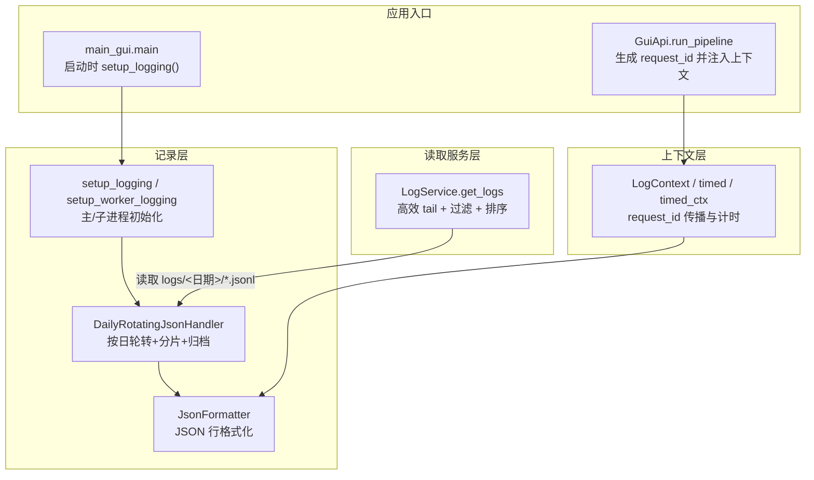
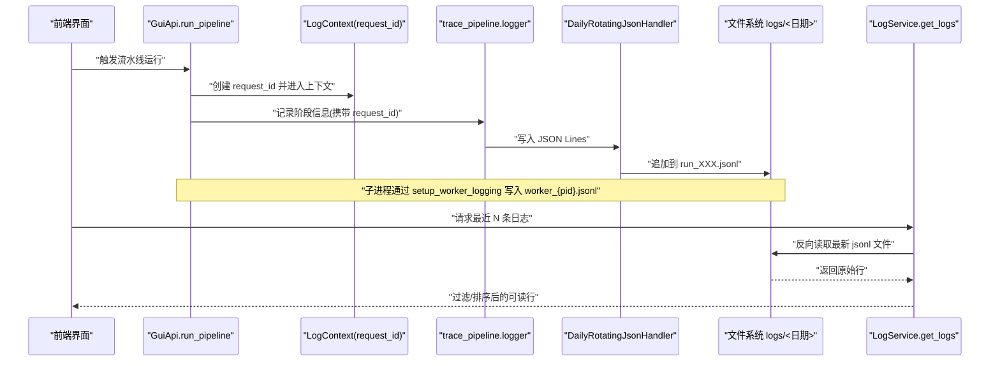
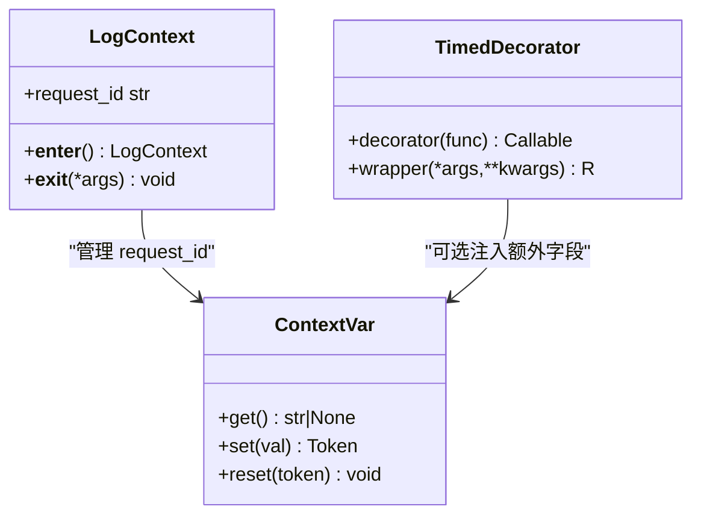
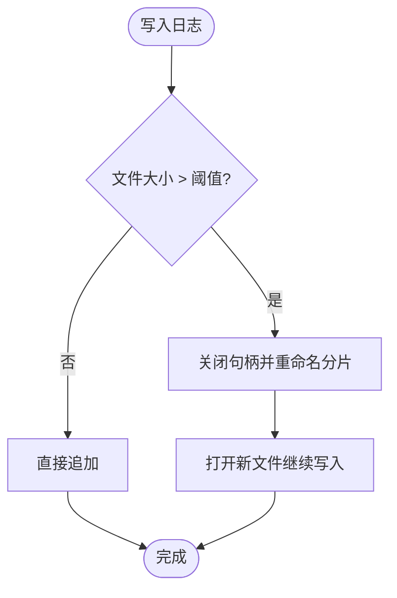
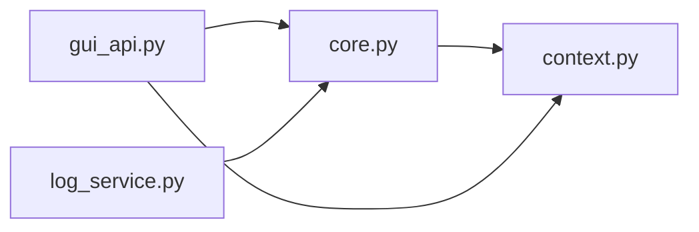

# 日志调试

<cite>
**本文引用的文件**   
- [trace_pipeline/logging/core.py](file://trace_pipeline/logging/core.py)
- [trace_pipeline/logging/context.py](file://trace_pipeline/logging/context.py)
- [backend/services/log_service.py](file://backend/services/log_service.py)
- [backend/gui_api.py](file://backend/gui_api.py)
- [backend/main_gui.py](file://backend/main_gui.py)
- [tests/test_logging.py](file://tests/test_logging.py)
</cite>

## 目录
1. [简介](#简介)
2. [项目结构](#项目结构)
3. [核心组件](#核心组件)
4. [架构总览](#架构总览)
5. [详细组件分析](#详细组件分析)
6. [依赖关系分析](#依赖关系分析)
7. [性能考虑](#性能考虑)
8. [故障排查指南](#故障排查指南)
9. [结论](#结论)
10. [附录](#附录)

## 简介
本手册聚焦 TracePipeline 的日志系统与调试技术，覆盖以下要点：
- JSON Lines 结构化日志字段、时间戳格式与级别分类
- request_id 追踪机制与上下文传递（含分布式/多进程场景）
- 性能分析工具集成建议（CPU profiler、内存分析器、I/O 监控）
- 错误处理与异常捕获策略、错误码定义与用户友好提示
- 调试技巧与最佳实践（断点、过滤、远程调试）
- 日志分析与可视化工具推荐（ELK Stack、Grafana、自定义脚本）

## 项目结构
TracePipeline 的日志系统由“记录层”“上下文层”“读取服务层”组成，GUI 入口负责初始化日志并暴露日志读取 API。

图示来源
- [trace_pipeline/logging/core.py:44-122](file://trace_pipeline/logging/core.py#L44-L122)
- [trace_pipeline/logging/core.py:148-305](file://trace_pipeline/logging/core.py#L148-L305)
- [trace_pipeline/logging/core.py:326-449](file://trace_pipeline/logging/core.py#L326-L449)
- [trace_pipeline/logging/context.py:27-56](file://trace_pipeline/logging/context.py#L27-L56)
- [trace_pipeline/logging/context.py:83-133](file://trace_pipeline/logging/context.py#L83-L133)
- [backend/services/log_service.py:57-141](file://backend/services/log_service.py#L57-L141)
- [backend/main_gui.py:81-95](file://backend/main_gui.py#L81-L95)
- [backend/gui_api.py:388-445](file://backend/gui_api.py#L388-L445)

章节来源
- [trace_pipeline/logging/core.py:44-122](file://trace_pipeline/logging/core.py#L44-L122)
- [trace_pipeline/logging/core.py:148-305](file://trace_pipeline/logging/core.py#L148-L305)
- [trace_pipeline/logging/core.py:326-449](file://trace_pipeline/logging/core.py#L326-L449)
- [trace_pipeline/logging/context.py:27-56](file://trace_pipeline/logging/context.py#L27-L56)
- [trace_pipeline/logging/context.py:83-133](file://trace_pipeline/logging/context.py#L83-L133)
- [backend/services/log_service.py:57-141](file://backend/services/log_service.py#L57-L141)
- [backend/main_gui.py:81-95](file://backend/main_gui.py#L81-L95)
- [backend/gui_api.py:388-445](file://backend/gui_api.py#L388-L445)

## 核心组件
- JsonFormatter：将 LogRecord 序列化为单行 JSON，包含 timestamp、level、logger、module、funcName、lineno、message、request_id、exc_info、extra 等字段；自动清理 NaN/inf 以保证标准 JSON 输出。
- DailyRotatingJsonHandler：按天目录存储 JSON Lines，支持同文件大小分片、旧日目录打包 zip、保留期清理；仅主进程执行归档以避免竞态。
- setup_logging/setup_worker_logging：幂等初始化统一日志系统，合并 backend 到 trace_pipeline 命名空间，确保 GUI 与后端共享同一份 run_*.jsonl；子进程使用 worker_{pid}.jsonl。
- LogContext/timed/timed_ctx：基于 contextvars 的 request_id 传播与计时上下文，支持装饰器与显式上下文管理器两种用法。
- LogService：高效 tail 读取当天最新 jsonl 文件，解析 JSON Lines，按 level 过滤与时间排序，返回人类可读的行列表。

章节来源
- [trace_pipeline/logging/core.py:44-122](file://trace_pipeline/logging/core.py#L44-L122)
- [trace_pipeline/logging/core.py:148-305](file://trace_pipeline/logging/core.py#L148-L305)
- [trace_pipeline/logging/core.py:326-449](file://trace_pipeline/logging/core.py#L326-L449)
- [trace_pipeline/logging/context.py:27-56](file://trace_pipeline/logging/context.py#L27-L56)
- [trace_pipeline/logging/context.py:83-133](file://trace_pipeline/logging/context.py#L83-L133)
- [backend/services/log_service.py:57-141](file://backend/services/log_service.py#L57-L141)

## 架构总览
下图展示从 GUI 调用到日志落盘与读取的全链路流程，以及 request_id 在上下文中的传播路径。

图示来源
- [backend/gui_api.py:388-445](file://backend/gui_api.py#L388-L445)
- [trace_pipeline/logging/context.py:27-56](file://trace_pipeline/logging/context.py#L27-L56)
- [trace_pipeline/logging/core.py:326-398](file://trace_pipeline/logging/core.py#L326-L398)
- [trace_pipeline/logging/core.py:148-305](file://trace_pipeline/logging/core.py#L148-L305)
- [backend/services/log_service.py:78-141](file://backend/services/log_service.py#L78-L141)

## 详细组件分析

### JSON Lines 日志结构与规范
- 字段说明
  - timestamp：ISO 8601 带时区（UTC），例如 2026-05-16T12:34:56.789012+00:00
  - level：日志级别名称（DEBUG/INFO/WARNING/ERROR/CRITICAL）
  - logger：logger 名称（如 trace_pipeline、backend）
  - module/funcName/lineno：定位代码位置
  - message：日志消息文本
  - request_id：当前请求 ID（若存在）
  - exc_info：异常堆栈（仅在记录异常时出现）
  - extra：扩展字段（通过 extra= 传入），包含 duration_ms、stage、error 等业务上下文
- 数值安全
  - NaN/inf 会被替换为 null，保证标准 JSON 可解析
- 级别分类
  - DEBUG/INFO/WARNING/ERROR/CRITICAL，读取服务支持 ALL/DEBUG/INFO/WARN/WARNING/ERROR/CRITICAL 过滤

章节来源
- [trace_pipeline/logging/core.py:44-122](file://trace_pipeline/logging/core.py#L44-L122)
- [backend/services/log_service.py:109-121](file://backend/services/log_service.py#L109-L121)

### 时间戳与时区
- 所有时间戳以 UTC ISO 8601 输出，便于跨时区聚合与排序
- 读取服务按 timestamp 字符串排序，确保顺序正确

章节来源
- [trace_pipeline/logging/core.py:60-72](file://trace_pipeline/logging/core.py#L60-L72)
- [backend/services/log_service.py:107-107](file://backend/services/log_service.py#L107-L107)

### request_id 追踪机制与上下文传递
- 生成规则：时间戳纳秒 + UUID 短前缀，具备高唯一性
- 传播方式：contextvars 线程级上下文，适合 GUI 多线程与子进程独立上下文
- 使用模式
  - 装饰器 @timed：自动记录耗时与异常，附带 func/module/duration_ms/error
  - 上下文管理器 with LogContext：在作用域内绑定 request_id
  - 显式 timed_ctx：传入 logger 的计时上下文
- 分布式/多进程
  - 主进程：run_*.jsonl
  - 子进程：worker_{pid}.jsonl（文件名带 PID），避免跨进程共享状态
  - 归档与清理仅在主进程执行，防止竞态

图示来源
- [trace_pipeline/logging/context.py:27-56](file://trace_pipeline/logging/context.py#L27-L56)
- [trace_pipeline/logging/context.py:83-133](file://trace_pipeline/logging/context.py#L83-L133)

章节来源
- [trace_pipeline/logging/context.py:27-56](file://trace_pipeline/logging/context.py#L27-L56)
- [trace_pipeline/logging/context.py:83-133](file://trace_pipeline/logging/context.py#L83-L133)
- [trace_pipeline/logging/core.py:401-449](file://trace_pipeline/logging/core.py#L401-L449)

### 日志轮转、分片与归档
- 目录结构：logs/YYYY-MM-DD/run_001.jsonl、worker_{pid}.jsonl
- 分片策略：单文件超过阈值后在同目录重命名为 run_001_part_1.jsonl，继续写新文件
- 归档策略：非当天目录打包为 zip 后删除原目录；保留最近 30 天压缩包
- 并发安全：类级锁保护归档与分片操作；仅主进程执行归档

图示来源
- [trace_pipeline/logging/core.py:274-305](file://trace_pipeline/logging/core.py#L274-L305)
- [trace_pipeline/logging/core.py:207-273](file://trace_pipeline/logging/core.py#L207-L273)

章节来源
- [trace_pipeline/logging/core.py:148-305](file://trace_pipeline/logging/core.py#L148-L305)

### 日志读取服务与过滤
- 高效 tail：从文件末尾反向读取，限制缓冲区上限，避免大文件全量加载
- 过滤：支持 ALL/DEBUG/INFO/WARN/WARNING/ERROR/CRITICAL 级别过滤
- 排序：按 timestamp 排序，取最后 N 条返回
- 容错：跳过非法 JSON 行与 OSError 异常，记录警告

章节来源
- [backend/services/log_service.py:22-54](file://backend/services/log_service.py#L22-L54)
- [backend/services/log_service.py:78-141](file://backend/services/log_service.py#L78-L141)

### GUI 集成与 API 暴露
- 启动时调用 setup_logging()，统一配置控制台与文件输出
- run_pipeline 方法中生成 request_id 并通过 LogContext 注入，所有后续日志均携带该 ID
- get_logs 接口封装 LogService，供前端实时查看日志

章节来源
- [backend/main_gui.py:81-95](file://backend/main_gui.py#L81-L95)
- [backend/gui_api.py:388-445](file://backend/gui_api.py#L388-L445)
- [backend/gui_api.py:630-636](file://backend/gui_api.py#L630-L636)

## 依赖关系分析
- 模块耦合
  - core.py 依赖 context.py 获取 request_id
  - gui_api.py 依赖 logging 与 LogContext 进行上下文注入
  - log_service.py 依赖 pathlib/json 解析 JSON Lines
- 外部依赖
  - Python 标准库 logging、contextvars、zipfile、pathlib、datetime
  - 无第三方运行时依赖用于日志子系统

图示来源
- [trace_pipeline/logging/core.py:21-21](file://trace_pipeline/logging/core.py#L21-L21)
- [backend/gui_api.py:34-34](file://backend/gui_api.py#L34-L34)
- [backend/services/log_service.py:12-12](file://backend/services/log_service.py#L12-L12)

章节来源
- [trace_pipeline/logging/core.py:21-21](file://trace_pipeline/logging/core.py#L21-L21)
- [backend/gui_api.py:34-34](file://backend/gui_api.py#L34-L34)
- [backend/services/log_service.py:12-12](file://backend/services/log_service.py#L12-L12)

## 性能考虑
- 写入路径优化
  - 单文件大小阈值控制，避免超大文件导致 I/O 抖动
  - 子进程独立文件，减少锁竞争
- 读取路径优化
  - 反向 tail 读取，限制最大缓冲，避免 OOM
  - 仅对当天目录扫描，降低磁盘遍历开销
- 归档与清理
  - 仅主进程执行，避免多进程竞态
  - 压缩与清理失败仅告警，不影响主流程

章节来源
- [trace_pipeline/logging/core.py:148-305](file://trace_pipeline/logging/core.py#L148-L305)
- [backend/services/log_service.py:22-54](file://backend/services/log_service.py#L22-L54)

## 故障排查指南
- 常见问题
  - 日志未写入：检查 setup_logging 是否被调用；确认 logs 目录权限
  - 日志缺失或乱序：确认 timestamp 字段；检查是否跨进程混写
  - 读取为空：确认当天目录是否存在 jsonl；检查文件大小是否超过读取限制
- 错误处理
  - 归档失败：记录 warning，不中断启动
  - 读取失败：OSError 捕获并记录 warning，跳过问题文件
- 测试验证
  - 幂等性：多次 setup_logging 不会重复添加 handler
  - 数值安全：NaN/inf 被替换为 null

章节来源
- [trace_pipeline/logging/core.py:326-398](file://trace_pipeline/logging/core.py#L326-L398)
- [trace_pipeline/logging/core.py:207-273](file://trace_pipeline/logging/core.py#L207-L273)
- [backend/services/log_service.py:94-106](file://backend/services/log_service.py#L94-L106)
- [tests/test_logging.py:9-29](file://tests/test_logging.py#L9-L29)

## 结论
TracePipeline 的日志系统以 JSON Lines 为核心，结合按日轮转、分片与归档，提供稳定可靠的持久化能力；通过 contextvars 实现 request_id 的全链路追踪，配合计时上下文与结构化 extra 字段，便于性能分析与问题定位。读取服务采用高效 tail 与过滤排序，满足前端实时查看需求。整体设计兼顾并发安全与可扩展性，适合桌面 GUI 与多进程环境。

## 附录

### 性能分析工具集成建议
- CPU Profiler
  - cProfile：在关键函数前后插入统计，结合 timed 装饰器输出 duration_ms
  - py-spy：无侵入采样，适用于生产环境
- 内存分析器
  - tracemalloc：定位内存增长热点
  - memory_profiler：逐行内存占用分析
- I/O 监控
  - os.stat 与日志中 st_size 字段对比，评估分片与归档效果
  - 使用 iostat/Resource Monitor 观察磁盘吞吐

[本节为通用指导，无需源码引用]

### 错误处理与异常捕获
- 统一异常记录：使用 logger.exception 记录完整堆栈
- 错误码与提示
  - 业务错误：在 extra.error 中记录类型与消息
  - 用户提示：GUI 层将错误转换为友好消息返回前端
- 恢复策略
  - 归档失败降级为警告，继续运行
  - 读取失败跳过问题文件，记录警告

章节来源
- [backend/gui_api.py:420-445](file://backend/gui_api.py#L420-L445)
- [backend/services/log_service.py:94-106](file://backend/services/log_service.py#L94-L106)

### 调试技巧与最佳实践
- 断点调试
  - 在 JsonFormatter.format 与 DailyRotatingJsonHandler.emit 设置断点，验证序列化与落盘
- 日志过滤
  - 使用 get_logs(level="DEBUG") 获取更详细信息
  - 通过 request_id 筛选特定请求链
- 远程调试
  - 使用 debugpy 附加到 GUI 进程，注意隔离日志输出避免阻塞

章节来源
- [backend/gui_api.py:630-636](file://backend/gui_api.py#L630-L636)
- [trace_pipeline/logging/context.py:83-133](file://trace_pipeline/logging/context.py#L83-L133)

### 日志分析与可视化工具推荐
- ELK Stack（Elasticsearch + Logstash + Kibana）
  - 使用 Filebeat 采集 logs/<日期>/*.jsonl
  - 在 Kibana 中按 timestamp、level、request_id 检索与可视化
- Grafana
  - 对接 Elasticsearch 数据源，构建仪表盘展示错误率、延迟分布
- 自定义脚本
  - 使用 Python 解析 JSON Lines，聚合统计指标（如各 stage 耗时、错误占比）
  - 导出 CSV/Parquet 供离线分析

[本节为通用指导，无需源码引用]