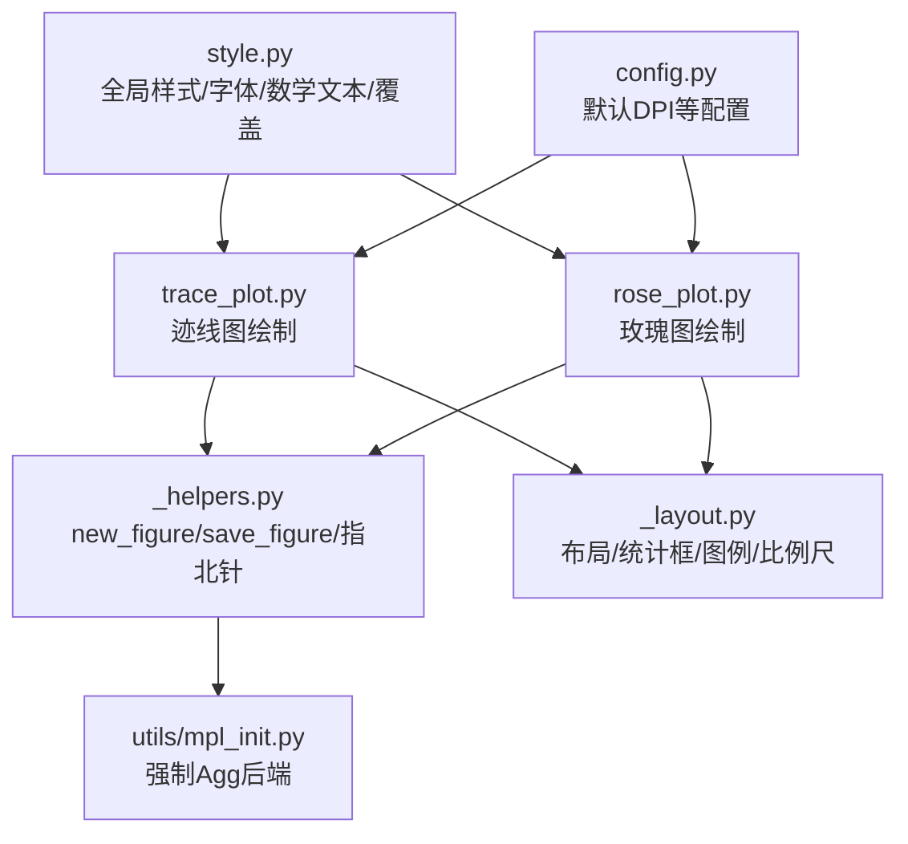
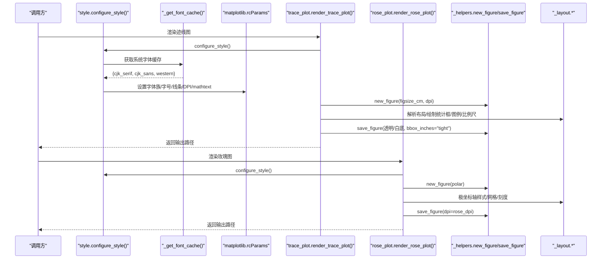
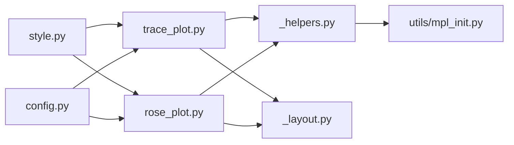

# 自定义样式配置

<cite>
**本文引用的文件**   
- [trace_pipeline/plotting/style.py](file://trace_pipeline/plotting/style.py)
- [trace_pipeline/plotting/trace_plot.py](file://trace_pipeline/plotting/trace_plot.py)
- [trace_pipeline/plotting/rose_plot.py](file://trace_pipeline/plotting/rose_plot.py)
- [trace_pipeline/plotting/_helpers.py](file://trace_pipeline/plotting/_helpers.py)
- [trace_pipeline/plotting/_layout.py](file://trace_pipeline/plotting/_layout.py)
- [trace_pipeline/utils/mpl_init.py](file://trace_pipeline/utils/mpl_init.py)
- [trace_pipeline/config.py](file://trace_pipeline/config.py)
</cite>

## 目录
1. [简介](#简介)
2. [项目结构](#项目结构)
3. [核心组件](#核心组件)
4. [架构总览](#架构总览)
5. [详细组件分析](#详细组件分析)
6. [依赖关系分析](#依赖关系分析)
7. [性能与导出优化](#性能与导出优化)
8. [常见问题排查](#常见问题排查)
9. [结论](#结论)
10. [附录：样式覆盖示例与最佳实践](#附录样式覆盖示例与最佳实践)

## 简介
本指南面向需要在 TracePipeline 中定制 matplotlib 全局样式的用户，涵盖字体栈选择算法、CJK 字体回退机制、数学文本字体设置、颜色方案定制（迹线、轮廓填充、玫瑰图配色）、标题与正文字体配置方法、Times New Roman 优先策略、宋体黑体搭配与字体权重控制、绘图尺寸与分辨率设置（DPI、页面布局、导出格式优化），并提供完整的样式覆盖示例代码路径、context manager 使用方法、线程安全考虑、样式继承机制以及常见样式问题的排查与解决方案。

## 项目结构
与样式系统直接相关的模块主要位于 plotting 与 utils 子包中：
- style.py：matplotlib 全局样式配置、字体栈与 CJK 回退、数学文本字体、样式覆盖上下文管理器
- trace_plot.py / rose_plot.py：具体绘图入口，调用样式配置并应用
- _helpers.py / _layout.py：通用辅助函数与布局工具，使用 heading/body 字体参数
- utils/mpl_init.py：强制非交互后端 Agg，避免多进程/后台线程冲突
- config.py：默认 DPI 等配置项来源（如 rose_dpi、trace_dpi）

图表来源
- [trace_pipeline/plotting/style.py:187-256](file://trace_pipeline/plotting/style.py#L187-L256)
- [trace_pipeline/plotting/trace_plot.py:443-565](file://trace_pipeline/plotting/trace_plot.py#L443-L565)
- [trace_pipeline/plotting/rose_plot.py:106-140](file://trace_pipeline/plotting/rose_plot.py#L106-L140)
- [trace_pipeline/plotting/_helpers.py:26-93](file://trace_pipeline/plotting/_helpers.py#L26-L93)
- [trace_pipeline/plotting/_layout.py:262-357](file://trace_pipeline/plotting/_layout.py#L262-L357)
- [trace_pipeline/utils/mpl_init.py:12-24](file://trace_pipeline/utils/mpl_init.py#L12-L24)
- [trace_pipeline/config.py:56-79](file://trace_pipeline/config.py#L56-L79)

章节来源
- [trace_pipeline/plotting/style.py:1-296](file://trace_pipeline/plotting/style.py#L1-L296)
- [trace_pipeline/plotting/trace_plot.py:1-565](file://trace_pipeline/plotting/trace_plot.py#L1-L565)
- [trace_pipeline/plotting/rose_plot.py:1-140](file://trace_pipeline/plotting/rose_plot.py#L1-L140)
- [trace_pipeline/plotting/_helpers.py:1-192](file://trace_pipeline/plotting/_helpers.py#L1-L192)
- [trace_pipeline/plotting/_layout.py:1-653](file://trace_pipeline/plotting/_layout.py#L1-L653)
- [trace_pipeline/utils/mpl_init.py:1-24](file://trace_pipeline/utils/mpl_init.py#L1-L24)
- [trace_pipeline/config.py:1-326](file://trace_pipeline/config.py#L1-L326)

## 核心组件
- 全局样式配置器 configure_style()：幂等初始化，设置字体族、字号、线条粗细、刻度样式、DPI、保存背景色、标题字重等；同时配置 mathtext 字体集以统一数学文本中的英文、数字与单位字体。
- 字体栈与回退：通过缓存系统可用字体，构建西文优先 Times New Roman、中文优先宋体的组合栈；标题使用黑体字形但避免请求缺失的 bold 字重，减少 findfont 警告。
- 样式覆盖上下文管理器 apply_style_overrides()：线程安全地临时覆盖模块级样式常量（迹线颜色、宽度、凸包/圆窗填充与边线、玫瑰图柱体颜色/边线/网格色等），并在退出时自动恢复；支持 label_font_size/global_font_size 覆盖 rcParams 字号。
- 绘图入口：trace_plot.render_trace_plot 与 rose_plot.render_rose_plot 在开始处调用 configure_style()，确保样式一致。
- 辅助与布局：_helpers.new_figure/save_figure 负责创建与保存图形，支持透明背景与原子写入；_layout 提供统计框、图例、比例尺等布局与样式工具，统一使用 heading/body 字体参数。
- 后端强制：mpl_init.force_noninteractive_backend() 将后端设为 Agg，避免 GUI 后端在多进程/后台线程下冲突。

章节来源
- [trace_pipeline/plotting/style.py:187-296](file://trace_pipeline/plotting/style.py#L187-L296)
- [trace_pipeline/plotting/trace_plot.py:443-565](file://trace_pipeline/plotting/trace_plot.py#L443-L565)
- [trace_pipeline/plotting/rose_plot.py:106-140](file://trace_pipeline/plotting/rose_plot.py#L106-L140)
- [trace_pipeline/plotting/_helpers.py:26-93](file://trace_pipeline/plotting/_helpers.py#L26-L93)
- [trace_pipeline/plotting/_layout.py:262-357](file://trace_pipeline/plotting/_layout.py#L262-L357)
- [trace_pipeline/utils/mpl_init.py:12-24](file://trace_pipeline/utils/mpl_init.py#L12-L24)

## 架构总览
下图展示了样式配置在绘图流程中的位置与关键数据流：

图表来源
- [trace_pipeline/plotting/style.py:187-256](file://trace_pipeline/plotting/style.py#L187-L256)
- [trace_pipeline/plotting/trace_plot.py:443-565](file://trace_pipeline/plotting/trace_plot.py#L443-L565)
- [trace_pipeline/plotting/rose_plot.py:106-140](file://trace_pipeline/plotting/rose_plot.py#L106-L140)
- [trace_pipeline/plotting/_helpers.py:26-93](file://trace_pipeline/plotting/_helpers.py#L26-L93)
- [trace_pipeline/plotting/_layout.py:262-357](file://trace_pipeline/plotting/_layout.py#L262-L357)

## 详细组件分析

### 全局样式配置器 configure_style()
- 幂等性与线程安全：使用 RLock 与双检锁，避免重复配置与竞态条件。
- 字体族设置：
  - 正文：优先 Times New Roman，其次宋体，再回退到可用的 CJK 衬线/无衬线及 serif。
  - 标题：优先 Times New Roman，其次黑体，再回退到 CJK 无衬线/衬线与 sans-serif。
  - 通过 _preferred_font_stack 去重合并，保证稳定顺序。
- 字号与线条：
  - 默认 font.size=8.5，axes.linewidth=0.75，tick 宽度与大小、lines.linewidth/markersize 等按论文风格设定。
- DPI 与导出：
  - figure.dpi/savefig.dpi=300，savefig.facecolor="white"。
- 数学文本字体：
  - mathtext.fontset="custom"，rm/it/bf/sf/cal/tt/default 均指向可用西文字体（优先 Times New Roman），避免数学公式中英文与单位出现不一致。
- 标题字重：
  - axes.titleweight/figure.titleweight 设置为 normal，避免 CJK 字体缺少 bold 导致 findfont 反复回退噪声。

章节来源
- [trace_pipeline/plotting/style.py:187-256](file://trace_pipeline/plotting/style.py#L187-L256)

### 字体栈选择算法与 CJK 回退机制
- 字体缓存：_get_font_cache() 扫描系统字体，优先选择 regular weight（style="normal", weight=400）的候选字体，否则回退到可用字体集合。
- 候选列表：
  - 西文：Times New Roman → Liberation Serif → DejaVu Serif → serif
  - CJK 衬体：SimSun → Noto Serif SC → STSong → FangSong
  - CJK 无衬体：SimHei → Microsoft YaHei → Noto Sans CJK SC → Source Han Sans SC → WenQuanYi Micro Hei → Arial Unicode MS → sans-serif
- 合并策略：_preferred_font_stack 将西文主字体与 CJK 主字体置于最前，随后拼接 western/cjk_serif/cjk_sans，最后追加 serif，并通过 _dedupe_fonts 去重。
- 标题与正文差异：
  - 标题使用 heading_font_kwargs，优先 Times New Roman + SimHei，然后 western/cjk_sans/cjk_serif + sans-serif。
  - 正文使用 body_font_kwargs，优先 Times New Roman + SimSun，然后 western/cjk_serif/cjk_sans + serif。
- 字体权重控制：
  - 对标题若请求 bold/semibold/heavy/black，会将其替换为 normal，以避免 CJK 字体缺失字重导致的警告。

章节来源
- [trace_pipeline/plotting/style.py:82-173](file://trace_pipeline/plotting/style.py#L82-L173)

### 数学文本字体设置
- 通过 mathtext.custom 配置，将 rm/it/bf/sf/cal/tt/default 全部映射到可用西文字体（优先 Times New Roman）。
- 效果：数学公式中的英文、数字与单位与正文西文字体保持一致，避免混用不同字体造成视觉不一致。

章节来源
- [trace_pipeline/plotting/style.py:221-233](file://trace_pipeline/plotting/style.py#L221-L233)

### 颜色方案定制（迹线、轮廓填充、玫瑰图）
- 可覆盖的样式键（由 apply_style_overrides 注册）：
  - 迹线：trace_line_color、trace_line_width
  - 凸包：hull_line_color、hull_fill_color、hull_fill_alpha
  - 圆窗：circle_window_line_color、circle_window_fill_color、circle_window_fill_alpha
  - 玫瑰图：rose_bar_color、rose_bar_edge、rose_grid_color
- 这些键在运行时动态映射到对应模块的模块级常量（trace_plot 或 rose_plot），在 context manager 作用域内生效，退出后自动恢复。

章节来源
- [trace_pipeline/plotting/style.py:22-35](file://trace_pipeline/plotting/style.py#L22-L35)
- [trace_pipeline/plotting/trace_plot.py:48-70](file://trace_pipeline/plotting/trace_plot.py#L48-L70)
- [trace_pipeline/plotting/rose_plot.py:19-24](file://trace_pipeline/plotting/rose_plot.py#L19-L24)

### 标题与正文字体配置方法
- 标题：heading_font_kwargs 返回包含 fontfamily 与字体权重控制的字典，供 suptitle 或标题文本使用。
- 正文：body_font_kwargs 返回正文字体族字典，用于统计框、图例、比例尺标签等。
- Times New Roman 优先策略：
  - 正文与标题均将 Times New Roman 置于首选位置，确保西文与数字呈现一致。
- 宋体黑体搭配：
  - 正文优先宋体（SimSun），标题优先黑体（SimHei），兼顾可读性与学术规范。
- 字体权重控制：
  - 标题即使传入 bold 也会降级为 normal，避免 CJK 字体缺失字重引发的警告。

章节来源
- [trace_pipeline/plotting/style.py:135-173](file://trace_pipeline/plotting/style.py#L135-L173)
- [trace_pipeline/plotting/_layout.py:262-357](file://trace_pipeline/plotting/_layout.py#L262-L357)

### 绘图尺寸与分辨率设置（DPI、页面布局、导出格式优化）
- DPI 配置：
  - 全局默认 figure.dpi/savefig.dpi=300。
  - 各绘图入口支持独立 dpi 参数：trace_plot 默认 300，rose_plot 默认 400；也可从配置中读取 rose_dpi/trace_dpi。
- 页面布局：
  - _layout._resolve_layout 根据标题行数调整外框顶部位置，统计框占据右上区域，图例自适应高度，比例尺带固定底部。
  - 迹线图支持自适应 figsize_cm，使 1m 物理长度在不同图中尽量一致。
- 导出格式优化：
  - save_figure 支持透明背景（alpha==0.0）与白底两种模式，采用原子写入（先写 .tmp 再 replace）避免中断损坏。
  - bbox_inches="tight" 与 pad_inches 控制裁剪与留白。

章节来源
- [trace_pipeline/plotting/style.py:234-249](file://trace_pipeline/plotting/style.py#L234-L249)
- [trace_pipeline/plotting/_helpers.py:26-93](file://trace_pipeline/plotting/_helpers.py#L26-L93)
- [trace_pipeline/plotting/_layout.py:362-392](file://trace_pipeline/plotting/_layout.py#L362-L392)
- [trace_pipeline/plotting/trace_plot.py:420-441](file://trace_pipeline/plotting/trace_plot.py#L420-L441)
- [trace_pipeline/config.py:56-79](file://trace_pipeline/config.py#L56-L79)

### 样式覆盖示例与上下文管理器用法
- 使用 apply_style_overrides 临时覆盖样式：
  - 覆盖迹线颜色与宽度、凸包/圆窗填充与边线、玫瑰图柱体颜色/边线/网格色。
  - 覆盖 label_font_size 或 global_font_size 以调整全局字号。
- 线程安全：
  - 内部使用 RLock 保护，嵌套调用不会死锁；在 finally 块中确保 orig 状态恢复。
- 样式继承机制：
  - 覆盖仅作用于当前上下文，退出后恢复至原值；不影响其他线程或后续调用。

章节来源
- [trace_pipeline/plotting/style.py:258-296](file://trace_pipeline/plotting/style.py#L258-L296)

## 依赖关系分析
- style.py 被 trace_plot.py 与 rose_plot.py 导入，作为全局样式与字体配置的单一来源。
- _helpers.py 与 _layout.py 被 trace_plot.py 与 rose_plot.py 复用，提供统一的 Figure 创建、保存与布局工具。
- mpl_init.py 在 _helpers.py 导入时即执行 force_noninteractive_backend()，确保后端为 Agg。
- config.py 提供默认 DPI 等配置项，供上层服务或 CLI 覆盖。

图表来源
- [trace_pipeline/plotting/style.py:187-296](file://trace_pipeline/plotting/style.py#L187-L296)
- [trace_pipeline/plotting/trace_plot.py:1-565](file://trace_pipeline/plotting/trace_plot.py#L1-L565)
- [trace_pipeline/plotting/rose_plot.py:1-140](file://trace_pipeline/plotting/rose_plot.py#L1-L140)
- [trace_pipeline/plotting/_helpers.py:1-192](file://trace_pipeline/plotting/_helpers.py#L1-L192)
- [trace_pipeline/plotting/_layout.py:1-653](file://trace_pipeline/plotting/_layout.py#L1-L653)
- [trace_pipeline/utils/mpl_init.py:1-24](file://trace_pipeline/utils/mpl_init.py#L1-L24)
- [trace_pipeline/config.py:1-326](file://trace_pipeline/config.py#L1-L326)

章节来源
- [trace_pipeline/plotting/style.py:1-296](file://trace_pipeline/plotting/style.py#L1-L296)
- [trace_pipeline/plotting/trace_plot.py:1-565](file://trace_pipeline/plotting/trace_plot.py#L1-L565)
- [trace_pipeline/plotting/rose_plot.py:1-140](file://trace_pipeline/plotting/rose_plot.py#L1-L140)
- [trace_pipeline/plotting/_helpers.py:1-192](file://trace_pipeline/plotting/_helpers.py#L1-L192)
- [trace_pipeline/plotting/_layout.py:1-653](file://trace_pipeline/plotting/_layout.py#L1-L653)
- [trace_pipeline/utils/mpl_init.py:1-24](file://trace_pipeline/utils/mpl_init.py#L1-L24)
- [trace_pipeline/config.py:1-326](file://trace_pipeline/config.py#L1-L326)

## 性能与导出优化
- 字体扫描缓存：_get_font_cache() 使用 lru_cache(maxsize=1)，仅扫描一次系统字体，避免重复开销。
- 非交互后端：force_noninteractive_backend() 强制 Agg，避免 GUI 后端在多进程/后台线程下的冲突与额外开销。
- 原子写入：save_figure 先写临时文件再 replace，提升并发安全性与完整性。
- 自适应尺寸：迹线图根据数据范围计算 figsize_cm，保持 1m 物理长度一致性，利于面积比较。
- 建议：
  - 批量导出时统一 DPI（例如 600），结合 bbox_inches="tight" 与 pad_inches 控制留白。
  - 需要透明背景叠加时，传入 background_color="transparent" 并确保 save_figure 检测到 alpha==0.0。

[本节为通用指导，不直接分析具体文件]

## 常见问题排查
- 中文显示异常或乱码：
  - 确认系统已安装 SimSun/SimHei/Noto 系列字体；configure_style() 会在未检测到目标字体时记录警告日志。
  - 检查 matplotlib.rcParams["font.family"] 是否已被正确设置为期望的字体栈。
- 数学公式字体不一致：
  - 确认 mathtext.fontset="custom" 且 rm/it/bf/sf/cal/tt/default 指向可用西文字体。
- 标题 bold 警告过多：
  - 标题字体权重会被降级为 normal，避免 CJK 字体缺失 bold 字重导致的 findfont 警告。
- 多线程/多进程绘图崩溃：
  - 确保在导入绘图模块前已调用 force_noninteractive_backend()，后端设为 Agg。
- 样式覆盖未生效或泄漏：
  - 使用 apply_style_overrides 上下文管理器，确保在 finally 中恢复原值；避免手动修改模块级常量。
- 导出文件不完整：
  - save_figure 使用原子写入，若仍出现损坏，检查磁盘权限与并发写入情况。

章节来源
- [trace_pipeline/plotting/style.py:216-220](file://trace_pipeline/plotting/style.py#L216-L220)
- [trace_pipeline/plotting/style.py:258-296](file://trace_pipeline/plotting/style.py#L258-L296)
- [trace_pipeline/plotting/_helpers.py:12-24](file://trace_pipeline/plotting/_helpers.py#L12-L24)
- [trace_pipeline/plotting/_helpers.py:42-93](file://trace_pipeline/plotting/_helpers.py#L42-L93)

## 结论
TracePipeline 的样式系统围绕 style.py 构建，提供幂等、线程安全的 matplotlib 全局样式配置，完善的字体栈与 CJK 回退机制，以及针对数学文本的统一字体设置。通过 apply_style_overrides 上下文管理器，用户可以安全地在局部作用域内定制颜色与字号，而不影响全局或其他线程。配合 _helpers 与 _layout 提供的布局与导出工具，可在保证学术规范的同时实现灵活的可视化定制。

[本节为总结性内容，不直接分析具体文件]

## 附录：样式覆盖示例与最佳实践
- 覆盖迹线与凸包/圆窗颜色：
  - 参考路径：[apply_style_overrides 使用示例:87-90](file://tests/test_plotting.py#L87-L90)
- 覆盖玫瑰图配色：
  - 参考路径：[rose_plot 模块级常量定义:19-24](file://trace_pipeline/plotting/rose_plot.py#L19-L24)
- 覆盖全局字号：
  - 参考路径：[apply_style_overrides 处理 label_font_size/global_font_size:279-286](file://trace_pipeline/plotting/style.py#L279-L286)
- 线程安全注意事项：
  - 参考路径：[RLock 与 double-checked locking](file://trace_pipeline/plotting/style.py:187-256)
- 最佳实践：
  - 在应用启动时调用 configure_style() 一次即可；后续绘图无需重复配置。
  - 使用 apply_style_overrides 进行局部覆盖，避免污染全局样式。
  - 批量导出时统一 DPI 与 bbox_inches，必要时启用透明背景以支持叠加。

章节来源
- [trace_pipeline/plotting/style.py:258-296](file://trace_pipeline/plotting/style.py#L258-L296)
- [trace_pipeline/plotting/rose_plot.py:19-24](file://trace_pipeline/plotting/rose_plot.py#L19-L24)
- [tests/test_plotting.py:87-90](file://tests/test_plotting.py#L87-L90)