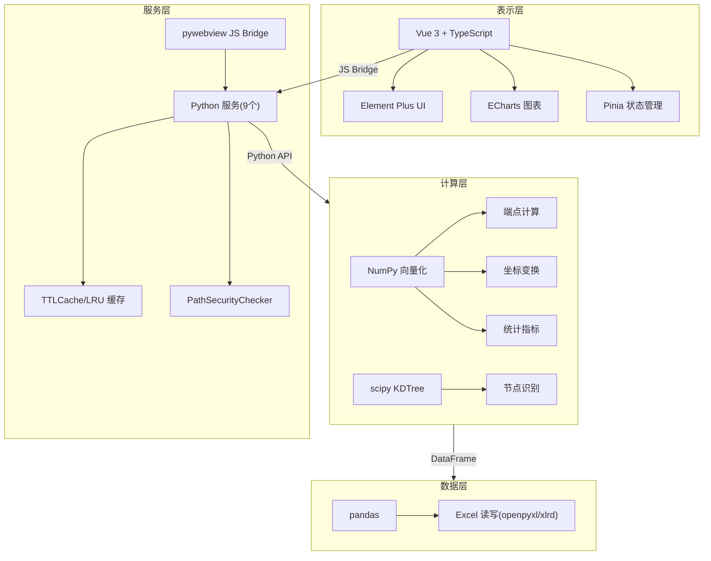
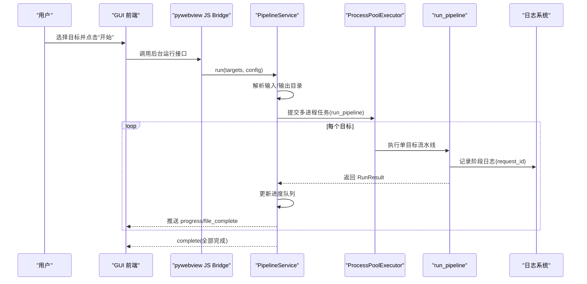
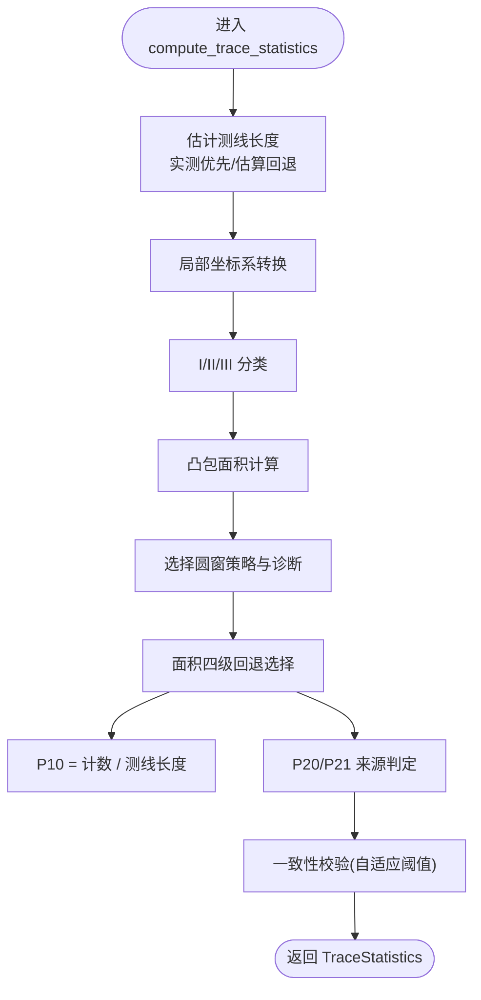
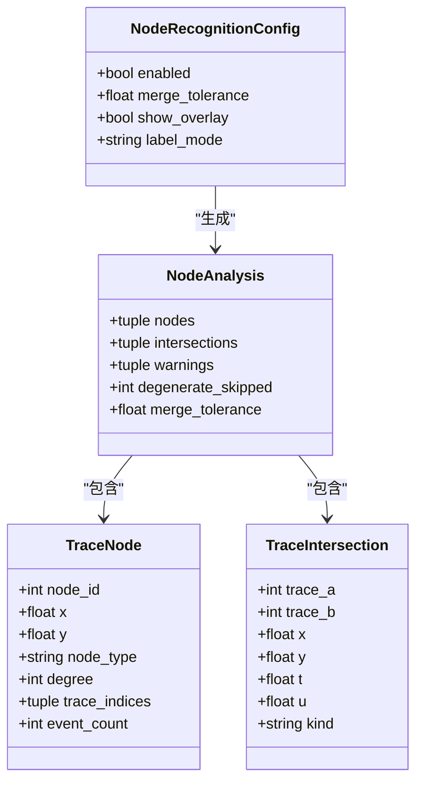
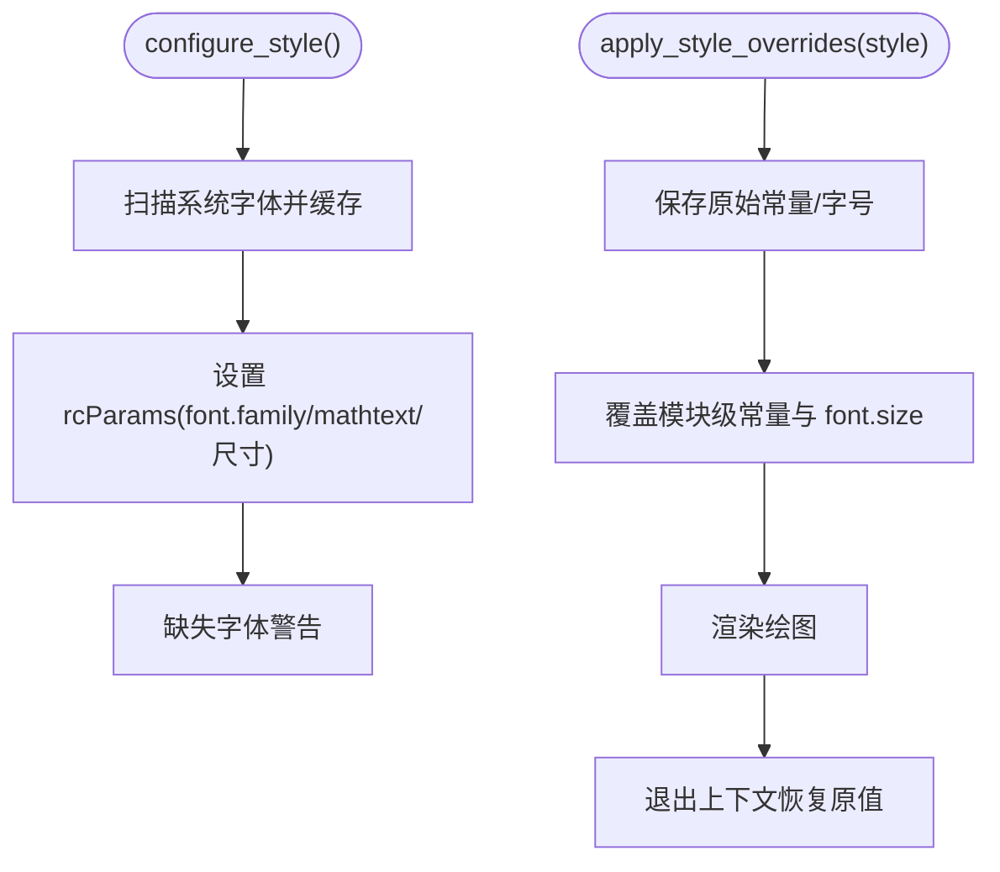
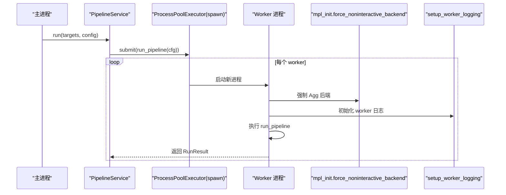
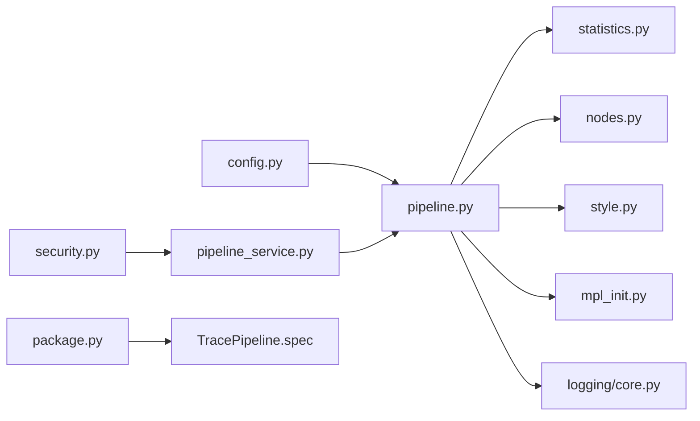
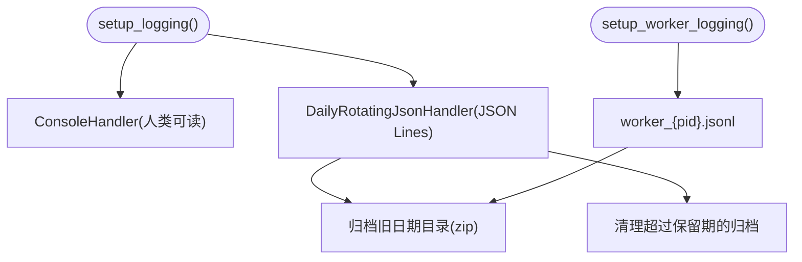
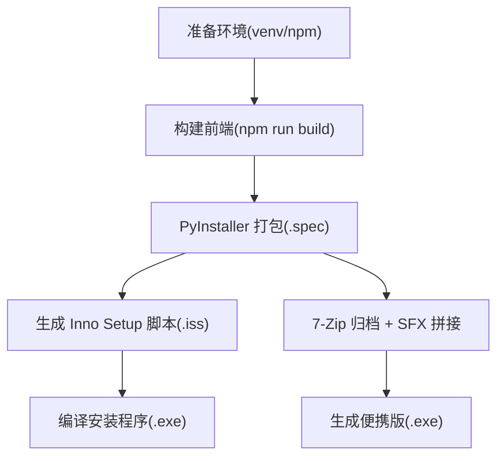

# 高级主题

<cite>
**本文引用的文件**   
- [README.md](file://README.md)
- [pipeline.py](file://trace_pipeline/pipeline.py)
- [config.py](file://trace_pipeline/config.py)
- [TracePipeline.spec](file://TracePipeline.spec)
- [package.py](file://scripts/package.py)
- [numpy_compat.py](file://trace_pipeline/utils/numpy_compat.py)
- [security.py](file://backend/utils/security.py)
- [core.py](file://trace_pipeline/logging/core.py)
- [style.py](file://trace_pipeline/plotting/style.py)
- [_window_strategies.py](file://trace_pipeline/geology/_window_strategies.py)
- [mpl_init.py](file://trace_pipeline/utils/mpl_init.py)
- [pipeline_service.py](file://backend/services/pipeline_service.py)
- [nodes.py](file://trace_pipeline/analysis/nodes.py)
- [statistics.py](file://trace_pipeline/geology/statistics.py)
- [config.example.json](file://config.example.json)
</cite>

## 目录
1. [简介](#简介)
2. [项目结构](#项目结构)
3. [核心组件](#核心组件)
4. [架构总览](#架构总览)
5. [详细组件分析](#详细组件分析)
6. [依赖关系分析](#依赖关系分析)
7. [性能优化指南](#性能优化指南)
8. [安全配置指南](#安全配置指南)
9. [日志与调试](#日志与调试)
10. [打包与分发](#打包与分发)
11. [扩展开发指南](#扩展开发指南)
12. [故障排除](#故障排除)
13. [结论](#结论)

## 简介
本高级主题文档面向有经验的开发者与高级用户，聚焦 TracePipeline 在性能、样式、安全、日志、打包与扩展方面的深度实践。内容涵盖：
- NumPy 向量化编程、内存管理与并行处理配置
- matplotlib 样式覆盖、颜色方案定制、字体设置
- 路径遍历防护、外部域名白名单、图片格式校验等安全措施
- JSON Lines 日志、request_id 追踪、性能分析工具
- PyInstaller + Inno Setup + 7-Zip SFX 的打包流程
- 新增圆窗策略、节点识别算法、绘图样式的扩展方法

## 项目结构
TracePipeline 采用四层架构（表示层、服务层、计算层、数据层），前后端通过 pywebview JS Bridge 通信，后端以多个 Python 服务模块组织，计算层以纯函数与向量化实现为主，数据层基于 pandas/openpyxl/xlrd 完成 Excel 读写。

图示来源
- [README.md:170-237](file://README.md#L170-L237)

章节来源
- [README.md:170-237](file://README.md#L170-L237)

## 核心组件
- 流水线编排：加载 → 坐标变换+统计 → 节点识别 → Excel 导出 → 绘图
- 配置系统：JSON 配置合并、CLI 覆盖、路径解析与工作区保障
- 样式系统：matplotlib 全局样式与运行时覆盖，CJK 字体回退链
- 安全校验：路径遍历防护、设备名过滤、URL 递归解码
- 日志系统：JSON Lines、按日轮转、worker 独立文件、归档压缩
- 并行执行：ProcessPoolExecutor + spawn 上下文，自动 CPU 数裁剪
- 打包分发：PyInstaller 规格、Inno Setup 脚本、7-Zip SFX 便捷版

章节来源
- [pipeline.py:230-474](file://trace_pipeline/pipeline.py#L230-L474)
- [config.py:86-190](file://trace_pipeline/config.py#L86-L190)
- [style.py:187-256](file://trace_pipeline/plotting/style.py#L187-L256)
- [security.py:47-128](file://backend/utils/security.py#L47-L128)
- [core.py:148-305](file://trace_pipeline/logging/core.py#L148-L305)
- [pipeline_service.py:146-220](file://backend/services/pipeline_service.py#L146-L220)
- [TracePipeline.spec:38-114](file://TracePipeline.spec#L38-L114)
- [package.py:306-353](file://scripts/package.py#L306-L353)

## 架构总览
下图展示 GUI 启动到流水线执行的端到端调用序列，包括并行任务提交、结果聚合与进度推送。

图示来源
- [pipeline_service.py:100-220](file://backend/services/pipeline_service.py#L100-L220)
- [pipeline.py:230-330](file://trace_pipeline/pipeline.py#L230-L330)
- [core.py:326-398](file://trace_pipeline/logging/core.py#L326-L398)

## 详细组件分析

### 流水线与统计计算
- 五阶段流水线：数据加载、坐标变换与统计、节点识别、Excel 导出、绘图
- 统计计算包含测线长度估计、迹长来源回退、面积四级回退（实测→凸包→缓冲凸包→圆窗等效）
- 圆窗策略支持 tangent/hybrid/concentric/auto，auto 模式基于密度阈值与评分选择

图示来源
- [statistics.py:212-391](file://trace_pipeline/geology/statistics.py#L212-L391)
- [_window_strategies.py:173-185](file://trace_pipeline/geology/_window_strategies.py#L173-L185)

章节来源
- [pipeline.py:230-474](file://trace_pipeline/pipeline.py#L230-L474)
- [statistics.py:212-391](file://trace_pipeline/geology/statistics.py#L212-L391)
- [_window_strategies.py:52-185](file://trace_pipeline/geology/_window_strategies.py#L52-L185)

### 节点识别算法
- 基于线段相交检测与空间网格聚类，识别 I/Y/X 型节点
- 使用并查集进行候选点传递性合并，降低 O(N^2) 比较开销
- 退化线段过滤与自适应聚类容差提升鲁棒性

图示来源
- [nodes.py:160-417](file://trace_pipeline/analysis/nodes.py#L160-L417)

章节来源
- [nodes.py:160-417](file://trace_pipeline/analysis/nodes.py#L160-L417)

### 样式系统与字体回退
- 全局样式幂等配置，标题与正文分别构建字体栈
- 运行时 apply_style_overrides 线程安全覆盖颜色、线宽、字号等
- CJK 字体优先宋体/黑体，西文优先 Times New Roman，缺失时回退可用字体

图示来源
- [style.py:187-256](file://trace_pipeline/plotting/style.py#L187-L256)
- [style.py:258-296](file://trace_pipeline/plotting/style.py#L258-L296)

章节来源
- [style.py:187-296](file://trace_pipeline/plotting/style.py#L187-L296)

### 并行处理与进程隔离
- PipelineService 使用 ProcessPoolExecutor + spawn 上下文，workers 由 parallel_workers 或 CPU 数决定
- 子进程内强制 Agg 后端、独立日志初始化，避免 GUI 后端冲突与重复 handler
- 优雅关闭：shutdown_event 提前取消剩余任务，join 等待写入完成

图示来源
- [pipeline_service.py:146-220](file://backend/services/pipeline_service.py#L146-L220)
- [mpl_init.py:12-24](file://trace_pipeline/utils/mpl_init.py#L12-L24)
- [core.py:401-449](file://trace_pipeline/logging/core.py#L401-L449)

章节来源
- [pipeline_service.py:146-220](file://backend/services/pipeline_service.py#L146-L220)
- [mpl_init.py:12-24](file://trace_pipeline/utils/mpl_init.py#L12-L24)
- [core.py:401-449](file://trace_pipeline/logging/core.py#L401-L449)

## 依赖关系分析
- 服务层依赖配置与安全校验；计算层依赖 NumPy/scipy/shapely；数据层依赖 pandas/openpyxl/xlrd
- 打包阶段需显式声明隐藏导入，确保惰性加载模块被收集

图示来源
- [config.py:86-190](file://trace_pipeline/config.py#L86-L190)
- [security.py:47-128](file://backend/utils/security.py#L47-L128)
- [pipeline_service.py:100-220](file://backend/services/pipeline_service.py#L100-L220)
- [pipeline.py:230-330](file://trace_pipeline/pipeline.py#L230-L330)
- [statistics.py:212-391](file://trace_pipeline/geology/statistics.py#L212-L391)
- [nodes.py:160-417](file://trace_pipeline/analysis/nodes.py#L160-L417)
- [style.py:187-296](file://trace_pipeline/plotting/style.py#L187-L296)
- [mpl_init.py:12-24](file://trace_pipeline/utils/mpl_init.py#L12-L24)
- [core.py:326-398](file://trace_pipeline/logging/core.py#L326-L398)
- [package.py:306-353](file://scripts/package.py#L306-L353)
- [TracePipeline.spec:38-114](file://TracePipeline.spec#L38-L114)

## 性能优化指南
- NumPy 向量化
  - 使用广播与布尔 mask 替代循环分支，减少 Python 层开销
  - 将 numpy/pandas 类型转换为原生类型用于 JSON 序列化与日志，避免序列化失败
- 内存管理
  - 不可变数据模型与 writeable=False 数组防止意外修改
  - 大对象及时释放，避免长时间持有引用导致内存峰值
- 并行处理配置
  - parallel_workers=0 自动取 CPU 数，<=1 串行，>1 指定进程数
  - 小目标数默认降级为串行以减少进程间开销
- 绘图 DPI 与批量渲染
  - 合理设置 trace_dpi/rotated_trace_dpi/rose_dpi，避免过高 DPI 导致 IO 瓶颈
  - 批量任务中复用样式配置，减少重复初始化

章节来源
- [numpy_compat.py:15-57](file://trace_pipeline/utils/numpy_compat.py#L15-L57)
- [pipeline_service.py:146-175](file://backend/services/pipeline_service.py#L146-L175)
- [config.example.json:1-26](file://config.example.json#L1-L26)

## 安全配置指南
- 路径遍历防护
  - URL 递归解码后再次检查 ".."，拒绝 Windows 设备名路径段
  - resolve() 跟随符号链接后限制在 base 目录下
- 外部域名白名单
  - 对外部资源访问应维护白名单并在请求前校验域名
- 图片格式校验
  - 对上传/读取的图片进行扩展名与 MIME 校验，限制大小，防止 XSS 与 DoS

章节来源
- [security.py:47-128](file://backend/utils/security.py#L47-L128)

## 日志与调试
- JSON Lines 格式
  - JsonFormatter 输出标准 JSON 行，自动剔除 NaN/inf，兼容 numpy 类型
- 按日轮转与归档
  - DailyRotatingJsonHandler 按天目录存储，旧目录打包 zip 并清理超期归档
- request_id 全链路追踪
  - LogContext 注入 request_id，跨进程/线程传播，便于定位问题
- 性能分析
  - 利用 extra 字段记录 stage/duration_ms 等指标，结合外部 APM 或日志分析工具

图示来源
- [core.py:326-398](file://trace_pipeline/logging/core.py#L326-L398)
- [core.py:401-449](file://trace_pipeline/logging/core.py#L401-L449)
- [core.py:148-305](file://trace_pipeline/logging/core.py#L148-L305)

章节来源
- [core.py:148-305](file://trace_pipeline/logging/core.py#L148-L305)
- [core.py:326-398](file://trace_pipeline/logging/core.py#L326-L398)
- [core.py:401-449](file://trace_pipeline/logging/core.py#L401-L449)

## 打包与分发
- PyInstaller 规格
  - 显式声明 hiddenimports，确保惰性加载模块被收集
  - 绑定静态资源与图标，剥离控制台窗口
- Inno Setup 安装程序
  - 自动生成 .iss 脚本，支持中文语言包，创建快捷方式与卸载入口
- 7-Zip SFX 便携版
  - 最高压缩比归档，拼接 SFX 模块与配置文件生成自解压 exe

图示来源
- [TracePipeline.spec:38-114](file://TracePipeline.spec#L38-L114)
- [package.py:306-353](file://scripts/package.py#L306-L353)
- [package.py:356-474](file://scripts/package.py#L356-L474)
- [package.py:478-563](file://scripts/package.py#L478-L563)

章节来源
- [TracePipeline.spec:38-114](file://TracePipeline.spec#L38-L114)
- [package.py:306-353](file://scripts/package.py#L306-L353)
- [package.py:356-474](file://scripts/package.py#L356-L474)
- [package.py:478-563](file://scripts/package.py#L478-L563)

## 扩展开发指南
- 添加新的圆窗策略
  - 在 _window_strategies.py 中新增策略函数，注册到 compute_circle_windows 分发逻辑
  - 在 statistics.py 的策略选择与评分中纳入新策略的诊断结果
- 新增节点识别算法
  - 在 analysis/nodes.py 中实现新的识别流程，保持返回 NodeAnalysis 结构
  - 调整聚类容差与拓扑分类逻辑，确保与现有覆盖层绘制兼容
- 自定义绘图样式
  - 在 style.py 的 _STYLE_CONSTANTS 中注册新的样式键，供 apply_style_overrides 覆盖
  - 在配置文件的 style 字典中提供覆盖项，或在 GUI 配置界面动态设置

章节来源
- [_window_strategies.py:173-185](file://trace_pipeline/geology/_window_strategies.py#L173-L185)
- [statistics.py:212-391](file://trace_pipeline/geology/statistics.py#L212-L391)
- [nodes.py:160-417](file://trace_pipeline/analysis/nodes.py#L160-L417)
- [style.py:23-35](file://trace_pipeline/plotting/style.py#L23-L35)
- [style.py:258-296](file://trace_pipeline/plotting/style.py#L258-L296)

## 故障排除
- 文件占用或权限不足
  - 现象：PermissionError 提示文件被占用
  - 处理：关闭 Excel/WPS 后再试；检查输出目录权限
- 输入文件不存在
  - 现象：FileNotFoundError
  - 处理：确认 input_dir 与 table_stem/outcrop 匹配的文件存在
- 并行执行异常
  - 现象：子进程崩溃或无输出
  - 处理：检查 parallel_workers 与 CPU 核心数；查看 worker 日志文件
- 样式未生效
  - 现象：颜色/字体未按配置变化
  - 处理：确认 style 键已注册且处于 apply_style_overrides 作用域内
- 打包产物缺失
  - 现象：缺少静态文件或第三方声明
  - 处理：确认前端已构建、图标与法律声明文件存在

章节来源
- [pipeline.py:450-474](file://trace_pipeline/pipeline.py#L450-L474)
- [core.py:148-305](file://trace_pipeline/logging/core.py#L148-L305)
- [style.py:258-296](file://trace_pipeline/plotting/style.py#L258-L296)
- [package.py:306-353](file://scripts/package.py#L306-L353)

## 结论
TracePipeline 在工程化落地方面具备完善的分层架构、严格的类型与安全检查、健壮的日志体系与可复用的打包流程。通过 NumPy 向量化、合理的并行配置与样式覆盖机制，可在保证正确性的同时获得良好的性能与可视化效果。扩展点清晰，便于按需增强圆窗策略、节点识别与绘图样式。