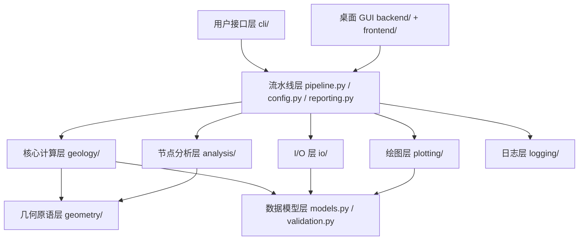

# 岩体节理测线坐标计算与绘图工具

> **版本**: v4.0.0 | **语言**: Python >= 3.10 | **许可证**: MIT

基于 Python 的岩体节理测线法数据处理与可视化系统，支持 **CLI 命令行**与**桌面 GUI（pywebview + Vue 3）**双模式。以北山沙枣园花岗岩体 8 个露头（O76-O83）的 172 条节理迹线为数据基础，将 MATLAB 原型算法完整移植为工程化 Python 代码。适用于岩体节理几何特征分析。项目同时提供 **PyInstaller + Inno Setup** 一键打包能力，可生成 Windows 安装程序和免安装便携版。

**核心流水线**：综合法复数向量化端点计算 → 坐标平移与旋转标准化 → I/II/III 型自动分类 → 测线长度估算 → 凸包/缓冲凸包露头面积 → 圆形取样窗法 4 策略自适应（tangent/hybrid/concentric + auto 6 因子加权评分）→ P10/P20/P21 密度统计（实测优先四级回退）→ Mauldon 迹长估计（三级回退：测段→端点→圆窗）→ 窗口一致性校验（自适应阈值）→ 节点识别（I/Y/X 拓扑分类，空间网格聚类 + 并查集）→ 多工作表 Excel 导出（6-9 sheet）→ 迹线图（含比例尺、指北针、LaTeX 统计信息框、凸包/圆窗/节点覆盖层、自动避让布局）→ 玫瑰花瓣图。

---

## 目录结构

```
.
├── config.example.json                 # 配置模板；运行 GUI 时会自动生成本地 config.json
├── pyproject.toml                      # 项目元数据与依赖（含 CLI 入口）
├── run_trace_pipeline.py               # CLI 入口脚本
├── run_gui.py                          # GUI 入口脚本
│
├── trace_pipeline/                     # 核心计算包（51 .py 文件：9 __init__ + 42 业务模块）
│   ├── __init__.py                     # 顶层公开 API（20 个导出，3 惰性导入）
│   ├── __main__.py                     # python -m trace_pipeline 入口
│   ├── models.py                       # TraceData / RunConfig / RunResult
│   ├── config.py                       # 配置加载、校验、路径解析
│   ├── validation.py                   # 校验与类型强制转换工具
│   ├── pipeline.py                     # 单目标全流程编排（5 阶段）
│   ├── reporting.py                    # 结果格式化与汇总报告
│   │
│   ├── geology/                        # 地质/几何算法（纯函数，无 I/O）
│   │   ├── __init__.py                 # 子包导出
│   │   ├── angles.py                   # 倾向⇄走向、折叠、半平面
│   │   ├── endpoints.py                # 迹线端点向量化计算（复数运算）
│   │   ├── transforms.py               # 坐标平移与旋转变换
│   │   ├── statistics.py               # 统计编排层：P10/P20/P21 + 迹线分型
│   │   ├── _stat_types.py              #   └─ 统计数据类（TraceStatistics 等，25 字段+1属性）
│   │   ├── _stat_format.py             #   └─ LaTeX 统计信息框格式化
│   │   ├── _circle_window.py           #   └─ 圆窗计数 + I/II/III 型分类
│   │   ├── _convex_hull.py             #   └─ 凸包面积（Andrew 单调链算法）+ 缓冲凸包
│   │   ├── _window_strategies.py       #   └─ tangent/hybrid/concentric 策略布局
│   │   ├── _window_scoring.py          #   └─ auto 策略 6 因子加权评分与选择
│   │
│   ├── analysis/                       # 节点识别分析
│   │   ├── __init__.py                 # 子包导出
│   │   ├── models.py                   # NodeRecognitionConfig / TraceNode / TraceIntersection / NodeAnalysis
│   │   └── nodes.py                    # 节点识别算法（空间网格聚类 + I/Y/X 拓扑分类）
│   │
│   ├── geometry/                       # 几何原语
│   │   ├── __init__.py                 # 子包导出
│   │   └── segments.py                 # 线段相交、叉积、参数化交点、点到线段距离
│   │
│   ├── io/                             # I/O 层
│   │   ├── __init__.py                 # 子包导出（含 TraceFile、ExcelLayout）
│   │   ├── excel_reader.py             # Excel 读取（.xlsx/.xls 回退）
│   │   ├── excel_writer.py             # 多工作表布局写入（6-9 sheet）
│   │   └── discovery.py                # 输入目录文件扫描与去重
│   │
│   ├── plotting/                       # 绘图层（惰性加载 matplotlib）
│   │   ├── __init__.py                 # 子包导出（惰性加载）
│   │   ├── style.py                    # 全局样式 + CJK 字体多级回退
│   │   ├── trace_plot.py               # 迹线图（比例尺 + 指北针 + 统计框 + 覆盖层）
│   │   ├── rose_plot.py                # 玫瑰花瓣图
│   │   ├── overlays.py                 # 覆盖层构建（圆窗/凸包/节点）
│   │   ├── preview_plot.py             # 独立样式预览（与业务数据解耦）
│   │   ├── _helpers.py                 # Figure 工具（cm→inch、保存与关闭）
│   │   └── _layout.py                  # 自动避让布局算法
│   │
│   ├── logging/                        # 结构化日志系统
│   │   ├── __init__.py                 # 子包导出
│   │   ├── core.py                     # JsonFormatter / DailyRotatingJsonHandler / setup_logging
│   │   └── context.py                  # LogContext / request_id 传播 / timed 装饰器
│   │
│   └── cli/                            # 命令行入口
│       ├── __init__.py                 # 子包导出
│       ├── main.py                     # 顶层编排（参数解析→配置加载→文件发现→目标决策→执行→汇总）
│       ├── args.py                     # argparse 参数解析（12 参数）
│       ├── interactive.py              # 交互式文件选择
│       ├── dispatcher.py               # 目标决策与串/并行执行（ProcessPoolExecutor）
│       └── logging_setup.py            # 向后兼容的日志初始化
│   │
│   └── utils/                           # 工具函数
│       ├── __init__.py                  # 子包导出
│       ├── fonts.py                     # CJK 字体检测
│       ├── formatting.py                # 格式化工具
│       ├── mpl_init.py                  # matplotlib Agg 后端强制
│       ├── numpy_compat.py              # NumPy 兼容处理
│       ├── output_paths.py              # 输出路径生成
│       └── paths.py                     # 项目根路径解析
│
├── backend/                            # GUI 后端（pywebview）
│   ├── __init__.py                     # 包标记
│   ├── main_gui.py                     # PyWebView 启动器（1400×900，WebView2 检测）
│   ├── gui_api.py                      # JS API 入口（37 方法，路径安全校验）
│   ├── webview2_checker.py             # WebView2 Runtime 注册表检测
│   └── services/                       # 后端服务层（9 个服务）
│       ├── __init__.py                 # 服务层包标记
│       ├── config_service.py           # 配置读写、部分重置
│       ├── file_service.py             # 文件扫描（30s 缓存）
│       ├── pipeline_service.py         # 线程安全流水线执行
│       ├── stats_service.py            # 统计计算（5min 缓存）
│       ├── data_service.py             # Excel 数据读取（分页）
│       ├── preview_service.py          # 样式预览（MD5 缓存）
│       ├── report_service.py           # Word/PDF 报告导出
│       ├── log_service.py              # JSON Lines 日志读取
│       └── audit_service.py            # 操作审计日志
│   │
│   └── utils/                           # 后端工具
│       ├── __init__.py                  # 工具层包标记
│       ├── cache.py                     # 缓存工具与目录变更检测
│       ├── path_utils.py                # 路径工具
│       └── security.py                  # 路径遍历防护（PathSecurityChecker）
│
├── frontend/                           # Vue 3 前端（42 源文件）
│   ├── package.json                    # v4.0.0，Vue 3 + Element Plus + ECharts
│   ├── vite.config.ts                  # 构建到 ../backend/static
│   ├── tsconfig.json                   # TypeScript 配置
│   └── src/
│       ├── main.ts                     # 应用启动（Pinia + Router + Element Plus）
│       ├── App.vue                     # 主布局（侧边栏 + 路由 + 启动屏 + 状态栏）
│       ├── router/index.ts             # Hash 路由（6 视图，KeepAlive）
│       ├── api/pywebview.ts            # JS Bridge（含开发 mock 降级）
│       ├── types/index.ts              # TypeScript 接口定义
│       ├── stores/                     # Pinia 状态管理（4 Store）
│       │   ├── app.ts                  # 全局应用状态
│       │   ├── config.ts               # 配置 CRUD
│       │   ├── pipeline.ts             # 流水线运行状态
│       │   └── cache.ts               # 分层缓存（30s~10min TTL）
│       ├── utils/                      # 前端工具（format, image, echarts-theme, message）
│       ├── styles/                     # 样式设计令牌（tokens, fonts, element-global）
│       ├── views/                      # 6 页面视图
│       │   ├── IntroView.vue           # 首页引导
│       │   ├── ProcessingView.vue      # 流水线处理
│       │   ├── StatisticsView.vue      # 单露头统计
│       │   ├── ComparisonView.vue      # 多露头对比
│       │   ├── DataView.vue            # 原始数据浏览
│       │   └── ConfigView.vue          # 配置与样式
│       └── components/                 # 14 个通用组件
│           ├── SplashScreen.vue        # 启动屏
│           ├── ConfigForm.vue          # 配置编辑表单
│           ├── DataTable.vue           # 分页数据表格
│           ├── DevPanel.vue            # 开发者面板
│           ├── FileList.vue            # 文件列表
│           ├── GeoIcon.vue             # 地质图标
│           ├── HistogramChart.vue      # 直方图
│           ├── ImageModal.vue          # 图片模态框
│           ├── ImageViewer.vue         # 图片查看器
│           ├── PieChart.vue            # 饼图
│           ├── ProgressPanel.vue       # 进度面板
│           ├── RoseChart.vue           # 玫瑰图
│           ├── StatCards.vue           # 统计卡片
│           ├── StylePreview.vue        # 样式预览
│           └── icons/                  # 6 个自定义图标组件（Home/Process/Stats/Compare/Data/Config）
│
├── tests/                              # pytest 单元测试（19 文件，覆盖率目标 >= 85%）
├── scripts/                            # 打包与构建脚本
│   └── package.py                      # 一键打包（PyInstaller + Inno Setup + 7-Zip SFX）
├── TracePipeline.spec                  # PyInstaller 打包规格
├── TracePipeline-setup.iss             # Inno Setup 安装脚本（自动生成）
├── input/                              # 输入目录（存放 *_process.xls*）
├── output/                             # 输出目录（Excel + 图片，含 reports/）
├── logs/                               # 运行日志（JSON Lines，按日轮转，保留 30 天）
├── reference/                          # 研究资料（6 子目录，约 96 文件）
│   ├── matlab/                         # MATLAB 原版（3 .m + README，含 Bug 文档）
│   ├── 图件/                           # 论文图件（技术路线图、算法流程图、统计图表、GIS 数据等）
│   ├── 地质背景/                       # 区域地质 PDF x2（区域地质相关资料）+ Excel
│   ├── 文献/                           # 学术论文 7 篇（节理与岩体力学相关，共 12 文件）
│   ├── 测量/                           # 野外资料 x5（测量原理.docx、工具.docx、测线法说明.pptx、照片 x2）
│   └── 论文/                           # 论文相关 x13（任务书、开题报告、文献综述、初稿、外文翻译、模板等）
```

---

## 设计理念

系统遵循"**不可变数据模型 — 纯函数计算 — 向量化优先**"三项核心设计原则，采用四层模块架构：

| 层次 | 名称 | 核心模块 | 职责 |
|------|------|----------|------|
| 第 1 层 | **数据模型层** | `models.py`、`validation.py`、`_stat_types.py`、`analysis/models.py` | 定义 11 个不可变数据类（`frozen=True`）+ 1 个状态枚举，构造时完成 NumPy 数组只读设置，从架构层面消除状态副作用 |
| 第 2 层 | **流水线编排层** | `pipeline.py`、`config.py`、`reporting.py` | `run_pipeline` 按顺序调度 5 个处理阶段：加载→变换→节点识别→导出→绘图 |
| 第 3 层 | **核心计算层** | `geology/`、`analysis/`、`geometry/` | 纯函数算法——角度转换、端点计算、坐标变换、统计分析、节点识别、几何原语 |
| 第 4 层 | **I/O 与绘图层** | `io/`、`plotting/`、`logging/` | Excel 读写（双引擎）、迹线图/玫瑰图、结构化日志 |

各层之间**高内聚低耦合**，上层仅依赖下层，同层模块互不感知。代码总量约 4500 行 Python，51 个模块文件。



| 原则 | 说明 |
|------|------|
| **不可变数据模型** | 7 个核心不可变数据类（`models.py`: `TraceData`、`RunConfig`、`RunResult`；`_stat_types.py`: `TraceStatistics`（25字段+1属性）、`TraceStatisticsConfig`、`CircleWindowDiagnostic`；`endpoints.py`: `EndpointResult`），另有 1 个状态枚举 `PipelineStatus` 和 `analysis/models.py` 中 4 个节点分析类型，NumPy 数组深拷贝后设为 read-only |
| **纯函数计算层** | `geology/` 子包全部为纯函数——接收数组，返回数组，无 I/O 无副作用 |
| **向量化优先** | NumPy 广播 + 复数运算替代 `for` 循环；布尔 mask 索引替代多级 `if-else` |
| **惰性导入** | `__init__.py` 通过 `__getattr__` 延迟加载 matplotlib 依赖，`import trace_pipeline` 不触发绘图初始化 |
| **实测优先四级回退** | 面积回退链：实测 → 凸包 → 缓冲凸包 → 圆窗等效；P10/P20/P21/平均迹长各有独立回退链，全链路来源标注 (M)/(W)/(W_eq)/(E) |
| **私有模块拆分** | `statistics.py` 作为编排层，委托 6 个 `_*.py` 单一职责模块（`_stat_types`、`_stat_format`、`_circle_window`、`_convex_hull`、`_window_strategies`、`_window_scoring`），每个模块 50-350 行 |
| **结构化日志** | JSON Lines 格式，按日轮转（50MB 上限），30 天保留，`contextvars` 传播 request_id，支持 `@timed` 装饰器自动计时 |
| **安全路径校验** | GUI 后端所有文件路径通过 `_safe_path()` 校验，防止路径遍历攻击 |

---

## 安装与环境配置

### 系统要求

- **Python** >= 3.10
- **Node.js** >= 18（仅 GUI 模式前端构建需要）
- **Windows WebView2 Runtime**（GUI 模式依赖，Windows 11 已内置；缺失时程序自动提示下载）
- **pip** >= 21.0

### 依赖

| 包 | 用途 |
|---|---|
| `numpy` | 向量化数值计算 |
| `pandas` | Excel 表格读写 |
| `matplotlib` | 迹线图与玫瑰图绘制 |
| `scipy` | 空间几何算法支持 |
| `shapely` | 几何图形缓冲与面积计算 |
| `openpyxl` | .xlsx 读写引擎 |
| `xlrd` | .xls 回退读取引擎 |
| `Pillow` | 图像处理 |
| `tqdm` | 命令行进度条 |
| `pywebview` | 桌面 GUI 容器（GUI 模式） |
| `python-docx` | Word 报告生成（可选） |
| `reportlab` | PDF 报告生成（可选） |

### 快速开始

```bash
cd code

# 方式一：venv（推荐）
python -m venv .venv
.venv\Scripts\Activate.ps1    # Windows PowerShell
# 或 source .venv/bin/activate   # Linux/macOS
pip install -e .
pip install -e .[dev]         # 可选：安装开发依赖

# 方式二：conda / mamba
conda create -n trace python=3.11 -y
conda activate trace
pip install -e .

# 方式三：uv（快速）
uv sync
uv run trace-pipeline
```

### GUI 模式构建

```bash
# 1. 安装 Python 依赖
pip install -e .

# 2. 构建前端
cd frontend
npm install
npm run build
cd ..

# 3. 启动 GUI
python run_gui.py
```

### 运行效果

**CLI 模式**：一行命令生成全部成果，终端输出汇总表，`output/` 目录生成 24 个文件（玫瑰图按需开启）：

```bash
uv run trace-pipeline
```

| 产物 | 示例 | 数量 |
|------|------|------|
| 旋转迹线图（600 DPI，含 LaTeX 统计框） | `O76_rotated(strike=298.0).png` | 8 |
| 原始迹线图（600 DPI） | `O76_raw(n=19).png` | 8 |
| Excel（多工作表） | `O76_traces.xlsx` | 8 |
| 玫瑰花瓣图（`export_rose_plot: true`） | `O76_rose(bin=10.0).png` | 8 |

> 全部 8 露头串行处理约 30-60 秒，加 `-p 4` 启用 4 线程并行。

---

## GUI 桌面应用

项目提供完整的桌面 GUI，基于 **pywebview** + **Vue 3 + Element Plus + ECharts**：

```bash
python run_gui.py
```

### 启动流程
1. 检测 Windows WebView2 Runtime（缺失时弹出下载提示）
2. 初始化 9 个后端服务模块（配置、文件、流水线、统计、数据、预览、报告、日志、审计）+ 路径安全校验
3. 加载构建好的 Vue 前端（`backend/static/index.html`）
4. 显示启动屏（4 步引导：WebView2→配置→文件扫描→服务就绪）

### 界面架构

| 页面 | 路由 | 功能 |
|------|------|------|
| 首页 | `/` | 项目介绍、功能卡片、快速入门引导 |
| 处理 | `/processing` | 流水线执行：文件选择 → 参数配置 → 进度监控 → 结果查看 |
| 统计 | `/statistics` | 单露头统计仪表板：卡片 + 直方图 + 饼图 + 迹线图 + 玫瑰图 |
| 对比 | `/comparison` | 多露头对比表格 + ECharts 柱状图 + 图片网格 |
| 数据 | `/data` | 原始数据浏览：输入/输出切换 + 9 区 Excel 分页 |
| 配置 | `/config` | 全局设置 + 样式预览（3 面板，500ms 去抖）+ 开发者面板 |

### 前后端通信

```
Vue 3 前端 → pywebview.api (JS Bridge) → GuiApi (37 方法) → 9 个 Service
```

### 缓存架构

| 缓存项 | 前端 TTL | 后端 TTL |
|--------|---------|---------|
| 文件扫描 | 30s | 30s |
| 统计数据 | 5min | 5min |
| 对比数据 | 5min | — |
| 结果列表 | 1min | — |
| 样式预览 | 10min | MD5 文件哈希 |
| 图片 | 10min | — |

### 报告导出

开发者面板支持一键导出 **Word**（python-docx）或 **PDF**（reportlab）格式报告，包含：
- 8 露头统计汇总表
- 迹线图内嵌
- 玫瑰图内嵌
- 跨平台 CJK 字体自动检测

---

## 功能特性

| 功能 | 说明 |
|------|------|
| **数字化重构** | 从 r1-r7 测线记录通过复数法推导端点坐标，实现一维→二维空间还原 |
| **坐标变换** | 平移正象限 → 走向角旋转 → 再平移的规范化流水线 |
| **批量处理** | 自动扫描 `input/` 目录，支持 8 个露头一键处理（串行/并行） |
| **迹线图导出** | 原始迹线图（600 DPI）+ 旋转迹线图（600 DPI），含比例尺、指北针、统计信息框；凸包/缓冲凸包/圆窗/节点覆盖层；装饰元素自动避让布局 |
| **玫瑰花瓣图** | 节理走向统计，可自定义分箱宽度与 DPI |
| **迹线统计指标** | I/II/III 型自动分类，P10/P20/P21 密度参数（实测优先四级回退），圆形取样窗法 4 策略自适应，Mauldon 平均迹长估计，凸包/缓冲凸包露头面积，窗口一致性校验 |
| **节点识别** | I/Y/X 型拓扑节点自动识别（空间网格聚类 + 并查集 + 拓扑值计算） |
| **Excel 多工作表输出** | 基本信息 / 裂隙情况 / 计算数据 / 原始坐标 / 旋转坐标 / 走向与长度 / 节点统计 / 节点明细 / 节点交点（6-9 sheet） |
| **MATLAB 验证** | 与原版 `Coordinate.m` 端点坐标理论误差 < 1e-10 m（浮点精度级） |
| **桌面 GUI** | pywebview + Vue 3 桌面应用，6 页面视图，4 级缓存，实时进度 |
| **报告生成** | Word/PDF 报告一键导出（含统计汇总 + 图表内嵌） |
| **结构化日志** | JSON Lines 格式，按日轮转，request_id 全链路追踪，30 天保留 |

---

## 配置

配置文件 `config.json`（项目根目录，本地生成且不提交）控制所有运行参数；仓库提供 `config.example.json` 作为模板：

```json
{
  "input_dir":                "input",
  "output_dir":               "output",
  "output_prefix":            "Outcrop",
  "table_stem":               "O76_process",
  "outcrop":                  "O76",
  "process_all":              true,
  "export_rose_plot":         false,
  "rose_bin_width":           10.0,
  "rose_dpi":                 600,
  "trace_dpi":                600,
  "rotated_trace_dpi":        600,
  "window_strategy":          "auto",
  "auto_density_threshold":   5.0,
  "tangent_window_count":     3,
  "min_intersections":        5,
  "style":                    {},
  "enable_node_recognition":  false,
  "node_merge_tolerance":     0.01,
  "show_node_overlay":        true,
  "node_label_mode":          "type",
  "is_dev_mode":              false
}
```

| 配置键 | 类型 | 默认值 | 说明 |
|--------|------|--------|------|
| `input_dir` | string | `"input"` | 输入目录（含 `*_process.xls*` 迹线表），支持相对/绝对路径 |
| `output_dir` | string | `"output"` | 输出目录（Excel + 图片将写入此目录） |
| `output_prefix` | string | `"Outcrop"` | 输出 Excel 命名前缀；批量模式按露头名输出 |
| `table_stem` | string | `"O76_process"` | 单文件模式下读取的 Excel 文件名（不含扩展名） |
| `outcrop` | string | `"O76"` | 露头名称（也是 Excel 工作表名） |
| `process_all` | bool | `true` | `true`=批量处理；`false`=仅处理 `table_stem` 指定文件 |
| `export_rose_plot` | bool | `false` | 是否导出玫瑰花瓣图 |
| `rose_bin_width` | float | `10` | 玫瑰图分箱宽度（度），范围 (0, 180] |
| `rose_dpi` | int | `600` | 玫瑰图分辨率 |
| `trace_dpi` | int | `600` | 原始迹线图分辨率 |
| `rotated_trace_dpi` | int | `600` | 旋转迹线图分辨率 |
| `window_strategy` | string | `"auto"` | 圆形取样窗策略：`auto`/`tangent`/`hybrid`/`concentric` |
| `auto_density_threshold` | float | `5.0` | `auto` 策略下切换 hybrid→concentric 的粗估面密度阈值 |
| `tangent_window_count` | int | `3` | `tangent` 策略下每侧布置的切圆数量 |
| `style` | object | `{}` | 绘图样式覆盖（颜色、字体、线型、节点样式等） |
| `enable_node_recognition` | bool | `false` | 是否启用节点识别（I/Y/X 拓扑分类） |
| `node_merge_tolerance` | float | `0.01` | 节点合并容差（m） |
| `show_node_overlay` | bool | `true` | 是否在迹线图上叠加节点标记 |
| `node_label_mode` | string | `"type"` | 节点标签模式：`none`（不显示）/ `type`（显示类型）/ `id`（显示 ID） |
| `is_dev_mode` | bool | `false` | GUI 开发者模式开关（显示 DevPanel） |
| `min_intersections` | int | `5` | 圆窗有效性最低交切数阈值 |

---

## 命令行用法

### 基本运行

```bash
# 使用 config.json 配置运行
python run_trace_pipeline.py

# 指定自定义配置文件
python run_trace_pipeline.py -c my_config.json

# 指定输入/输出目录
python run_trace_pipeline.py -i ./data -o ./results
```

### 完整 CLI 选项

| 参数 | 简写 | 说明 |
|---|---|---|
| `--input` | `-i` | 输入目录（覆盖 `input_dir`） |
| `--output` | `-o` | 输出目录（覆盖 `output_dir`） |
| `--config` | `-c` | 自定义 JSON 配置文件路径 |
| `--single` | `-s` | 单文件模式：仅处理 `table_stem` 指定文件 |
| `--rose-bin` | -- | 玫瑰图分箱宽度（度） |
| `--rose-dpi` | -- | 玫瑰图 DPI |
| `--no-rose` | -- | 跳过玫瑰图导出 |
| `--window-strategy` | -- | 圆窗策略：auto/tangent/hybrid/concentric |
| `--parallel` | `-p` | 并行处理线程数（默认 0=串行） |
| `--list` | `-l` | 列出发现的迹线表文件后退出 |
| `--interactive` | `-I` | 交互模式：由用户选择处理目标 |
| `--dry-run` | `-n` | 试运行：打印待处理目标但不执行 |

### 运行模式

**批量模式**（默认）：扫描 `input/` 下所有 `*_process.xlsx`（或 `*.xls`）文件。

```bash
python run_trace_pipeline.py              # 批量处理
python run_trace_pipeline.py --no-rose    # 批量处理，跳过玫瑰图
python run_trace_pipeline.py -p 4         # 4 线程并行
python run_trace_pipeline.py --window-strategy hybrid  # 指定圆窗策略
```

**单文件模式**：仅处理 `table_stem` 指定的文件。

```bash
python run_trace_pipeline.py -s                      # 仅处理 O76
python run_trace_pipeline.py -s -c my_config.json    # 自定义配置
```

---

## 数据处理流程

```text
加载配置 → 文件发现 → 逐目标处理（5 阶段）→
  阶段1: 加载 — 读取 Excel → 解析表头与数值矩阵
  阶段2: 变换 — 倾向→走向转换 → 向量化端点计算 → 坐标规范化
           → 迹线统计（I/II/III 型 + P10/P20/P21 + 圆窗 + 凸包 + 窗口校验）
           → 覆盖层构建（圆窗/凸包）
  阶段3: 节点识别 — 候选点生成 → 空间网格聚类 → I/Y/X 拓扑分类
   阶段4: Excel 导出 — 多工作表布局写入
   阶段5: 绘图 — 原始迹线图 + 旋转迹线图 + 玫瑰花瓣图
```

### 核心模块

| 模块 | 职责 | 关键函数 |
|------|------|----------|
| `geology/angles.py` | 倾向→走向、走向折叠、半平面折叠 | `dip_to_strike`, `fold_strike_angle`, `fold_to_halfplane` |
| `geology/endpoints.py` | 向量化端点坐标计算、表头解析 | `compute_endpoints` |
| `geology/transforms.py` | 坐标平移与旋转标准化流水线 | `normalize_coordinates` |
| `geology/statistics.py` | 统计编排层：P10/P20/P21 + I/II/III 分类（委托 6 个私有模块） | `compute_trace_statistics` |
| `analysis/nodes.py` | 节点识别：I/Y/X 拓扑分类 + 空间聚类 | `recognize_trace_nodes` |
| `geometry/segments.py` | 几何原语：线段相交、叉积、退化检测 | `segment_intersection`, `cross2d` |
| `pipeline.py` | 单目标 5 阶段全流程编排 | `run_pipeline`, `load_trace_data` |
| `config.py` | 配置加载/校验、路径解析、CLI 覆盖 | `load_config`, `resolve_io_paths` |
| `io/excel_reader.py` | Excel 迹线表读取（.xlsx/.xls 回退） | `read_trace_excel` |
| `io/excel_writer.py` | 多工作表布局写入 | `build_result_workbook_sections` |
| `io/discovery.py` | 输入目录文件扫描与去重 | `find_trace_tables` |
| `plotting/trace_plot.py` | 迹线图（比例尺 + 指北针 + 统计框 + 覆盖层 + 自动避让） | `render_trace_plot` |
| `plotting/rose_plot.py` | 玫瑰花瓣图 | `render_rose_plot` |
| `plotting/overlays.py` | 覆盖层构建（圆窗/凸包/节点） | `build_raw_circle_overlays` 等 |
| `plotting/style.py` | 全局样式配置 + CJK 字体多级回退 | `configure_style` |
| `logging/core.py` | JSON Lines 日志 + 按日轮转 | `setup_logging` |
| `logging/context.py` | request_id 传播 + 计时装饰器 | `LogContext`, `timed` |
| `reporting.py` | 结果格式化：详情、汇总表、统计摘要 | `print_pipeline_results` |
| `models.py` | 不可变数据类（含校验） | `TraceData`, `RunConfig`, `RunResult` |
| `cli/` | 命令行入口：args/dispatcher/interactive/logging_setup/main | `parse_args`, `execute_targets` |

### 内部子模块（geology/ 统计实现）

`statistics.py` 将圆形取样窗、凸包面积、分型与格式化委托给以下 6 个私有模块：

| 模块 | 职责 | 关键函数/类 |
|------|------|------------|
| `_stat_types.py` | 统计数据类定义 + 浮点容差 | `TraceStatistics`（25 字段 + 1 属性）, `TraceStatisticsConfig`, `CircleWindowDiagnostic` |
| `_circle_window.py` | 圆窗计数与 I/II/III 型分类 | `classify_trace_types`, `_count_circle_window` |
| `_convex_hull.py` | 凸包面积 + 几何工具函数 | `convex_hull_area`（Andrew 单调链）, `cross_2d` |
| `_window_strategies.py` | 三种圆窗策略实现 | `compute_circle_windows`（调度 tangent/hybrid/concentric） |
| `_window_scoring.py` | auto 策略 6 因子评分与选择 | `select_window_diagnostics`, `_aggregate_window_metric` |
| `_stat_format.py` | LaTeX 统计信息框文本 | `format_statistics_box_lines`（9 行核心指标） |

---

## 数据格式

### 综合法测量原理

本项目采用**综合法**（Scanline Method 的扩展）进行野外节理调查。根据迹线与测线的相互关系，分为三种类型：

| 类型 | 名称 | 判定条件 | 特征 |
|------|------|----------|------|
| **I型** | 相交型 | 迹线直接穿过测线 | 双侧均有迹线延伸 |
| **II型** | 延长相交型 | 迹线延长线穿过测线 | 单侧迹线延伸 |
| **III型** | 不相交型 | 迹线及延长线均不穿过测线 | 过迹线起点作测线垂线定位 |

> 仅记录迹长 > 30 cm 的结构面，短于 30 cm 的表层微裂隙不纳入统计。

### Excel 输入格式

`input/` 目录中的 `*_process.xls`（或 `.xlsx`）列布局（下表为 0-based 编程索引，对应 Excel 实际列号 = 索引 + 1）：

| 列号 | 符号 | 物理含义 | 约束 |
|------|------|----------|------|
| 0 | `r1` | 沿测线位移 | >=0 |
| 1 | `r2` | 垂直测线偏移（左正右负） | -- |
| 2 | `dip` | 节理倾向，自动转为走向 | [0, 360) |
| 3 | `r4` | 左侧迹线第一段长度 | >=0 |
| 4 | `r5` | 左侧迹线第二段长度 | >=0 |
| 5 | `r6` | 右侧迹线第一段长度 | >=0 |
| 6 | `r7` | 右侧迹线第二段长度 | >=0 |
| 7 | `ang0` | 测线走向角（**仅首行有效**） | [0, 360) |
| 8 | `n` | 迹线条数（**仅首行有效**） | >=1 |
| 9-10 | -- | 保留列，程序不读取 | -- |
| 11 | `scanline_length` | 实测测线长度，m（**仅首行有效，可选**） | >0 |
| 12 | `outcrop_area` | 实测露头面积，m²（**仅首行有效，可选**） | >0 |

### 倾向→走向转换公式

$$ \text{strike} = \begin{cases}
dd - 270 & dd \ge 270 \\
dd - 90 & 90 \le dd < 270 \\
dd + 90 & dd < 90
\end{cases} $$

走向角进一步折叠到 $[-90^\circ, 90^\circ]$ 用于坐标旋转。

### 复平面端点坐标算法

在复平面中构建测线局部坐标系。设测线方位角为 $\alpha$，笛卡尔角 $\theta = 90° - \alpha$（当 $\alpha < 90°$）或 $\theta = 450° - \alpha$（当 $\alpha \ge 90°$），测线方向单位向量 $\mathbf{v} = e^{i\theta}$，左右垂直向量 $\mathbf{v}_L = e^{i(\theta+\pi/2)}$，$\mathbf{v}_R = e^{i(\theta-\pi/2)}$。迹线参考点的复坐标为 $Z_0 = r_1 \cdot e^{i\theta}$。

根据综合法参数 $r_5, r_7$ 的取值自动判别三种计算情形：

| 情形 | 条件 | 起点 | 终点 |
|------|------|------|------|
| 仅左侧 | $r_5 \ne 0,\ r_7 = 0$ | $Z_0 + r_2\mathbf{v}_L + r_4\mathbf{v}_s$ | 起点 $+ r_5\mathbf{v}_s$ |
| 仅右侧 | $r_5 = 0,\ r_7 \ne 0$ | $Z_0 + r_2\mathbf{v}_R + r_6\mathbf{v}_s$ | 起点 $+ r_7\mathbf{v}_s$ |
| 双侧（I型） | $r_5 \ne 0,\ r_7 \ne 0$ | — | 左端点 $= Z_0 + r_2\mathbf{v}_L + (r_4+r_5)\mathbf{v}_s$；右端点 $= Z_0 + r_2\mathbf{v}_R + (r_6+r_7)\mathbf{v}_s$ |

其中 $\mathbf{v}_s$ 为迹线倾斜方向向量，由 `fold_to_halfplane` 根据走向角与测线方位角的关系确定。全部计算通过 NumPy 复数向量化一次性完成 $N$ 条迹线的转换，时间复杂度 $O(N)$。

### 圆窗计数公式

对于半径为 $r$ 的圆形取样窗，统计三种相交情形：$n_0$（两端均在圆外）、$n_1$（一端在圆内）、$n_2$（两端均在圆内），定义 $m = n_1 + 2n_2$，$q = 2n_0 + n_1$，则：

$$P_{20} = \frac{q}{2\pi r^2} \quad P_{21} = \frac{m}{4r} \quad \hat{L} = \frac{\pi r}{2} \cdot \frac{m}{q}$$

其中 $\hat{L}$ 为 Mauldon（1998）无偏平均迹长估计量。

### 迹线统计指标

> 理论参考：相关文献《岩体节理平均迹长估计》；Laslett C. (1982) 圆形取样窗法；Mauldon M. (1998) 平均迹长闭式估计。

#### 密度参数定义

| 指标 | 含义 | 计算方法 |
|------|------|----------|
| **P10** | 线密度（m⁻¹） | 迹线数 / 测线长度；测线长度优先读取实测值 |
| **P20** | 面密度（m⁻²） | `trace_count / effective_area`；面积优先链：实测 → 凸包 → 缓冲凸包 → 圆窗等效 |
| **P21** | 面累计长度密度（m⁻¹） | `observed_total / effective_area`；observed 优先：测段(r5+r7) → 端点欧氏距离 → 圆窗 L_est |
| **平均迹长** | 平均迹线长度（m） | 三级回退：(1) 测段(r5+r7) → (2) 端点欧氏距离 → (3) 圆窗 Mauldon L_est |
| **露头面积** | 露头有效面积（m²） | 四层回退：实测 → 凸包 → 缓冲凸包 → 圆窗等效 |

来源标注：**(M)** 实测、**(W)** 圆窗、**(W_eq)** 圆窗等效、**(E)** 估算/凸包/端点/测段。

#### 圆形取样窗法（4 策略）

| 策略 | 窗口布置 | 适用场景 |
|------|----------|----------|
| **tangent** | 沿测线均布 k 个相切圆（每侧 `tangent_window_count` 个） | 大间距、稀疏迹线 |
| **hybrid** | 3 切点（25%/50%/75%）× 2 侧 × 3 半径缩放比（1.0/0.75/0.50），最多 18 窗口 | 中等密度 |
| **concentric** | 测线中点同心圆，按 `radius_fractions` 生成多个半径 | 高密度 |
| **auto** | 分别试算三种策略，按 6 因子加权评分选择最优策略 | 默认推荐 |

#### auto 策略评分机制

| 因子 | 权重 | 计算方式 |
|------|------|----------|
| 有效组数 | ×1.45 | 有效分组数 / 策略最大可能分组数 |
| 有效组比例 | ×1.00 | 有效分组 / 该策略全部分组 |
| 空间覆盖 | ×1.35 | 双侧平衡度（0-0.85）+ 沿测线三分区覆盖率 |
| 指标稳定性 | ×1.10 | 1/(1+CV) 对 P20/P21/L_est 三指标取均值 |
| 半径尺度 | ×1.00 | median_radius / max_radius |
| 样本充足率 | ×1.10 | mean(min(1, count / (2 × min_intersections))) |

#### 窗口一致性校验

圆窗诊断**始终计算**，主结果选定后自动对比主结果与圆窗结果，不一致时触发告警或降级。

#### 各露头统计汇总

| 露头 | 迹线数 | 测线走向 | 平均迹长 (m) | I/II/III | P10 (m⁻¹) | P20 (m⁻²) | P21 (m⁻¹) | 策略 | 有效窗 |
|------|--------|----------|-------------|----------|-----------|-----------|-----------|------|--------|
| O76 | 19 | 298 | 11.87 | 13/6/0 | 1.0671 | 0.0551 (E) | 0.6541 (E) | concentric | 3 |
| O77 | 19 | 280 | 13.44 | 12/7/0 | 0.8064 | 0.0316 (E) | 0.4242 (E) | concentric | 3 |
| O78 | 26 | 165 | 7.69 | 21/5/0 | 1.0033 | 0.0408 (E) | 0.3136 (E) | concentric | 3 |
| O79 | 20 | 212 | 12.47 | 20/0/0 | 0.5672 | 0.0119 (E) | 0.1488 (E) | concentric | 3 |
| O80 | 29 | 334 | 7.44 | 29/0/0 | 1.1959 | 0.0725 (E) | 0.5392 (E) | concentric | 3 |
| O81 | 19 | 75 | 6.54 | 17/2/0 | 2.2042 | 0.2044 (E) | 1.3372 (E) | concentric | 3 |
| O82 | 20 | 273 | 6.43 | 18/2/0 | 1.6632 | 0.1241 (E) | 0.7973 (E) | concentric | 3 |
| O83 | 20 | 265 | 6.45 | 18/2/0 | 2.1769 | 0.1564 (E) | 1.0081 (E) | concentric | 3 |

> 上表由 `auto` 策略生成（2026-05-21 运行结果）。当前 8 个输入表缺少实测测线长度（第12列）和实测露头面积（第13列），因此 P20/P21 主要依赖凸包面积估算 (E)。来源标注：(M)=实测，(E)=凸包/端点估算，(W)=圆窗估计。

#### 节点识别结果汇总

启用 `enable_node_recognition: true` 后，8 个露头共识别出 **510 个节点**（I 型 315 个、Y 型 12 个、X 型 183 个）和 196 个交叉事件：

| 露头 | 迹线数 | 节点数 | I 型 | Y 型 | X 型 | 交叉事件 | 合并容差 (m) |
|------|--------|--------|------|------|------|----------|-------------|
| O76 | 19 | 48 | 33 | 3 | 12 | 15 | 0.119 |
| O77 | 19 | 49 | 37 | 1 | 11 | 12 | 0.134 |
| O78 | 26 | 56 | 48 | 1 | 7 | 7 | 0.077 |
| O79 | 20 | 64 | 38 | 1 | 25 | 29 | 0.125 |
| O80 | 29 | 114 | 49 | 3 | 62 | 62 | 0.074 |
| O81 | 19 | 69 | 37 | 0 | 32 | 34 | 0.065 |
| O82 | 20 | 60 | 34 | 3 | 23 | 25 | 0.064 |
| O83 | 20 | 50 | 39 | 0 | 11 | 12 | 0.065 |

> 合并容差自适应于数据尺度：`tol = max(node_merge_tolerance, 0.01 × mean_trace_length)`。

---

## 输出

### Excel 文件

`{outcrop}_traces.xlsx`，多工作表格式（每个分区一个独立 sheet）：

| Sheet | 内容 |
|--------|------|
| 基本信息 | 测线走向、测线长度、平均迹长、露头面积 |
| 裂隙情况 | 迹线数量、I/II/III 型裂隙数 |
| 计算数据 | P10/P20/P21（含来源标注）、有效取样窗数量 |
| 原始端点坐标 | 起点(X,Y)、终点(X,Y) |
| 旋转后端点坐标 | 旋转后起点(X,Y)、旋转后终点(X,Y) |
| 走向与长度 | 节理走向(°)、端点距离、测段长度(r5+r7)、迹线类型 |
| 节点统计（可选） | 节点总数、I/Y/X型计数、交点事件数、合并容差 |
| 节点明细（可选） | 节点 ID、类型、拓扑值、关联迹线 |
| 节点交点（可选） | 迹线对、交点坐标、事件类型 |

### 图片文件

| 命名模式 | 说明 | DPI |
|----------|------|-----|
| `{outcrop}_raw(n={count}).png` | 原始迹线图（含统计框 + 覆盖层 + 自动避让） | 600 |
| `{outcrop}_rotated(strike={azimuth}).png` | 走向旋转后迹线图 | 600 |
| `{outcrop}_rose(bin={width}).png` | 玫瑰花瓣图（可选） | 600 |

### 输出示例

```
output/
├── O76_raw(n=19).png
├── O76_rotated(strike=298.0).png
├── O76_traces.xlsx
├── ...（O77-O83 同理，共 32 个文件）
└── preview/               # 样式预览图（15 张）
└── reports/               # GUI 报告导出（可选）
```

---

## 使用示例

### 日常使用

```bash
python run_trace_pipeline.py           # 批量处理全部 8 露头
python run_trace_pipeline.py -l        # 列出可用文件
python run_trace_pipeline.py -n        # 试运行，预览目标不实际处理
```

### 自定义输出

```bash
python run_trace_pipeline.py --rose-bin 15 --rose-dpi 600
python run_trace_pipeline.py --window-strategy hybrid
python run_trace_pipeline.py -o ./results
```

### 高级用法

```bash
python run_trace_pipeline.py -I                    # 交互式选择目标
python run_trace_pipeline.py -p 4                  # 4 线程并行
python run_trace_pipeline.py -s -c my_config.json  # 单文件 + 自定义配置
```

---

## 打包与分发

项目提供完整的 Windows 桌面应用打包流水线，由 `scripts/package.py` 统一编排，支持一键生成安装程序和免安装便携版。

### 打包前置依赖

| 工具 | 用途 | 默认路径 |
|------|------|----------|
| PyInstaller | Python 应用打包为独立文件夹 | `.venv/Scripts/pyinstaller.exe` |
| Inno Setup 6 | 生成 Windows 安装程序（`.exe`） | `D:/Inno Setup 6/ISCC.exe` |
| 7-Zip | 生成自解压便携版（`.exe`） | `C:/Program Files/7-Zip/7z.exe` |

> Inno Setup 和 7-Zip 路径可通过环境变量 `ISCC_EXE` / `SEVEN_ZIP` 或命令行参数覆盖。

### 打包流程

```bash
# 完整打包（安装版 + 便携版）
python scripts/package.py

# 仅安装版
python scripts/package.py --skip-portable

# 仅便携版
python scripts/package.py --skip-installer

# 跳过前端构建（已构建时）
python scripts/package.py --skip-frontend
```

打包流水线按以下顺序执行：

| 步骤 | 工具 | 产物 |
|------|------|------|
| 0. 前端构建 | `npm run build` | `backend/static/` 静态资源 |
| 0.5. 依赖清单 | 正则提取 `pyproject.toml` | `requirements.txt`（自动生成） |
| 1. 应用打包 | PyInstaller | `dist/TracePipeline/` 独立程序文件夹 |
| 2. 安装程序 | Inno Setup 6 | `dist/TracePipeline-Setup-v{version}.exe` |
| 3. 便携版 | 7-Zip SFX | `dist/TracePipeline-Portable-v{version}.exe` |

### PyInstaller 打包细节

打包规格文件 `TracePipeline.spec` 采用文件夹模式（`COLLECT`），入口为 `run_gui.py`，以无控制台窗口模式运行（`console=False`）。捆绑内容包括 `backend/static` 前端构建产物和 `reference/favicon.ico` 图标文件。显式声明了约 40 个 `trace_pipeline` 子包的 `hiddenimports`，并排除 `tkinter`、`turtle` 等无关模块以减小体积。

### 安装程序特性

Inno Setup 安装脚本由 `scripts/package.py` 自动生成（`TracePipeline-setup.iss`），支持简体中文与英文双语界面，默认安装目录为 `{autopf}\TracePipeline`，使用 LZMA2 最大压缩比。安装完成后可选创建桌面快捷方式，卸载时自动清理 `logs/` 目录与本地 `config.json`。

---

## Python API 编程接口

除 CLI 和 GUI 外，`trace_pipeline` 包提供完整的 Python 编程接口，支持在其他 Python 项目中作为库调用。顶层包导出 20 个公开入口，采用 `__getattr__` 惰性加载机制，`import trace_pipeline` 不会触发 matplotlib 等重依赖的初始化。

### 基本导入

```python
from trace_pipeline import (
    run_pipeline,            # 核心流水线
    load_trace_data,         # 数据加载
    TraceData,               # 数据模型
    RunConfig,               # 运行配置
    RunResult,               # 运行结果
    load_config,             # 配置加载
    compute_trace_statistics,# 统计计算
    TraceStatistics,         # 统计结果
    TraceStatisticsConfig,   # 统计参数
    find_trace_tables,       # 文件发现
    configure_style,         # 绘图样式
)
```

### 完整流水线调用

```python
from trace_pipeline import load_config, RunConfig, run_pipeline

# 1. 加载配置
cfg_dict = load_config("config.json")

# 2. 构造运行参数
config = RunConfig(
    input_dir="/path/to/input",
    output_dir="/path/to/output",
    output_prefix="Outcrop",
    table_stem="O76_process",
    outcrop="O76",
    export_rose_plot=True,
    window_strategy="auto",
)

# 3. 执行流水线（返回不可变 RunResult）
result = run_pipeline(config)
print(result.status)          # PipelineStatus.SUCCESS
print(result.excel_path)      # 输出 Excel 路径
print(result.raw_plot_path)   # 原始迹线图路径
```

### 单独调用统计计算

```python
from trace_pipeline import load_trace_data, compute_trace_statistics, TraceStatisticsConfig

# 加载迹线数据
trace = load_trace_data("input", "O76_process", "O76")

# 自定义统计参数
stats_config = TraceStatisticsConfig(
    window_strategy="hybrid",
    min_intersections=5,
    hull_buffer_ratio=0.25,
)

# 计算统计指标
stats = compute_trace_statistics(trace, stats_config)
print(f"P10 = {stats.p10:.4f} m⁻¹ ({stats.scanline_length_source})")
print(f"P20 = {stats.p20:.4f} m⁻² ({stats.p20_source})")
print(f"P21 = {stats.p21:.4f} m⁻¹ ({stats.p21_source})")
print(f"面积 = {stats.outcrop_area:.2f} m² ({stats.outcrop_area_source})")
print(f"有效窗 = {stats.valid_window_count}")
```

### 节点识别

```python
from trace_pipeline.analysis.models import NodeRecognitionConfig
from trace_pipeline.analysis.nodes import recognize_trace_nodes

config = NodeRecognitionConfig(merge_tolerance=0.01)
analysis = recognize_trace_nodes(trace.endpoints, config)

print(f"节点总数: {analysis.node_count}")
counts = analysis.type_counts
print(f"I/Y/X 型: {counts.get('I', 0)}/{counts.get('Y', 0)}/{counts.get('X', 0)}")
print(f"交叉事件: {analysis.intersection_count}")
```

### 文件发现与批量处理

```python
from trace_pipeline import find_trace_tables, run_pipeline, RunConfig

# 扫描输入目录
files = find_trace_tables("input")
for f in files:
    print(f"{f.outcrop}: {f.path}")

# 批量处理
results = []
for f in files:
    cfg = RunConfig(
        input_dir="input", output_dir="output",
        output_prefix="Outcrop",
        table_stem=f.stem, outcrop=f.outcrop,
    )
    results.append(run_pipeline(cfg))
```

---

## MATLAB 参考

原版 MATLAB 代码位于 `reference/matlab/`：

| 文件 | Python 对应模块 |
|---|---|
| `Coordinate.m` | `endpoints.py` + `angles.py`（核心几何算法） |
| `A_outcrop_0map_coordinate.m` | `pipeline.py`（主流程） |
| `A_outcrop_0map_rotate.m` | `transforms.py`（坐标旋转） |

### MATLAB vs Python 对比

| 功能区 | MATLAB 原版 | Python 版 |
|------|-------------|-----------|
| 计算模式 | `for` 循环逐条处理 | NumPy 向量化批量运算 |
| 角度转换 | 硬编码 `if-else` | `numpy.select` 向量化分段映射 |
| 坐标变换 | 逐行循环旋转 | 矩阵广播一次性旋转 |
| I/O | `xlsread`/`writematrix` 单文件 | `pandas`+`openpyxl` 多工作表（6-9 sheet） |
| 绘图 | `plot` + 手动导图 | `matplotlib` 自动排版 + 多 DPI + CJK 多字体回退 |
| 批量处理 | 手动改文件名逐张运行 | 自动扫描 + 可选并行 + 进度条 |
| 迹线统计 | 无 | I/II/III 型分类 + P10/P20/P21（四级回退）+ 凸包/缓冲凸包面积 + 圆形取样窗法 4 策略 + Mauldon 迹长 + 窗口一致性校验 |
| 节点识别 | 无 | I/Y/X 拓扑分类（空间网格聚类 + 并查集） |
| 迹线图信息 | 无 | LaTeX 统计信息框（含来源标注）+ 覆盖层（凸包/圆窗/节点）+ 自动避让 |
| 精度 | 基准 | 端点坐标误差 < 1e-10 m |

### 迁移要点

- **向量化**：逐条 `for` 循环改为 NumPy mask 三分支，角度/半平面改为数组广播
- **修正 MATLAB Bug**：`A_outcrop_0map_rotate.m:68-76` 中 `if ang0<=360` 永远为真，导致分支不可达；Python 版 `fold_strike_angle` 正确折叠到 `[-90, 90]`
- **双定义输出**：Excel 同时输出端点距离（欧氏距离）与测段长度（r5+r7）
- **统计增强**：新增四级面积回退、圆窗 4 策略自适应、节点识别
- **GUI 桌面应用**：pywebview + Vue 3 完整交互界面，实时进度、统计仪表板、报告导出

### 验证

端点坐标算法与 MATLAB 原版 `Coordinate.m` 公式完全一致（均使用双精度浮点），理论误差 < 1e-10 m。

```bash
python run_trace_pipeline.py -s    # 处理 O76
# Excel 区域 B（原始坐标）与 MATLAB XY 变量逐行对比
# 最大绝对误差 < 1e-10 m
```

---

## 开发

### 开发工具

```bash
# 安装开发依赖
pip install -e .[dev]

# 代码检查（ruff）
ruff check .

# 类型检查（mypy）
mypy trace_pipeline/

# 运行测试
pytest

# 运行测试 + 覆盖率
pytest --cov --cov-report=term --cov-report=html
```

| 工具 | 配置位置 | 要点 |
|------|----------|------|
| ruff | `pyproject.toml [tool.ruff]` | Python 3.10 target, 100 列行宽, 规则集 E/F/I/N/UP/B/SIM |
| mypy | `pyproject.toml [tool.mypy]` | Python 3.10 target, `warn_return_any=true` |
| pytest | `pyproject.toml [tool.pytest]` | testpaths = `tests/`, 文件匹配 `test_*.py` |
| coverage | `pyproject.toml [tool.coverage]` | 源 = `trace_pipeline/`, 排除 `tests/` |

### 测试

测试套件覆盖全部公开模块（计划覆盖率目标 >= 85%）。当前测试文件结构：

| 测试文件 | 被测模块 |
|----------|----------|
| `test_angles.py` | `geology/angles.py` — 倾向走向转换、折叠逻辑 |
| `test_endpoints.py` | `geology/endpoints.py` — 端点计算三分支 |
| `test_transforms.py` | `geology/transforms.py` — 坐标变换流水线 |
| `test_statistics.py` | `geology/statistics.py` — P10/P20/P21、圆窗计数与策略、凸包面积 |
| `test_segments.py` | `geometry/segments.py` — 几何原语 |
| `test_nodes.py` | `analysis/nodes.py` — 节点识别 |
| `test_models.py` | `models.py` — 数据类校验 |
| `test_config.py` | `config.py` — 配置加载与校验 |
| `test_run_config.py` | `models.RunConfig` — 运行参数构造与校验 |
| `test_excel_writer.py` | `io/excel_writer.py` — 多工作表布局 |
| `test_logging.py` | `logging/` — 日志系统 |
| `test_pipeline.py` | `pipeline.py` — 流水线编排 |
| `test_pipeline_service.py` | `backend/services/pipeline_service.py` — GUI 流水线服务 |
| `test_stats_service.py` | `backend/services/stats_service.py` — GUI 统计服务 |
| `test_data_service.py` | `backend/services/data_service.py` — GUI 数据服务 |
| `test_path_utils.py` | `backend/utils/path_utils.py` — 路径工具 |
| `test_security.py` | `backend/utils/security.py` — 路径安全校验 |
| `test_error_response.py` | `backend/gui_api.py` — 错误响应格式 |
| `test_packaging_metadata.py` | `scripts/package.py` — 打包元数据 |

### 日志

**双通道输出**：
- 控制台：INFO 级别
- 文件：DEBUG 级别，JSON Lines 格式（`logs/YYYY-MM-DD/run_001.jsonl`）
- 按日轮转，单文件 50MB 上限，保留 30 天
- `contextvars` 传播 `request_id` 实现全链路追踪
- 支持 `@timed` 装饰器自动计时

### 扩展

新增模块在 `trace_pipeline/` 下创建，在 `__init__.py` 中导出。流水线编排在 `pipeline.py:run_pipeline()` 中，可按需插入或替换阶段。顶层包导出 20 个公开入口：

```python
from trace_pipeline import run_pipeline, TraceData, compute_trace_statistics
from trace_pipeline.geology.angles import fold_strike_angle
from trace_pipeline.geology.statistics import TraceStatisticsConfig
from trace_pipeline.analysis.nodes import recognize_trace_nodes
```

### 常见问题

| 现象 | 原因 | 解决 |
|------|------|------|
| 迹线图中文字符显示为方块 | 系统缺少 CJK 字体 | 安装宋体/黑体；程序已内置多级回退链 |
| `ModuleNotFoundError: openpyxl` | 未安装依赖 | `pip install -e .` |
| 发现 0 个迹线表文件 | 文件名不以 `_process` 结尾 | 重命名为 `{露头}_process.xls(x)` 并放入 `input/` |
| "工作表不存在" 错误 | Sheet 名与露头编号不一致 | 确保 Sheet 名为 `O76`/`O77`… |
| P20/P21 显示 NaN | 迹线数过少（< 3）导致凸包退化 | 正常兜底行为，论文中标注 N/A |
| GUI 启动白屏 | 前端未构建 | `cd frontend && npm install && npm run build` |
| GUI 提示 WebView2 缺失 | 系统未安装 WebView2 Runtime | 点击提示链接下载安装 |
| 迹线图统计框内数值与论文预期不符 | 圆窗策略不同导致估计值差异 | 尝试 `--window-strategy tangent` 或 `hybrid` 对比 |
