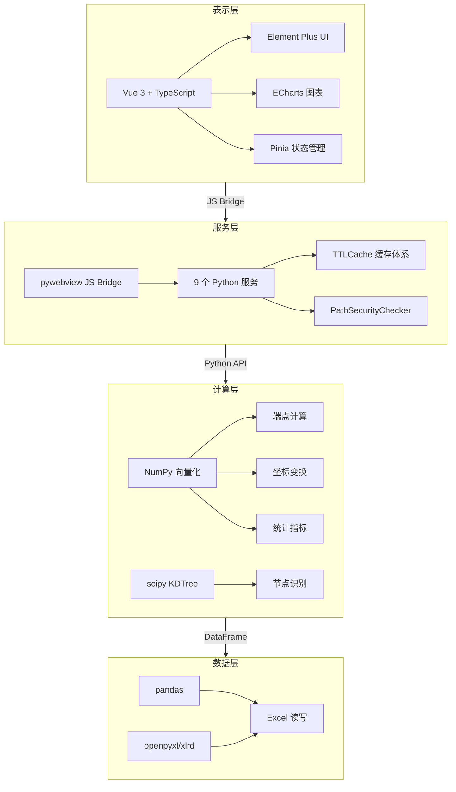

<p align="center">
  
</p>

<h1 align="center">TracePipeline</h1>

<p align="center">
  <strong>岩体节理测线坐标计算与绘图工具<br>Rock Joint Scanline Coordinate Computation & Visualization Toolkit</strong>
</p>

<p align="center">
  <a href="https://github.com/zylyes/TracePipeline/blob/main/LICENSE"></a>
  <a href="https://github.com/zylyes/TracePipeline/releases"></a>
  
  
  
  <a href="https://github.com/zylyes/TracePipeline/blob/main/CODE_OF_CONDUCT.md"></a>
</p>

<p align="center">
  基于 Python 的岩体节理测线法数据处理与可视化系统。<br>
  支持 <b>CLI 命令行</b>与<b>桌面 GUI</b> 双模式，MATLAB 原型算法完整移植为工程化 Python 代码。
</p>

---

## 📑 目录

- [🚀 快速开始](#-快速开始)
- [📖 1. 项目简介](#-1-项目简介)
  - [1.1 核心特性](#11-核心特性)
  - [1.2 处理管线](#12-处理管线)
  - [1.3 效果展示](#13-效果展示)
- [🏗 2. 技术栈与系统架构](#-2-技术栈与系统架构)
  - [2.1 四层架构](#21-四层架构)
  - [2.2 技术选型](#22-技术选型)
  - [2.3 数据流](#23-数据流)
  - [2.4 设计原则](#24-设计原则)
- [📋 3. 环境依赖与前置条件](#-3-环境依赖与前置条件)
- [⚙️ 4. 安装与运行](#-4-安装与运行)
  - [4.1 安装方式](#41-安装方式)
  - [4.2 GUI 前端构建](#42-gui-前端构建)
  - [4.3 运行方式](#43-运行方式)
- [🔧 5. 配置说明](#-5-配置说明)
- [🎨 6. 功能使用说明](#-6-功能使用说明)
  - [6.1 输入数据格式](#61-输入数据格式)
  - [6.2 CLI 命令行模式](#62-cli-命令行模式)
  - [6.3 GUI 桌面应用](#63-gui-桌面应用)
  - [6.4 Python API 编程接口](#64-python-api-编程接口)
  - [6.5 打包分发](#65-打包分发)
- [🧪 7. 算法原理](#-7-算法原理)
- [📁 8. 项目目录结构](#-8-项目目录结构)
- [👩‍💻 9. 开发指南](#-9-开发指南)
- [💡 10. 常见问题 (FAQ)](#-10-常见问题-faq)
- [🙏 11. 参考资料与致谢](#-11-参考资料与致谢)

---

<p align="center">
  
  
</p>

## 🚀 快速开始

```bash
# 1. 克隆仓库并安装
git clone https://github.com/zylyes/TracePipeline.git && cd TracePipeline
python -m venv .venv && .venv\Scripts\Activate.ps1
pip install -e .

# 2. 准备输入数据
# 将 Excel 文件命名为 {露头名}_process.xlsx 放入 input/ 目录
cp config.example.json config.json    # 按需修改配置

# 3. 运行（CLI 模式）
python run_trace_pipeline.py          # 批量处理全部露头

# 4. 运行（GUI 模式，需先构建前端）
cd frontend && npm install && npm run build && cd ..
python run_gui.py
```

> 📖 更详细的安装说明见 [第 4 节](#-4-安装与运行)，输入数据格式见 [第 6.1 节](#61-输入数据格式)。

---

## 📖 1. 项目简介

**TracePipeline** 是一套面向岩体节理几何特征分析的专业工具。以野外实测节理迹线数据为基础，实现了从原始测线记录到统计指标、可视化图表的全流程自动化处理。

> **适用场景**：岩体结构面调查、隧道/边坡工程地质勘察、岩石力学研究中的节理几何参数提取。

### 1.1 核心特性

| 特性                           | 说明                                                                                                                                           |
| :----------------------------- | :--------------------------------------------------------------------------------------------------------------------------------------------- |
| 🔢**综合法端点计算**     | 从 r₁–r₇ 测线记录经复数向量化推导端点坐标，一维→二维空间还原，与 MATLAB 原版误差 < 10⁻¹⁰ m                                              |
| 🔄**坐标变换流水线**     | 平移正象限 → 走向角旋转 → 再平移的规范化流程，自动处理坐标系对齐                                                                             |
| 📐**迹线分类与统计**     | I/II/III 型自动分类，P₁₀/P₂₀/P₂₁ 密度统计（实测优先四级回退），Mauldon 平均迹长估计                                                      |
| 🎯**圆窗四策略**         | `tangent` / `hybrid` / `concentric` / `auto` 四策略，`auto` 模式 6 因子加权评分自动选择                                              |
| 🏔️**面积四级回退**     | 实测面积 → 凸包 (Andrew 单调链) → 缓冲凸包 → 圆窗等效面积，确保统计指标始终可计算                                                           |
| 🔗**节点拓扑识别**       | I/Y/X 型拓扑节点自动识别，空间网格聚类 + 并查集 + 自适应合并容差                                                                               |
| 🖼️**高精度绘图**       | 600 DPI 迹线图（比例尺、指北针、LaTeX 统计框、凸包/圆窗/节点覆盖层、自动避让）                                                                 |
| 🌹**玫瑰图**             | 节理走向统计玫瑰图，可自定义分箱宽度 (5°–30°) 与 DPI                                                                                        |
| 📋**Excel 多工作表导出** | 6–9 个 Sheet：基本信息、裂隙情况、计算数据、端点坐标、节点统计等                                                                              |
| 🖥️**桌面 GUI**         | Vue 3 + Element Plus + ECharts 交互式仪表板，6 页面视图，4 级缓存体系                                                                          |
| 📄**报告导出**           | Word / PDF 一键生成，含统计汇总与图表内嵌，支持批量 ZIP 打包                                                                                   |
| 📊**多露头对比**         | 统计指标对比表格 + 柱状图 + 图片网格，便于跨露头分析                                                                                           |
| 🔍**数据溯源**           | P₁₀/P₂₀/P₂₁ 计算来源链追溯（实测/凸包/圆窗等效），审计友好                                                                               |
| 📦**一键打包**           | PyInstaller + Inno Setup + 7-Zip SFX 生成 Windows 安装版与便携版                                                                               |
| 📝**结构化日志**         | JSON Lines 格式，按日轮转，`request_id` 全链路追踪，30 天保留                                                                                |
| 🛡️**深度安全防护**     | 路径遍历防护（含 URL 递归解码防双重编码）、外部域名白名单、图片格式/大小校验、配置字段类型强制转换、GuiApiInterface 类型安全桥接、原子配置保存 |
| 🛡️**类型安全桥接**     | GuiApiInterface (37 方法签名) + TypeScript 严格类型，vue-tsc 零错误，前后端类型精确匹配                                                        |
| 🧪**完善测试**           | 后端 pytest 23 个测试文件 + 前端 Vitest 组件/Store 测试                                                                                        |

### 1.2 处理管线

一次完整的流水线处理包含 5 个阶段：

```
① 数据加载        ② 坐标变换+统计      ③ 节点识别        ④ Excel 导出        ⑤ 绘图
──────────       ─────────────────     ────────────      ──────────────      ────────────
Excel 读取      坐标归一化+旋转        I/Y/X 拓扑识别    多工作表导出        迹线图 + 旋转图
端点计算        圆窗策略计算           网格聚类+并查集   基本信息/裂隙情况    玫瑰图 (可选)
                P₁₀/P₂₀/P₂₁ 统计      自适应合并容差     端点坐标/节点统计    覆盖层渲染
                凸包/覆盖层构建
```

**产出物**（每个露头）：

| 产物           | 文件命名                            | 说明                            |
| :------------- | :---------------------------------- | :------------------------------ |
| 多工作表 Excel | `{露头}_traces.xlsx`              | 6–9 个 Sheet，含完整计算结果   |
| 原始迹线图     | `{露头}_raw(n=N).png`             | 原始坐标系下的迹线分布          |
| 旋转迹线图     | `{露头}_rotated(strike=X).png`    | 测线方向对齐 x 轴后的标准化视图 |
| 玫瑰图         | `{露头}_rose(bin=X).png`          | 节理走向统计玫瑰图（可选）      |
| 报告           | `reports/{露头}_report.pdf/.docx` | Word/PDF 综合报告（可选）       |

### 1.3 效果展示

<details>
<summary><b>点击展开效果截图预览</b></summary>

#### GUI 桌面应用界面

| 页面      | 说明                                                     |
| :-------- | :------------------------------------------------------- |
| 🏠 首页   | 项目介绍、功能卡片、快速入门引导                         |
| ⚙️ 处理 | 文件选择 → 参数配置 → 进度监控 → 结果查看             |
| 📊 统计   | 单露头统计仪表板：卡片 + 直方图 + 饼图 + 迹线图 + 玫瑰图 |
| 📈 对比   | 多露头对比表格 + 柱状图 + 图片网格                       |
| 📋 数据   | 原始数据浏览：输入/输出切换 + 9 区 Excel 分页            |
| 🔧 配置   | 全局设置 + 样式预览 + 开发者面板                         |

#### 输出产物示例

- **迹线图**：含测线、迹线、凸包边界、圆窗覆盖层、指北针、比例尺和 LaTeX 统计信息框
- **玫瑰图**：节理走向频率分布，支持自定义分箱宽度与配色
- **多工作表 Excel**：完整的数据追溯链，每列明确标注数据来源
- **报告**：Word (.docx) 或 PDF 格式，含统计汇总表格与图表内嵌

</details>

---

## 🏗 2. 技术栈与系统架构



### 2.1 四层架构

系统采用严格分层设计，层间单向依赖：

```
┌──────────────────────────────────────────────────────────────┐
│  表示层 (Presentation)                                       │
│  Vue 3.4 + TypeScript + Element Plus + ECharts + Pinia      │
│  6 页面视图、响应式仪表板、组件化 UI                            │
├──────────────────────────────────────────────────────────────┤
│  服务层 (Service)                                            │
│  pywebview JS Bridge + 9 个 Python 服务模块                   │
│  前后端通信、线程管理、缓存体系、安全校验                        │
├──────────────────────────────────────────────────────────────┤
│  计算层 (Computation)                                        │
│  NumPy 向量化 + 纯函数模块                                    │
│  端点计算、坐标变换、统计指标、节点识别                          │
├──────────────────────────────────────────────────────────────┤
│  数据层 (Data)                                               │
│  pandas + openpyxl / xlrd                                    │
│  Excel 读写、文件发现、多工作表导出                             │
└──────────────────────────────────────────────────────────────┘
```

### 2.2 技术选型

| 组件      | 选型                             | 版本      | 说明                                        |
| :-------- | :------------------------------- | :-------- | :------------------------------------------ |
| 桌面容器  | pywebview                        | ≥5.0     | Windows WebView2 嵌入，无 Electron 体积开销 |
| 前端框架  | Vue 3 + TypeScript               | 3.4 / 5.4 | Composition API，Pinia 状态管理             |
| UI 组件库 | Element Plus                     | 2.x       | 企业级 Vue 3 组件库                         |
| 图表      | ECharts + vue-echarts            | 5.x       | 直方图、饼图、柱状图对比                    |
| 数值计算  | NumPy                            | ≥1.24    | 广播 + 复数向量化                           |
| 绘图引擎  | matplotlib                       | ≥3.7     | 迹线图 (600 DPI)、玫瑰图、LaTeX 统计框      |
| 空间算法  | scipy                            | ≥1.10    | KDTree 等空间索引                           |
| 几何计算  | shapely                          | ≥2.0     | 缓冲区、几何求交                            |
| 打包      | PyInstaller + Inno Setup + 7-Zip | —        | 安装版 + 便携版一链生成                     |
| 日志      | 自定义 JSON Lines + contextvars  | —        | 按日轮转，30 天保留                         |
| 测试      | pytest + vitest                  | —        | 后端 23 文件 + 前端组件测试                 |
| 代码质量  | ruff + mypy                      | —        | Python 3.10，行宽 100                       |

### 2.3 数据流

```
┌──────────┐    ┌───────────────┐    ┌─────────────────────┐
│ 输入文件  │───▶│  excel_reader │───▶│  compute_endpoints   │
│ .xls/.xlsx│    │  (pandas 引擎) │    │  (复数向量化端点计算)  │
└──────────┘    └───────────────┘    └──────────┬──────────┘
                                                 │
                ┌────────────────────────────────┘
                ▼
┌─────────────────────────────────────────────────────────────┐
│                   run_pipeline() 五阶段流水线                 │
│                                                             │
│  ① 数据加载 ──▶ ② 坐标变换+统计 ──▶ ③ 节点识别 ──▶ ④ Excel │
│                                                     │       │
│                                            ┌────────┘       │
│                                            ▼                │
│                             ⑤ 绘图：迹线图 + 旋转图 + 玫瑰图  │
└─────────────────────────────────────────────────────────────┘
                │
                ▼
┌──────────────────────────────────────┐
│  输出产物                             │
│  • {露头}_traces.xlsx                 │
│  • {露头}_raw(n=N).png               │
│  • {露头}_rotated(strike=X).png      │
│  • {露头}_rose(bin=X).png (可选)      │
│  • reports/{露头}_report.pdf (可选)   │
└──────────────────────────────────────┘
```

### 2.4 设计原则

| 原则                     | 说明                                                                             |
| :----------------------- | :------------------------------------------------------------------------------- |
| **不可变数据模型** | 核心数据类 `frozen=True`，NumPy 数组 `writeable=False`，防止意外修改         |
| **纯函数计算**     | `geology/` 子包全部为纯函数，接收数组返回数组，无状态、无副作用                |
| **向量化优先**     | NumPy 广播 + 复数运算替代 for 循环；布尔 mask 替代 if-else 分支                  |
| **惰性导入**       | `__getattr__` 延迟加载 matplotlib/绘图模块，`import trace_pipeline` 无副作用 |
| **私有模块拆分**   | 大模块委托 `_*.py` 单一职责子模块，每个 50–350 行                             |
| **结构化日志**     | JSON Lines + 按日轮转 +`contextvars` 传播 `request_id`                       |
| **异常安全**       | 统一错误处理路径，优雅降级，文件占用/权限异常友好提示                            |

---

## 📋 3. 环境依赖与前置条件

### 系统要求

| 组件             | 最低要求                | 说明                                                                                            |
| :--------------- | :---------------------- | :---------------------------------------------------------------------------------------------- |
| 操作系统         | Windows 10 (1809+) / 11 | GUI 模式必需；CLI 模式理论跨平台                                                                |
| Python           | 3.10+                   | 推荐 3.11（性能最优），支持 3.12                                                                |
| Node.js          | 18 LTS                  | 仅 GUI 前端构建时需要                                                                           |
| WebView2 Runtime | 任意版本                | Win11 已内置；Win10 自动推送或[手动安装](https://developer.microsoft.com/microsoft-edge/webview2/) |
| 内存             | 2 GB (CLI) / 4 GB (GUI) | 并行处理时建议 ≥4 GB                                                                           |
| 磁盘             | 500 MB                  | 含依赖；打包产物约 150–250 MB                                                                  |

### 运行时依赖

**核心依赖**（CLI 与 GUI 通用）：

| 包             | 版本   | 用途                 |
| :------------- | :----- | :------------------- |
| `numpy`      | ≥1.24 | 向量化数值计算       |
| `pandas`     | ≥2.0  | Excel 表格读写       |
| `matplotlib` | ≥3.7  | 迹线图与玫瑰图绘制   |
| `openpyxl`   | ≥3.1  | `.xlsx` 读写引擎   |
| `xlrd`       | ≥2.0  | `.xls` 读写引擎    |
| `Pillow`     | ≥9.0  | 图像处理与缩略图生成 |
| `scipy`      | ≥1.10 | 空间算法 (KDTree)    |
| `shapely`    | ≥2.0  | 几何缓冲区与求交     |
| `tqdm`       | ≥4.67 | CLI 进度条           |

**GUI 附加依赖**：

| 包              | 版本  | 用途                     |
| :-------------- | :---- | :----------------------- |
| `pywebview`   | ≥5.0 | 桌面 GUI 容器 (WebView2) |
| `python-docx` | ≥1.0 | Word 报告导出            |
| `reportlab`   | ≥4.0 | PDF 报告导出             |

---

## ⚙️ 4. 安装与运行

### 4.1 安装方式

**方式一：pip 虚拟环境（推荐，全功能）**

```bash
git clone https://github.com/zylyes/TracePipeline.git
cd TracePipeline

# 创建虚拟环境
python -m venv .venv
.venv\Scripts\Activate.ps1      # Windows PowerShell

# 安装项目（含全部依赖）
pip install -e .
```

**方式二：仅 CLI 模式（不含 GUI 依赖）**

```bash
pip install -e . --no-deps
pip install numpy pandas matplotlib openpyxl xlrd Pillow scipy shapely tqdm
```

**方式三：含开发依赖**

```bash
pip install -e ".[dev]"    # 含 ruff, mypy, pytest, pytest-cov
```

**方式四：conda / mamba**

```bash
conda create -n trace python=3.11 -y
conda activate trace
pip install -e .
```

**方式五：uv（快速依赖解析）**

```bash
uv sync
uv run trace-pipeline
```

### 4.2 GUI 前端构建

```bash
cd frontend
npm install                 # 安装前端依赖（首次约 2–5 分钟）
npm run build               # 生产构建 → backend/static/
cd ..
python run_gui.py           # 启动桌面应用
```

> **提示**：开发时可使用 `npm run dev` 启动 Vite 热重载开发服务器，在浏览器中独立调试前端界面（自动使用 mock 数据，无需 Python 后端）。

### 4.3 运行方式

```bash
# === CLI 模式 ===

# 批量处理全部露头
python run_trace_pipeline.py

# 使用注册的命令行入口
trace-pipeline

# 通过模块运行
python -m trace_pipeline

# 4 进程并行处理
python run_trace_pipeline.py -p 4

# 交互式选择目标
python run_trace_pipeline.py -I

# 列出可用文件
python run_trace_pipeline.py -l

# === GUI 模式 ===
python run_gui.py
```

---

## 🔧 5. 配置说明

配置文件 `config.json`（本地生成，不提交 Git）。仓库提供 `config.example.json` 作为模板，复制后修改即可：

```bash
cp config.example.json config.json
```

### 完整配置项

```json
{
  "input_dir": "input",
  "output_dir": "output",
  "output_prefix": "Outcrop",
  "table_stem": "O76_process",
  "outcrop": "O76",
  "process_all": true,
  "export_rose_plot": false,
  "rose_bin_width": 10.0,
  "rose_dpi": 600,
  "trace_dpi": 600,
  "rotated_trace_dpi": 600,
  "window_strategy": "auto",
  "auto_density_threshold": 5.0,
  "tangent_window_count": 3,
  "min_intersections": 5,
  "style": {},
  "enable_node_recognition": false,
  "node_merge_tolerance": 0.01,
  "show_node_overlay": true,
  "node_label_mode": "type",
  "parallel_workers": 0,
  "is_dev_mode": false
}
```

### 配置项详表

| 配置键                      | 类型       | 默认值            | 说明                                                           |
| :-------------------------- | :--------- | :---------------- | :------------------------------------------------------------- |
| `input_dir`               | `string` | `"input"`       | 输入目录路径（含 `*_process.xls*` 文件）                     |
| `output_dir`              | `string` | `"output"`      | 输出目录路径                                                   |
| `output_prefix`           | `string` | `"Outcrop"`     | 输出文件前缀（批量模式下被露头名覆盖）                         |
| `table_stem`              | `string` | `"O76_process"` | 单文件模式下的文件名主干（不含扩展名）                         |
| `outcrop`                 | `string` | `"O76"`         | 单文件模式下的露头标识（也是 Excel Sheet 名）                  |
| `process_all`             | `bool`   | `true`          | 是否批量处理 `input_dir` 下所有文件                          |
| `export_rose_plot`        | `bool`   | `false`         | 是否导出玫瑰图                                                 |
| `rose_bin_width`          | `float`  | `10.0`          | 玫瑰图分箱宽度（度），范围 (0, 180]                            |
| `rose_dpi`                | `int`    | `600`           | 玫瑰图分辨率                                                   |
| `trace_dpi`               | `int`    | `600`           | 原始迹线图分辨率                                               |
| `rotated_trace_dpi`       | `int`    | `600`           | 旋转迹线图分辨率                                               |
| `window_strategy`         | `string` | `"auto"`        | 圆窗策略：`auto` / `tangent` / `hybrid` / `concentric` |
| `auto_density_threshold`  | `float`  | `5.0`           | `auto` 策略粗估面密度阈值                                    |
| `tangent_window_count`    | `int`    | `3`             | `tangent` 策略每侧切圆数量                                   |
| `min_intersections`       | `int`    | `5`             | 圆窗最小交切数（低于此值窗口无效）                             |
| `style`                   | `dict`   | `{}`            | 自定义绘图样式覆盖（见下方详表）                               |
| `enable_node_recognition` | `bool`   | `false`         | 是否启用节点拓扑识别                                           |
| `node_merge_tolerance`    | `float`  | `0.01`          | 节点合并容差（m）                                              |
| `show_node_overlay`       | `bool`   | `true`          | 是否在迹线图上绘制节点覆盖层                                   |
| `node_label_mode`         | `string` | `"type"`        | 节点标注模式：`"none"` / `"type"` / `"id"`               |
| `parallel_workers`        | `int`    | `0`             | 并行进程数（0=自动 CPU 数，1=串行，>1=指定进程数）              |
| `is_dev_mode`             | `bool`   | `false`         | GUI 开发者模式（显示调试面板）                                 |

> **CLI 覆盖**：命令行参数可覆盖配置文件中的对应字段（如 `--rose-bin 5` 覆盖 `rose_bin_width`）。

### 样式自定义 (`style` 字段)

`style` 字典用于覆盖默认的 matplotlib 绘图样式，支持以下键：

| 键                   | 类型       | 说明         | 示例值           |
| :------------------- | :--------- | :----------- | :--------------- |
| `trace_color`      | `string` | 迹线颜色     | `"#1f77b4"`    |
| `scanline_color`   | `string` | 测线颜色     | `"#d62728"`    |
| `hull_color`       | `string` | 凸包边界颜色 | `"#2ca02c"`    |
| `window_color`     | `string` | 圆窗边界颜色 | `"#ff7f0e"`    |
| `node_color`       | `string` | 节点标记颜色 | `"#9467bd"`    |
| `background_color` | `string` | 图片背景色   | `"#ffffff"`    |
| `line_width`       | `float`  | 迹线线宽     | `1.2`          |
| `font_family`      | `string` | 字体族       | `"sans-serif"` |
| `font_size`        | `int`    | 统计框字号   | `8`            |
| `node_style`       | `string` | 节点样式预设 | `"default"`    |
| `show_grid`        | `bool`   | 是否显示网格 | `true`         |

示例：

```json
"style": {
  "trace_color": "#1a5276",
  "scanline_color": "#922b21",
  "line_width": 1.5,
  "node_style": "compact"
}
```

---

## 🎨 6. 功能使用说明

### 6.1 输入数据格式

#### 文件命名

输入文件放置于 `input/` 目录（可配置），命名格式为：

```
{露头编号}_process.xlsx   或   {露头编号}_process.xls
```

示例：`O76_process.xlsx`、`O77_process.xls`

程序自动扫描 `input/` 下所有匹配 `*_process.xls*` 的文件。

#### Excel 工作表结构

每个文件应包含一个以露头编号命名的工作表（如 `O76`、`O77`）。**第 1 行为表头行**，**第 2 行起为数据行**。

**表头行（Row 1）**：

| 列 (1-indexed) | 参数         | 含义                               | 类型   |
| :------------- | :----------- | :--------------------------------- | :----- |
| H (8)          | 测线走向     | 测线走向方位角 (°)，值域 [0, 360) | 数值   |
| I (9)          | 迹线条数     | 需解析的迹线总条数 N               | 正整数 |
| L (12)         | 实测测线长度 | 实测测线长度 (m，可选)             | 数值   |
| M (13)         | 实测露头面积 | 实测露头面积 (m²，可选)           | 数值   |

**数据行（Row 2 起，共 N 行）**：

| 列 (1-indexed) | 参数 | 含义                | 要求 |
| :------------- | :--- | :------------------ | :--- |
| A (1)          | r₁  | 沿测线位移 (m)      | 数值 |
| B (2)          | r₂  | 垂直测线位移 (m)    | 数值 |
| C (3)          | 倾向 | 节理倾向方位角 (°) | 数值 |
| D (4)          | r₄  | 左侧迹长 1 (m)      | 数值 |
| E (5)          | r₅  | 左侧迹长 2 (m)      | 数值 |
| F (6)          | r₆  | 右侧迹长 1 (m)      | 数值 |
| G (7)          | r₇  | 右侧迹长 2 (m)      | 数值 |

> **注意事项**：
>
> - 前 7 列必须为数值型
> - r₅ 与 r₇ 不能同时为 0
> - 仅记录迹长 > 30 cm 的结构面
> - 程序自动将倾向转换为走向（倾向 ± 90°，规范化到 [0, 180)）

### 6.2 CLI 命令行模式

#### 基本用法

```bash
# 批量处理全部露头（使用 config.json）
python run_trace_pipeline.py

# 列出可用的输入文件
python run_trace_pipeline.py -l

# 试运行（预览目标，不实际执行）
python run_trace_pipeline.py -n

# 交互式选择处理目标
python run_trace_pipeline.py -I

# 自定义配置文件
python run_trace_pipeline.py -c my_config.json

# 4 进程并行处理
python run_trace_pipeline.py -p 4

# 指定圆窗策略 + 并行
python run_trace_pipeline.py --window-strategy hybrid -p 4

# 高 DPI 玫瑰图
python run_trace_pipeline.py --rose-bin 5 --rose-dpi 1200
```

#### 完整 CLI 参数

| 参数                    | 简写   | 说明                                                           |
| :---------------------- | :----- | :------------------------------------------------------------- |
| `--input DIR`         | `-i` | 输入目录（覆盖 `input_dir`）                                 |
| `--output DIR`        | `-o` | 输出目录（覆盖 `output_dir`）                                |
| `--config PATH`       | `-c` | 自定义 JSON 配置文件路径                                       |
| `--single`            | `-s` | 单文件模式：仅处理 `table_stem` 指定的文件                   |
| `--parallel N`        | `-p` | 并行进程数（0 = 串行，默认）                                   |
| `--list`              | `-l` | 列出发现的文件后退出                                           |
| `--interactive`       | `-I` | 交互式选择处理目标                                             |
| `--dry-run`           | `-n` | 试运行，不实际执行                                             |
| `--no-rose`           | —     | 跳过玫瑰图导出                                                 |
| `--rose-bin W`        | —     | 玫瑰图分箱宽度（度）                                           |
| `--rose-dpi DPI`      | —     | 玫瑰图分辨率                                                   |
| `--window-strategy S` | —     | 圆窗策略：`auto` / `tangent` / `hybrid` / `concentric` |
| `--force-parallel`    | —     | 强制并行处理（目标数 ≤2 时默认降级串行，此参数禁用该启发式）     |

#### 性能参考

| 场景          | 预期耗时  | 推荐命令                              |
| :------------ | :-------- | :------------------------------------ |
| 单目标串行    | 3–8 秒   | `python run_trace_pipeline.py -s`   |
| 8 目标串行    | 30–60 秒 | `python run_trace_pipeline.py`      |
| 8 目标 4 并行 | 15–30 秒 | `python run_trace_pipeline.py -p 4` |

### 6.3 GUI 桌面应用

#### 启动

```bash
# 先构建前端（仅首次或前端代码变更后需要）
cd frontend && npm install && npm run build && cd ..

# 启动 GUI
python run_gui.py
```

首次启动包含 4 步引导：WebView2 检测 → 配置初始化 → 文件扫描 → 服务就绪。

#### 界面架构

| 页面      | 路由            | 功能                                                     |
| :-------- | :-------------- | :------------------------------------------------------- |
| 🏠 首页   | `/`           | 项目介绍、功能卡片、快速入门引导                         |
| ⚙️ 处理 | `/processing` | 文件选择 → 参数配置 → 进度监控 → 结果查看             |
| 📊 统计   | `/statistics` | 单露头统计仪表板：卡片 + 直方图 + 饼图 + 迹线图 + 玫瑰图 |
| 📈 对比   | `/comparison` | 多露头对比表格 + 柱状图 + 图片网格                       |
| 📋 数据   | `/data`       | 原始数据浏览：输入/输出切换 + 9 区 Excel 分页            |
| 🔧 配置   | `/config`     | 全局设置 + 样式预览 + 开发者面板                         |

#### 缓存体系

| 缓存项     | TTL      | 存储方式                      |
| :--------- | :------- | :---------------------------- |
| 文件扫描   | 30s      | 后端 TTLCache + 目录变更检测  |
| 统计数据   | 5min     | 后端 LRU (SHA-256 配置指纹)   |
| 图片       | 10min    | 后端 LRU (≤50 条目 / 80 MB)  |
| 缩略图     | 10min    | 后端 LRU (≤120 条目 / 30 MB) |
| Excel 数据 | 5min     | 后端 TTLCache                 |
| 样式预览   | 配置 MD5 | 文件系统缓存                  |
| 结果列表   | 5s       | 前端 sessionStorage           |
| 对比数据   | 5min     | 前端 sessionStorage           |

### 6.4 Python API 编程接口

`trace_pipeline` 可作为 Python 库直接调用。所有公开 API 通过惰性导入导出，`import trace_pipeline` 不会触发 matplotlib 初始化。

#### 完整流水线

```python
from trace_pipeline import load_config, RunConfig, run_pipeline, RunResult

# 加载配置
cfg_dict = load_config("config.json")
config = RunConfig(
    input_dir="input",
    output_dir="output",
    output_prefix="Outcrop",
    table_stem="O76_process",
    outcrop="O76",
    window_strategy="auto",
    min_intersections=5,
)

# 执行流水线
result: RunResult = run_pipeline(config)

# 查看结果
print(result.status)            # PipelineStatus.SUCCESS
print(result.excel_path)        # output/O76_traces.xlsx
print(result.raw_plot_path)     # output/O76_raw(n=19).png
print(result.rotated_plot_path) # output/O76_rotated(strike=298.0).png
print(result.trace_count)       # 19
print(result.area_source)       # measured / hull / hull_buffered / window_equivalent
```

#### 单独统计计算

```python
from trace_pipeline import load_trace_data, compute_trace_statistics, TraceStatisticsConfig

# 加载迹线数据
trace = load_trace_data("input", "O76_process", "O76")

# 计算统计指标
stats_config = TraceStatisticsConfig(window_strategy="hybrid")
stats = compute_trace_statistics(trace, stats_config)

print(f"P₁₀ = {stats.p10:.4f}  m⁻¹")           # 线密度
print(f"P₂₀ = {stats.p20:.4f}  m⁻²")           # 面密度
print(f"P₂₁ = {stats.p21:.4f}  m⁻¹")           # 面累计长度密度
print(f"平均迹长 = {stats.mean_trace_length:.4f}  m")
print(f"面积来源 = {stats.outcrop_area_source}")  # measured / hull / hull_buffered / window_equivalent
print(f"圆窗策略 = {stats.window_strategy}")       # tangent / hybrid / concentric / auto
```

#### 节点识别

```python
from trace_pipeline.analysis.models import NodeRecognitionConfig
from trace_pipeline.analysis.nodes import recognize_trace_nodes

config = NodeRecognitionConfig(
    enabled=True,
    merge_tolerance=0.01,
    show_overlay=True,
    label_mode="type",  # "none" | "type" | "id"
)
analysis = recognize_trace_nodes(trace.endpoints, config)

print(f"节点总数: {analysis.node_count}")
print(f"I 型节点 (孤立端点): {analysis.type_counts.get('I', 0)}")
print(f"Y 型节点 (三叉):     {analysis.type_counts.get('Y', 0)}")
print(f"X 型节点 (交叉):     {analysis.type_counts.get('X', 0)}")
print(f"交点总数: {analysis.intersection_count}")

# 节点密度（需传入露头面积）
density = analysis.node_density(area=150.0)
print(f"节点密度: {density:.4f} 个/m²")
```

#### 完整 API 导出

```python
from trace_pipeline import (
    run_pipeline,                # 核心流水线
    load_trace_data,             # 数据加载（带文件签名缓存）
    TraceData,                   # 不可变数据模型
    RunConfig,                   # 运行配置（frozen dataclass）
    RunResult,                   # 运行结果（frozen dataclass）
    compute_trace_statistics,    # 统计计算
    TraceStatistics,             # 统计结果
    TraceStatisticsConfig,       # 统计配置
    find_trace_tables,           # 文件发现
    load_config,                 # 配置加载
    apply_cli_overrides,         # CLI 参数覆盖
    configure_style,             # matplotlib 样式配置
    print_pipeline_results,      # 结果格式化输出
    CircleWindowDiagnostic,      # 圆窗诊断信息
    format_statistics_box_lines, # 统计框文本行
)
```

### 6.5 打包分发

`scripts/package.py` 提供一键打包流水线：

```bash
python scripts/package.py                  # 完整打包（安装版 + 便携版）
python scripts/package.py --skip-portable   # 仅安装版
python scripts/package.py --skip-installer  # 仅便携版
python scripts/package.py --skip-frontend   # 跳过前端构建（假设已构建）
```

#### 打包工具链

| 工具         | 用途                  | 发现方式                           |
| :----------- | :-------------------- | :--------------------------------- |
| PyInstaller  | Python 应用打包       | `.venv/Scripts/pyinstaller.exe`  |
| Inno Setup 6 | 生成 Windows 安装程序 | 环境变量 `ISCC_EXE` 或系统 PATH  |
| 7-Zip        | 生成自解压便携版      | 环境变量 `SEVEN_ZIP` 或系统 PATH |

#### 打包流程

| 步骤     | 工具                        | 产物                                           |
| :------- | :-------------------------- | :--------------------------------------------- |
| 依赖声明 | 正则解析 `pyproject.toml` | `requirements.txt`                           |
| 前端构建 | `npm run build`           | `backend/static/`                            |
| 应用打包 | PyInstaller                 | `dist/TracePipeline/` (~150–250 MB)         |
| 安装程序 | Inno Setup 6                | `dist/TracePipeline-Setup-v{version}.exe`    |
| 便携版   | 7-Zip SFX                   | `dist/TracePipeline-Portable-v{version}.exe` |

> 打包前确保 `backend/static/index.html` 存在（前端已构建）。PyInstaller 步骤约需 3–10 分钟。

---

## 🧪 7. 算法原理

### 7.1 综合法测量原理

根据迹线与测线的相互关系，将节理迹线分为三种类型：

| 类型             | 名称       | 判定条件                 | 特征                                  |
| :--------------- | :--------- | :----------------------- | :------------------------------------ |
| **I 型**   | 相交型     | 迹线直接穿过测线         | 双侧均有迹线延伸 (r₅ ≠ 0, r₇ ≠ 0) |
| **II 型**  | 延长相交型 | 迹线延长线穿过测线       | 仅单侧有迹线延伸 (仅一侧非零)         |
| **III 型** | 不相交型   | 迹线及延长线均不穿过测线 | 过迹线起点作测线垂线定位              |

### 7.2 复平面端点坐标算法

在复平面中构建测线局部坐标系。测线方向单位向量 **v** = e^{iθ}，根据 r₅, r₇ 的取值自动判别三种计算情形：

| 情形   | 条件               | 计算方式                                                                     |
| :----- | :----------------- | :--------------------------------------------------------------------------- |
| 仅左侧 | r₅ ≠ 0, r₇ = 0  | Z₀ + r₂·**v**⟂ᴸ + r₄·**v**ₛ → 起点 + r₅·**v**ₛ |
| 仅右侧 | r₅ = 0, r₇ ≠ 0  | Z₀ + r₂·**v**⟂ᴿ + r₆·**v**ₛ → 起点 + r₇·**v**ₛ |
| 双侧   | r₅ ≠ 0, r₇ ≠ 0 | 分开计算左右端点                                                             |

全部计算通过 NumPy 复数向量化一次性完成 N 条迹线的转换，时间复杂度 O(N)。与 MATLAB 原版端点坐标误差 < 10⁻¹⁰ m。

### 7.3 坐标变换流水线

1. **平移至第一象限**：所有端点平移至 x ≥ 0, y ≥ 0 区域（留 1.0 边距）
2. **旋转标准化**：绕原点旋转使测线方向与 x 轴对齐
3. **再次平移**：确保旋转后坐标仍为非负

### 7.4 统计指标定义

| 指标               | 含义                   | 计算方法                                                       |
| :----------------- | :--------------------- | :------------------------------------------------------------- |
| **P₁₀**    | 线密度 (m⁻¹)         | 迹线数 / 测线长度                                              |
| **P₂₀**    | 面密度 (m⁻²)         | 迹线数 / 有效面积                                              |
| **P₂₁**    | 面累计长度密度 (m⁻¹) | 累计迹长 / 有效面积                                            |
| **平均迹长** | 平均迹线长度 (m)       | 三级回退：测段 (r₅+r₇) → 端点欧氏距离 → 圆窗 Mauldon L_est |

**面积回退链**：

```
实测面积 (measured) → 凸包面积 (hull) → 缓冲凸包面积 (hull_buffered) → 圆窗等效面积 (window_equivalent)
```

> 来源标注：`(M)` 实测、`(H)` 凸包、`(HB)` 缓冲凸包、`(WE)` 圆窗等效、`(E)` 估算。

### 7.5 圆形取样窗策略

| 策略           | 窗口布置                                     | 适用场景           |
| :------------- | :------------------------------------------- | :----------------- |
| `tangent`    | 沿测线均布 k 个相切圆                        | 大间距、稀疏迹线   |
| `hybrid`     | 3 切点 × 2 侧 × 3 半径缩放比，最多 18 窗口 | 中等密度           |
| `concentric` | 测线中点同心圆，多半径                       | 高密度             |
| `auto`       | 三种策略 6 因子加权评分，自动选择最优        | **默认推荐** |

`auto` 模式的 6 因子评分包括：窗口有效率、交切数均值、交切数 CV、有效窗口比例、覆盖密度、策略偏好权重。

### 7.6 节点拓扑识别

启用 `enable_node_recognition: true` 后，通过空间网格聚类 + 并查集算法自动识别节点：

- **I 型节点**：单迹线端点孤立（度 = 1）
- **Y 型节点**：三条迹线交汇（度 = 3）
- **X 型节点**：四条迹线交汇（度 = 4）

合并容差 `node_merge_tolerance` 默认 0.01 m，支持自适应调整。

---

## 📁 8. 项目目录结构

```
TracePipeline/
│
├── trace_pipeline/                 # 🔧 核心计算包 (50 个 .py 文件)
│   ├── __init__.py                 #   包入口，惰性导入，__all__ 定义 (v4.2.5)
│   ├── __main__.py                 #   python -m trace_pipeline 入口
│   ├── models.py                   #   数据模型 (TraceData, RunConfig, RunResult)
│   ├── config.py                   #   配置加载、路径解析、CLI 覆盖合并
│   ├── pipeline.py                 #   单目标全流程编排 (5 阶段)
│   ├── reporting.py                #   终端结果表格与摘要输出
│   ├── validation.py               #   标量类型强制转换工具
│   │
│   ├── geology/                    # 📐 地质/几何算法（纯函数模块）
│   │   ├── angles.py               #   角度转换（倾向→走向、方位角→笛卡尔）
│   │   ├── endpoints.py            #   综合法复数向量化端点计算
│   │   ├── statistics.py           #   P₁₀/P₂₀/P₂₁ 密度统计、迹线分类
│   │   ├── transforms.py           #   坐标平移、旋转与标准化
│   │   ├── _convex_hull.py         #   Andrew 单调链凸包、鞋带公式面积
│   │   ├── _circle_window.py       #   圆窗交切计数（批量向量化）
│   │   ├── _window_strategies.py   #   tangent/hybrid/concentric 布局
│   │   ├── _window_scoring.py      #   auto 策略 6 因子加权评分
│   │   ├── _stat_types.py          #   TraceStatisticsConfig, TraceStatistics
│   │   └── _stat_format.py         #   统计信息格式化
│   │
│   ├── analysis/                   # 🔗 节点识别分析
│   │   ├── models.py               #   NodeRecognitionConfig, NodeAnalysis
│   │   └── nodes.py                #   recognize_trace_nodes (网格聚类+并查集)
│   │
│   ├── geometry/                   # 📏 几何原语
│   │   └── segments.py             #   线段求交、共线性、点到线距离
│   │
│   ├── io/                         # 💾 I/O 层
│   │   ├── discovery.py            #   find_trace_tables (文件发现)
│   │   ├── excel_reader.py         #   read_trace_excel (引擎/表名回退)
│   │   └── excel_writer.py         #   write_excel_multi_sheets (多工作表导出)
│   │
│   ├── plotting/                   # 🖼️ 绘图层
│   │   ├── style.py                #   matplotlib 全局样式 + CJK 字体配置
│   │   ├── trace_plot.py           #   render_trace_plot (迹线图)
│   │   ├── rose_plot.py            #   render_rose_plot (玫瑰图)
│   │   ├── preview_plot.py         #   render_preview_* (样式预览)
│   │   ├── overlays.py             #   凸包/圆窗/节点覆盖层构建
│   │   ├── _helpers.py             #   图形创建、指北针、边界计算
│   │   └── _layout.py              #   布局、统计框、图例、比例尺
│   │
│   ├── logging/                    # 📝 结构化日志系统
│   │   ├── core.py                 #   JsonFormatter, DailyRotatingJsonHandler
│   │   └── context.py              #   LogContext, request_id 传播, timed 装饰器
│   │
│   ├── cli/                        # ⌨️ 命令行入口
│   │   ├── main.py                 #   CLI 入口 (配置→发现→调度→报告)
│   │   ├── args.py                 #   argparse 参数定义
│   │   ├── dispatcher.py           #   批量/单文件目标选择与串/并行执行
│   │   ├── interactive.py          #   交互式文件选择 (范围解析)
│   │   └── logging_setup.py        #   日志兼容层
│   │
│   └── utils/                      # 🛠️ 工具函数
│       ├── paths.py                #   PyInstaller 感知的路径解析
│       ├── output_paths.py         #   输出图片查找
│       ├── numpy_compat.py         #   NumPy → Python 原生类型转换
│       ├── mpl_init.py             #   强制非交互式 backend
│       ├── fonts.py                #   CJK 字符检测
│       └── formatting.py           #   文件大小格式化
│
├── backend/                        # 🖥️ GUI 后端 (pywebview, 18 个 .py 文件)
│   ├── main_gui.py                 #   pywebview 启动器、窗口管理、DPI 处理
│   ├── gui_api.py                  #   JS Bridge API (40 个公开方法)
│   ├── webview2_checker.py         #   WebView2 Runtime 检测与引导
│   ├── services/                   #   9 个后端服务模块
│   │   ├── config_service.py       #   配置读写 (原子保存)
│   │   ├── file_service.py         #   文件扫描 (TTLCache 30s)
│   │   ├── pipeline_service.py     #   后台流水线执行 (线程+队列)
│   │   ├── stats_service.py        #   统计计算 (TTLCache 5min + SHA-256)
│   │   ├── data_service.py         #   Excel 数据分页读取
│   │   ├── preview_service.py      #   样式预览生成 (MD5 缓存)
│   │   ├── report_service.py       #   Word/PDF 报告导出
│   │   ├── audit_service.py        #   用户操作审计日志
│   │   └── log_service.py          #   结构化日志读取
│   └── utils/                      #   后端工具
│       ├── cache.py                #   TTLCache + 目录变更检测
│       ├── security.py             #   路径遍历防护、Windows 设备名拦截
│       └── path_utils.py           #   露头名校验、错误响应格式化
│
├── frontend/                       # 🌐 Vue 3 前端 (TypeScript)
│   └── src/
│       ├── App.vue                 #   根组件 (侧边栏 + 标题栏 + 状态栏)
│       ├── main.ts                 #   入口文件
│       ├── views/                  #   6 页面视图
│       │   ├── IntroView.vue       #     首页引导
│       │   ├── ProcessingView.vue  #     文件选择 + 流水线处理
│       │   ├── StatisticsView.vue  #     单露头统计仪表板
│       │   ├── ComparisonView.vue  #     多露头对比
│       │   ├── DataView.vue        #     原始数据浏览
│       │   └── ConfigView.vue      #     全局配置 + 样式预览
│       ├── components/             #   功能组件
│       │   ├── SplashScreen.vue    #     启动画面
│       │   ├── FileList.vue        #     文件选择列表
│       │   ├── ProgressPanel.vue   #     流水线进度面板
│       │   ├── StatCards.vue       #     统计卡片
│       │   ├── HistogramChart.vue  #     迹长直方图
│       │   ├── PieChart.vue        #     迹线类型饼图
│       │   ├── ImageViewer.vue     #     图片查看器
│       │   ├── ImageModal.vue      #     图片放大模态框
│       │   ├── StylePreview.vue    #     样式预览面板
│       │   ├── ConfigForm.vue      #     配置表单
│       │   ├── DevPanel.vue        #     开发者面板
│       │   ├── DataTable.vue       #     数据分页表格
│       │   ├── GeoIcon.vue         #     地质图标
│       │   └── icons/              #     导航图标
│       ├── stores/                 #   Pinia 状态管理
│       │   ├── app.ts              #     应用全局状态
│       │   ├── config.ts           #     配置状态
│       │   ├── cache.ts            #     缓存状态
│       │   └── pipeline.ts         #     流水线状态
│       ├── api/
│       │   └── pywebview.ts        #   JS Bridge 封装 (含 mock 回退)
│       ├── utils/                  #   前端工具函数
│       ├── types/                  #   TypeScript 类型定义
│       └── styles/                 #   设计令牌、Element Plus 覆盖
│
├── tests/                          # 🧪 Python 单元测试 (pytest, 23 文件)
├── frontend/tests/                 # 🧪 前端单元测试 (vitest)
├── scripts/
│   └── package.py                  # 📦 一键打包流水线
├── reference/                      # 📚 参考资料
│   ├── matlab/                     #   MATLAB 算法原型
│   ├── input.zip                   #   示例输入数据
│   └── favicon.ico                 #   应用图标
│
├── input/                          # 📥 输入数据 (gitignored)
├── output/                         # 📤 输出产物 (gitignored)
├── logs/                           # 📝 日志文件 (gitignored)
├── reports/                        # 📄 报告文件 (gitignored)
├── dist/                           # 📦 打包产物 (gitignored)
├── build/                          # 🔨 构建临时文件 (gitignored)
├── cache/                          # ⚡ 缓存目录 (gitignored)
│
├── config.example.json             # ⚙️ 配置模板
├── config.json                     # ⚙️ 本地配置 (gitignored)
├── pyproject.toml                  # 📋 项目元数据与构建配置
├── requirements.txt                # 📋 依赖声明 (自动生成)
├── TracePipeline.spec              # 🔧 PyInstaller 打包规格
├── TracePipeline-setup.iss         # 🔧 Inno Setup 安装脚本
├── run_trace_pipeline.py           # ▶️ CLI 入口脚本
├── run_gui.py                      # ▶️ GUI 入口脚本
├── CHANGELOG.md                    # 📋 变更日志
├── CONTRIBUTING.md                 # 📋 贡献指南
├── CODE_OF_CONDUCT.md              # 📋 行为准则
├── RELEASE_NOTES.md                # 📋 发布说明
├── LICENSE                         # 📄 MIT 许可证
└── README.md                       # 📖 本文件
```

---

## 👩‍💻 9. 开发指南

### 9.1 开发环境搭建

```bash
# 安装含开发依赖
pip install -e ".[dev]"       # ruff, mypy, pytest, pytest-cov

# 前端开发 (浏览器热重载模式，使用 mock 数据)
cd frontend
npm install
npm run dev                   # 启动 Vite 开发服务器
```

### 9.2 代码质量工具

```bash
# 代码检查 (ruff)
ruff check .

# 类型检查 (mypy)
mypy trace_pipeline/

# 后端测试
pytest                                    # 全部测试
pytest --cov --cov-report=term            # 含覆盖率报告
pytest --cov --cov-report=html            # HTML 覆盖率报告
pytest tests/test_angles.py               # 运行指定测试文件

# 前端测试
cd frontend
npm run typecheck                         # TypeScript 类型检查
npm run test                              # vitest 运行
npm run test:watch                        # vitest 监视模式
```

#### 工具配置

| 工具     | 配置文件                               | 关键设置                                     |
| :------- | :------------------------------------- | :------------------------------------------- |
| ruff     | `pyproject.toml [tool.ruff]`         | Python 3.10, 行宽 100, 规则 E/F/I/N/UP/B/SIM |
| mypy     | `pyproject.toml [tool.mypy]`         | Python 3.10,`warn_return_any=true`         |
| pytest   | `pyproject.toml [tool.pytest]`       | `testpaths = ["tests"]`                    |
| coverage | `pyproject.toml [tool.coverage.run]` | `source = ["trace_pipeline", "backend"]`   |
| vitest   | `frontend/vitest.config.ts`          | jsdom 环境                                   |

### 9.3 贡献流程

我们欢迎各种形式的贡献！详细指南见 [CONTRIBUTING.md](CONTRIBUTING.md)，行为准则见 [CODE_OF_CONDUCT.md](CODE_OF_CONDUCT.md)。

#### 快速流程

1. **Fork** 本仓库
2. 创建特性分支：`git checkout -b feat/amazing-feature`
3. 确保代码通过检查：
   ```bash
   ruff check .
   mypy trace_pipeline/
   pytest
   ```
4. 提交变更：`git commit -m 'feat: add amazing feature'`
5. 推送到分支：`git push origin feat/amazing-feature`
6. 创建 **Pull Request**

#### 分支命名规范

| 前缀          | 用途      | 示例                     |
| :------------ | :-------- | :----------------------- |
| `feat/`     | 新功能    | `feat/node-clustering` |
| `fix/`      | Bug 修复  | `fix/excel-lock-error` |
| `docs/`     | 文档更新  | `docs/api-reference`   |
| `refactor/` | 重构      | `refactor/cache-layer` |
| `test/`     | 测试      | `test/edge-cases`      |
| `chore/`    | 构建/工具 | `chore/update-deps`    |

#### Commit Message 格式

```
<type>(<scope>): <description>

[optional body]
```

类型：`feat`、`fix`、`docs`、`style`、`refactor`、`test`、`chore`、`perf`

---

## 💡 10. 常见问题 (FAQ)

### 安装与启动

<details>
<summary><b>安装时报错 ModuleNotFoundError</b></summary>

未安装项目依赖。运行 `pip install -e .` 安装全部依赖，或 `pip install -r requirements.txt`。

</details>

<details>
<summary><b>GUI 启动后显示白屏</b></summary>

前端未构建。执行以下步骤：

```bash
cd frontend
npm install
npm run build
cd ..
python run_gui.py
```

</details>

<details>
<summary><b>GUI 提示 WebView2 缺失</b></summary>

系统未安装 WebView2 Runtime。Win11 已内置；Win10 可通过 Windows Update 获取，或点击提示中的链接下载。

</details>

<details>
<summary><b>仅需 CLI 模式，不想安装 GUI 依赖</b></summary>

```bash
pip install -e . --no-deps
pip install numpy pandas matplotlib openpyxl xlrd Pillow scipy shapely tqdm
```

</details>

### 数据与运行

<details>
<summary><b>发现 0 个迹线表文件</b></summary>

文件名不以 `_process` 结尾。请确保文件命名为 `{露头名}_process.xlsx` 格式，并放置在 `input/` 目录下。

</details>

<details>
<summary><b>"工作表不存在" 错误</b></summary>

Excel 中的 Sheet 名与露头编号不一致。请确保 Sheet 名与文件名中的露头编号一致（如文件 `O76_process.xlsx` 中应有 Sheet `O76`）。

</details>

<details>
<summary><b>.xls 文件读取报错</b></summary>

`xlrd >= 2.0` 仅支持 `.xls` 格式。如果文件实际为 `.xlsx`，请将扩展名改为 `.xlsx`。

</details>

<details>
<summary><b>迹线图中文字符显示为方块</b></summary>

系统缺少 CJK 字体。程序已内置多级字体回退链（微软雅黑 → 宋体 → DejaVu Sans），请安装宋体或微软雅黑。

</details>

### 运行时异常

<details>
<summary><b>P₂₀ / P₂₁ 显示 NaN</b></summary>

迹线数过少 (< 3) 导致凸包退化，无法计算面积。这是正常的兜底行为，可在 Excel 中手动填写实测露头面积。

</details>

<details>
<summary><b>并行处理时内存占用过高</b></summary>

`ProcessPoolExecutor` 每个子进程独立加载依赖库。降低 `-p` 参数值，串行模式 (`-p 0`) 内存最低。

</details>

<details>
<summary><b>Excel 写入权限错误</b></summary>

输出文件被 Excel/WPS 打开占用。请关闭正在查看的输出文件后重试。

</details>

<details>
<summary><b>节点识别未生成覆盖层</b></summary>

需同时设置 `enable_node_recognition: true` 和 `show_node_overlay: true`。

</details>

<details>
<summary><b>打包后运行提示找不到字体</b></summary>

PyInstaller 不会打包系统字体。确保目标系统已安装宋体或微软雅黑等 CJK 字体。

</details>

<details>
<summary><b>matplotlib 后端警告</b></summary>

程序已强制使用 Agg 后端，此警告可安全忽略。

</details>

---

## 🙏 11. 参考资料与致谢

### 学术参考

- MATLAB 原版算法（`reference/matlab/`）为本项目的理论基础
- [Mauldon (1998)](https://doi.org/10.1016/S0148-9062(98)00007-2) — 圆形取样窗平均迹长估计方法
- [Laslett (1982)](https://doi.org/10.1007/BF01032939) — 圆形取样窗法

### 版本历史

| 版本   | 日期    | 里程碑                                                                  |
| :----- | :------ | :---------------------------------------------------------------------- |
| v4.3.2 | 2026-06 | 代码质量与防御性编程：7 项一般缺陷修复（临时文件清理、锁一致性、哈希统一等） |
| v4.3.1 | 2026-06 | 性能与安全优化：多进程日志竞态修复、图片缓存、节点批量绘制、启动并行化 |
| v4.3.0 | 2026-06 | 全面代码审计：6 项致命缺陷修复 + 12 项严重缺陷修复 + 前端性能优化      |
| v4.2.7 | 2026-06 | 进度条平滑插值动画（requestAnimationFrame 驱动）                       |
| v4.2.6 | 2026-06 | GUI/CLI 并行处理支持（ProcessPoolExecutor）、--force-parallel 参数     |
| v4.2.5 | 2026-06 | 类型安全加固（25+ any→具体类型）、GuiApiInterface、shell=True 消除     |
| v4.2.4 | 2026-06 | 安全重构：GuiApiInterface(36方法)、shell=True→shutil.which、异常精确化 |
| v4.2.3 | 2026-06 | 前端类型安全：4 接口定义、14处 any 替换、catch(e:any)→unknown          |
| v4.2.2 | 2026-06 | 错误处理强化：合并图片调用、清理调试残留、空 catch→错误日志            |
| v4.2.1 | 2026-06 | 缓存性能优化（O(1)字符计数）、幂等样式配置、资源泄漏修复                |
| v4.2.0 | 2026-06 | 报告实时进度、测试框架、绘图解耦、启动优化                              |
| v4.0.0 | 2026-06 | 公开发布：CLI + GUI 双模式，6 页面视图，一键打包                        |
| v3.2.0 | 2026-05 | 节点识别 (I/Y/X)，前端样式重构                                          |
| v2.3.1 | 2026-04 | GUI 首次引入，结构化日志，缓存机制                                      |
| v2.0.0 | 2026-03 | 圆窗四策略，凸包面积，P₁₀/P₂₀/P₂₁，节点识别                       |
| v1.0.0 | 2026-02 | MATLAB 算法移植，CLI，Excel 导出，迹线图绘制                            |

完整记录见 [CHANGELOG.md](CHANGELOG.md) 和 [GitHub Releases](https://github.com/zylyes/TracePipeline/releases)。

---

## 📄 许可证

本项目基于 [MIT 许可证](LICENSE) 开源。

```
Copyright (c) 2026 TracePipeline Contributors
```

Repository: [github.com/zylyes/TracePipeline](https://github.com/zylyes/TracePipeline)
