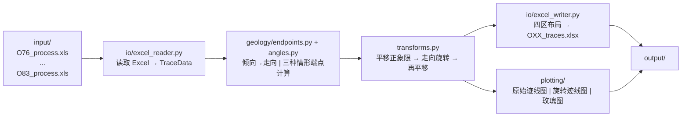
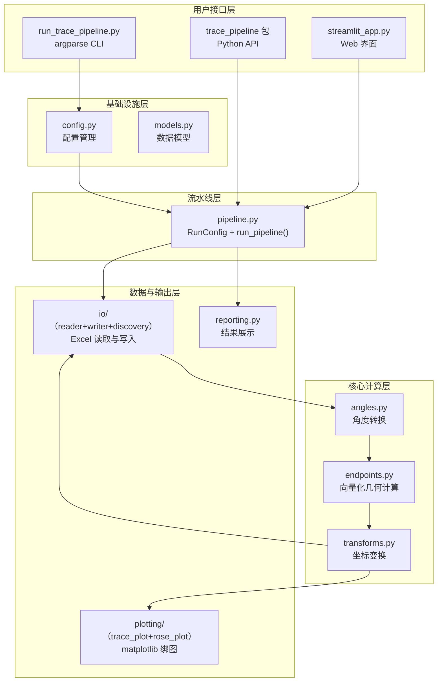
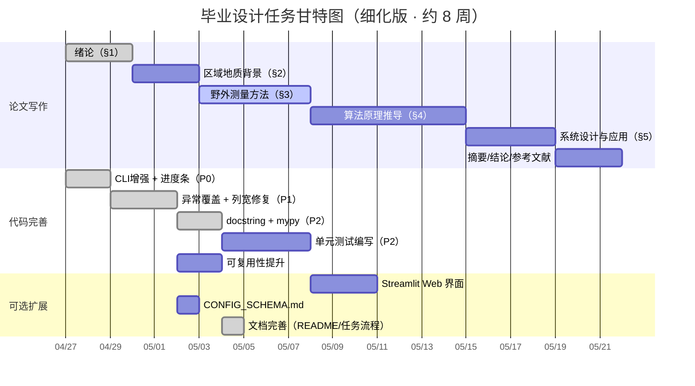

# 毕业设计任务流程与预期成果

> **版本**: v2.3 | **最后更新**: 2026-05-04 | **适用周期**: 2026 年 4 月 – 6 月（约 8 周）

---

## 项目概况

### 课题定义

本课题实现 **岩体节理测线法坐标计算与可视化系统**，将 MATLAB 原型算法（`matlab参考/Coordinate.m`）完整移植为 Python 工程化代码。系统覆盖 **8 个露头（O76–O83）共 172 条节理迹线**，完成从原始测绘数据到端点坐标计算、旋转变换、Excel 导出、迹线图与玫瑰花瓣图的自动化流水线。

> **配套文档**: 详细的项目安装、配置、CLI 用法、数据格式、输出说明及 MATLAB vs Python 对比见 [`README.md`](../README.md)。本文件聚焦于任务分解与进度跟踪，两者互为补充。

> **地质背景资料**（位于 `杂项/地质背景/`）：
> - 董艳辉等 — 甘肃北山-河西走廊-祁连山区域地下水循环模式
> - 纪景仁等 — 离散裂隙网络模拟在地下硐室中的应用（甘肃北山地下实验室为例）
> 
> **野外测量资料**（位于 `杂项/测量/`）：
> - `测线法说明.pptx` — 综合法测量操作流程
> - `测量原理.docx` — 综合法三种类型的几何原理说明
> - `测量工具.docx` — 野外仪器型号、精度与用途清单
> - `IMG_7311.JPG` / `30MDJI_0662.JPG` — 现场节理露头照片
> 
> 以上文献与资料可作为 §2（区域地质背景）、§3（野外测量与数据获取）的参考文献和素材。

### 系统架构（数据流）



### 已完成 vs 待完成

| 模块 | 文件 | 当前状态 | 待完成工作 |
|------|------|----------|------------|
| **配置系统** | `config.py` | ✅ 完成（加载/校验/路径解析/文件发现） | — |
| **数据模型** | `models.py` | ✅ 完成（TraceData / RunConfig / RunResult，原 `types.py`） | — |
| **角度转换** | `angles.py` | ✅ 完成（倾向→走向/折叠/半平面） | — |
| **数据 I/O** | `io/` | ✅ 完成（`excel_reader` / `excel_writer` / `discovery`，列宽已循环化） | — |
| **几何计算** | `geology/endpoints.py` | ✅ 完成（向量化复数运算，原 `geometry.py`） | 论文推导展开 |
| **坐标变换** | `transforms.py` | ✅ 完成（平移+旋转流水线） | 论文推导展开 |
| **结果展示** | `reporting.py` | ✅ 完成（格式化表格/摘要，原 `report.py`） | — |
| **绘图** | `plotting/` | ✅ 完成（`trace_plot` + `rose_plot` + `style`） | — |
| **流水线编排** | `pipeline.py` | ✅ 完成（单目标全流程） | — |
| **CLI 入口** | `run_trace_pipeline.py` + `trace_pipeline.cli/` | ✅ 完成（薄 shim + CLI 全功能：12 参数、交互式、并行、tqdm） | — |
| **单元测试** | `tests/` | ✅ 已编写 4 个模块（见 §2.5） | 需补充集成测试与配置测试 |
| **节点识别** | — | ❌ 未实现 | §1.3 规划：I/Y/X型节点检测算法 |
| **Terzaghi修正** | — | ❌ 未实现 | §1.3 规划：测线方向取样偏差修正 |
| **密度参数统计** | — | ❌ 未实现 | §1.3 规划：P10/P20/P21 |
| **极点等值线图** | — | ❌ 未实现 | §1.3 规划：产状优势分组与等值线可视化 |
| **Web 界面** | `streamlit_app.py` | ❌ 不存在 | 可选扩展 |
| **配置文档** | `CONFIG_SCHEMA.md` | ❌ 不存在 | 可选扩展 |

---

## 一、论文写作任务分解

### 论文结构总览（五章 + 摘要/结论）

根据论文初稿实际结构，全文共五章：

| 章节 | 标题 | 预计字数 | 核心内容 | 依赖数据/代码 |
|------|------|----------|----------|---------------|
| — | **摘要 + 关键词** | 300–500 | 中英文双语；研究背景、方法、结果、结论 | 全部完成后撰写 |
| §1 | **绪论** | 3000–4000 | 选题背景、国内外研究现状（调查方法/统计建模/Python应用）、研究内容与技术路线、研究意义 | 文献调研（已完成初稿） |
| §2 | **区域地质背景** | 1500–2000 | 北山沙枣园花岗岩体地质概况、构造环境、岩体特征、研究露头分布 | 地质背景资料（`杂项/地质背景/`） |
| §3 | **野外测量与数据获取** | 4000–5000 | 露头选取原则、综合法三种类型测量原理、操作流程、露头概况、仪器参数、数据格式映射说明 | 野外记录、照片、PPT、测量工具 |
| §4 | **算法原理与实现** | 4000–5000 | 倾向→走向转换、基准角、三种情形复数推导、半平面折叠、坐标变换流水线、适用性分析 | `endpoints.py`、`transforms.py`、MATLAB 参考 |
| §5 | **系统设计与应用** | 3000–4000 | 模块架构、三层用户接口（CLI/API）、批量处理结果展示、与 MATLAB 对比验证 | 全部 Python 代码、`output/` |
| — | **结论与展望** | 500–800 | 成果总结、创新点、不足与改进方向 | — |
| — | **参考文献** | — | ≥ 20 篇中英文文献 | — |
| — | **致谢** | 200–300 | — | — |

---

### 1.1 第二章「区域地质背景」详细任务

> **写作周期**: 3 天 | **优先级**: 🟡 中（为后续野外测量和算法应用提供地质 context）

#### 子任务 2.1：北山沙枣园花岗岩体地质概况（§2.1，约 800 字）

| 要点 | 内容 | 参考资料 |
|------|------|----------|
| 地理位置 | 北山地区戈壁地带，具体经纬度范围 | 地质背景资料 |
| 岩体特征 | 花岗岩岩性、形成年代、侵入关系 | `杂项/地质背景/纪景仁.pdf` |
| 构造环境 | 区域构造应力场、主要断裂带分布 | `杂项/地质背景/董艳辉.pdf` |
| 节理发育 | 节理组数、优势走向、与区域构造的关系 | 论文文献综述 |

#### 子任务 2.2：研究露头分布与选取依据（§2.2，约 600 字）

- 8 个露头（O76–O83）的空间分布示意（可用草图或 GIS 截图）
- 各露头与区域主要构造线的关系
- 露头选取的代表性论证（覆盖不同节理组、不同风化程度）

#### 第二章交付物清单

- [ ] §2.1 北山沙枣园花岗岩体地质概况（岩性、构造、风化）
- [ ] §2.2 研究露头分布与选取依据（引用 `杂项/地质背景/` 文献）
- [ ] 区域地质背景参考文献（董艳辉等、纪景仁等）

---

### 1.2 第三章「野外测量与数据获取」详细任务

> **写作周期**: 5 天 | **优先级**: 🔴 最高（先完成此章才能确定算法输入变量的物理含义）

#### 子任务 3.0：露头选取原则与测量规范（§3.0，约 600 字）

在进行Ⅳ级和Ⅴ级结构面调查前，需遵循以下原则选取测量露头，以保证数据的代表性与可靠性：

| 原则 | 具体要求 | 目的 |
|------|----------|------|
| **露头平整** | 选取的露头面应尽量平整，起伏面会给迹长和间距测量带来较大偏差 | 减小几何测量误差 |
| **露头新鲜** | 尽量选取未受爆破、倾倒破坏、风化剥蚀和植物生长影响的露头 | 保证测量数据真实反映原生节理特征 |
| **露头面积** | 露头面积尽可能大，以保证足够的数据样本量 | 提高统计代表性，尽可能多测出半迹长 |
| **测量一致性** | 同一批次测量中不宜频繁变更人员、设备和方法 | 减小系统误差与人为误差 |
| **迹长下限** | 综合法测量时，仅记录露头内 **迹长 > 30 cm** 的结构面 | 排除表层微裂隙，聚焦工程有意义的节理 |

**测量总体流程**：通过实地踏勘在研究范围内选择发育良好的露头 → 用 GPS 确定露头位置 → 采用**综合法**进行节理调查 → 记录测线走向与起点 GPS → 按优势产状分组测量 → 露头面积与产状测量 → 红色油漆编号标记 → 含比例尺拍照。

#### 子任务 3.1：综合法测量原理与操作流程（§3.1，约 1000 字）

**综合法**根据测线与节理迹线的相互关系，将露头内的节理迹线划分为三种类型（如图 1 所示）：

| 类型 | 名称 | 判定条件 | 几何特征 |
|------|------|----------|----------|
| **Ⅰ型** | 相交型 | 迹线与测线直接相交 | 迹线穿过测线，交点为 L₀ |
| **Ⅱ型** | 延长相交型 | 迹线本身不与测线相交，但其延长线与测线相交 | 迹线位于测线一侧，延长交点为 L₀ |
| **Ⅲ型** | 不相交型 | 迹线及其延长线均不与测线相交 | 过迹线起点作测线垂线，垂足为 L₀，垂线段长为 L₁ |

**图中符号说明**（对应图 1）：
- **O 点**：测线起点
- **OA**：测线方向
- **L₀**：迹线与测线交点（Ⅰ型、Ⅱ型）或垂足（Ⅲ型）在测线上的位置坐标
- **L₁**：Ⅲ型迹线起点到测线的垂直距离（即 r2 的绝对值）
- **L₂、L₃**：迹线段长度（从交点/垂足向两侧延伸的长度分量）

> 💡 **论文写作提示**: 图 1 是本章核心配图，需在论文中重绘或引用高清版本。三种类型的判定条件需用数学不等式表达（如 "当 L₁ = 0 且迹线穿过测线时为Ⅰ型"）。

**测量操作流程**:

| 要点 | 具体内容 | 参考资料 |
|------|----------|----------|
| 测线布设原则 | 测线方位选择依据（尽量垂直主节理组走向）、测线长度 30m、皮尺固定方式；合理布置须囊括主要走向的所有节理 | 野外记录本 |
| 露头定位 | 用 GPS 记录每个露头的地理坐标（经纬度），作为露头概况表基础数据 | GPS |
| 测线测量 | 测量测线走向（ang0），记录测线起点的 GPS 坐标值；以测线起点 O 为起始点，指向测线终点 A | DQY-1 罗盘 |
| 分组策略 | 按照结构面优势产状，初步划分测量组，依次测量每个优势组中每一条节理面 | 现场判断 |
| 测量步骤 | ① 布设 30m 皮尺作为测线基准 OA → ② 用红色油漆对露头编号、对每条节理编号标记 → ③ 判定节理类型（Ⅰ/Ⅱ/Ⅲ型）→ ④ 记录交点/垂足位置 L₀（沿测线距离，即 r1）→ ⑤ 记录垂直偏移 L₁（即 r2，左侧为正/右侧为负）→ ⑥ 用 DQY-1 罗盘测量节理倾向与倾角 → ⑦ 用 5m 钢卷尺分别测量迹线段长度 L₂、L₃（映射为 r4–r7）→ ⑧ 用塞尺测量节理隙宽（开度）→ ⑨ 记录填充物、端点类型、备注 | `测线法说明.pptx` |
| 露头测量 | 采用手持式 GPS 多边形法测量模块测量露头出露面积和每一个拐点坐标值；测量露头产状（倾向/倾角） | GPS、罗盘 |
| 标记拍照 | 用红色油漆对露头编号，测量露头的倾向与倾角，采用照相机对露头进行含比例尺拍照 | 喷漆、相机 |
| 测量示意图 | 手绘或 CAD 绘制：测线 + 节理迹线相交关系，标注 r1/r2/r4-r7 含义 | 自绘 |

#### 子任务 3.2：露头概况表（§3.2，约 600 字 + 表格）

需整理成如下格式（填入实际野外数据）：

| 露头编号 | 地理坐标（经纬度） | 地层岩性 | 露头面产状（走向/倾角） | 风化程度 | 测线方位角 | 节理条数 |
|----------|---------------------|----------|--------------------------|----------|------------|----------|
| O76 | ? | ? | ? | ? | 298° | 19 |
| O77 | ? | ? | ? | ? | 280° | 19 |
| O78 | ? | ? | ? | ? | 165° | 26 |
| O79 | ? | ? | ? | ? | 212° | 20 |
| O80 | ? | ? | ? | ? | 334° | 29 |
| O81 | ? | ? | ? | ? | 75° | 19 |
| O82 | ? | ? | ? | ? | 273° | 20 |
| O83 | ? | ? | ? | ? | 265° | 20 |

> ⚠️ **行动项**: 地理坐标、地层岩性、露头面产状、风化程度等 `?` 字段需从野外记录本或导师处补充。  
> ✅ **已提取**: 测线方位角和节理条数已从 `output/` 目录的导出文件命名中自动提取并填入上表。  
> 💡 **论文提示**: 若部分字段无法获取，可在论文中注明"数据由导师提供"，或使用"——"标注缺失项并说明原因。

#### 子任务 3.3：仪器与精度（§3.3，约 400 字）

| 仪器 | 型号/规格 | 测量对象 | 精度 |
|------|-----------|----------|------|
| 记录板 | A4 木质记录板（带金属夹） | 支撑纸质测量表、方便野外书写 | — |
| 地质罗盘 | 哈尔滨光学 DQY-1 地质罗盘仪（带反光镜） | 节理倾向、走向、测线方位角 | ±1° |
| 皮尺（50m） | 玻璃纤维卷尺（黄黑外壳，纤维尺带） | 测线布设、露头面总长测量 | ±0.01 m |
| 钢卷尺（5m） | 5m 钢卷尺 | 迹长分量 r4–r7、垂直位移 r2 | ±0.01 m |
| 塞尺 | 德力西 DELIXI 150A17，17 件套加长型，0.02–1.00mm，弹簧钢，150×13mm | 节理开度（隙宽）测量 | ±0.02 mm |
| 测距仪 | 博世 Bosch GLM 7000 Professional 激光测距仪（含充电器、电池） | 露头面距离、测线长度复核 | ±0.001 m |
| GPS | 手持 GPS（含充电器） | 露头地理坐标定位 | ±3–5 m |
| 对讲机 | LINTON 对讲机 ×3（含充电器） | 野外组成员间通讯 | — |
| 记录介质 | 纸质测量表 + 移动工作站 | 原始数据现场记录与数字化 | — |

**辅助工具**: 喷漆（节理编号标记）、刷子（清理岩面粉尘）、铲子（清除松散覆盖层）、背包、记录夹子。

**数据存储设备**: 个人笔记本电脑（每人自带）、移动工作站一台、移动硬盘、U 盘、无人机存储卡 ×2。

> 📌 **说明**: 上表为野外实际使用的全部设备清单，品牌型号根据提供的测量工具图片与文字描述整理。拍摄的工具照片可放入论文 §2.3 作为仪器展示图。

#### 子任务 3.4：数据记录、数字化与格式映射（§3.4，约 1000 字 + 表格）

**现场记录方式**: 每个露头一张独立的纸质测量表（见下表），每个结构面（节理）在表上占用一行。野外记录完成后，当晚由团队成员用个人笔记本电脑录入为 Excel 电子表格，统一汇总至移动工作站。最终整理为 `{露头编号}_process.xls`（如 `O76_process.xls`），存放于 `input/` 目录。

**表 2  露头结构面几何特征测量记录表（现场版）**

| 字段 | 符号 | 说明 |
|------|------|------|
| 露头编号 | — | 如 O76、O77 |
| 露头产状 | — | 露头面的倾向/倾角 |
| 露头面积 | — | GPS 多边形法测得的出露面积（m²） |
| 测线产状 | ang0 | 测线走向角（°） |
| 岩性 | — | 露头的岩石类型 |
| 岩层产状 | — | 岩层的倾向/倾角 |
| 结构面号 | — | 当前露头内节理编号 |
| **位置(m)** | **r1** | 节理与测线交点在测线上的位移（从 O 点量起） |
| **倾向(°)** | **dip** | 节理面倾向（dip direction） |
| **倾角(°)** | — | 节理面倾角（dip angle）*注：倾角用于地质分析，但不参与坐标计算* |
| **迹长(m)** | — | 节理迹线总长度（由 r4–r7 分段合成） |
| **隙宽(mm)** | — | 节理开度（塞尺测量） |
| 填充物 | — | 充填物类型（如钙质、泥质、无充填） |
| 备注 | — | 端点类型、风化特征等 |

**综合法参数 → 计算格式映射关系**

现场综合法测量的 L₀、L₁、L₂、L₃ 与计算程序使用的 r1–r7 参数对应关系如下：

| 综合法符号 | 计算格式符号 | 物理含义 | 适用类型 |
|------------|--------------|----------|----------|
| L₀ | r1 | 沿测线位移（从 O 点量起） | Ⅰ、Ⅱ、Ⅲ 型通用 |
| L₁ | r2 | 垂直于测线的偏移距离（左正右负） | Ⅰ、Ⅱ、Ⅲ 型通用 |
| — | dip | 节理面倾向（罗盘测量） | 通用 |
| L₂（左段） | r4 | 交点左侧迹线第一段长度 | Ⅰ、Ⅱ 型 |
| L₃（左延伸） | r5 | 交点左侧迹线第二段长度 | Ⅰ、Ⅱ 型（可为 0） |
| L₂（右段） | r6 | 交点右侧迹线第一段长度 | Ⅰ、Ⅲ 型 |
| L₃（右延伸） | r7 | 交点右侧迹线第二段长度 | Ⅰ、Ⅲ 型（可为 0） |
| — | ang0 | 测线走向角（仅首行） | 全局参数 |
| — | n | 迹线条数（仅首行） | 全局参数 |

> ⚠️ **重要说明**: 
> 1. **倾角字段**（dip angle）在野外记录表中必须测量和记录，用于地质产状分析，但在坐标计算程序（`Coordinate.m` / `endpoints.py`）中**不参与端点坐标计算**，因此未纳入 `*_process.xls` 的数据列。
> 2. **迹长下限**: 仅测量和记录迹长 **> 30 cm** 的结构面，短于 30 cm 的表层微裂隙不纳入统计。
> 3. **分段长度**: 现场测量的是总迹长，录入 Excel 时需根据交点位置拆分为左右两侧的分段长度 r4–r7。若某一侧无迹线延伸，对应段填 0。

结合 `IMG_7311.JPG`、`30MDJI_0662.JPG` 和 `测线法说明.pptx`，原始 Excel 输入文件 `*_process.xls` 的列布局如下：

| 列号（0基） | 符号 | 物理含义 | 正负约定 | 单位 |
|-------------|------|----------|----------|------|
| 0 | r1 | 节理与测线交点在测线上的位移（从测线起点量起，对应 L₀） | ≥0 | m |
| 1 | r2 | 交点到节理迹线在垂直于测线方向上的偏移（对应 L₁，左正右负） | 左正右负 | m |
| 2 | dip | 节理面倾向（dip direction） | [0°, 360°) | ° |
| 3 | r4 | 交点左侧迹线第一段长度（对应 L₂ 左段） | ≥0 | m |
| 4 | r5 | 交点左侧迹线第二段长度（对应 L₃ 左延伸） | ≥0 | m |
| 5 | r6 | 交点右侧迹线第一段长度（对应 L₂ 右段） | ≥0 | m |
| 6 | r7 | 交点右侧迹线第二段长度（对应 L₃ 右延伸） | ≥0 | m |
| 7 | ang0 | 测线走向角（**仅首行有效**） | [0°, 360°) | ° |
| 8 | n | 迹线条数（**仅首行有效**） | ≥1 | — |

> 💡 **论文写作提示**: 务必配图说明 L₀/L₁/L₂/L₃（即 r1/r2/r4-r7）的几何定义——这是算法推导的物理基础，也是审稿人最关注的部分。

#### 迹线类型判定：综合法类型 vs 计算分支

**综合法野外分类**（基于迹线与测线的几何关系）：

| 综合法类型 | 判定条件 | 几何特征 | 与计算格式的关系 |
|------------|----------|----------|------------------|
| **Ⅰ型（相交型）** | 迹线直接穿过测线 | 双侧均有迹线延伸 | 通常映射为**双侧迹线**（r4 ≠ 0, r6 ≠ 0） |
| **Ⅱ型（延长相交型）** | 迹线延长线穿过测线，迹线本身位于测线一侧 | 单侧迹线延伸 | 通常映射为**左迹线**或**右迹线**（仅一侧有长度） |
| **Ⅲ型（不相交型）** | 迹线及其延长线均不穿过测线 | 过迹线起点作测线垂线确定位置 | 通常映射为**左迹线**或**右迹线**（仅一侧有长度） |

**计算程序内部分类**（`endpoints.py` 中根据 r4–r7 取值自动判定）：

| 计算类型 | 判定条件 | 几何描述 | 端点个数 |
|----------|----------|----------|----------|
| **左迹线**（Left-only） | `r4 ≠ 0, r6 = 0` | 迹线位于测线左侧，从交点/垂足向左延伸 | 起点 + 终点 = 2 |
| **右迹线**（Right-only） | `r4 = 0, r6 ≠ 0` | 迹线位于测线右侧，从交点/垂足向右延伸 | 起点 + 终点 = 2 |
| **双侧迹线**（Bilateral） | `r4 ≠ 0, r6 ≠ 0` | 迹线跨越测线，左右两侧均有延伸 | 左端点 + 右端点 = 2 |

> **说明**: 综合法的Ⅰ/Ⅱ/Ⅲ型是野外**测量判定依据**，而计算分支的左/右/双侧是程序**端点计算依据**。两者并非一一对应：Ⅰ型多为双侧迹线，Ⅱ型和Ⅲ型多为单侧迹线。论文中需在 §2 说明综合法分类，在 §3 说明计算分支分类，并在 §3.3 阐明二者的映射关系。

> **注意**: MATLAB 原版的列命名与 Python 版存在偏移（MATLAB 第 4–7 列对应 r3–r6，而 Python 版按统一命名约定使用 r4–r7），已在代码中通过列索引适配处理。此差异在论文中需明确说明以避免混淆。

#### 第三章交付物清单

- [ ] §3.0 露头选取原则（5 条规范 + 迹长 >30cm 下限说明）
- [ ] §3.1 综合法测量原理（三种类型定义 + 图 1 引用/重绘）+ 操作流程
- [ ] §3.2 露头概况表（8 行，补全所有 `?` 字段）
- [ ] §3.3 仪器参数表（含实际品牌型号与图片）
- [ ] §3.4 野外记录表格式 + 综合法参数→r1-r7 映射表 + 数据格式说明表 + 现场照片引用

---

### 1.3 第四章「算法原理与实现」详细任务

> **写作周期**: 7 天 | **优先级**: 🔴 最高（论文核心章节，占全文 25%）  
> **依赖**: 第三章完成后才能开始（需确定物理量 → 数学符号的映射）

#### 子任务 4.1：倾向→走向转换（§4.1，约 600 字）

| 推导要素 | 内容 |
|----------|------|
| 地质定义 | 走向（strike）= 倾向（dip direction）− 90° → 当 dd ≥ 90°；走向 = dd + 270° → 当 dd < 90°。等价于代码中的三区间分段映射 |
| 分段证明 | $dd \ge 270°$：$strike = dd - 270°$；$90° \le dd < 270°$：$strike = dd - 90°$；$dd < 90°$：$strike = dd + 90°$ |
| 值域验证 | 证明变换后 strike ∈ [0°, 360°)，与地质罗盘读数一致 |
| 对应代码 | `angles.py` → `dip_to_strike()` |

#### 子任务 4.2：基准角构建（§4.2，约 400 字）

| 推导要素 | 内容 |
|----------|------|
| 定义 | $ang_{base}$ 是测线正方向逆时针旋转到正 x 轴的角度 |
| 分段公式 | 若 $ang_0 < 90°$：$ang_{base} = 90° - ang_0$；否则 $ang_{base} = 450° - ang_0$ |
| 几何意义 | 确保测线在坐标系中沿 x 轴正向延伸，节理迹线位于测线两侧 |
| 对应代码 | `endpoints.py` → `compute_endpoints()` 中的 `ang_base_deg` 计算 |

#### 子任务 4.3：三种情形的复数法端点计算（§4.3，约 1500 字，核心）

**统一数学框架**：在复平面 $z = x + iy$ 上，设交点 $z_1 = r_1 + i \cdot 0$，则：

| 情形 | 条件 | 左端点公式 | 右端点公式 |
|------|------|------------|------------|
| Case 1（仅左侧迹线） | $r_4 \neq 0, r_6 = 0$ | $P_{start} = z_1 + r_2 \cdot e^{i(\theta_{base}+\pi/2)} + r_4 \cdot e^{i\theta_{skew}}$ | $P_{end} = P_{start} + r_5 \cdot e^{i\theta_{skew}}$ |
| Case 2（仅右侧迹线） | $r_4 = 0, r_6 \neq 0$ | $P_{start} = z_1 + r_2 \cdot e^{i(\theta_{base}-\pi/2)} + r_6 \cdot e^{i\theta_{skew}}$ | $P_{end} = P_{start} + r_7 \cdot e^{i\theta_{skew}}$ |
| Case 3（双侧迹线） | $r_4 \neq 0, r_6 \neq 0$ | $P_{left} = z_1 + r_2 \cdot e^{i(\theta_{base}+\pi/2)} + (r_4+r_5) \cdot e^{i\theta_{skew}}$ | $P_{right} = z_1 + r_2 \cdot e^{i(\theta_{base}-\pi/2)} + (r_6+r_7) \cdot e^{i(\theta_{skew}+\pi)}$ |

> 💡 **论文写作提示**: 需要配图——画三条典型节理分别对应 Case 1/2/3，标注 $z_1, r_2, \theta_{base}, \theta_{skew}$ 等符号。

**对应代码**: `endpoints.py` → `_compute_left_only()`, `_compute_right_only()`, `_compute_bilateral()`

#### 子任务 4.4：半平面角折叠（§4.4，约 500 字）

| 推导要素 | 内容 |
|----------|------|
| 问题 | 节理方向角 $\theta_{skew}$ 可能跨越以 $\theta_{base}$ 为界的半平面，导致迹线画到测线另一侧 |
| 折叠规则 | 若 $\theta_{skew}$ 不在 $(\theta_{base}, \theta_{base}+180°)$ 半平面内，则 $\theta_{skew} \leftarrow \theta_{skew} + 180°$（模 360°） |
| 效果 | 保证左/右侧迹线严格位于测线左/右半平面 |
| 对应代码 | `angles.py` → `fold_to_halfplane()` |

#### 子任务 4.5：坐标变换流水线（§4.5，约 800 字）

| 步骤 | 操作 | 数学表达 | 目的 |
|------|------|----------|------|
| ① 平移至正象限 | $X' = X - \min(X) + margin$ | $T_1(\mathbf{x}) = \mathbf{x} - \mathbf{x}_{min} + \mathbf{m}$ | 使所有坐标 ≥ 0，避免负值影响绘图 |
| ② 走向角旋转 | $X'' = X' \cos\theta - Y' \sin\theta$, $Y'' = X' \sin\theta + Y' \cos\theta$ | $R(\theta) = \begin{bmatrix} \cos\theta & -\sin\theta \\ \sin\theta & \cos\theta \end{bmatrix}$ | 将测线旋转至水平，节理恢复到地理方位 |
| ③ 再次平移 | $X''' = X'' - \min(X'')$ | $T_2$ | 去除旋转引入的负值 |
| 整体 | $\mathbf{x}_{out} = T_2(R(\theta) \cdot T_1(\mathbf{x}_{in}))$ | — | 纯函数流水线 |

**对应代码**: `transforms.py` → `shift_to_positive()`, `rotate_and_shift()`, `normalize_coordinates()`

#### 子任务 4.6：适用性分析与对比（§4.6，约 800 字）

| 讨论维度 | 要点 |
|----------|------|
| 节理发育模式适用性 | 平行节理组 ✅（最佳）、共轭节理 ✅（需注意左右判断）、随机节理 ⚠️（测线方位代表性下降） |
| 测线方位敏感性 | 测线与主节理走向夹角 < 30° 时，r2 测量误差被放大；理想夹角为 60°–90° |
| MATLAB vs Python | for 循环（逐条处理 172 条 ≈ O(n) 串行）vs NumPy 广播（O(1) 向量化），实测加速比约 ?× |
| 误差传播 | r1/r2 测量误差 → 端点坐标误差的线性传播分析 |

> ⚠️ **行动项**: 加速比需要实际运行 benchmark 获得。

#### 第四章交付物清单

- [ ] §4.1 倾向→走向转换（含数学推导 + 值域证明）
- [ ] §4.2 基准角构建（含几何示意图）
- [ ] §4.3 三种情形复数推导（含 3 张配图，各对应 Case 1/2/3）
- [ ] §4.4 半平面角折叠（含半平面判定图）
- [ ] §4.5 坐标变换流水线（含旋转矩阵推导 + 流水线示意图）
- [ ] **§4.6 适用性分析 + MATLAB vs Python 对比**
- [ ] 算法流程图（建议用 Mermaid 或 Visio 绘制）

---

### 1.4 第五章「系统设计与应用」详细任务

> **写作周期**: 4 天 | **依赖**: 代码优化全部完成后才能撰写

#### 子任务 5.1：模块架构设计（§5.1，约 800 字）



#### 子任务 5.2：三层用户接口（§5.2，约 1200 字）

| 接口层次 | 目标用户 | 技术方案 | 使用示例 |
|----------|----------|----------|----------|
| **命令行** | 地质工程师 | `argparse`，支持 `-i/-o/-c/-s/--rose-bin/--rose-dpi/--no-rose/--list/--dry-run/--interactive` | `python run_trace_pipeline.py -i ./input -o ./output` |
| **Python API** | 科研二次开发 | `trace_pipeline` 包，核心函数 `run_pipeline()` + `RunConfig` 数据类 | `from trace_pipeline import run_pipeline, RunConfig; run_pipeline(RunConfig(...))` |
| **Web 界面** | 非编程用户 | `streamlit`，上传 Excel → 调参 → 预览 → 下载 | `streamlit run streamlit_app.py` |

#### 子任务 5.3：批量处理结果展示（§5.3，约 800 字 + 图表）

- 汇总 8 个露头的处理统计表（迹线条数、平均迹长、主节理走向、玫瑰图峰值区间）
- 选取 O80（29 条，最多）和 O76（19 条）做典型分析
- 展示旋转前后的迹线图对比（论文中放 1–2 组典型对比，其余放附录或 output/ 引用）

#### 第五章交付物清单

- [ ] §5.1 系统架构图 + 模块职责说明
- [ ] §5.2 三层接口设计 + 代码示例
- [ ] §5.3 批量处理结果汇总表 + 典型露头分析
- [ ] `streamlit_app.py` 可运行（可选）

---

### 1.5 摘要、结论与参考文献

> **写作周期**: 3 天 | **依赖**: 全部章节完成后撰写

| 部分 | 要点 |
|------|------|
| **中文摘要** | ① 问题背景（岩体节理测量） ② 方法（测线法 + 复数向量化计算） ③ 结果（8 露头 172 条迹线自动化处理） ④ 结论（系统有效、精度达标） |
| **英文摘要** | 中文摘要的准确翻译（非机翻），注意术语：scanline method, joint trace, strike/dip, rose diagram |
| **结论** | ① 完成的工作总结 ② 创新点（向量化替代 for 循环、三层接口设计） ③ 不足（未考虑节理面粗糙度、三维效应） ④ 展望（扩展到三维激光扫描数据、集成到 GIS） |
| **参考文献** | ≥ 20 篇：测线法经典文献（Priest & Hudson 等）、Python 科学计算（NumPy/Matplotlib 引用）、国内节理测量相关博士/硕士论文 |

---

## 二、代码完善任务分解

> **总周期**: 约 12 天 | **并行度**: 论文写作与代码完善可部分并行

### 2.1 P0 任务：CLI 增强 + 进度条 ✅ 已完成

#### 任务 A：交互式菜单模式（`--interactive`）✅

**文件**: `run_trace_pipeline.py`

```
$ python run_trace_pipeline.py --interactive

发现 8 个迹线表文件:

  [  1]  O76_process  (露头: O76)
  [  2]  O77_process  (露头: O77)
  ...

输入要处理的编号（支持: all / 1,3,5 / 1-5 / 1,3-5,7）
>>> _
```

**实现要点**:
- `select_targets_interactive()` 函数，支持 `all`/逗号分隔/区间/混合输入
- `_parse_selection()` 解析引擎，含输入校验与越界检测

#### 任务 B：`--list` 和 `--dry-run` ✅

| 参数 | 行为 |
|------|------|
| `--list` | 扫描 input/ 目录，打印所有匹配的 `*_process.xls*` 文件及露头名，然后退出 |
| `--dry-run` | 执行所有校验（配置加载、路径检查），打印处理计划但不实际写入任何输出文件 |

#### 任务 C：tqdm 进度条 ✅

**文件**: `run_trace_pipeline.py`

- 串行模式：`tqdm(targets, desc="处理迹线表")` 逐目标显示
- 并行模式：`tqdm(total=total)` + `as_completed` 更新，显示 `postfix_str` 为当前完成的文件名

### 2.2 P1 任务：异常处理 + 代码整理 ✅ 已完成

#### 任务 A：异常覆盖矩阵 ✅

| 异常类型 | 触发场景 | 处理策略 | 影响文件 |
|----------|----------|----------|----------|
| `pd.errors.ParserError` | Excel 文件损坏或格式异常 | 记录错误 → 跳过该文件 → 继续处理下一个 | `io/` |
| `pd.errors.EmptyDataError` | Excel 文件为空 | 同上 | `io/` |
| `MemoryError` | 超大文件（>1000 条迹线） | 提示用户减小批次或增加内存 | `pipeline.py` |
| `PermissionError` | output/ 目录无写入权限 | 提示检查目录权限 → 终止 | `io/` |
| `matplotlib` 字体警告 | 系统中文字体缺失 | 降级为英文标签 + 警告日志（已实现） | `plotting/style.py` |
| `KeyError` | config.json 缺少必要字段 | 返回清晰错误提示，列出缺失字段（已有基础） | `config.py` |

> **已实现**: `pipeline.py` 的 `run_pipeline()` 中对 `FileNotFoundError`、`ValueError`、`OSError`、`Exception` 全覆盖；`io/excel_reader.py` 支持工作表名不存在时自动回退第一个 sheet、.xlsx/.xls 双格式回退。

#### 任务 B：列宽设置循环化 ✅

**文件**: `io/excel_writer.py`

已实现：
```python
from openpyxl.utils import get_column_letter
for col_idx in range(max_col):
    col_letter = get_column_letter(col_idx + 1)
    ws.column_dimensions[col_letter].width = _COLUMN_WIDTH
```

### 2.3 P2 任务：文档与类型注解（进行中）

#### 任务 A：补齐 docstring（全包）✅ 已完成

**标准格式**（Google Style）:

```python
def function_name(param1: type, param2: type) -> return_type:
    """一句话概述函数功能。

    Args:
        param1: 参数说明。
        param2: 参数说明。

    Returns:
        返回值说明。

    Raises:
        ValueError: 什么情况下抛出。
    """
```

**已完成检查的文件**:
- [x] `config.py` — `validate_config`, `find_trace_tables`, `resolve_io_paths`
- [x] `models.py` — `TraceData`, `RunConfig`, `RunResult`
- [x] `angles.py` — `dip_to_strike`, `fold_strike_angle`, `fold_to_halfplane`
- [x] `endpoints.py` — `compute_endpoints`, 内部 `_compute_*` 函数
- [x] `transforms.py` — 所有公共函数
- [x] `io/` — `read_trace_excel`, `build_excel_sections`, `write_excel_sections`
- [x] `plotting/` — `render_trace_plot`, `render_rose_plot`, `segments_to_plot_xy`
- [x] `reporting.py` — `format_results_table`, `format_summary`, `print_pipeline_results`
- [x] `pipeline.py` — `run_pipeline`

> **注**: 全包 docstring 已在 v2.0 重构时同步补齐，所有公共 API 均包含参数、返回值、异常说明。

#### 任务 B：mypy --strict 通过（进行中）

```bash
pip install mypy
mypy --strict trace_pipeline/ run_trace_pipeline.py
```

常见修复项：
- 函数签名补齐类型注解（`dict` → `Dict[str, Any]`）
- `Optional` 类型标注（`np.ndarray | None`）
- 避免 `Any` 过度使用

**当前进展**: docstring 已全覆盖 ✅；类型注解（type hints）需根据 mypy 报错逐项修复。

### 2.4 P2 任务：论文扩展功能（可选，与论文写作并行）

以下功能在论文 §1.3 中有规划，但当前代码尚未实现。可根据论文写作进度选择性开发：

| 功能 | 难度 | 优先级 | 说明 |
|------|------|--------|------|
| **节点识别** | 中 | 🟡 建议 | I/Y/X 型节点检测算法，基于端点坐标拓扑关系判断 |
| **Terzaghi 修正** | 低 | 🟡 建议 | 测线方向与节理走向夹角的几何修正公式 |
| **P10/P20/P21 统计** | 低 | 🟡 建议 | 线密度、面密度中心数、面密度迹长 |
| **极点等值线图** | 中 | 🟢 可选 | 基于 scipy.stats.gaussian_kde 的半球投影等值线 |
| **无人机影像对比** | 高 | 🟢 可选 | 需无人机正射影像数据，超出当前数据范围 |

> **建议策略**：若时间紧张，可在论文中将这些功能列为"未来工作"，但需补充理论推导和算法设计说明，而非仅留空。

---

### 2.5 P2 任务：单元测试（4 天）

#### 测试目录结构（当前状态：基线测试已编写，待补充集成测试与配置测试）

```
tests/
├── __init__.py              # 已创建
├── test_angles.py           # dip_to_strike, fold_strike_angle, fold_to_halfplane, fold_strikes_to_semicircle
├── test_endpoints.py        # compute_endpoints, 左/右/双侧三种情形
├── test_transforms.py       # shift_to_positive, rotate_and_shift, normalize_coordinates
├── test_discovery.py        # find_trace_tables, TraceFile 元组解包
└── (待补充)
    ├── conftest.py          # 共享 fixtures（示例数据、临时目录）
    ├── test_config.py       # validate_config, find_trace_tables
    ├── test_io.py           # read_trace_excel, TraceData 校验
    └── test_pipeline.py     # run_pipeline 端到端（使用 O76 真实数据）
```

> **当前状态**：`tests/` 已编写 4 个核心测试模块，pytest 可直接运行。待补充配置测试、IO 测试与端到端集成测试。

#### 核心测试用例设计

| 被测函数 | 测试用例 | 预期行为 |
|----------|----------|----------|
| `dip_to_strike` | `[0, 90, 180, 270, 360]` | `[90, 0, 90, 0, 90]`（验证区间映射） |
| `dip_to_strike` | 空数组 `[]` | 返回空数组 |
| `dip_to_strike` | 浮点数 `45.5` | 正确浮点计算 |
| `fold_strike_angle` | `0, 45, 90, 135, 180` | 验证折叠到 `[-π/2, π/2]` |
| `shift_to_positive` | 含负值的 (N,4) 数组 | 所有坐标 ≥ margin，保持线段长度不变 |
| `rotate_and_shift` | 已知角度 + 简单线段 | 手算验证旋转矩阵 |
| `normalize_coordinates` | 完整流水线 | 端到端验证 |
| `compute_endpoints` | 真实 `O76_process.xls` | 返回正确 trace_count=19 和有限坐标 |
| `run_pipeline` | 完整 O76 处理 | 产出 4 个文件（Excel + 3 张图） |

#### 覆盖率目标

| 模块 | 目标行覆盖率 |
|------|-------------|
| `angles.py` | ≥ 95% |
| `endpoints.py` | ≥ 90% |
| `transforms.py` | ≥ 90% |
| `config.py` | ≥ 80% |
| `io/` | ≥ 80% |
| `models.py` | ≥ 80% |
| `pipeline.py` | ≥ 70% |
| `reporting.py` | ≥ 60% |
| `plotting/` | ≥ 50%（绑图难以全自动测试） |
| **整体** | ≥ 85% |

### 2.5 P2 任务：配置 schema 文档（0.5 天）

**文件**: `CONFIG_SCHEMA.md`

内容结构：
```markdown
# 配置项说明

## 必填字段
| 键 | 类型 | 默认值 | 说明 | 约束 |
|----|------|--------|------|------|
| input_dir | string | "input" | ... | 必须存在 |
| ... | ... | ... | ... | ... |

## 可选字段
...

## 命令行覆盖
...

## 示例配置
...
```

### 2.6 快速验证方法

在进入论文写作或代码完善前，先确认流水线可正常运行：

```bash
# 1. 激活环境 → 安装依赖
.venv\Scripts\Activate.ps1
pip install -e .

# 2. 试运行（不产生输出，仅打印计划）
python run_trace_pipeline.py -n

# 3. 单文件处理 O76（确认产出 4 个文件）
python run_trace_pipeline.py -s

# 4. 批量处理全部 8 个露头（验证批量流程）
python run_trace_pipeline.py

# 5. 查看汇总结果
# output/ 目录下应包含 32 个文件（8 露头 × 4 文件）
Get-ChildItem output/ | Measure-Object
```

> 💡 每次修改代码后，建议执行 `python run_trace_pipeline.py -s` 快速验证单一露头处理是否仍然正常。

### 2.7 可复用性提升（与第四章并行，2 天）

| 改进项 | 实现方式 | 优先级 |
|--------|----------|--------|
| 列索引可配置化 | `config.json` 新增 `column_mapping` 字段，`endpoints.py` 读取 | 🟡 P1 |
| CSV 导出支持 | `io/` 新增 `write_csv_sections()`，`--format csv` CLI 参数 | 🟢 P2 |
| 输出文件名模板化 | `config.json` 新增 `output_name_template: "{outcrop}_traces"` | 🟢 P2 |

---

## 三、Streamlit Web 界面设计

> **文件**: `streamlit_app.py`（约 200–300 行）| **周期**: 3 天

### 页面布局

```
┌─────────────────────────────────────────┐
│  岩体节理测线坐标计算与绘图工具          │
├────────────────────┬────────────────────┤
│  左侧控制面板       │  右侧预览区         │
│                    │                    │
│  [上传 Excel 文件]  │  迹线图预览         │
│                    │                    │
│  玫瑰图分箱宽度:    │                    │
│  [====10°====]     │                    │
│                    │                    │
│  玫瑰图 DPI:       │                    │
│  [300] [400] [600] │                    │
│                    │                    │
│  ☑ 导出玫瑰图      │                    │
│                    │                    │
│  [开始处理]         │                    │
│                    │                    │
│  处理状态: ✅ 完成   │                    │
│  [下载 Excel]       │                    │
│  [下载迹线图]       │                    │
│  [下载玫瑰图]       │                    │
├────────────────────┴────────────────────┤
│  批量模式: 上传多个文件（ZIP 或逐个上传） │
└─────────────────────────────────────────┘
```

### 技术实现要点

| 组件 | streamlit API | 说明 |
|------|---------------|------|
| 文件上传 | `st.file_uploader()` | 支持 `.xls/.xlsx`，单文件或批量 |
| 参数滑块 | `st.slider()` | 玫瑰图分箱宽度 1°–30° |
| 图片预览 | `st.image()` | matplotlib → `BytesIO` → st.image |
| 下载按钮 | `st.download_button()` | 将 Excel/PNG 转为 BytesIO 下载 |
| 批量处理 | `st.file_uploader(accept_multiple_files=True)` | ZIP 解压用 `zipfile` 标准库 |

**依赖**: `streamlit` 加入 `requirements.txt`

---

## 四、总体执行路线图（细化版）



### 里程碑节点

| 日期 | 里程碑 | 验收标准 | 状态 |
|------|--------|----------|------|
| **04/29** | M1: 绪论完成 | §1 初稿已完成（约3500字），待导师审阅 | ✅ 已完成 |
| **05/04** | M2: 第二章完成 | 露头概况表全部 `?` 字段补全 + 示意图定稿；README/任务流程文档已完善 | 🔴 进行中 |
| **05/06** | M3: P0 代码完成 | `--interactive`/`--list`/`--dry-run`/`--parallel`/tqdm 全部可用 | ✅ 已完成 |
| **05/11** | M4: 第三章完成 | 核心算法推导定稿，导师确认数学正确性 | — |
| **05/13** | M5: P1+P2 代码完成 | mypy --strict 通过，docstring 全覆盖，单元测试基线完成 | ⚠️ docstring ✅ / tests 基线 ✅ / mypy 🔴 进行中 |
| **05/17** | M6: 测试完成 | pytest 通过，覆盖率 ≥ 85%（含集成测试） | — |
| **05/19** | M7: 第四章完成 | 系统架构图 + API 示例定稿 | — |
| **05/22** | M8: 全文完稿 | 摘要/结论/参考文献完成，全文通读 | — |
| **05/25** | M9: 最终提交 | 论文 + 代码 + 答辩 PPT 全部就绪 | — |

> **论文范围提醒**：§1.3 规划了节点识别、Terzaghi修正、密度参数、极点图、无人机对比等 5 项扩展功能。当前代码仅实现了核心的数字化重构流水线。需在论文中明确标注已实现功能与待扩展功能，避免答辩时被质疑"论文承诺未兑现"。

---

## 五、风险管理

| 风险 | 概率 | 影响 | 缓解措施 |
|------|------|------|----------|
| **野外数据缺失**（露头坐标、岩性等） | 高 | 中 | 尽早与导师沟通，争取 5 月 1 日前补齐；若无法获取，论文中注明"数据由导师提供" |
| **MATLAB 算法理解偏差** | 中 | 高 | 逐行对照 `matlab参考/Coordinate.m` 与 `endpoints.py`，编写对比测试用例 |
| **综合法类型与计算分支映射不清** | 中 | 中 | 在论文 §2 与 §3 中明确区分"野外综合法分类"与"程序计算分支分类"，用表格阐明映射关系 |
| **Python 计算结果与 MATLAB 不一致** | 低 | 高 | 选取 O76 为基准，逐条对比端点坐标（误差应 < 1e-6） |
| **中文字体在绘图/论文中渲染异常** | 中 | 低 | `plotting/style.py` 已有多字体回退机制；论文用 Word 排版不受影响 |
| **论文范围超出代码范围** | 高 | 高 | §1.3 规划了 5 项扩展功能（节点识别/Terzaghi/密度/极点图/无人机），当前代码仅实现核心流水线。需在论文中明确区分"已实现"与"待扩展"，将未实现部分列为"未来工作"并给出理论推导 |
| **时间不足** | 中 | 高 | Streamlit 和可复用性提升标记为"可选"；P2 测试覆盖率可降至 70%；论文扩展功能可改为理论设计而非完整实现 |
| **导师修改意见大幅调整** | 中 | 中 | 每章完成即送审，预留 2–3 天修改时间 |

---

## 六、成果清单总览

| 编号 | 成果物 | 形式 | 优先级 | 预计完成 |
|------|--------|------|--------|----------|
| 1 | 毕业论文正文（五章，约 18000–22000 字） | Word/PDF | 🔴 必交 | 05/22 |
| 2 | 优化后的 Python 代码包（核心流水线，mypy 通过） | GitHub + ZIP | 🔴 必交 | 05/17 |
| 3 | `tests/` 测试套件（覆盖率 ≥ 85%） | Python 目录 | 🟡 建议 | 05/17 |
| 4 | `CONFIG_SCHEMA.md` 配置说明 | Markdown | 🟢 可选 | 05/08 |
| 5 | `streamlit_app.py` Web 交互界面 | Python 文件 | 🟢 可选 | 05/22 |
| 6 | 8 个露头的完整输出（迹线图 ×2 + 玫瑰图 + Excel，共 32 文件） | output/ 目录 | 🔴 必交 | ✅ 已有 |
| 7 | MATLAB vs Python 对比验证报告 | Markdown/Excel | 🟡 建议 | 05/11 |
| 8 | 项目文档（README.md + 毕业设计任务流程与预期成果.md） | Markdown | 🟡 建议 | ✅ 已有 |
| 9 | 答辩 PPT | PowerPoint | 🔴 必交 | 05/25 |
| 10 | 论文扩展功能（节点识别/Terzaghi/密度/极点图） | 理论推导或代码 | 🟢 可选 | 05/22 |

---

## 七、每周执行计划（建议）

### 第 1 周（04/27 – 05/03）
- ✅ 论文 §1（绪论）初稿
- ✅ CLI 增强（`--interactive`、`--list`、`--dry-run`）+ tqdm 进度条
- ✅ P1 异常处理覆盖 + 列宽循环化
- ✅ 全包 docstring 补齐
- ✅ 单元测试基线（angles / endpoints / transforms / discovery）
- 🟡 补齐露头概况表的 `?` 字段（联系导师）

### 第 2 周（05/04 – 05/10）
- ✅ README.md 与任务流程文档完善（05/04 完成）
- 🔴 论文 §2（区域地质背景）资料整理与初稿
- 🔴 论文 §3（野外测量）完稿送审
- 🔴 论文 §4（算法原理）开始推导
- 🟡 mypy --strict 通过
- 🟡 CONFIG_SCHEMA.md

### 第 3 周（05/11 – 05/17）
- 🔴 论文 §4（算法原理）完稿送审
- 🔴 mypy --strict 通过（docstring ✅ 已完成）
- 🔴 单元测试编写 + 覆盖率达标
- 🟡 论文 §1.3 扩展功能的理论推导（节点识别/Terzaghi/密度参数）

### 第 4 周（05/18 – 05/24）
- 🔴 论文 §5（系统设计）完稿
- 🔴 摘要/结论/参考文献
- 🟢 论文 §1.3 扩展功能的选择性实现（节点识别/Terzaghi修正，如时间允许）
- 🟢 Streamlit 界面（可选）
- 🔴 全文通读 + 导师终审

### 第 5 周（05/25 – 05/31）
- 🔴 答辩 PPT 制作
- 🔴 代码仓库最终整理（README、LICENSE、release tag）
- 🔴 答辩演练

---

> 📌 **使用说明**: 完成每个子任务后，在对应的 `- [ ]` 前打 `x` 变为 `- [x]`，方便追踪进度。每周日更新一次本文件，对照甘特图调整下周计划。

