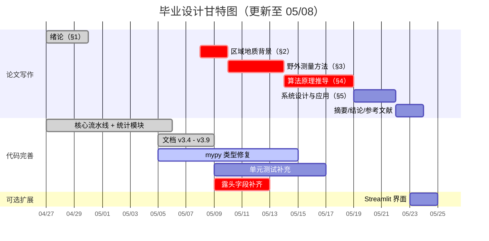

# 毕业设计任务流程与预期成果

> **版本**: v3.9 | **更新**: 2026-05-08 | **周期**: 2026 年 4 月 - 6 月（约 8 周）

---

## 项目概况

### 课题定义

实现 **岩体节理测线法坐标计算与可视化系统**，将 MATLAB 原型算法移植为 Python 工程化代码。覆盖 **8 个露头（O76-O83）共 172 条节理迹线**，完成从原始测绘数据到端点坐标计算、坐标变换、Excel 导出、迹线图与玫瑰花瓣图的自动化流水线。核心统计模块涵盖 I/II/III 型自动分类、P10/P20/P21 密度参数（实测优先三级回退管道）、圆形取样窗法 4 策略自适应（auto/tangent/hybrid/concentric）+ Mauldon 平均迹长估计 + 凸包露头面积。

> **配套文档**: 程序的安装、配置、CLI 用法、数据格式、输出及 MATLAB 对比详见 [`README.md`](../README.md)。本文件聚焦论文写作与任务进度跟踪。

### 参考资料

| 类别 | 资料 | 论文章节 |
|------|------|----------|
| 地质背景 | 董艳辉《区域地下水循环模式》、纪景仁《离散裂隙网络模拟》 | §2 |
| 统计理论 | 霍亮 x4（空间分布/多尺度/平面特征/聚类）、王贵宾《平均迹长》、杨春和《面密度估计》、许文涛《摄影测量》 | §1、§4.7 |
| 野外测量 | 测量原理.docx、测量工具.docx、测线法说明.pptx、现场照片 x2 | §3 |
| 论文写作 | 任务书、开题报告、文献综述、外文翻译、论文模板、过程管理手册 | 全文 |
| MATLAB | Coordinate.m / A_outcrop_0map_*.m + README.md | §4.3、§4.6 |

> 全部资料已引用（✅），仅董艳辉/纪景仁/许文涛待细读（📖）。文件位置见 `README.md` 目录结构。

### 代码完成状态

核心流水线已全部完成（配置、模型、角度、几何、变换、统计、I/O、绘图、CLI）。MATLAB ↔ Python 函数对应详见 [`reference/matlab/README.md`](matlab/README.md)。

| 项目 | 状态 | 论文处理 |
|------|------|----------|
| P10/P20/P21 + I/II/III 分类 + 圆形取样窗法 4 策略 + Mauldon 迹长 + 凸包面积 | ✅ | §4.7.1 |
| mypy 类型修复 | ⚠️ 进行中 | -- |
| 单元测试补充 | 🟡 进行中 | 目标覆盖率 >= 85% |
| 节点识别 | ❌ | §4.7.2 理论框架 + 结论 |
| Terzaghi 修正 | ❌ | §4.7.2 公式 + 结论 |

### 代码规模

| 指标 | 数值 |
|------|------|
| 源代码文件 | 34 .py（含 5 个 `__init__.py`） |
| 测试文件 | 17 test_*.py + conftest.py + __init__.py |
| 公开 API 导出 | 17 直接 + 3 惰性导入 = 20 个 |
| 不可变数据类 | 7 个核心（全 frozen=True） |
| 地质算法模块 | 12 个（4 公开 + 1 __init__ + 5 私有 `_*.py` + 2 工具 `_geometry_utils.py` / `_stat_format.py`） |
| CLI 参数 | 12 个（含简写 -i/-o/-c/-s/-p/-I/-l/-n） |
| 支持 Python 版本 | 3.9 - 3.13（5 版本） |
| 当前测试覆盖率 | 🟡 待获取（目标 >= 85%） |
| mypy 当前错误数 | ⚠️ 待获取（目标 0） |
| 代码总行数 | ~8200（含测试 ~3000，估算值） |
| 已实现（核心流水线） | ✅ 配置/模型/角度/几何/变换/统计/I/O/绘图/CLI（完整流水线 + 17 测试模块） |
| 待实现（论文理论框架） | 节点识别、极点等值线、Web 界面 — 均归入 §4.7.2 + 结论展望 |

---

## 一、论文写作任务

### 论文结构总览

| 章节 | 标题 | 字数 | 核心内容 | 状态 |
|------|------|------|----------|------|
| -- | 摘要 + 关键词 | 300-500 | 中英文双语 | ⏳ |
| §1 | 绪论 | 3000-4000 | 选题背景、研究现状、技术路线 | ✅ 初稿 |
| §2 | 区域地质背景 | 1500-2000 | 北山沙枣园岩体、构造环境、露头分布 | 🔴 |
| §3 | 野外测量与数据获取 | 4000-5000 | 综合法原理、露头概况、仪器、数据格式 | 🔴 |
| §4 | 算法原理与实现 | 4000-5000 | 倾向→走向转换、复数推导、坐标变换、迹线统计 | -- |
| §5 | 系统设计与应用 | 3000-4000 | 模块架构、三层接口、批量结果、MATLAB 对比 | -- |
| -- | 结论与展望 | 500-800 | 成果总结、创新点、未来工作 | -- |
| -- | 参考文献 | -- | >= 20 篇中英文 | -- |
| -- | 致谢 | 200-300 | -- | -- |

### 论文各章核心论点

| 章节 | 核心论点 | 关键证据 |
|------|----------|----------|
| §1 绪论 | MATLAB 逐条处理模式不满足工程化批量需求，需要系统化解决方案 | MATLAB for 循环 vs NumPy 向量化对比；手动改文件名 vs 自动扫描 |
| §2 地质背景 | 北山沙枣园场址对高放废物地质处置研究具有实际意义 | 纪景仁等地下实验室选址论证、董艳辉区域水文地质特征 |
| §3 野外测量 | 综合法能全面采集 I/II/III 型迹线信息，数据格式支撑完整计算流水线 | 三种类型几何定义、r1-r7 参数映射、8 露头 172 条实测数据 |
| §4 算法原理 | 复数向量化端点计算 + 三级回退统计是本文的算法贡献 | 三情形公式推导、P10/P20/P21 回退管道、auto 6因子评分、误差 < 1e-10 |
| §5 系统设计 | 四层模块化架构实现可复用的地质数据处理系统 | 7 个核心 frozen dataclass、20 个公开 API、CLI 12 参数 |
| 结论 | 向量化 + 统计增强 + 工程封装 = 从测绘数据到密度参数的有效数字化路径 | 8 露头完整输出、P10/P20/P21 汇总、4 项未来工作 |

### 写作注意事项

#### 格式规范

参照 `reference/论文/毕业设计(论文)模板-数字资源系(2025).docx`：

| 要素 | 要求 |
|------|------|
| 正文字体 | 宋体小四号，英文/数字 Times New Roman |
| 行距 | 1.5 倍 |
| 页边距 | 上 2.5cm、下 2.5cm、左 3cm、右 2cm |
| 图表编号 | 图 x-y / 表 x-y（x=章号，y=序号） |
| 公式编号 | 右对齐 (x-y) |
| 参考文献 | GB/T 7714-2015 格式 |
| 页码 | 摘要/目录 罗马数字，正文 阿拉伯数字 |

#### 术语一致性

论文全文应统一使用以下中英文术语对照：

| 中文 | English | 首次出现 |
|------|---------|----------|
| 节理迹线 | joint trace | §1 |
| 综合法 / 测线法 | scanline method | §3 |
| 倾向 | dip direction | §3 |
| 走向 | strike | §3 |
| 迹线端点 | trace endpoint | §4 |
| 圆形取样窗法 | circular sampling window method | §4.7 |
| 线密度 | P10 (linear density) | §4.7 |
| 面密度 | P20 (areal density) | §4.7 |
| 面累计长度密度 | P21 (areal intensity) | §4.7 |
| 凸包 | convex hull | §4.7 |
| 玫瑰花瓣图 | rose diagram | §5 |
| 不可变数据类 | frozen dataclass | §5 |

---

### 各章写作要点与交付物

#### §2 区域地质背景（2 天 · 🔴 最高 · 截止 05/09）

- [ ] §2.1 北山沙枣园岩体地质概况（地理位置、岩性、构造环境、节理发育）— 参考董艳辉、纪景仁
- [ ] §2.2 8 露头空间分布与代表性论证
- [ ] 配图：图 2-1 区域构造图

#### §3 野外测量与数据获取（4 天 · 🔴 最高 · 截止 05/13）

| 子节 | 内容 | 来源 |
|------|------|------|
| §3.1 | 露头选取原则（平整/新鲜/面积/一致/>30cm）与测量流程 | 野外规范 |
| §3.2 | 综合法原理（I/II/III 型几何定义）与操作流程 | 见 README 数据格式章节 |
| §3.3 | 露头概况表（8 露头，⚠️ 地理坐标/岩性/产状/风化程度待补，截止 05/13） | 野外记录本/导师 |
| §3.4 | 仪器与精度参数表 | `reference/测量/测量工具.docx` |
| §3.5 | 数据记录格式与 r1-r7 参数映射 | 见 README 数据格式章节 |
| §3.6 | I/II/III 型↔计算分支映射表 | 见代码 `endpoints.py` |

**交付物**：图 3-1（综合法示意图）、表 3-1（露头概况）、表 3-2（仪器参数）、表 3-3（类型映射）

#### §4 算法原理与实现（5 天 · 🔴 最高 · 截止 05/18）

| 子节 | 核心内容 | 对应代码 |
|------|----------|----------|
| §4.1 | 倾向→走向转换公式推导与值域验证 | `angles.py:dip_to_strike()` |
| §4.2 | 基准角构建（ang_base 使测线沿 x 轴正向） | `endpoints.py` |
| §4.3 | 三种情形复数法端点计算（**核心**，需 3 张配图） | `endpoints.py` |
| §4.4 | 半平面角折叠（保证迹线位于正确半平面） | `angles.py:fold_to_halfplane()` |
| §4.5 | 坐标变换流水线：平移→旋转→再平移 | `transforms.py` |
| §4.6 | 适用性分析 + MATLAB 对比（不晚于 05/15） | `reference/matlab/` |
| §4.7.1 | 迹线统计（✅ 已实现）：P10/P20/P21 三级回退 + 圆形取样窗法 4 策略 + auto 6因子评分 + Mauldon 迹长 + 凸包面积。论文推导 4 个关键公式（Laslett P20/P21、Mauldon L_est、Shoelace 面积） | `statistics.py` + `_*.py` |
| §4.7.2 | 扩展功能理论框架（节点识别、Terzaghi 修正 w=1/\|sin φ\|、极点等值线、无人机对比）— 归入结论展望 | 理论框架 |

**交付物**：图 4-1（角度转换）、图 4-2a/b/c（三种情形）、图 4-3（坐标变换）、图 4-4（圆窗分类）、表 4-1（MATLAB 对比）、表 4-2（auto 权重，✅）、算法流程图

#### §5 系统设计与应用（3 天 · 截止 05/21）

| 子节 | 核心内容 |
|------|----------|
| §5.1 | 四层模块架构（CLI→Pipeline→Core→IO/Plot）、7 个核心 frozen dataclass、纯函数 geology/ 子包 |
| §5.2 | 三层用户接口：命令行（12 参数）、Python API（20 个公开入口）、Web 界面（可选） |
| §5.3 | 8 露头批量处理结果：汇总统计表（见 README）、O80/O76 典型分析、旋转前后迹线图对比 |
| §5.4 | Web 界面架构设计（streamlit，可选，时间紧张可仅给架构说明） |

**交付物**：图 5-1（架构图，✅）、图 5-2（CLI 截图）、表 5-1（汇总表，✅）、图 5-3（O80 迹线图，✅）、图 5-4（玫瑰图拼图，✅）

#### 摘要、结论与参考文献（2 天 · 截止 05/24，全部章节完成后）

| 部分 | 要点 |
|------|------|
| 中英文摘要 | 背景 → 方法（测线法+复数向量化+圆窗统计）→ 结果（8 露头 172 条，P10/P20/P21）→ 结论 |
| 结论 | 成果总结 + 创新点（向量化、三层接口、密度统计增强）+ 不足 + 未来工作（4 项） |
| 参考文献 | >= 20 篇，GB/T 7714-2015 |

---

## 二、代码完善任务

### 已完成

| 任务 | 完成时间 | 备注 |
|------|----------|------|
| CLI 增强 + tqdm 进度条（P0） | 04/29 | 交互式模式、list/dry-run |
| 异常处理 + 列宽修复（P1） | 05/02 | 异常覆盖矩阵、列宽循环化 |
| 全包 docstring | 05/03 | -- |
| 文档完善 v3.4 | 05/05 | README + 任务流程 |
| P10/P20/P21 + I/II/III 分类 + 圆形取样窗法 4 策略 + Mauldon + 凸包 | 05/06 | 18 窗口、auto 评分、分组聚合、来源标注 |
| 文档 v3.6 / v3.7 完善 | 05/07 | 4 策略自适应、auto 评分机制、数据格式统一 |

### 进行中

| 任务 | 状态 | 目标日期 | 论文关联 |
|------|------|----------|----------|
| mypy 类型修复 | ⚠️ 进行中 | 05/15 | -- |
| 单元测试补充（集成测试） | 🟡 进行中 | 05/17 | -- |
| 文档 v3.9 完善 | 🟡 进行中 | 05/08 | README + 任务流程 |

### 未实现（论文中作为理论框架或未来工作）

| 功能 | 难度 | 论文处理 | 接口状态 |
|------|------|----------|----------|
| 节点识别（I/Y/X 型拓扑） | 中 | §4.7.2 理论框架 + 结论 | 未预留 |
| Terzaghi 修正 | 低 | §4.7.2 公式 + 结论 | 未预留 |
| 极点等值线图 | 中 | 结论展望 | 未预留 |
| Streamlit Web 界面 | 中 | §5.4 架构设计（可选） | 未预留 |
| 无人机对比 | 高 | 结论展望 | 未预留 |

### 测试

- 基线：17 模块测试文件 ✅
- 待补充：集成测试
- 目标覆盖率 >= 85%

---

## 三、代码模块与论文章节交叉索引

| 源代码模块 | 论文章节 | 内容关联 |
|-----------|---------|----------|
| `geology/angles.py` | §4.1, §4.4 | 倾向->走向转换、半平面角折叠 |
| `geology/endpoints.py` | §4.2, §4.3 | 基准角构建、三种情形端点计算 |
| `geology/transforms.py` | §4.5 | 坐标变换流水线（平移-旋转-再平移） |
| `geology/statistics.py` + `_*.py` 子模块 | §4.7.1 | P10/P20/P21、I/II/III 分类、圆窗法、auto 评分 |
| `geology/_window_scoring.py` | §4.7.1（auto 评分子节） | 6 因子加权评分与策略自动选择 |
| `geology/_convex_hull.py` | §4.7.1（露头面积子节） | 凸包面积估算 |
| `models.py`, `config.py`, `validation.py`, `pipeline.py` | §5.1 | 数据模型、配置管理、校验、流水线编排 |
| `cli/` | §5.2 | 命令行接口设计（12 参数） |
| `plotting/` + `reporting.py` | §5.3 | 迹线图/玫瑰图生成、结果汇总 |
| `io/excel_writer.py` | §5.3 | 四区 Excel 布局输出 |
| `reference/matlab/` | §4.6 | MATLAB 对比、Bug 修正（见 `reference/matlab/README.md`）、精度验证 |
| `reference/文献/` | §4.7 | 圆窗公式理论来源（Laslett、Mauldon、王贵宾） |
| `reference/地质背景/` | §2 | 区域地质背景（董艳辉、纪景仁） |
| `reference/测量/` | §3.1, §3.3 | 综合法原理、仪器参数 |

---

## 四、执行路线图

### 里程碑

| 日期 | 里程碑 | 验收标准 | 状态 |
|------|--------|----------|------|
| 04/29-05/08 | M1-M2: 核心就绪 | §1 初稿 ✅ / CLI+统计完整 ✅ / 文档 v3.9 ✅ | ✅ |
| 05/13 | M3: §2 + §3 | 露头字段补齐/标注 + §3 初稿 | 🔴 逾期 |
| 05/13 | M4: 露头字段 | `?` 字段补齐或标记"数据由导师提供" | 🔴 逾期 |
| 05/15 | M5: mypy | mypy 类型检查通过 | ⚠️ 进行中 |
| 05/17 | M6: 测试 | pytest 通过，覆盖率 >= 85% | 🟡 |
| 05/18 | M7: §4 | 算法推导 + §4.7 框架（含统计详述） | -- |
| 05/23 | M8: 全文 | §5 + 摘要/结论/参考文献完成 | -- |
| 05/25 | M9: 提交 | 论文 + 代码 + PPT 就绪 | -- |

---

## 五、风险管理

| 风险 | 概率 | 影响 | 缓解措施 | 进展 |
|------|------|------|----------|------|
| 野外数据缺失 | 高 | 中 | 05/13 前补齐，否则标注"数据由导师提供" | 🔴 已逾期 |
| MATLAB 算法偏差 | 中 | 高 | 逐行对照 + 对比测试 | ✅ |
| 分类映射混淆 | 中 | 中 | §3.6 映射表 + 代码自动分类 | ✅ |
| Python vs MATLAB 不一致 | 低 | 高 | O76 逐条对比 | ✅ < 1e-10 |
| 统计模块实现偏差 | 低 | 中 | 圆形取样窗法参考 Laslett (1982)、Mauldon (1998) 及王贵宾/杨春和文献，公式逐行验证，4 策略自适应 + 分组聚合 | ✅ |
| CJK 字体异常 | 中 | 低 | 多字体回退 | ✅ |
| 论文超代码范围 | 中 | 高 | 统计模块已全部实现，剩余扩展 -> §4.7.2 + 结论 | ✅ |
| 时间不足 | 中 | 高 | 可选功能降优先级 | -- |
| 导师修改意见 | 中 | 中 | 每章完即送审，预留 2-3 天 | -- |

---

## 六、成果清单

| 编号 | 成果物 | 形式 | 优先级 | 截止 | 状态 |
|------|--------|------|--------|------|------|
| 1 | 毕业论文（~20000 字） | Word/PDF | 🔴 必交 | 05/22 | ⏳ |
| 2 | Python 代码包（含统计模块） | GitHub+ZIP | 🔴 必交 | 05/17 | ✅ |
| 3 | 测试套件（覆盖率 >= 85%） | tests/ | 🟡 建议 | 05/17 | 🟡 |
| 4 | 8 露头输出（32 文件 + 统计信息） | output/ | 🔴 必交 | ✅ | ✅ |
| 5 | MATLAB vs Python 验证 | docs/ | 🟡 建议 | ✅ | ✅ |
| 6 | 项目文档 | README + 任务流程 | 🟡 建议 | ✅ | ✅ v3.9 |
| 7 | 答辩 PPT | PowerPoint | 🔴 必交 | 05/25 | ❌ |
| 8 | 迹线统计完整实现 | 论文 §4.7.1 + 代码 | 🔴 必交 | 05/22 | ✅ 代码+公式已实现 |

---

## 七、答辩 PPT 制作

> **周期**: 3-4 天 | **截止**: 05/25 | **优先级**: 🔴 必交

### 总体规划

| 部分 | 内容 | 页数 | 用时 |
|------|------|------|------|
| 结构设计 | 框架与视觉风格（校徽配色） | -- | 0.5 天 |
| 背景与意义 | 选题背景、北山沙枣园、研究现状 | 2-3 | 0.5 天 |
| 野外数据 | 综合法原理图、露头概况、现场照片 | 2-3 | 0.5 天 |
| 算法推导 | 倾向转换、三种情形复数公式（建议动画） | 3-4 | 1 天 |
| 系统演示 | CLI 录屏/截图、架构图、三层接口 | 2-3 | 0.5 天 |
| 结果展示 | 迹线图 + 玫瑰图 + 统计汇总 + MATLAB 对比 | 3-4 | 0.5 天 |
| 结论展望 | 成果总结 + 创新点 + 4 项未来工作 | 1-2 | 0.5 天 |
| 预演修改 | 2 轮预演 + 反馈修改 | -- | 1 天 |

### 逐页规划（18 页）

| 页码 | 标题 | 要素 | 素材来源 |
|------|------|------|----------|
| 1 | 封面 | 课题名称、姓名、学号、指导教师、日期 | -- |
| 2 | 研究背景与意义 | 北山场址意义、高放废物处置需求、节理调查必要性 | 纪景仁等、董艳辉等 |
| 3 | 研究现状与不足 | MATLAB 逐条处理局限、缺乏统计模块、无批量化 | 文献综述 |
| 4 | 技术路线 | 流程框图：数据采集 -> 算法 -> 系统 -> 输出 | 手绘 |
| 5 | 综合法原理 | I/II/III 型示意图（**建议动画逐步展示**） | `reference/测量/测线法说明.pptx` |
| 6 | 复数法端点计算（上） | Case 1/2 公式 + 示意图（**建议动画逐步展示**） | 手绘 + §4.3 |
| 7 | 复数法端点计算（下） | Case 3 公式 + 向量化实现说明 | §4.3 |
| 8 | 坐标变换流水线 | 三步变换图（平移->旋转->再平移） | §4.5 |
| 9 | 迹线统计方法 | P10/P20/P21 定义 + 三级回退示意 + I/II/III 分类 | §4.7.1 |
| 10 | 圆形取样窗法 | 4 策略对比 + **auto 6 因子评分柱状图** | §4.7.1 + output/ |
| 11 | 系统架构 | 四层架构图 + 模块关系 | README.md |
| 12 | CLI 演示 | 命令行截图或录屏 GIF（批量处理、交互选择） | 实际运行 |
| 13 | 典型结果（O80） | O80 旋转迹线图（含统计信息框） | `output/O80_rotated(strike=334.0).png` |
| 14 | 8 露头汇总 | P10/P20/P21 汇总表 + 策略列 + 玫瑰图拼图 | output/ + README 汇总表 |
| 15 | MATLAB 对比 | 对比表 + 误差 < 1e-10 验证 + Bug 修正说明 | §4.6 |
| 16 | 结论 | 3 项成果 + 3 项创新点 | 全文总结 |
| 17 | 未来工作 | 4 项扩展（节点识别、Terzaghi、极点等值线、无人机） | §4.7.2 |
| 18 | 致谢 | 感谢导师、同学 | -- |

> **提示**: 算法部分用动画逐步展示复数运算；系统演示提前录 GIF/MP4；图片素材从 `output/` 取用；总页数 18 页。

---

## 八、论文图表清单

> 统一索引论文中所需的全部图表，标注来源与完成状态，避免遗漏。

| 编号 | 类型 | 内容 | 来源 | 状态 |
|------|------|------|------|------|
| 图 2-1 | 地图 | 北山沙枣园区域构造图 | 董艳辉/纪景仁 PDF 截图 | ❌ |
| 图 3-1 | 示意图 | I/II/III 型综合法几何定义 | 手绘或参考 `测量原理.docx` | ❌ |
| 图 3-2 | 照片 | 野外测量现场 | `reference/测量/*.JPG` | ❌ |
| 表 3-1 | 表格 | 8 露头概况表（含坐标、岩性、产状等） | §3.2（待补全 `?` 字段） | 🟡 |
| 表 3-2 | 表格 | 仪器与精度参数 | `reference/测量/测量工具.docx` | ❌ |
| 表 3-3 | 表格 | 综合法类型↔计算分支映射 | §3.5 | ❌ |
| 图 4-1 | 示意图 | 倾向→走向转换角度关系 | 手绘 | ❌ |
| 图 4-2a/b/c | 示意图 | 三种情形复数法推导（Case 1/2/3 各一） | 手绘 | ❌ |
| 图 4-3 | 示意图 | 坐标变换三步流水线（平移→旋转→再平移） | 手绘 | ❌ |
| 图 4-4 | 示意图 | 圆形取样窗 n₀/n₁/n₂ 分类 | 手绘或参考 Laslett (1982) | ❌ |
| 表 4-1 | 表格 | MATLAB vs Python 对比 | README.md + benchmark | 🟡 |
| 表 4-2 | 表格 | auto 策略 6 因子权重 | README.md | ✅ |
| 图 5-1 | 框图 | 四层系统架构 | README.md Mermaid | ✅ |
| 图 5-2 | 截图 | CLI 运行终端截图 | 实际运行 | ❌ |
| 表 5-1 | 表格 | 8 露头 P10/P20/P21 汇总 | README.md + `output/` | ✅ |
| 图 5-3 | 迹线图 | O80 旋转迹线图（含 LaTeX 统计框） | `output/O80_rotated(strike=334.0).png` | ✅ |
| 图 5-4 | 拼图 | 8 露头玫瑰图 | `output/*_rose(bin=10.0).png` | ✅ |

> 图片编号格式：图 x-y（x=章号，y=序号）。论文模板要求图题在图片下方，表题在表格上方。

---

> 📌 **使用说明**: 完成子任务后在 `- [ ]` 前打 `x` 变为 `- [x]`。每周日更新，对照甘特图调整下周计划。当前版本 v3.9。
