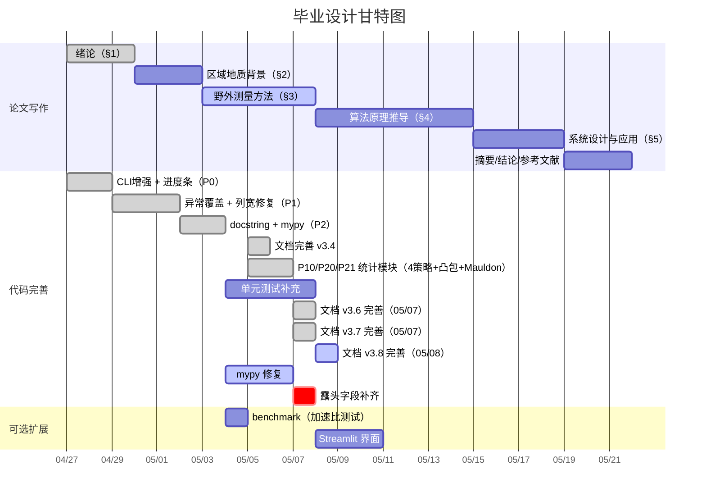

# 毕业设计任务流程与预期成果

> **版本**: v3.9 | **更新**: 2026-05-08 | **周期**: 2026 年 4 月 - 6 月（约 8 周）

---

## 项目概况

### 课题定义

实现 **岩体节理测线法坐标计算与可视化系统**，将 MATLAB 原型算法移植为 Python 工程化代码。覆盖 **8 个露头（O76-O83）共 172 条节理迹线**，完成从原始测绘数据到端点坐标计算、坐标变换、Excel 导出、迹线图与玫瑰花瓣图的自动化流水线。核心统计模块涵盖 I/II/III 型自动分类、P10/P20/P21 密度参数（实测优先三级回退管道）、圆形取样窗法 4 策略自适应（auto/tangent/hybrid/concentric）+ Mauldon 平均迹长估计 + 凸包露头面积。

> **配套文档**: 程序的安装、配置、CLI 用法、数据格式、输出及 MATLAB 对比详见 [`README.md`](../README.md)。本文件聚焦论文写作与任务进度跟踪。

### 参考资料

| 类别 | 资料 | 文件名 | 论文引用点 | 状态 |
|------|------|--------|-----------|------|
| 地质 | 董艳辉《区域地下水循环模式》 | `地质背景——...董艳辉.pdf` | §2.1 区域水文地质与构造环境 | 📖 待读 |
| 地质 | 纪景仁《离散裂隙网络模拟...以甘肃北山地下实验室为例》 | `地质背景——...纪景仁.pdf` | §2.1 岩体特征与节理发育、§1 研究背景 | 📖 待读 |
| 统计 | 霍亮《北山沙枣园花岗岩体随机结构面的空间分布》 | `北山沙枣园...空间分布_霍亮.*` | §3 露头节理分布、§4.7 统计基础 | ✅ 已引用 |
| 统计 | 霍亮《北山沙枣园花岗岩岩体不同尺度结构面几何特征研究》 | `北山沙枣园...不同尺度..._霍亮.*` | §3 多尺度特征、§4.7 密度对比 | ✅ 已引用 |
| 统计 | 霍亮《北山沙枣园花岗岩岩体露头节理的平面特征研究》 | `北山沙枣园...平面特征_霍亮.*` | §3.2 平面特征、§5.3 结果验证 | ✅ 已引用 |
| 统计 | 霍亮《基于混合Fisher分布的随机结构面产状聚类模型》 | `基于混合Fisher..._霍亮.*` | §1 研究现状（产状聚类） | ✅ 已引用 |
| 统计 | 王贵宾《岩体节理平均迹长估计》 | `岩体节理平均迹长估计_王贵宾.pdf` | §4.7.1 P10/P20/P21 公式推导、Mauldon 迹长 | ✅ 已引用 |
| 统计 | 杨春和等《岩体节理平均迹长和迹线中点面密度估计》 | `岩体节理平均迹长和..._杨春和.pdf` | §4.7.1 面密度估计、圆形取样窗理论 | ✅ 已引用 |
| 统计 | 许文涛《基于摄影测量系统的岩体结构面精细识别表征及应用》 | `基于摄影测量..._许文涛.*` | §1 技术路线对比（摄影测量 vs 测线法） | 📖 待读 |
| 测量 | 测量原理.docx — I/II/III 型几何定义、L0-L3 映射 | `reference/测量/测量原理.docx` | §3.1 综合法原理与操作流程 | ✅ 已引用 |
| 测量 | 测线法说明.pptx — 操作流程图、野外照片 | `reference/测量/测线法说明.pptx` | §3.1 配图素材 | ✅ 已引用 |
| 测量 | 测量工具.docx — 仪器型号与精度规格 | `reference/测量/测量工具.docx` | §3.3 仪器与精度参数表 | ✅ 已引用 |
| 测量 | 现场照片 x2 | `reference/测量/*.JPG` | §3 配图、答辩 PPT | ✅ 已引用 |
| 论文 | 毕业设计(论文)模板-数字资源系(2025).docx | `reference/论文/毕业设计(论文)模板...` | 全文格式（字号、行距、页边距、参考文献） | ✅ 已引用 |
| 论文 | 任务书.docx | `reference/论文/...任务书_周咏霖.docx` | 课题来源与要求 | ✅ 已引用 |
| 论文 | 开题报告.docx | `reference/论文/...开题报告.docx` | 研究方案与技术路线 | ✅ 已引用 |
| 论文 | 文献综述.docx | `reference/论文/...文献综述.docx` | §1 研究现状素材 | ✅ 已引用 |
| 论文 | 外文翻译（原件 PDF + 翻译件 PDF/DOCX） | `reference/论文/...外文翻译...` | 附录 | ✅ 已引用 |
| 论文 | 过程管理手册（参考）.docx | `reference/论文/...过程管理手册...` | 答辩流程参考 | ✅ 已引用 |
| MATLAB | Coordinate.m / A_outcrop_0map_coordinate.m / A_outcrop_0map_rotate.m + README.md | `reference/matlab/` | §4.6 MATLAB 对比、§4.3 算法验证 | ✅ 已引用 |

### 代码完成状态

核心流水线已全部完成（配置、模型、角度、几何、变换、统计、I/O、绘图、CLI 全功能、测试模块（17 文件）），详见 [`README.md`](../README.md)。MATLAB <-> Python 函数对应关系详见 [`reference/matlab/README.md`](matlab/README.md)。

**待完成工作**：

| 项目 | 状态 | 论文处理 |
|------|------|----------|
| mypy --strict 类型修复 | ⚠️ 进行中（截至 05/07） | -- |
| 单元测试补充（集成测试） | 🟡 进行中 | -- |
| P10/P20/P21 密度统计 + I/II/III 型分类 + 圆形取样窗法 4 策略自适应（auto 6因子加权评分/tangent/hybrid/concentric）+ Mauldon 迹长 + 凸包面积 | ✅ 已实现 | §4.7.1 详述算法与结果（含 auto 评分机制） |
| 节点识别 | ❌ | §4.7.2 理论框架 + 结论章"未来工作" |

### 代码规模

| 指标 | 数值 |
|------|------|
| 源代码文件 | 32 .py（含 4 空 `__init__.py`） |
| 测试文件 | 17 test_*.py + conftest.py |
| 公开 API 导出 | 21 个（含 3 惰性导入） |
| 不可变数据类 | 6 个（全 frozen=True） |
| 地质算法模块 | 10 个（4 公开 + 6 私有 `_*.py`） |
| CLI 参数 | 12 个（含简写 -i/-o/-c/-s/-p/-I/-l/-n） |
| 支持 Python 版本 | 3.9 - 3.13（5 版本） |
| 当前测试覆盖率 | 🟡 待获取（目标 >= 85%） |
| mypy 当前错误数 | ⚠️ 待获取（目标 0） |
| 代码总行数 | ~7500（含测试 ~2500） |
| Terzaghi 修正 | ❌ | §4.7.2 几何修正公式（w = 1/|sin φ|）+ 结论章"未来工作"（代码中参数接口待实现） |
| 极点等值线图 | ❌ | 结论章展望 |
| Web 界面（streamlit） | ❌ | §5.4 架构设计（可选） |

---

## 一、论文写作任务

### 论文结构总览

| 章节 | 标题 | 字数 | 核心内容 | 状态 |
|------|------|------|----------|------|
| -- | 摘要 + 关键词 | 300-500 | 中英文双语 | ⏳ |
| §1 | 绪论 | 3000-4000 | 选题背景、研究现状、技术路线 | ✅ 初稿 |
| §2 | 区域地质背景 | 1500-2000 | 北山沙枣园岩体、构造环境、露头分布 | 🔴 |
| §3 | 野外测量与数据获取 | 4000-5000 | 综合法原理、露头概况、仪器、数据格式 | 🔴 |
| §4 | 算法原理与实现 | 4000-5000 | 倾角转换、复数推导、坐标变换、扩展框架 | -- |
| §5 | 系统设计与应用 | 3000-4000 | 模块架构、三层接口、批量结果、MATLAB 对比 | -- |
| -- | 结论与展望 | 500-800 | 成果总结、创新点、未来工作 | -- |
| -- | 参考文献 | -- | >= 20 篇中英文 | -- |
| -- | 致谢 | 200-300 | -- | -- |

### 论文各章核心论点

| 章节 | 核心论点 | 关键证据 |
|------|----------|----------|
| §1 绪论 | MATLAB 逐条处理模式不满足工程化批量需求，需要系统化解决方案 | MATLAB for 循环 vs NumPy 向量化对比；手动改文件名 vs 自动扫描 |
| §2 地质背景 | 北山沙枣园场址对高放废物地质处置研究具有实际意义 | 纪景仁等地下实验室选址论证、董艳辉区域水文地质特征 |
| §3 野外测量 | 综合法能全面采集 I/II/III 型迹线信息，数据格式支撑完整计算流水线 | 三种类型几何定义、r1-r7 参数映射、8 露头 172 条实测数据 |
| §4 算法原理 | 复数向量化端点计算 + 三级回退统计是本文的算法贡献 | 三情形公式推导、P10/P20/P21 回退管道、auto 6因子评分、误差 < 1e-10 |
| §5 系统设计 | 四层模块化架构实现可复用的地质数据处理系统 | 6 frozen dataclass、21 个公开 API、CLI 12 参数、CI 10 jobs |
| 结论 | 向量化 + 统计增强 + 工程封装 = 从测绘数据到密度参数的有效数字化路径 | 8 露头完整输出、P10/P20/P21 汇总、4 项未来工作 |

### 写作注意事项

#### 格式规范

参照 `reference/论文/毕业设计(论文)模板-数字资源系(2025).docx`：

| 要素 | 要求 |
|------|------|
| 正文字体 | 宋体小四号，英文/数字 Times New Roman |
| 行距 | 1.5 倍 |
| 页边距 | 上 2.5cm、下 2.5cm、左 3cm、右 2cm |
| 图表编号 | 图 x-y / 表 x-y（x=章号，y=序号） |
| 公式编号 | 右对齐 (x-y) |
| 参考文献 | GB/T 7714-2015 格式 |
| 页码 | 摘要/目录 罗马数字，正文 阿拉伯数字 |

#### 术语一致性

论文全文应统一使用以下中英文术语对照：

| 中文 | English | 首次出现 |
|------|---------|----------|
| 节理迹线 | joint trace | §1 |
| 综合法 / 测线法 | scanline method | §3 |
| 倾向 | dip direction | §3 |
| 走向 | strike | §3 |
| 迹线端点 | trace endpoint | §4 |
| 圆形取样窗法 | circular sampling window method | §4.7 |
| 线密度 | P10 (linear density) | §4.7 |
| 面密度 | P20 (areal density) | §4.7 |
| 面累计长度密度 | P21 (areal intensity) | §4.7 |
| 凸包 | convex hull | §4.7 |
| 玫瑰花瓣图 | rose diagram | §5 |
| 不可变数据类 | frozen dataclass | §5 |

#### 图片使用规范

| 用途 | 来源 | 规格要求 |
|------|------|----------|
| 旋转迹线图（论文正文） | `output/{outcrop}_rotated(strike=*.0).png` | 600 DPI，适合印刷 |
| 玫瑰花瓣图 | `output/{outcrop}_rose(bin=10.0).png` | 400 DPI |
| 原始迹线图（对比展示） | `output/{outcrop}_raw(n=*).png` | 300 DPI |
| 现场照片 | `reference/测量/*.JPG` | 需裁剪并添加中文图题 |
| 综合法示意图 | 手绘或参考 `reference/测量/测线法说明.pptx` | 需标注 I/II/III 型 |

> 所有图题使用中文，格式为「图 x-y 图题内容」。

---

### 1.1 第二章「区域地质背景」

> **周期**: 3 天 | **优先级**: 🟡 中

#### §2.1 北山沙枣园花岗岩体地质概况（~800 字）

| 要点 | 内容 | 参考资料 |
|------|------|----------|
| 地理位置 | 北山地区戈壁地带 | 地质资料 |
| 岩体特征 | 花岗岩岩性、形成年代、侵入关系 | 纪景仁等 |
| 构造环境 | 区域构造应力场、主要断裂带 | 董艳辉等 |
| 节理发育 | 节理组数、优势走向与构造关系 | 文献综述 |

#### §2.2 研究露头分布与选取依据（~600 字）

- 8 个露头空间分布示意
- 与区域构造线的关系
- 代表性论证

#### 交付物

- [ ] §2.1 地质概况
- [ ] §2.2 露头分布与选取依据
- [ ] 参考文献（董艳辉等、纪景仁等）

---

### 1.2 第三章「野外测量与数据获取」

> **周期**: 5 天 | **优先级**: 🔴 最高

#### §3.0 露头选取原则与测量规范（~600 字）

| 原则 | 要求 | 目的 |
|------|------|------|
| 露头平整 | 面应尽量平整 | 减小几何误差 |
| 露头新鲜 | 未受爆破、风化、植被影响 | 反映原生节理特征 |
| 面积充足 | 尽可能大 | 提高统计代表性 |
| 测量一致 | 不变更人员、设备、方法 | 减小系统误差 |
| 迹长下限 | 仅记录 > 30 cm 的结构面 | 排除表层微裂隙 |

**测量总体流程**：踏勘选点 -> GPS 定位 -> 综合法测量 -> 记录测线走向 -> 按优势产状分组 -> 露头面积与产状测量 -> 红色油漆编号 -> 含比例尺拍照。

#### §3.1 综合法测量原理与操作流程（~1000 字）

I/II/III 型定义、判定条件及 r1-r7 参数映射详见 [`README.md`](../README.md#综合法测量原理)。此处仅补充论文所需的类型与计算分支对应关系。

**操作流程**：布设 30m 皮尺 -> 油漆编号 -> 判定类型 -> 记录 r1-r7 -> 罗盘测倾向 -> 钢卷尺测迹长 -> 塞尺测隙宽 -> 记录填充物。

> 需配图说明三种类型并用数学不等式表达判定条件。

#### §3.2 露头概况表（~600 字）

| 露头 | 地理坐标 | 岩性 | 露头产状 | 风化程度 | 测线方位 | 迹线数 |
|------|----------|------|----------|----------|----------|--------|
| O76 | ? | 花岗岩 | ? | ? | 298 | 19 |
| O77 | ? | 花岗岩 | ? | ? | 280 | 19 |
| O78 | ? | 花岗岩 | ? | ? | 165 | 26 |
| O79 | ? | 花岗岩 | ? | ? | 212 | 20 |
| O80 | ? | 花岗岩 | ? | ? | 334 | 29 |
| O81 | ? | 花岗岩 | ? | ? | 75 | 19 |
| O82 | ? | 花岗岩 | ? | ? | 273 | 20 |
| O83 | ? | 花岗岩 | ? | ? | 265 | 20 |

> ⚠️ `?` 字段待从以下来源补全：① 野外记录本原始记录；② 导师霍亮补充；③ 参考王贵宾/杨春和文献中同区域露头描述。
> **截止日延至 05/11**，逾期则在论文中注明"数据由导师提供"，不再阻塞写作。

#### §3.3 仪器与精度（~400 字）

参考 `reference/测量/测量工具.docx`（仪器型号与精度规格，以现场实际使用为准）。

| 仪器 | 型号 | 测量对象 | 精度 |
|------|------|----------|------|
| 地质罗盘 | 哈尔滨 DQY-1 | 倾向、方位角 | +-1 |
| 皮尺 | 50m 玻璃纤维 | 测线、露头总长 | +-0.01 m |
| 钢卷尺 | 5m | 迹长 r4-r7 | +-0.01 m |
| 塞尺 | 德力西 150A17 | 节理开度 | +-0.02 mm |
| 测距仪 | Bosch GLM 7000 | 距离复核 | +-0.001 m |
| GPS | 手持 | 露头坐标 | +-3-5 m |

#### §3.4 数据记录与格式映射（~1000 字）

野外记录录入为 `{露头编号}_process.xls`，存放于 `input/`。综合法参数（L0、L1、L2、L3）到计算符号（r1-r7）的映射及列布局详见 [`README.md`](../README.md) 数据格式章节。

> ⚠️ 倾角字段需测量但不参与端点坐标计算。迹线下限 30 cm。

#### §3.5 综合法类型与计算分支映射（~500 字）

明确野外分类与程序分类的对应关系：

| 综合法类型 | 判定 | 典型计算分支 |
|-----------|------|-------------|
| I型（相交型） | 迹线穿过测线 | 双侧迹线（r4!=0, r6!=0） |
| II型（延长相交型） | 延长线穿过测线 | 左迹线或右迹线 |
| III型（不相交型） | 均不穿过 | 左迹线或右迹线 |

> 例外：若某一侧迹线段长度为 0，I型可退化为单侧。

#### 交付物

- [ ] §3.0 露头选取原则
- [ ] §3.1 综合法原理 + 配图 + 操作流程
- [ ] §3.2 露头概况表（补全 `?` -- 🔴 05/07 已逾期）
- [ ] §3.3 仪器参数表
- [ ] §3.4 数据格式映射
- [ ] §3.5 综合法类型<->计算分支映射表

---

### 1.3 第四章「算法原理与实现」

> **周期**: 7 天 | **优先级**: 🔴 最高（核心章节）

#### §4.1 倾向->走向转换（~600 字）

- 走向 = 倾向 - 90（dd>=90）；走向 = dd + 270（dd<90）
- 分段证明与值域验证
- 代码：`angles.py:dip_to_strike()`

#### §4.2 基准角构建（~400 字）

- 定义 ang_base 使测线沿 x 轴正向延伸
- 代码：`endpoints.py:compute_endpoints()`

#### §4.3 三种情形复数法端点计算（~1500 字，核心）

复平面 z = x + iy，交点 z1 = r1 + i*0：

| 情形 | 条件 | 公式要点 |
|------|------|----------|
| Case 1（仅左侧） | r4!=0, r6=0 | P_start = z1 + r2*e^i(theta_base+pi/2) + r4*e^i*theta_skew |
| Case 2（仅右侧） | r4=0, r6!=0 | P_start = z1 + r2*e^i(theta_base-pi/2) + r6*e^i*theta_skew |
| Case 3（双侧） | r4!=0, r6!=0 | 左右端点分别计算 |

> 需配图展示三条典型节理对应 Case 1/2/3。代码：`endpoints.py`

**§4.3 必须推导的关键公式**：
1. 基准角 theta_base = azimuth_to_cartesian(ang0)
2. 垂直偏移向量 delta_perp = r2 * exp(i * (theta_base +- pi/2))
3. Case 1 起点与终点公式（含半平面折叠）
4. Case 2 起点与终点公式（对称情形）
5. Case 3 双侧端点公式（左右分别计算）
6. numpy.select 向量化实现的数学等价性说明

**所需配图**：三种情形示意图 x3（每种一张，标注 z1、r2、r4-r7、theta_skew）

#### §4.4 半平面角折叠（~500 字）

- 保证迹线位于测线正确半平面
- 代码：`angles.py:fold_to_halfplane()`

#### §4.5 坐标变换流水线（~800 字）

| 步骤 | 操作 | 目的 |
|------|------|------|
| (1) | 平移至正象限 | 坐标 >= 0 |
| (2) | 走向角旋转 | 测线转至水平 |
| (3) | 再次平移 | 去除旋转负值 |

整体：x_out = T2(R(theta) * T1(x_in))。代码：`transforms.py`

#### §4.6 适用性分析与 MATLAB 对比（~800 字）

| 维度 | 要点 |
|------|------|
| 适用性 | 平行节理 ✅、共轭节理 ✅、随机节理 ⚠️ |
| 方位敏感性 | 测线与主节理走向夹角 < 30 时 r2 误差放大 |
| MATLAB vs Python | for 循环 vs NumPy 广播，需 benchmark 获得加速比 |
| 验证 | O76 基准对比，误差 < 1e-10 m ✅ |

> ⚠️ 加速比需实际运行 benchmark（建议使用 `timeit` 或 `pytest-benchmark`），推荐在 §4 算法推导写作前完成（不晚于 05/15）。

#### §4.7 迹线统计与扩展功能理论框架（~1600 字）

##### §4.7.1 迹线分型与密度统计（~800 字，✅ 代码已全部实现）

统计指标定义、三级回退逻辑、4 策略窗口布置、auto 评分 6 因子权重详见 [`README.md`](../README.md#迹线统计指标)。论文 §4.7.1 聚焦以下 **4 个关键公式的数学推导**：

**§4.7.1 必须推导的关键公式**：
1. P20 = m / (2 * pi * R^2)（Laslett 1982 圆窗闭式公式）
2. P21 = q / (4R)（Laslett 1982）
3. L_est = (pi * R / 2) * (q / m)（Mauldon 1998 平均迹长）
4. 凸包面积 Shoelace 公式：A = (1/2) * |sum(x_i * y_{i+1} - x_{i+1} * y_i)|

**所需配图**：圆形取样窗几何示意图 x1（标注圆心、半径 R、n0/n1/n2 分类）

> 统计方法详情及公式见 [`README.md`](../README.md) 迹线统计指标章节。各露头对比汇总见 §5.3。

##### §4.7.2 待扩展功能框架（~600 字）

以下在论文中给出理论框架，具体实现列为"未来工作"：

| 功能 | 理论要点 | 优先级 |
|------|----------|--------|
| 节点识别 | I/Y/X 型拓扑判定，端点邻近搜索 + 距离阈值 | 🟡 |
| Terzaghi 修正 | 修正因子 w = 1/|sin φ|（论文给出理论公式，代码中参数接口待实现） | 🟡 |
| 极点等值线 | KDE + 施密特网下半球投影 | 🟢 |
| 无人机对比 | 重构迹线与正射影像叠合 | 🟢 |

#### 交付物

- [ ] §4.1 倾向->走向转换
- [ ] §4.2 基准角构建
- [ ] §4.3 三种情形复数推导（含 3 张配图）
- [ ] §4.4 半平面角折叠
- [ ] §4.5 坐标变换流水线（含旋转矩阵推导）
- [ ] §4.6 适用性分析 + MATLAB 对比（含加速比）
- [ ] §4.7.1 迹线分型与密度统计（含 4 个圆窗公式推导 + 1 张配图）
- [ ] §4.7.2 扩展功能理论框架
- [ ] 算法流程图

---

### 1.4 第五章「系统设计与应用」

> **周期**: 4 天 | **依赖**: 代码优化完成后

#### §5.1 模块架构设计（~800 字）

四层架构：用户接口层（CLI）-> 流水线层（pipeline.py）-> 核心计算层（geology/ 子包：angles、endpoints、transforms、statistics + 6 个私有模块）-> 数据与输出层（io/、plotting/、reporting）。详见 [`README.md`](../README.md)。

#### §5.2 三层用户接口（~1200 字）

| 层次 | 用户 | 技术 |
|------|------|------|
| 命令行 | 地质工程师 | argparse，12 参数 |
| Python API | 科研开发 | `trace_pipeline` 包，21 个公开入口 |
| Web 界面 | 非编程用户 | streamlit（见 §5.4） |

#### §5.3 批量处理结果（~1000 字）

- 8 露头汇总统计表（迹线数、平均迹长、主走向、玫瑰图峰值、I/II/III 分型统计、自适应窗口策略、来源标注）
- 各露头 P10/P20/P21 密度参数对比与地质解释
- O80（29 条）和 O76（19 条）典型分析
- 旋转前后迹线图对比（含统计信息框）

#### §5.4 Web 界面架构设计（~500 字，可选）

左侧控制面板（上传文件、参数调整）+ 右侧预览区（迹线图、玫瑰图）。技术选型：`streamlit.file_uploader`、`slider`、`image`、`download_button`。时间紧张则仅给出架构说明。

#### 交付物

- [ ] §5.1 系统架构图 + 模块说明
- [ ] §5.2 三层接口 + 代码示例
- [ ] §5.3 批量处理汇总 + 典型分析
- [ ] §5.4 Web 界面架构设计（可选）

---

### 1.5 摘要、结论与参考文献

> **周期**: 3 天 | **依赖**: 全部章节完成后

| 部分 | 要点 |
|------|------|
| 中文摘要 | 背景 -> 方法（测线法+复数向量化+圆形取样窗统计）-> 结果（8 露头 172 条，含 P10/P20/P21 密度参数）-> 结论 |
| 英文摘要 | 中文翻译，术语：scanline method, joint trace, strike/dip, rose diagram, circular sampling window, P10/P20/P21 |
| 结论 | 成果总结 + 创新点（向量化、三层接口、密度统计增强）+ 不足 + 未来工作（4 项扩展） |
| 参考文献 | >= 20 篇 |
| 致谢 | 200-300 字 |

---

## 二、代码完善任务

### 已完成

| 任务 | 完成时间 | 备注 |
|------|----------|------|
| CLI 增强 + tqdm 进度条（P0） | 04/29 | 交互式模式、list/dry-run |
| 异常处理 + 列宽修复（P1） | 05/02 | 异常覆盖矩阵、列宽循环化 |
| 全包 docstring | 05/03 | -- |
| 文档完善 v3.4 | 05/05 | README + 任务流程 |
| P10/P20/P21 + I/II/III 分类 + 圆形取样窗法 4 策略 + Mauldon + 凸包 | 05/06 | 18 窗口、auto 评分、分组聚合、来源标注 |
| 文档 v3.6 / v3.7 完善 | 05/07 | 4 策略自适应、auto 评分机制、数据格式统一 |

### 进行中

| 任务 | 状态 | 目标日期 | 论文关联 |
|------|------|----------|----------|
| mypy --strict 类型修复 | ⚠️ 进行中 | 05/15 | -- |
| 单元测试补充（集成测试） | 🟡 进行中 | 05/17 | -- |
| 文档 v3.8 完善 | 🟡 进行中 | 05/08 | README + 任务流程 |

### 未实现（论文中作为理论框架或未来工作）

| 功能 | 难度 | 论文处理 | 接口状态 |
|------|------|----------|----------|
| 节点识别（I/Y/X 型拓扑） | 中 | §4.7.2 理论框架 + 结论 | 未预留 |
| Terzaghi 修正 | 低 | §4.7.2 公式 + 结论 | 代码中参数接口待实现 |
| 极点等值线图 | 中 | 结论展望 | 未预留 |
| Streamlit Web 界面 | 中 | §5.4 架构设计（可选） | 未预留 |
| 无人机对比 | 高 | 结论展望 | 未预留 |

### 测试

- 基线：17 模块测试文件 ✅
- 待补充：集成测试
- 目标覆盖率 >= 85%

---

## 三、代码模块与论文章节交叉索引

| 源代码模块 | 论文章节 | 内容关联 |
|-----------|---------|----------|
| `geology/angles.py` | §4.1, §4.4 | 倾向->走向转换、半平面角折叠 |
| `geology/endpoints.py` | §4.2, §4.3 | 基准角构建、三种情形端点计算 |
| `geology/transforms.py` | §4.5 | 坐标变换流水线（平移-旋转-再平移） |
| `geology/statistics.py` + `_*.py` 子模块 | §4.7.1 | P10/P20/P21、I/II/III 分类、圆窗法、auto 评分 |
| `geology/_window_scoring.py` | §4.7.1（auto 评分子节） | 6 因子加权评分与策略自动选择 |
| `geology/_convex_hull.py` | §4.7.1（露头面积子节） | 凸包面积估算 |
| `models.py`, `config.py`, `validation.py`, `pipeline.py` | §5.1 | 数据模型、配置管理、校验、流水线编排 |
| `cli/` | §5.2 | 命令行接口设计（12 参数） |
| `plotting/` + `reporting.py` | §5.3 | 迹线图/玫瑰图生成、结果汇总 |
| `io/excel_writer.py` | §5.3 | 四区 Excel 布局输出 |
| `reference/matlab/` | §4.6 | MATLAB 对比、Bug 修正（见 `reference/matlab/README.md`）、精度验证 |
| `reference/文献/` | §4.7 | 圆窗公式理论来源（Laslett、Mauldon、王贵宾） |
| `reference/地质背景/` | §2 | 区域地质背景（董艳辉、纪景仁） |
| `reference/测量/` | §3.1, §3.3 | 综合法原理、仪器参数 |

---

## 四、执行路线图

### 里程碑

| 日期 | 里程碑 | 验收标准 | 状态 |
|------|--------|----------|------|
| 04/29 | M1: 绪论 | §1 初稿完成 | ✅ |
| 05/05 | M2: 文档 | README + 任务流程 v3.2（统计模块文档补充） | ✅ |
| 05/06 | M2b: 统计 | P10/P20/P21 + I/II/III + 圆形取样窗法实现，文档 v3.4 | ✅ |
| 05/07 | M2c: 文档完善 | README + 任务流程 v3.6（4 策略自适应、凸包面积、Mauldon 迹长、来源标注） | ✅ |
| 05/07 | M2d: 文档 v3.7 | auto 策略评分机制、数据格式统一、露头字段标注 | ✅ |
| 05/07 | M3b: §2 + 露头字段 | `?` 字段补齐或标记 + §2 初稿 | 🔴 已逾期 |
| 05/08 | M2e: 文档 v3.8 | README + 任务流程全面完善（目录树、设计理念、CI、交叉索引） | 🟡 进行中 |
| 05/11 | M4: §3 | §3.5 映射表定稿 + §4.7.1 统计结果 | -- |
| 05/15 | M5: P1+P2 | mypy --strict 通过 | ⚠️ |
| 05/17 | M6: 测试 | pytest 通过，覆盖率 >= 85% | -- |
| 05/19 | M7: §4 | 算法推导 + §4.7 框架（含统计详述） | -- |
| 05/22 | M8: 全文 | 摘要/结论/参考文献完成 | -- |
| 05/25 | M9: 提交 | 论文 + 代码 + PPT 就绪 | -- |

---

## 五、风险管理

| 风险 | 概率 | 影响 | 缓解措施 | 进展 |
|------|------|------|----------|------|
| 野外数据缺失 | 高 | 中 | 05/07 前补齐，否则标注"数据由导师提供" | 🔴 已逾期 |
| MATLAB 算法偏差 | 中 | 高 | 逐行对照 + 对比测试 | ✅ |
| 分类映射混淆 | 中 | 中 | §3.5 映射表 + 代码自动分类 | ✅ |
| Python vs MATLAB 不一致 | 低 | 高 | O76 逐条对比 | ✅ < 1e-10 |
| 统计模块实现偏差 | 低 | 中 | 圆形取样窗法参考 Laslett (1982)、Mauldon (1998) 及王贵宾/杨春和文献，公式逐行验证，4 策略自适应 + 分组聚合 | ✅ |
| CJK 字体异常 | 中 | 低 | 多字体回退 | ✅ |
| 论文超代码范围 | 中 | 高 | 统计模块已全部实现，剩余扩展 -> §4.7.2 + 结论 | ✅ |
| 时间不足 | 中 | 高 | 可选功能降优先级 | -- |
| 导师修改意见 | 中 | 中 | 每章完即送审，预留 2-3 天 | -- |

---

## 六、成果清单

| 编号 | 成果物 | 形式 | 优先级 | 截止 | 状态 |
|------|--------|------|--------|------|------|
| 1 | 毕业论文（~20000 字） | Word/PDF | 🔴 必交 | 05/22 | ⏳ |
| 2 | Python 代码包（含统计模块） | GitHub+ZIP | 🔴 必交 | 05/17 | ✅ |
| 3 | 测试套件（覆盖率 >= 85%） | tests/ | 🟡 建议 | 05/17 | 🟡 |
| 4 | 8 露头输出（32 文件 + 统计信息） | output/ | 🔴 必交 | ✅ | ✅ |
| 5 | MATLAB vs Python 验证 | docs/ | 🟡 建议 | ✅ | ✅ |
| 6 | 项目文档 | README + 任务流程 | 🟡 建议 | ✅ | ✅ v3.8 |
| 7 | 答辩 PPT | PowerPoint | 🔴 必交 | 05/25 | ❌ |
| 8 | 迹线统计完整实现 | 论文 §4.7.1 + 代码 | 🔴 必交 | 05/22 | ✅ 代码+公式已实现 |

---

## 七、每周执行计划

### 第 1 周（04/27 - 05/03）✅

- ✅ §1 初稿 · ✅ CLI + tqdm · ✅ 异常覆盖 · ✅ docstring · ✅ 基线测试

### 第 2 周（05/04 - 05/10）⚠️ 进行中

- ✅ 文档 v3.4/v3.6/v3.7 · ✅ 统计指标实现（05/05-06）· ✅ 4 策略自适应 + auto 评分 · 🔴 §2 初稿（05/07 已逾期，延至 05/10）· 🔴 §3 送审（含 §3.5，05/10 截止）· 🔴 §4 开始推导 · 🟡 mypy 进行中 · 🔴 露头字段补齐（05/07 已逾期，延至 05/11 -- 见 §3.2 备注）· 🟡 文档 v3.9（05/08 进行中）

### 第 3 周（05/11 - 05/17）

- 🔴 §4 送审（含 §4.7）· 🔴 mypy 通过（05/15）· 🔴 集成测试 · 🟡 benchmark

### 第 4 周（05/18 - 05/24）

- 🔴 §5 完稿（含 §5.4）· 🔴 摘要/结论/参考文献 · 🔴 全文通读 + 导师终审

### 第 5 周（05/25 - 05/31）

- 🔴 答辩 PPT · 🔴 代码整理 · 🔴 答辩演练

---

## 八、答辩 PPT 制作

> **周期**: 3-4 天 | **截止**: 05/25 | **优先级**: 🔴 必交

### 总体规划

| 部分 | 内容 | 页数 | 用时 |
|------|------|------|------|
| 结构设计 | 框架与视觉风格（校徽配色） | -- | 0.5 天 |
| 背景与意义 | 选题背景、北山沙枣园、研究现状 | 2-3 | 0.5 天 |
| 野外数据 | 综合法原理图、露头概况、现场照片 | 2-3 | 0.5 天 |
| 算法推导 | 倾向转换、三种情形复数公式（建议动画） | 3-4 | 1 天 |
| 系统演示 | CLI 录屏/截图、架构图、三层接口 | 2-3 | 0.5 天 |
| 结果展示 | 迹线图 + 玫瑰图 + 统计汇总 + MATLAB 对比 | 3-4 | 0.5 天 |
| 结论展望 | 成果总结 + 创新点 + 4 项未来工作 | 1-2 | 0.5 天 |
| 预演修改 | 2 轮预演 + 反馈修改 | -- | 1 天 |

### 逐页规划（18 页）

| 页码 | 标题 | 要素 | 素材来源 |
|------|------|------|----------|
| 1 | 封面 | 课题名称、姓名、学号、指导教师、日期 | -- |
| 2 | 研究背景与意义 | 北山场址意义、高放废物处置需求、节理调查必要性 | 纪景仁等、董艳辉等 |
| 3 | 研究现状与不足 | MATLAB 逐条处理局限、缺乏统计模块、无批量化 | 文献综述 |
| 4 | 技术路线 | 流程框图：数据采集 -> 算法 -> 系统 -> 输出 | 手绘 |
| 5 | 综合法原理 | I/II/III 型示意图（**建议动画逐步展示**） | `reference/测量/测线法说明.pptx` |
| 6 | 复数法端点计算（上） | Case 1/2 公式 + 示意图（**建议动画逐步展示**） | 手绘 + §4.3 |
| 7 | 复数法端点计算（下） | Case 3 公式 + 向量化实现说明 | §4.3 |
| 8 | 坐标变换流水线 | 三步变换图（平移->旋转->再平移） | §4.5 |
| 9 | 迹线统计方法 | P10/P20/P21 定义 + 三级回退示意 + I/II/III 分类 | §4.7.1 |
| 10 | 圆形取样窗法 | 4 策略对比 + **auto 6 因子评分柱状图** | §4.7.1 + output/ |
| 11 | 系统架构 | 四层架构图 + 模块关系 | README.md |
| 12 | CLI 演示 | 命令行截图或录屏 GIF（批量处理、交互选择） | 实际运行 |
| 13 | 典型结果（O80） | O80 旋转迹线图（含统计信息框） | `output/O80_rotated(strike=334.0).png` |
| 14 | 8 露头汇总 | P10/P20/P21 汇总表 + 策略列 + 玫瑰图拼图 | output/ + README 汇总表 |
| 15 | MATLAB 对比 | 对比表 + 误差 < 1e-10 验证 + Bug 修正说明 | §4.6 |
| 16 | 结论 | 3 项成果 + 3 项创新点 | 全文总结 |
| 17 | 未来工作 | 4 项扩展（节点识别、Terzaghi、极点等值线、无人机） | §4.7.2 |
| 18 | 致谢 | 感谢导师、同学 | -- |

> **提示**: 算法部分用动画逐步展示复数运算；系统演示提前录 GIF/MP4；图片素材从 `output/` 取用；总页数 18 页。

---

## 九、论文图表清单

> 统一索引论文中所需的全部图表，标注来源与完成状态，避免遗漏。

| 编号 | 类型 | 内容 | 来源 | 状态 |
|------|------|------|------|------|
| 图 2-1 | 地图 | 北山沙枣园区域构造图 | 董艳辉/纪景仁 PDF 截图 | ❌ |
| 图 3-1 | 示意图 | I/II/III 型综合法几何定义 | 手绘或参考 `测量原理.docx` | ❌ |
| 图 3-2 | 照片 | 野外测量现场 | `reference/测量/*.JPG` | ❌ |
| 表 3-1 | 表格 | 8 露头概况表（含坐标、岩性、产状等） | §3.2（待补全 `?` 字段） | 🟡 |
| 表 3-2 | 表格 | 仪器与精度参数 | `reference/测量/测量工具.docx` | ❌ |
| 表 3-3 | 表格 | 综合法类型↔计算分支映射 | §3.5 | ❌ |
| 图 4-1 | 示意图 | 倾向→走向转换角度关系 | 手绘 | ❌ |
| 图 4-2a/b/c | 示意图 | 三种情形复数法推导（Case 1/2/3 各一） | 手绘 | ❌ |
| 图 4-3 | 示意图 | 坐标变换三步流水线（平移→旋转→再平移） | 手绘 | ❌ |
| 图 4-4 | 示意图 | 圆形取样窗 n₀/n₁/n₂ 分类 | 手绘或参考 Laslett (1982) | ❌ |
| 表 4-1 | 表格 | MATLAB vs Python 对比 | README.md + benchmark | 🟡 |
| 表 4-2 | 表格 | auto 策略 6 因子权重 | README.md | ✅ |
| 图 5-1 | 框图 | 四层系统架构 | README.md Mermaid | ✅ |
| 图 5-2 | 截图 | CLI 运行终端截图 | 实际运行 | ❌ |
| 表 5-1 | 表格 | 8 露头 P10/P20/P21 汇总 | README.md + `output/` | ✅ |
| 图 5-3 | 迹线图 | O80 旋转迹线图（含 LaTeX 统计框） | `output/O80_rotated(strike=334.0).png` | ✅ |
| 图 5-4 | 拼图 | 8 露头玫瑰图 | `output/*_rose(bin=10.0).png` | ✅ |

> 图片编号格式：图 x-y（x=章号，y=序号）。论文模板要求图题在图片下方，表题在表格上方。

---

> 📌 **使用说明**: 完成子任务后在 `- [ ]` 前打 `x` 变为 `- [x]`。每周日更新，对照甘特图调整下周计划。当前版本 v3.9。
