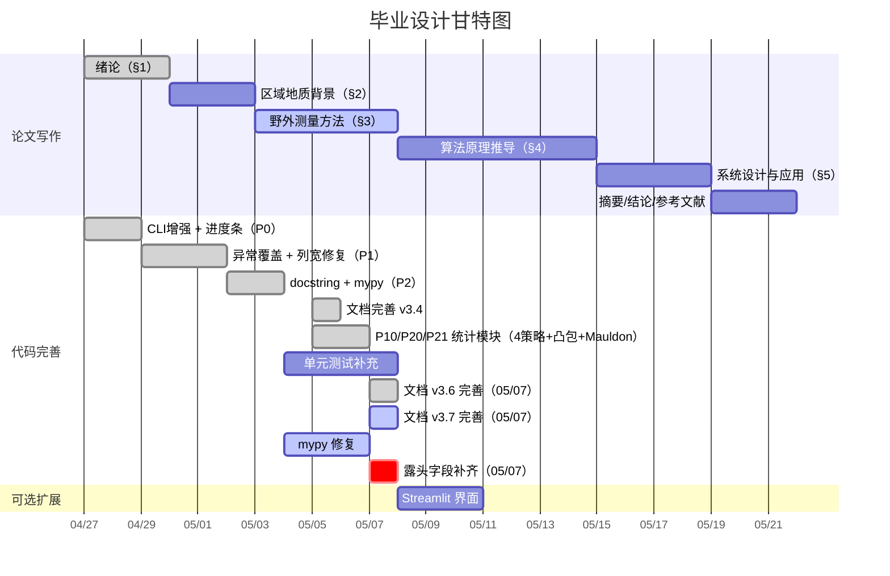

# 毕业设计任务流程与预期成果

> **版本**: v3.7 | **更新**: 2026-05-07 | **周期**: 2026 年 4 月 – 6 月（约 8 周）

---

## 项目概况

### 课题定义

实现 **岩体节理测线法坐标计算与可视化系统**，将 MATLAB 原型算法移植为 Python 工程化代码。覆盖 **8 个露头（O76–O83）共 172 条节理迹线**，完成从原始测绘数据到端点坐标计算、坐标变换、Excel 导出、迹线图与玫瑰花瓣图的自动化流水线。核心统计模块涵盖 I/II/III 型自动分类、P10/P20/P21 密度参数（实测优先三级回退管道）、圆形取样窗法 4 策略自适应（auto/tangent/hybrid/concentric）+ Mauldon 平均迹长估计 + 凸包露头面积。

> **配套文档**: 程序的安装、配置、CLI 用法、数据格式、输出及 MATLAB 对比详见 [`README.md`](../README.md)。本文件聚焦论文写作与任务进度跟踪。

### 参考资料

| 类别 | 路径 | 内容 |
|------|------|------|
| 地质背景 | `reference/地质背景/` | 董艳辉等《区域地下水循环模式》（PDF）、《离散裂隙网络模拟在地下硐室…以甘肃北山地下实验室为例》纪景仁等（PDF） |
| 野外测量 | `reference/测量/` | 测线法说明 PPT ×1、测量原理 DOCX ×1、测量工具清单 DOCX ×1、现场照片 JPG ×2 |
| 任务书 | `reference/论文/` | 任务书 DOCX ×1、开题报告 DOCX ×1、文献综述 DOCX ×1、外文翻译（原件 PDF + 翻译件 PDF/DOCX）、过程管理手册（参考）DOCX ×1、毕业论文模板（2025 版）DOCX ×1 |
| 统计理论 | `reference/文献/` | 霍亮《北山沙枣园花岗岩体随机结构面的空间分布》（CAJ+PDF）、《北山沙枣园花岗岩岩体不同尺度结构面几何特征研究》（CAJ+PDF）、《北山沙枣园花岗岩岩体露头节理的平面特征研究》（CAJ+PDF）、《基于混合Fisher分布的随机结构面产状聚类模型》（CAJ+PDF）；王贵宾《岩体节理平均迹长估计》（PDF）；杨春和等《岩体节理平均迹长和迹线中点面密度估计》（PDF）；许文涛《基于摄影测量系统的岩体结构面精细识别表征及应用》（CAJ+PDF）——共 7 种文献 / 12 个文件 |
| MATLAB 原版 | `reference/matlab/` | Coordinate.m、A_outcrop_0map_coordinate.m、A_outcrop_0map_rotate.m + README.md |

### 代码完成状态

核心流水线已全部完成（配置、模型、角度、几何、变换、统计、I/O、绘图、CLI 全功能、测试模块（18 文件）），详见 [`README.md`](../README.md)。MATLAB ↔ Python 函数对应关系详见 [`reference/matlab/README.md`](matlab/README.md)。

**待完成工作**：

| 项目 | 状态 | 论文处理 |
|------|------|----------|
| mypy --strict 类型修复 | ⚠️ 进行中（截至 05/07） | — |
| 单元测试补充（集成测试） | 🟡 进行中 | — |
| P10/P20/P21 密度统计 + I/II/III 型分类 + 圆形取样窗法 4 策略自适应（auto 6因子加权评分/tangent/hybrid/concentric）+ Mauldon 迹长 + 凸包面积 | ✅ 已实现 | §4.7.1 详述算法与结果（含 auto 评分机制） |
| 节点识别 | ❌ | §4.7.2 理论框架 + 结论章"未来工作" |
| Terzaghi 修正 | ❌ | §4.7.2 几何修正公式 + 结论章"未来工作"（接口已预留 `terzaghi_correction` 参数） |
| 极点等值线图 | ❌ | 结论章展望 |
| Web 界面（streamlit） | ❌ | §5.4 架构设计（可选） |

---

## 一、论文写作任务

### 论文结构总览

| 章节 | 标题 | 字数 | 核心内容 | 状态 |
|------|------|------|----------|------|
| — | 摘要 + 关键词 | 300–500 | 中英文双语 | ⏳ |
| §1 | 绪论 | 3000–4000 | 选题背景、研究现状、技术路线 | ✅ 初稿 |
| §2 | 区域地质背景 | 1500–2000 | 北山沙枣园岩体、构造环境、露头分布 | 🔴 |
| §3 | 野外测量与数据获取 | 4000–5000 | 综合法原理、露头概况、仪器、数据格式 | 🔴 |
| §4 | 算法原理与实现 | 4000–5000 | 倾角转换、复数推导、坐标变换、扩展框架 | — |
| §5 | 系统设计与应用 | 3000–4000 | 模块架构、三层接口、批量结果、MATLAB 对比 | — |
| — | 结论与展望 | 500–800 | 成果总结、创新点、未来工作 | — |
| — | 参考文献 | — | ≥ 20 篇中英文 | — |
| — | 致谢 | 200–300 | — | — |

---

### 1.1 第二章「区域地质背景」

> **周期**: 3 天 | **优先级**: 🟡 中

#### §2.1 北山沙枣园花岗岩体地质概况（~800 字）

| 要点 | 内容 | 参考资料 |
|------|------|----------|
| 地理位置 | 北山地区戈壁地带 | 地质资料 |
| 岩体特征 | 花岗岩岩性、形成年代、侵入关系 | 纪景仁等 |
| 构造环境 | 区域构造应力场、主要断裂带 | 董艳辉等 |
| 节理发育 | 节理组数、优势走向与构造关系 | 文献综述 |

#### §2.2 研究露头分布与选取依据（~600 字）

- 8 个露头空间分布示意
- 与区域构造线的关系
- 代表性论证

#### 交付物

- [ ] §2.1 地质概况
- [ ] §2.2 露头分布与选取依据
- [ ] 参考文献（董艳辉等、纪景仁等）

---

### 1.2 第三章「野外测量与数据获取」

> **周期**: 5 天 | **优先级**: 🔴 最高

#### §3.0 露头选取原则与测量规范（~600 字）

| 原则 | 要求 | 目的 |
|------|------|------|
| 露头平整 | 面应尽量平整 | 减小几何误差 |
| 露头新鲜 | 未受爆破、风化、植被影响 | 反映原生节理特征 |
| 面积充足 | 尽可能大 | 提高统计代表性 |
| 测量一致 | 不变更人员、设备、方法 | 减小系统误差 |
| 迹长下限 | 仅记录 > 30 cm 的结构面 | 排除表层微裂隙 |

**测量总体流程**：踏勘选点 → GPS 定位 → 综合法测量 → 记录测线走向 → 按优势产状分组 → 露头面积与产状测量 → 红色油漆编号 → 含比例尺拍照。

#### §3.1 综合法测量原理与操作流程（~1000 字）

参考 `reference/测量/测量原理.docx` 与 `reference/测量/测线法说明.pptx`。

| 类型 | 名称 | 判定条件 | 几何特征 |
|------|------|----------|----------|
| Ⅰ型 | 相交型 | 迹线与测线直接相交 | 穿过测线，交点为 L₀ |
| Ⅱ型 | 延长相交型 | 延长线与测线相交 | 位于测线一侧，延长交点为 L₀ |
| Ⅲ型 | 不相交型 | 迹线及延长线均不相交 | 过起点作垂线，垂足为 L₀ |

**操作流程**：布设 30m 皮尺 → 油漆编号 → 判定类型 → 记录 r1–r7 → 罗盘测倾向 → 钢卷尺测迹长 → 塞尺测隙宽 → 记录填充物。

> 💡 需配图说明三种类型并用数学不等式表达判定条件。

#### §3.2 露头概况表（~600 字）

| 露头 | 地理坐标 | 岩性 | 露头产状 | 风化程度 | 测线方位 | 迹线数 |
|------|----------|------|----------|----------|----------|--------|
| O76 | ? | 花岗岩 | ? | ? | 298° | 19 |
| O77 | ? | 花岗岩 | ? | ? | 280° | 19 |
| O78 | ? | 花岗岩 | ? | ? | 165° | 26 |
| O79 | ? | 花岗岩 | ? | ? | 212° | 20 |
| O80 | ? | 花岗岩 | ? | ? | 334° | 29 |
| O81 | ? | 花岗岩 | ? | ? | 75° | 19 |
| O82 | ? | 花岗岩 | ? | ? | 273° | 20 |
| O83 | ? | 花岗岩 | ? | ? | 265° | 20 |

> ⚠️ `?` 字段待从野外记录本或导师补充，当前保留占位供论文写作时逐项填入。

#### §3.3 仪器与精度（~400 字）

参考 `reference/测量/测量工具.docx`（野外记录附页，具体型号以现场实际使用为准）。

| 仪器 | 型号 | 测量对象 | 精度 |
|------|------|----------|------|
| 地质罗盘 | 哈尔滨 DQY-1 | 倾向、方位角 | ±1° |
| 皮尺 | 50m 玻璃纤维 | 测线、露头总长 | ±0.01 m |
| 钢卷尺 | 5m | 迹长 r4–r7 | ±0.01 m |
| 塞尺 | 德力西 150A17 | 节理开度 | ±0.02 mm |
| 测距仪 | Bosch GLM 7000 | 距离复核 | ±0.001 m |
| GPS | 手持 | 露头坐标 | ±3–5 m |

#### §3.4 数据记录与格式映射（~1000 字）

野外记录录入为 `{露头编号}_process.xls`，存放于 `input/`。综合法参数（L₀、L₁、L₂、L₃）到计算符号（r1–r7）的映射及列布局详见 [`README.md`](../README.md) 数据格式章节。

> ⚠️ 倾角字段需测量但不参与端点坐标计算。迹线下限 30 cm。

#### §3.5 综合法类型与计算分支映射 ✨（~500 字）

明确野外分类与程序分类的对应关系：

| 综合法类型 | 判定 | 典型计算分支 |
|-----------|------|-------------|
| Ⅰ型（相交型） | 迹线穿过测线 | 双侧迹线（r4≠0, r6≠0） |
| Ⅱ型（延长相交型） | 延长线穿过测线 | 左迹线或右迹线 |
| Ⅲ型（不相交型） | 均不穿过 | 左迹线或右迹线 |

> 例外：若某一侧迹线段长度为 0，Ⅰ型可退化为单侧。

#### 交付物

- [ ] §3.0 露头选取原则
- [ ] §3.1 综合法原理 + 配图 + 操作流程
- [ ] §3.2 露头概况表（补全 `?` → 🔴 05/07）
- [ ] §3.3 仪器参数表
- [ ] §3.4 数据格式映射
- [ ] §3.5 综合法类型↔计算分支映射表 ✨

---

### 1.3 第四章「算法原理与实现」

> **周期**: 7 天 | **优先级**: 🔴 最高（核心章节）

#### §4.1 倾向→走向转换（~600 字）

- 走向 = 倾向 − 90°（dd≥90°）；走向 = dd + 270°（dd<90°）
- 分段证明与值域验证
- 代码：`angles.py:dip_to_strike()`

#### §4.2 基准角构建（~400 字）

- 定义 ang_base 使测线沿 x 轴正向延伸
- 代码：`endpoints.py:compute_endpoints()`

#### §4.3 三种情形复数法端点计算（~1500 字，核心）

复平面 z = x + iy，交点 z₁ = r₁ + i·0：

| 情形 | 条件 | 公式要点 |
|------|------|----------|
| Case 1（仅左侧） | r₄≠0, r₆=0 | P_start = z₁ + r₂·e^i(θ_base+π/2) + r₄·e^iθ_skew |
| Case 2（仅右侧） | r₄=0, r₆≠0 | P_start = z₁ + r₂·e^i(θ_base−π/2) + r₆·e^iθ_skew |
| Case 3（双侧） | r₄≠0, r₆≠0 | 左右端点分别计算 |

> 💡 需配图展示三条典型节理对应 Case 1/2/3。代码：`endpoints.py`

#### §4.4 半平面角折叠（~500 字）

- 保证迹线位于测线正确半平面
- 代码：`angles.py:fold_to_halfplane()`

#### §4.5 坐标变换流水线（~800 字）

| 步骤 | 操作 | 目的 |
|------|------|------|
| ① | 平移至正象限 | 坐标 ≥ 0 |
| ② | 走向角旋转 | 测线转至水平 |
| ③ | 再次平移 | 去除旋转负值 |

整体：x_out = T₂(R(θ)·T₁(x_in))。代码：`transforms.py`

#### §4.6 适用性分析与 MATLAB 对比（~800 字）

| 维度 | 要点 |
|------|------|
| 适用性 | 平行节理 ✅、共轭节理 ✅、随机节理 ⚠️ |
| 方位敏感性 | 测线与主节理走向夹角 < 30° 时 r2 误差放大 |
| MATLAB vs Python | for 循环 vs NumPy 广播，需 benchmark 获得加速比 |
| 验证 | O76 基准对比，误差 < 1e-10 m ✅ |

> ⚠️ 加速比需实际运行 benchmark（建议使用 `timeit` 或 `pytest-benchmark`），推荐在 §4 算法推导写作前完成（不晚于 05/15）。

#### §4.7 迹线统计与扩展功能理论框架 ✨（~1600 字）

##### §4.7.1 迹线分型与密度统计（~800 字，✅ 代码已全部实现）

| 模块 | 理论要点 | 实现状态 |
|------|----------|----------|
| I/II/III 型分类 | 基于迹线-测线相交关系的自动判定（线段相交/延长线相交/均不相交） | ✅ `statistics.py:_classify_trace_types` |
| P10 线密度 | 迹线数与测线有效长度之比，分流 I 型与全部 | ✅ `statistics.py:compute_trace_statistics` |
| P20 面密度 | 三级回退：① 实测面积法（N/A_measured）→ ② 圆窗闭式 P20 = m/(2πR²) → ③ 凸包面积法（N/A_hull）兜底 | ✅ `statistics.py:_compute_circle_windows` |
| P21 体密度 | 三级回退：① 圆窗闭式 P21 = q/(4R) → ② 实测面积法（ΣL/A_measured）→ ③ 凸包面积法（ΣL/A_hull） | ✅ `statistics.py:compute_trace_statistics` |
| 平均迹长 | 三级回退：① Mauldon L = (πR/2)·(q/m)（圆窗分组聚合均值）→ ② 端点欧氏距离均值 → ③ r5+r7 均值兜底 | ✅ `statistics.py:_aggregate_window_metric` |
| 露头面积 | 实测优先（第 13 列）；缺失时使用迹线端点凸包面积（Convex Hull） | ✅ `statistics.py:_convex_hull_area` |
| 4 策略窗口布置 | **tangent**（沿测线均布相切圆）/ **hybrid**（3切点×左右×3半径=≤18窗口）/ **concentric**（中点同心圆）/ **auto**（自适应阶梯选择） | ✅ 自动约束半径与交集数阈值 |
| auto 策略评分 | 对 3 种候选策略分别计算 6 因子加权评分——有效组数（×1.45）、有效组比例（×1.00）、空间覆盖（×1.35，双侧平衡+沿测线分布）、指标稳定性（×1.10）、半径尺度（×1.00）、样本充足率（×1.10），最高分胜出；与粗估密度偏好分差≤12%容差时回退；无有效候选时按粗估面密度降级 | ✅ `_select_window_diagnostics` |
| 迹线图统计信息框 | LaTeX 格式 10 行指标，含来源标注 (M)/(W)/(E)，内嵌于原始/旋转迹线图右侧 | ✅ `statistics.py:format_statistics_box_lines` |

> P10/P20/P21 统计结果随迹线图输出为 LaTeX 统计信息框（10 行指标，含来源标注 (M)/(W)/(E)），各露头对比汇总见 §5.3（含策略列）。统计方法详情及公式见 [`README.md`](../README.md) 迹线统计指标章节。

##### §4.7.2 待扩展功能框架（~600 字）

以下在论文中给出理论框架，具体实现列为"未来工作"：

| 功能 | 理论要点 | 优先级 |
|------|----------|--------|
| 节点识别 | I/Y/X 型拓扑判定，端点邻近搜索 + 距离阈值 | 🟡 |
| Terzaghi 修正 | 修正因子 w = 1/\|sin φ\|（接口已预留 `terzaghi_correction` 参数） | 🟡 |
| 极点等值线 | KDE + 施密特网下半球投影 | 🟢 |
| 无人机对比 | 重构迹线与正射影像叠合 | 🟢 |

#### 交付物

- [ ] §4.1 倾向→走向转换
- [ ] §4.2 基准角构建
- [ ] §4.3 三种情形复数推导（含 3 张配图）
- [ ] §4.4 半平面角折叠
- [ ] §4.5 坐标变换流水线（含旋转矩阵推导）
- [ ] §4.6 适用性分析 + MATLAB 对比（含加速比）
- [ ] §4.7.1 迹线分型与密度统计（I/II/III、P10/P20/P21、圆形取样窗）✨
- [ ] §4.7.2 扩展功能理论框架（节点识别、Terzaghi 修正、极点等值线、无人机对比）✨
- [ ] 算法流程图

---

### 1.4 第五章「系统设计与应用」

> **周期**: 4 天 | **依赖**: 代码优化完成后

#### §5.1 模块架构设计（~800 字）

四层架构：用户接口层（CLI）→ 流水线层（pipeline.py）→ 核心计算层（geology/ 子包：angles、endpoints、transforms、statistics）→ 数据与输出层（io/、plotting/、reporting）。详见 [`README.md`](../README.md)。

#### §5.2 三层用户接口（~1200 字）

| 层次 | 用户 | 技术 |
|------|------|------|
| 命令行 | 地质工程师 | argparse，12 参数 |
| Python API | 科研开发 | `trace_pipeline` 包，15 个入口 |
| Web 界面 | 非编程用户 | streamlit（见 §5.4） |

#### §5.3 批量处理结果（~1000 字）

- 8 露头汇总统计表（迹线数、平均迹长、主走向、玫瑰图峰值、I/II/III 分型统计、自适应窗口策略、来源标注）
- 各露头 P10/P20/P21 密度参数对比与地质解释
- O80（29 条）和 O76（19 条）典型分析
- 旋转前后迹线图对比（含统计信息框）

#### §5.4 Web 界面架构设计 ✨（~500 字，可选）

左侧控制面板（上传文件、参数调整）+ 右侧预览区（迹线图、玫瑰图）。技术选型：`streamlit.file_uploader`、`slider`、`image`、`download_button`。时间紧张则仅给出架构说明。

#### 交付物

- [ ] §5.1 系统架构图 + 模块说明
- [ ] §5.2 三层接口 + 代码示例
- [ ] §5.3 批量处理汇总 + 典型分析
- [ ] §5.4 Web 界面架构设计（可选）✨

---

### 1.5 摘要、结论与参考文献

> **周期**: 3 天 | **依赖**: 全部章节完成后

| 部分 | 要点 |
|------|------|
| 中文摘要 | 背景 → 方法（测线法+复数向量化+圆形取样窗统计）→ 结果（8 露头 172 条，含 P10/P20/P21 密度参数）→ 结论 |
| 英文摘要 | 中文翻译，术语：scanline method, joint trace, strike/dip, rose diagram, circular sampling window, P10/P20/P21 |
| 结论 | 成果总结 + 创新点（向量化、三层接口、密度统计增强）+ 不足 + 未来工作（4 项扩展） |
| 参考文献 | ≥ 20 篇 |
| 致谢 | 200–300 字 |

---

## 二、代码完善任务

### P0：CLI 增强 + 进度条 ✅

- 交互式模式、list/dry-run ✅
- tqdm 进度条（串行/并行）✅

### P1：异常处理 + 代码整理 ✅

- 异常覆盖矩阵 ✅
- 列宽循环化 ✅

### P2：文档与类型注解 ⚠️

- 全包 docstring ✅
- mypy --strict 🔴 进行中
- 文档（README + 任务流程）✅ v3.2

### 扩展功能（论文 §4.7 + 结论章）

| 功能 | 难度 | 优先级 | 论文处理 |
|------|------|--------|----------|
| P10/P20/P21 + I/II/III 分类 + 圆形取样窗法（18 窗口） | 中 | ✅ 已实现 | §4.7.1 详述 + §5.3 汇总 |
| 节点识别 | 中 | 🟡 | §4.7.2 框架 + 结论 |
| Terzaghi 修正 | 低 | 🟡 | §4.7.2 公式 + 结论（`terzaghi_correction` 接口已预留） |
| 极点等值线图 | 中 | 🟢 | 结论展望 |
| 无人机对比 | 高 | 🟢 | 结论展望 |

### 测试

- 基线：10 模块 ✅
- 待补充：集成测试
- 目标覆盖率 ≥ 85%

---

## 三、执行路线图

### 里程碑

| 日期 | 里程碑 | 验收标准 | 状态 |
|------|--------|----------|------|
| 04/29 | M1: 绪论 | §1 初稿完成 | ✅ |
| 05/05 | M2: 文档 | README + 任务流程 v3.2（统计模块文档补充） | ✅ |
| 05/06 | M2b: 统计 | P10/P20/P21 + I/II/III + 圆形取样窗法（18 窗口）实现，文档 v3.4 | ✅ |
| 05/07 | M2c: 文档完善 | README + 任务流程 v3.6 完善（4 策略自适应、凸包面积、Mauldon 迹长、来源标注 M/W/E） | ✅ |
| 05/07 | M2d: 文档 v3.7 | README + 任务流程 v3.7 完善（auto 策略评分机制、数据格式统一、露头字段标注） | 🟡 进行中 |
| 05/07 | M3b: §2 + 露头字段 | `?` 字段补齐或标记 + §2 初稿 | 🔴 今日到期 |
| 05/11 | M4: §3 | §3.5 映射表定稿 + §4.7.1 统计结果 | — |
| 05/15 | M5: P1+P2 | mypy --strict 通过（推迟 2 天保护 §3–§4 写作窗口） | ⚠️ |
| 05/17 | M6: 测试 | pytest 通过，覆盖率 ≥ 85% | — |
| 05/19 | M7: §4 | 算法推导 + §4.7 框架（含统计详述） | — |
| 05/22 | M8: 全文 | 摘要/结论/参考文献完成 | — |
| 05/25 | M9: 提交 | 论文 + 代码 + PPT 就绪 | — |

---

## 四、风险管理

| 风险 | 概率 | 影响 | 缓解措施 | 进展 |
|------|------|------|----------|------|
| 野外数据缺失 | 高 | 中 | 05/07 前补齐，否则标注"数据由导师提供" | 🔴 |
| MATLAB 算法偏差 | 中 | 高 | 逐行对照 + 对比测试 | ✅ |
| 分类映射混淆 | 中 | 中 | §3.5 映射表 + 代码自动分类 | ✅ |
| Python vs MATLAB 不一致 | 低 | 高 | O76 逐条对比 | ✅ < 1e-10 |
| 统计模块实现偏差 | 低 | 中 | 圆形取样窗法参考 Laslett (1982)、Mauldon (1998) 及王贵宾/杨春和文献，公式逐行验证，4 策略自适应 + 分组聚合 | ✅ |
| CJK 字体异常 | 中 | 低 | 多字体回退 | ✅ |
| 论文超代码范围 | 中 | 高 | 统计模块已实现，剩余扩展 → §4.7.2 + 结论 | 🟡 |
| 时间不足 | 中 | 高 | 可选功能降优先级 | — |
| 导师修改意见 | 中 | 中 | 每章完即送审，预留 2–3 天 | — |

---

## 五、成果清单

| 编号 | 成果物 | 形式 | 优先级 | 截止 | 状态 |
|------|--------|------|--------|------|------|
| 1 | 毕业论文（~20000 字） | Word/PDF | 🔴 必交 | 05/22 | ⏳ |
| 2 | Python 代码包（含统计模块） | GitHub+ZIP | 🔴 必交 | 05/17 | ✅ |
| 3 | 测试套件（覆盖率 ≥ 85%） | tests/ | 🟡 建议 | 05/17 | 🟡 |
| 4 | 8 露头输出（32 文件 + 统计信息） | output/ | 🔴 必交 | ✅ | ✅ |
| 5 | MATLAB vs Python 验证 | docs/ | 🟡 建议 | ✅ | ✅ |
| 6 | 项目文档 | README + 任务流程 | 🟡 建议 | ✅ | ✅ v3.6 |
| 7 | 答辩 PPT | PowerPoint | 🔴 必交 | 05/25 | ❌ |
| 8 | 迹线统计完整实现（P10/P20/P21 + 4 策略圆形取样窗法 + Mauldon + 凸包面积） | 论文 §4.7.1 + 代码 | 🔴 必交 | 05/22 | ✅ 代码+公式已实现 |

---

## 六、每周执行计划

### 第 1 周（04/27 – 05/03）✅

- ✅ §1 初稿 · ✅ CLI + tqdm · ✅ 异常覆盖 · ✅ docstring · ✅ 基线测试

### 第 2 周（05/04 – 05/10）🔴

- ✅ 文档 v3.7 · ✅ 统计指标完整实现（P10/P20/P21 + I/II/III 分类 + 圆形取样窗法 4 策略自适应 + Mauldon 迹长 + 凸包面积）· 🔴 §2 初稿（05/07 截止）· 🔴 §3 送审（含 §3.5）· 🔴 §4 开始推导 · 🟡 mypy · 🔴 露头字段补齐（05/07 今日到期）

### 第 3 周（05/11 – 05/17）

- 🔴 §4 送审（含 §4.7）· 🔴 mypy 通过（05/15）· 🔴 集成测试 · 🟡 benchmark

### 第 4 周（05/18 – 05/24）

- 🔴 §5 完稿（含 §5.4）· 🔴 摘要/结论/参考文献 · 🔴 全文通读 + 导师终审

### 第 5 周（05/25 – 05/31）

- 🔴 答辩 PPT · 🔴 代码整理 · 🔴 答辩演练

---

## 七、答辩 PPT 制作 ✨

> **周期**: 3–4 天 | **截止**: 05/25 | **优先级**: 🔴 必交

| 部分 | 内容 | 页数 | 用时 |
|------|------|------|------|
| 结构设计 | 框架与视觉风格（校徽配色） | — | 0.5 天 |
| 背景与意义 | 选题背景、北山沙枣园、研究现状 | 2–3 | 0.5 天 |
| 野外数据 | 综合法原理图、露头概况、现场照片 | 2–3 | 0.5 天 |
| 算法推导 | 倾向转换、三种情形复数公式（建议动画） | 3–4 | 1 天 |
| 系统演示 | CLI 录屏/截图、架构图、三层接口 | 2–3 | 0.5 天 |
| 结果展示 | O80 旋转迹线（含 LaTeX 统计信息框 + 来源标注）+ O76 玫瑰 + P10/P20/P21 8 露头汇总表（含策略列）+ auto 策略 6 因子评分对比示意 + MATLAB 对比 | 3–4 | 0.5 天 |
| 结论展望 | 成果总结 + 创新点 + 4 项未来工作 | 1–2 | 0.5 天 |
| 预演修改 | 2 轮预演 + 反馈修改 | — | 1 天 |

> **提示**: 算法部分用动画逐步展示复数运算；系统演示提前录 GIF/MP4；图片素材从 `output/` 取用；总页数 15–20 页。

---

> 📌 **使用说明**: 完成子任务后在 `- [ ]` 前打 `x` 变为 `- [x]`。每周日更新，对照甘特图调整下周计划。当前版本 v3.7。
